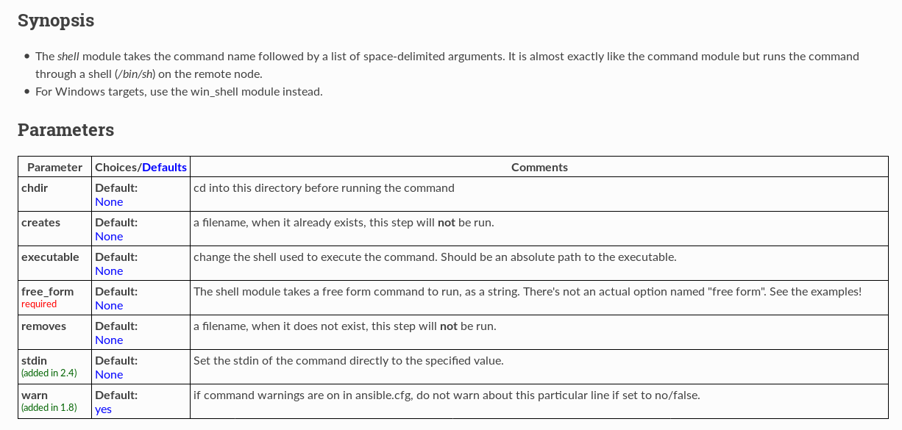

[[_TOC_]]

# Introduction

Telle que présenté lors de l'introduction DevOps , un des principes fondamental et d'être en mesure de déployer les applications rapidement , nous l'avons vu dans le processus de l'intégration continue. En d'autre mot lors d'un changement de code ou sur une base régulière, chaque jour par exemple, nous devons être en mesure de déployer une nouvelle version de l'application. Cette opération doit être réalisé de manière identique, à chaque déploiement, il serait complètement incohérent d'avoir un mécanisme différent à chaque fois. Le requis d'un déploiement rapide n'est pas réellement présent, cependant si vous devez passer 6 heures pour réalisé chaque déploiement manuellement, vous passerez l'ensemble de votre temps à réalisé cette opération. Par le fait même après 2 semaines à réalisé ces opérations répétitive, votre niveau de motivation sera très bas !!

Il existe plusieurs solution de déploiement , **puppet** , **ansible**, **salt** , **cfengin** , ... Je ne vais pas vous dire que **Ansible** est le meilleur , cependant c'est celui qui est très populaire et avec le support de RedHat assure une garantie de stabilité et d'évolution. Par la suite chacun on leur avantage et inconvénient , l'important est d'en maitriser UN par la suite l'apprentissage des autres est plus simple.

Information sur [ansible depuis wikipedia](https://fr.wikipedia.org/wiki/Ansible_\(logiciel\))

> Ansible est une plate-forme logicielle libre pour la configuration et la gestion des ordinateurs. Elle combine le déploiement de logiciels multi-nœuds, l'exécution des tâches ad-hoc, et la gestion de configuration. Elle gère les différents nœuds par-dessus SSH et ne nécessite l'installation d'aucun logiciel supplémentaire à distance sur eux. Les modules fonctionnent grâce à JSON et à la sortie standard et peuvent être écrits dans n'importe quel langage de programmation. Le système utilise YAML pour exprimer des descriptions réutilisables de systèmes.
> 
> La plate-forme a été créée par Michael DeHaan, l'auteur de l'application serveur de provisioning Cobbler et coauteur du cadre de développement Func pour l'administration à distance. Les utilisateurs de Ansible comprennent le Fedora Project, Hewlett-Packard Allemagne, Basho Technologies, ALE International et l'Université Aristote de Thessalonique, ainsi qu'Airbus, La Poste et la Société générale. Il est inclus dans le cadre de la distribution Linux Fedora, propriété de Red Hat inc., et est également disponible pour Red Hat Enterprise Linux, CentOS et Scientific Linux via les paquets supplémentaires "Extra Packages for Enterprise Linux" (EPEL)5.
> 
> Ansible Inc. était la société derrière le développement commercial de l'application Ansible. Red Hat rachète Ansible Inc. en octobre 2015.
> 
> Le nom Ansible a été choisi en référence au terme Ansible choisi par Ursula Le Guin dans ses romans de science-fiction pour désigner un moyen de communication plus rapide que la lumière.

TODO: Ajout de plus d'introduction avec le pull / push des agents 

## Référence :

* [Wikipedia ansible](https://fr.wikipedia.org/wiki/Ansible_(logiciel))

TODO : plus de référence SVP

# Mise en place d'un environnement d'apprentissage avec docker

Afin d'être en mesure de réaliser les exemples , démontrés dans cette documentation nous allons mettre en place un conteneur qui nous permettra de refaire l'ensemble du matériel ci-dessous. 
J'ai choisie de le faire dans un conteneur , afin d'avoir quelques choses de portables, mais aussi ceci offre la possibilité de voir l'ensemble des requis pour que ça fonctionne . Que nous parlions de packages installé ou de fichiers de configuration mis en place.


## Création du conteneur Ansible et validation

* Création de clé ssh ( explication plus loin) 

```bash
$ mkdir dockers/x3-ansible-srv/conf
$ ssh-keygen -b 2048 -f ./id_rsa
Generating public/private rsa key pair.
Enter passphrase (empty for no passphrase): 
Enter same passphrase again: 
Your identification has been saved in /home/xerus/.ssh/id_rsa.
Your public key has been saved in /home/xerus/.ssh/id_rsa.pub.
The key fingerprint is:
SHA256:znrVBd7Hdzg6/2Jzi5X2AI1xIhCV4oxCL2t5QrWspqU xerus@goishi
The key s randomart image is:
+---[RSA 2048]----+
|        oo..     |
|    . . ... .    |
|   . + = ...oo.o |
|    + = o  ..*= =|
|   . *  S  .oo.oo|
|    O .o  . +.  .|
|   * o  o.   o.+ |
|  E    ..     O.o|
|      ..     o *+|
+----[SHA256]-----+

$ ls         
id_rsa  id_rsa.pub         
```

Vous avez le conteneur disponible x3-ansible-srv : [Dockerfile](./dockers/x3-ansible-srv/Dockerfile)

```
 # pull base image
FROM ubuntu:16.04
MAINTAINER Thomas Boutry <thomas.boutry@x3rus.com>

ENV DEBIAN_FRONTEND=noninteractive 

 # Installation of ansible 
 # J'ai volontairement PAS bloquer l'installation des packages en plus car je veux avoir une conteneur
 # meme s'il est gros ca me derange pas :D
RUN apt-get update -y && \
    apt-get install -y software-properties-common && \
    apt-add-repository -y ppa:ansible/ansible && \
    apt-get update -y && \
    apt-get install -y ansible
    
 # Create user "c3po" with no password
 # Ajout du groupe docker pour communiquer avec le docker host
RUN useradd -s /bin/bash -m  c3po && \
    groupadd automate && \
    usermod -G automate c3po

 # Creation du répertoire ssh pour l'utilisateur
RUN mkdir /home/c3po/.ssh/ && \
    chown c3po:c3po /home/c3po/.ssh && \
    chmod 700 /home/c3po/.ssh/

 # Copie la clef publique pour jenkins 
COPY conf/id_rsa* /home/c3po/.ssh/

 # Fix perms for ssh key
RUN chown c3po:c3po /home/c3po/.ssh/id_rsa* && \
    chmod 700 /home/c3po/.ssh/id_rsa*
   
 # default command: display Ansible version
ENTRYPOINT ["/usr/bin/ansible-playbook"]
CMD ["--version"]

```

Définition du docker-compose [docker-compose.yml](./dockers/x3-ansible-srv/docker-compose.yml): 

```
version: '2'
services:
    ansible:
        image: x3rus/x3-ansible
        build: .
        container_name : 'x3-ansible-p'
        environment:
            - TERM=xterm
 #        volumes:
 
 # Exemple d'utilisation avec docker-compose et run :
 # docker-compose run --volume=/tmp/ansible-tmp/:/etc/ansible/  ansible   /etc/ansible/playbooks/setup-dck.yml
 #

```

Création de l'image 

```bash
$ cd dockers/x3-ansible-srv
$ docker-compose build
```

Validation que l'ensemble fonctionne avec des testes simple qui seront expliqué plus tard ...

```bash
$ docker-compose  run --rm ansible 
ansible-playbook 2.5.2
  config file = /etc/ansible/ansible.cfg
  configured module search path = [u'/root/.ansible/plugins/modules', u'/usr/share/ansible/plugins/modules']
  ansible python module location = /usr/lib/python2.7/dist-packages/ansible
  executable location = /usr/bin/ansible-playbook
  python version = 2.7.12 (default, Dec  4 2017, 14:50:18) [GCC 5.4.0 20160609]


$ docker-compose  run --rm --entrypoint=/bin/bash ansible
root@1f26260af83d:/# 
root@1f26260af83d:/# 

root@e306f2e83359:/# ansible localhost -m ping
 [WARNING]: provided hosts list is empty, only localhost is available. Note that the implicit localhost does not match 'all'

localhost | SUCCESS => {
    "changed": false, 
    "ping": "pong"
}
```

## Infrastructure pour l'apprentissage 

Afin d'être en mesure de faire de vraie teste nous allons mettre " l'infrastructure ", disons plus la configuration suivante : 


* **Ansible** : Un conteneur ansible avec l'application et un **volume** pour stocker la configuration.
* **AppServer1** : Un conteneur qui nous servira de serveur applicatif , je ne sais pas encore quelle application mais détail.
* **AppServer2** : Un conteneur qui nous servira de serveur applicatif , je ne sais pas encore quelle application mais détail.
* **WebServer** : Un conteneur avec un serveur web qui servira de frontal pour le serveur applicatif.
* **DatabaseServer** : Un conteneur pour la Base de donnés .

Les conteneurs AppServer + WebServer + DatabaseServer seront basés sur la même images docker.

Nous utiliserons le mode "original" ou "classique" de Ansible pour la communication avec les nœuds soit le protocole ssh ( port 22 / TCP ) , nous verrons éventuellement d'autre mode telle que l'orchestration des dockers, AWS , voir powershell :P 

Donc la machine **ansible** étalira la connexion via **ssh** , bien entendu nous ne voulons pas avoir à saisir un mot de passe nous utiliserons donc le système de clé publique / privé afin de permettre à la machine de ce connecté sur les noeuds.
G
Nous utiliserons 2 utilisateur :

* **c3po** : Cette utilisateur sera celui qui est en exécution sur le serveur Ansible, il est l'utilisateur qui initie l'orchestration
* **r2d2** : Cette utilisateur est celui qui est configurer sur les serveurs , il a les permissions root , sans mot de passe sur le système via la commande **sudo**.

J'ai opté pour 2 utilisateurs distinct afin de démontrer la différence , éventuellement nous pourrions avoir d'autre utilisateur en plus de **r2d2** selon les serveurs.


### Création de l'image pour la simulation des machines 

Telle que mentionné dans la section précédente nous allons simulé une machine de type VM ou physique, nous allons donc faire une entorse au principe du conteneur et avoir une service OpenSSH en plus du service qui sera déployé . Ansible a un module spécifique pour docker que nous aurons l'occasion de voir assurément cependant je veux le faire en mode "VM" service ssh pour débuter nous passerons à l'autre étape par la suite. 

J'ai créé une définition de l'image sous : [dockers/x3-ansible-client/Dockerfile](dockers/x3-ansible-client/Dockerfile) 

```bash
 #
 # Description : Ansible Slave / machine pour formation
 #
 # Author : Thomas.boutry@x3rus.com
 # Licence : GPLv3 ou plus
 #
 # Reference : https://docs.docker.com/engine/examples/running_ssh_service/#build-an-eg_sshd-image
 ###########################################################

FROM ubuntu:16.04
MAINTAINER Thomas Boutry "thomas.boutry@x3rus.com"

 # Installation des applications, besoin de ssh et de java pour le service Jenkins
RUN apt-get update && \
    apt-get install -y openssh-server sudo git python && \
    mkdir /var/run/sshd

 # TODO besoin client ansible / python ??

 # ajout des package oublié :P 
 # Valider si requis ou juste Jenkins RUN apt-get install -y libltdl7 git 

 # SSH login fix. Otherwise user is kicked off after login
RUN sed 's@session\s*required\s*pam_loginuid.so@session optional pam_loginuid.so@g' -i /etc/pam.d/sshd

ENV NOTVISIBLE "in users profile"
RUN echo "export VISIBLE=now" >> /etc/profile && \
    echo "%automate ALL=(ALL) NOPASSWD:ALL" >> /etc/sudoers


 # Create user "r2d2" with no password
 # Ajout du groupe docker pour communiquer avec le docker host
RUN useradd -s /bin/bash -m  r2d2 && \
    groupadd automate && \
    usermod -G sudo,automate r2d2

 # Creation du répertoire ssh pour l'utilisateur
RUN mkdir /home/r2d2/.ssh/ && \
    chown r2d2:r2d2 /home/r2d2/.ssh && \
    chmod 700 /home/r2d2/.ssh/

 # Copie la clef publique pour jenkins 
COPY conf/authorized_keys /home/r2d2/.ssh/authorized_keys

 # Fix perms for ssh key
RUN chown r2d2:r2d2 /home/r2d2/.ssh/authorized_keys && \
    chmod 700 /home/r2d2/.ssh/authorized_keys

 # Port et service
EXPOSE 22
CMD ["/usr/sbin/sshd", "-D"]
```

Le fichier de **/home/r2d2/.ssh/authorized_keys** est la définition de la clé publique **dockers/x3-ansible-srv/conf/id_rsa.pub** de **c3po**.

J'ai fait la création d'un [docker-compose.yml](./dockers/x3-ansible-client/docker-compose.yml) pour cette image , cependant je ne l'utiliserai pas .

### Orchestrion des 3 machines

Création d'un docker-compose pour valider que ceci fonctionne bien , nous allons avoir le serveur ansible ainsi que les 3 serveurs qui seront démarrer en même temps avec un lien entre eux. Pour débuter, je n'en démarre que 1 , pour faire la validation par la suite nous réaliserons , l'ajout des autres instances. 

Comme vous allez pouvoir le voir dans la définition du docker-compose , je vais surdéfinir le point d'entré du conteneur pour le serveur Ansible pour **tail -f /dev/null** . L'image **x3rus/x3-ansible** a comme entry point d'exécuter un playbook ansible , malheureusement dans mon cas je veux faire de l'exploitation et apprendre. En sûr définissant le point d'entré ceci nous permettra de démarrer le service et de s'y connecter avec **docker exec** sans cassé la définition de l'image qui reste propre.

[docker-compose.yml](./dockers/docker-compose.yml) pour l'exercice :

```
version: '2'
services:
    ansible-srv:
        image: x3rus/x3-ansible
        build: ./x3-ansible-srv/
        container_name : 'x3-ansible-p'
        environment:
            - TERM=xterm
        links:
            - ansible-app:appserver
        entrypoint: 'tail -f /dev/null'
 #        volumes:
    ansible-app:
        image: x3rus/x3-ansible-client
        build: ./x3-ansible-client/
        container_name : 'x3-ansible-appsrv-t'
        environment:
            - TERM=xterm
```

Compilation et démarrage du service de conteneur client et teste de fonctionnement depuis le serveur ansible.

```bash
$ cd ansible/dockers
$ docker-compose build && docker-compose up 
Starting x3-ansible-appsrv-t ...       
Starting x3-ansible-appsrv-t ... done  
Starting x3-ansible-p ...              
Starting x3-ansible-p ... done         
Attaching to x3-ansible-appsrv-t, x3-ansible-p 

[ en attente ; prendre un autre terminal ]

$ docker exec -it x3-ansible-p bash
root@0cc27e4e8fda:/# 

[ Retour dans la fenêtre de ansible server ]

root@0cc27e4e8fda:/# su - c3po

c3po@0cc27e4e8fda:~$ ssh r2d2@appserver
Welcome to Ubuntu 16.04.1 LTS (GNU/Linux 4.12.4-1-ARCH x86_64)

 * Documentation:  https://help.ubuntu.com
 * Management:     https://landscape.canonical.com
 * Support:        https://ubuntu.com/advantage
Last login: Mon May 14 21:05:41 2018 from 172.31.0.3

r2d2@c98eee481fed:~$ sudo -l
Matching Defaults entries for r2d2 on c98eee481fed:
    env_reset, mail_badpass, secure_path=/usr/local/sbin\:/usr/local/bin\:/usr/sbin\:/usr/bin\:/sbin\:/bin\:/snap/bin

User r2d2 may run the following commands on c98eee481fed:
    (ALL : ALL) ALL
    (ALL) NOPASSWD: ALL
```

Nous voyons que ceci est un succès , aucun mot de passe demandé et la configuration sudo est bonne : ALL pas de mot de passe.

Ajustement pour avoir tous les slaves ainsi que le volume pour le serveur Ansible afin d'avoir une persistance des données.

```bash
$ docker-compose stop 
```

* pour le volume

```bash
$ mkdir -p dockers/volumes/ansibleSrv/
```

* Édition du fichier docker-compose :

```
version: '2'
services:
    ansible-srv:
        image: x3rus/x3-ansible
        build: ./x3-ansible-srv/
        container_name : 'x3-ansible-p'
        environment:
            - TERM=xterm
        links:
            - ansible-app1:appserver1
            - ansible-app2:appserver2
            - ansible-web:webserver
            - ansible-db:databaseserver
        entrypoint: 'tail -f /dev/null'
        volumes:
            - './volumes/ansibleSrv/:/etc/ansible/' 
    ansible-app1:
        image: x3rus/x3-ansible-client
        build: ./x3-ansible-client/
        container_name : 'x3-ansible-appsrv1-t'
        environment:
            - TERM=xterm
    ansible-app2:
        image: x3rus/x3-ansible-client
        build: ./x3-ansible-client/
        container_name : 'x3-ansible-appsrv2-t'
        environment:
            - TERM=xterm
    ansible-web:
        image: x3rus/x3-ansible-client
        build: ./x3-ansible-client/
        container_name : 'x3-ansible-websrv-t'
        environment:
            - TERM=xterm
    ansible-db:
        image: x3rus/x3-ansible-client
        build: ./x3-ansible-client/
        container_name : 'x3-ansible-dbsrv-t'
        environment:
            - TERM=xterm
```

# Tutorial Ansible

Le fichier de configuration par défaut d'Ansible est **/etc/ansible/ansible.cfg** , vous avez une copie de ce fichier disponible : [ansible-ORI.cfg](./data/ansible-ORI.cfg). Je vous invite à le consulter voir les paramètres utilisés par défaut par le système. Pour débuter nous ne ferons pas de modification dans le fichier. 


Démarrage du service et accès au serveur Ansible:

```bash
$ docker-compose up -d 
$ docker exec -it  x3-ansible-p bash
root@6b5d3b68e23c:/etc/ansible# ls     
ansible.cfg  hosts  roles        
```

## Gestion de l'inventaire .

Nous allons regrouper nos machines / serveurs dans l'inventaire d'Ansible , ceci nous permettra d'avoir des regroupements de machines pour réaliser des opérations . Dans notre cas nous allons avoir un groupe représentant l'ensemble des machines , ainsi que des groupes par type : web , applicatif, base de données. 

La configuration est réalisé dans le fichier **/etc/ansible/hosts** , nous allons donc avoir le fichier suivant :

```bash
root@6b5d3b68e23c:/etc/ansible# cat hosts 
 # Configuration de l'inventaire
 #

 # All servers 
[SrvTraining]
appserver1
appserver2
webserver
databaseserver
 
 # Aapp servers  for training env
[AppSrvTraining]
appserver1
appserver2

[WebSrvTraining]
webserver
badserver

[DbSrvTraining]
databaseserver
```

TODO: Explication syntaxe et groupe

## Test de connexion 

Premièrement nous allons basculer avec l'utilisateur **c3po**, la configuration des clé de communication SSH fut réalisé avec cette utilisateur pour établir une connexion avec l'utilisateur **r2d2**. Nous allons donc devoir faire la configuration des ses utilisateurs . 

* Bascule sous **c3po**

```bash
root@6b5d3b68e23c:/etc/ansible# su - c3po
c3po@6b5d3b68e23c:~$ cd /etc/ansible/  
```

Exécution d'une validation avec le module **ping** sur le groupe de machine AppSrvTraining, attention ce n'est pas un PING ICMP , mais un ping/pong pour valider la communication Ansible.

Exécutons la commande : 

```bash
c3po@6b5d3b68e23c:/etc/ansible$ ansible -i ./hosts AppSrvTraining -m ping                                                                                     
The authenticity of host 'appserver1 (172.31.0.2)' can t be established.       
ECDSA key fingerprint is SHA256:uxG1tb2fVObTRyGqjEhzROTrpxTMvT7PLYqTShKiT7E.   
Are you sure you want to continue connecting (yes/no)? The authenticity of host 'appserver2 (172.31.0.4)' can t be established.
ECDSA key fingerprint is SHA256:uxG1tb2fVObTRyGqjEhzROTrpxTMvT7PLYqTShKiT7E.   
Are you sure you want to continue connecting (yes/no)? 

[ J ai fait CRTL+C ]
Process WorkerProcess-2:                                                                             
Traceback (most recent call last):     
  File "/usr/lib/python2.7/multiprocessing/process.py", line 258, in _bootstrap
 [ERROR]: User interrupted execution   

```

Nous n'avons jamais établie de connexion vers ces machines, donc effectivement devons accepter les clés , 2 méthodes s'offre à vous .

* Établir une connexion avec l'utilisateur initialement . 

Exemple :

```bash
c3po@6b5d3b68e23c:/etc/ansible$ ssh appserver1 
The authenticity of host 'appserver1 (172.31.0.2)' can t be established.
ECDSA key fingerprint is SHA256:uxG1tb2fVObTRyGqjEhzROTrpxTMvT7PLYqTShKiT7E.
Are you sure you want to continue connecting (yes/no)? yes
Warning: Permanently added 'appserver1,172.31.0.2' (ECDSA) to the list of known hosts.
c3po@appserver1 s password: 

[ J ai fait CRTL+C ]
```

Je refait la commande du ping pour Ansible:

```bash
c3po@6b5d3b68e23c:/etc/ansible$ ansible -i ./hosts AppSrvTraining -m ping      
The authenticity of host 'appserver2 (172.31.0.4)' can t be established.       
ECDSA key fingerprint is SHA256:uxG1tb2fVObTRyGqjEhzROTrpxTMvT7PLYqTShKiT7E.   
Are you sure you want to continue connecting (yes/no)? appserver1 | UNREACHABLE! => {                                                                         
    "changed": false,                  
    "msg": "Failed to connect to the host via ssh: Permission denied (publickey,password).\r\n",                                                              
    "unreachable": true                
}                                      
[ J ai fait CRTL+C ]
```

Bon bonne nouvelle le système ne demande que pour 1 serveur la clé, car nous avons approuvé la clé du serveur **appserver1**

L'autre méthode définir qu'il n'y a pas de validation de clé ssh pour l'ensemble des communications , voir documentation d'Ansible [host-key-checking](http://docs.ansible.com/ansible/latest/user_guide/intro_getting_started.html#host-key-checking).

Comme je ne désire pas désactivé la validation au niveau globale , je vais désactiver la validation pour la communication courante .

```bash
c3po@6b5d3b68e23c:/etc/ansible$ export ANSIBLE_HOST_KEY_CHECKING=False

c3po@6b5d3b68e23c:/etc/ansible$ ansible -i ./hosts AppSrvTraining -m ping
appserver1 | UNREACHABLE! => {         
    "changed": false,                  
    "msg": "Failed to connect to the host via ssh: Permission denied (publickey,password).\r\n",                                                              
    "unreachable": true                
}                                      
appserver2 | UNREACHABLE! => {         
    "changed": false,                  
    "msg": "Failed to connect to the host via ssh: Warning: Permanently added 'appserver2,172.31.0.4' (ECDSA) to the list of known hosts.\r\nPermission denied (publickey,password).\r\n",           
    "unreachable": true                
} 
```

Si je reéxécute la commande :

```bash
c3po@6b5d3b68e23c:/etc/ansible$ ansible -i ./hosts AppSrvTraining -m ping      
appserver2 | UNREACHABLE! => {         
    "changed": false,                  
    "msg": "Failed to connect to the host via ssh: Permission denied (publickey,password).\r\n",                                                              
    "unreachable": true                
}                                      
appserver1 | UNREACHABLE! => {         
    "changed": false,                  
    "msg": "Failed to connect to the host via ssh: Permission denied (publickey,password).\r\n",                                                              
    "unreachable": true                
} 
```

Bon c'est pas mal , on avance plus de demande de clé ssh .. Mais heu , comment dire ça marche pas. Le problème est que nous devons établir la connexion sous l'utilisateur **r2d2** et non **c3po**.

Nous allons éditer le fichier **hosts** afin d'identifier que l'utilisateur de connexion doit être **r2d2** .

```
 # App servers  for training env
[AppSrvTraining]
appserver1 ansible_user=r2d2
appserver2
```

Si je ré exécute la commande :

```bash
c3po@6b5d3b68e23c:/etc/ansible$ ansible -i ./hosts AppSrvTraining -m ping      
appserver2 | UNREACHABLE! => {         
    "changed": false,                  
    "msg": "Failed to connect to the host via ssh: Permission denied (publickey,password).\r\n",                                                              
    "unreachable": true                
}                                      
appserver1 | SUCCESS => {              
    "changed": false,                  
    "ping": "pong"                     
}  
```

Bien entendu je peux mettre cette configuration pour chaque machine mais je vais le définir par défaut, par le fait même l'ensemble des machines identifier aurons automatiquement l'utilisateur r2d2 d'associer. 

```bash
c3po@6b5d3b68e23c:/etc/ansible$ grep -n "r2d2" /etc/ansible/ansible.cfg 
98:remote_user = r2d2
``` 

Dans le fichier __/etc/ansible/ansible.cfg__ à la ligne 98 , dans la section **default** .

```bash
c3po@6b5d3b68e23c:/etc/ansible$ cat /etc/ansible/hosts                         
 # Configuration de l'inventaire        
 #                                      

 # All servers                          
[SrvTraining]                          
appserver1                             
appserver2                             
webserver                              
databaseserver                         
                                       
 # Aapp servers  for training env       
[AppSrvTraining]                       
appserver1                             
appserver2                             

[WebSrvTraining]                       
webserver                              
badserver                              

[DbSrvTraining]                        
databaseserver                         

c3po@6b5d3b68e23c:/etc/ansible$ ansible -i ./hosts AppSrvTraining -m ping   
appserver1 | SUCCESS => {
    "changed": false, 
    "ping": "pong"
}
appserver2 | SUCCESS => {
    "changed": false, 
    "ping": "pong"
}
```

Nous avons donc un succès . 

### Exécution de commande shell

Je vais faire une présentation des modules disponible sous peu , par contre afin de faire une petite démonstration un peu plus sexy que le ping/ping réalisé préalablement. Nous allons voir le module **shell** qui permet d'exécuter des commandes arbitraire. 

Si vous aviez éteint votre machine, remise en fonction des conteneurs 

```bash
$ docker-compose up -d                               
Starting x3-ansible-appsrv2-t ...      
Starting x3-ansible-appsrv2-t          
Starting x3-ansible-dbsrv-t ...        
Starting x3-ansible-dbsrv-t            
Starting x3-ansible-websrv-t ...       
Starting x3-ansible-appsrv1-t ...      
Starting x3-ansible-appsrv1-t          
Starting x3-ansible-appsrv1-t ... done 
Starting x3-ansible-p ...              
Starting x3-ansible-p ... done 
```

Accès au serveur ansible et bascule sous l'utilisateur **c3po** :

```bash
$ docker exec -it x3-ansible-p bash         
root@93c85717dd06:/# su - c3po
c3po@93c85717dd06:~$ cd /etc/ansible/
c3po@93c85717dd06:/etc/ansible$ 
```

Affichage du contenu du fichier __hosts__ pour les machines du groupe AppSrvTraining 

```bash
c3po@93c85717dd06:/etc/ansible$ ansible -i ./hosts AppSrvTraining -m shell -a 'cat /etc/hosts'
appserver1 | SUCCESS | rc=0 >>
127.0.0.1       localhost
::1     localhost ip6-localhost ip6-loopback
fe00::0 ip6-localnet
ff00::0 ip6-mcastprefix
ff02::1 ip6-allnodes
ff02::2 ip6-allrouters
172.31.0.5      27671fcbed7b

appserver2 | SUCCESS | rc=0 >>
127.0.0.1       localhost
::1     localhost ip6-localhost ip6-loopback
fe00::0 ip6-localnet
ff00::0 ip6-mcastprefix
ff02::1 ip6-allnodes
ff02::2 ip6-allrouters
172.31.0.2      f79ea034b345
```

Une autre commande : 

```bash
$ ansible -i ./hosts AppSrvTraining -m shell -a 'hostname && echo "bonjour" > /tmp/ansible-test && ls -l /tmp/ansible-test && echo "Ze Fin"  '
appserver1 | SUCCESS | rc=0 >>
27671fcbed7b
-rw-rw-r-- 1 r2d2 r2d2 8 May 23 21:10 /tmp/ansible-test
Ze Fin

appserver2 | SUCCESS | rc=0 >>
f79ea034b345
-rw-rw-r-- 1 r2d2 r2d2 8 May 23 21:10 /tmp/ansible-test
Ze Fin
```

* Visualisation d'un problème de communication 

Si nous prenons le groupe WebSrvTraining, j'ai introduit une erreur dans la configuration , le serveur badserver n'est pas disponible . Voici un exemple du résultat :

```bash
c3po@93c85717dd06:/etc/ansible$ cat hosts  | grep -A 3 WebSrv
[WebSrvTraining]
webserver
badserver


$ ansible -i ./hosts WebSrvTraining -m shell -a 'cat /etc/hosts'
badserver | UNREACHABLE! => {          
    "changed": false,                  
    "msg": "Failed to connect to the host via ssh: ssh: Could not resolve hostname badserver: Name or service not known\r\n",                                 
    "unreachable": true                
}                                      
webserver | SUCCESS | rc=0 >>          
127.0.0.1       localhost              
::1     localhost ip6-localhost ip6-loopback                                   
fe00::0 ip6-localnet                   
ff00::0 ip6-mcastprefix                
ff02::1 ip6-allnodes                   
ff02::2 ip6-allrouters                 
172.31.0.4      ed0155551cc4  
```

Bien entendu l'ensemble de l'exécution est réalisé sous l'utilisateur définie pour la connexion soit : 

```bash
c3po@93c85717dd06:/etc/ansible$ ansible -i ./hosts AppSrvTraining -m shell -a 'id '
appserver2 | SUCCESS | rc=0 >>
uid=1000(r2d2) gid=1000(r2d2) groups=1000(r2d2),27(sudo),1001(automate)

appserver1 | SUCCESS | rc=0 >>
uid=1000(r2d2) gid=1000(r2d2) groups=1000(r2d2),27(sudo),1001(automate)
```

Donc si vous essayez de réalisé une commande qui demande l'accès administrateur :

```bash
c3po@93c85717dd06:/etc/ansible$ ansible -i ./hosts AppSrvTraining -m shell -a 'apt-get install toto'
 [WARNING]: Consider using the apt module rather than running apt-get.  If you need to use command because apt is insufficient you can add warn=False to this
command task or set command_warnings=False in ansible.cfg to get rid of this message.

appserver1 | FAILED | rc=100 >>
E: Could not open lock file /var/lib/dpkg/lock - open (13: Permission denied)
E: Unable to lock the administration directory (/var/lib/dpkg/), are you root?non-zero return code

appserver2 | FAILED | rc=100 >>
E: Could not open lock file /var/lib/dpkg/lock - open (13: Permission denied)
E: Unable to lock the administration directory (/var/lib/dpkg/), are you root?non-zero return code
```

J'aimerai mettre en lumière 2 choses :

* **WARNING** : Qui vous indique de ne pas utiliser la commande apt-get mais d'utiliser le module apt disponible avec __ansible__ mais que si vraiment vous désirez faire la commande il est possible de désactiver la notification.
* **Permission denied** : Bien entendu la commande apt demande la permission root résultat l'utilisateur n'a pas les droits.

Si nous listons les permissions voici le résultat :

```bash
c3po@93c85717dd06:/etc/ansible$ ansible -i ./hosts AppSrvTraining -m shell -a 'sudo -l'
 [WARNING]: Consider using 'become', 'become_method', and 'become_user' rather than running sudo

appserver1 | SUCCESS | rc=0 >>
Matching Defaults entries for r2d2 on 27671fcbed7b:
    env_reset, mail_badpass, secure_path=/usr/local/sbin\:/usr/local/bin\:/usr/sbin\:/usr/bin\:/sbin\:/bin\:/snap/bin

User r2d2 may run the following commands on 27671fcbed7b:
    (ALL : ALL) ALL
    (ALL) NOPASSWD: ALL

appserver2 | SUCCESS | rc=0 >>
Matching Defaults entries for r2d2 on f79ea034b345:
    env_reset, mail_badpass, secure_path=/usr/local/sbin\:/usr/local/bin\:/usr/sbin\:/usr/bin\:/sbin\:/bin\:/snap/bin

User r2d2 may run the following commands on f79ea034b345:
    (ALL : ALL) ALL
    (ALL) NOPASSWD: ALL
```


## Les modules

Lors de la validation de communication entre les hôtes, nous avons utilisé l'option **-m** qui nous à permis d'utiliser des modules Ansible.
Par le fait même nous avons 2 modules :

* **PING** : qui nous permet d'établir une connexion ssh , exécuter **ping** et s'attendre à recevoir **PONG** , ceci est principalement utilisé pour valider la communication entre le serveur Jenkins et les nœuds.
* **SHELL** : Ceci nous permet d'exécuter des commandes arbitraire sur les nœuds.

Je ne prendrai pas de temps pour le module **ping**, car en dehors du processus de validation il n'a pas d'intérêt. Prenons quelque minutes pour regarder le module [Shell](http://docs.ansible.com/ansible/latest/modules/shell_module.html#shell-module). 

### Shell module

Comme vous pouvez le voir si vous cliquez sur le lien [Shell](http://docs.ansible.com/ansible/latest/modules/shell_module.html#shell-module). 

Si nous regardons la section paramètre, le module est en mesure de prendre des arguments :



Voyons la commande : __pwd & ls__

```bash
c3po@93c85717dd06:/etc/ansible$ ansible -i ./hosts AppSrvTraining -m shell -a 'pwd && ls'
appserver1 | SUCCESS | rc=0 >>
/home/r2d2

appserver2 | SUCCESS | rc=0 >>
/home/r2d2


```

Si je passe l'argument : **chdir** , pour changer de répertoire pour **/tmp** :

```bash
c3po@93c85717dd06:/etc/ansible$ ansible -i ./hosts AppSrvTraining -m shell -a 'pwd && ls chdir=/tmp'
appserver1 | SUCCESS | rc=0 >>
/tmp
ansible-test
ansible_1OU5Hs

appserver2 | SUCCESS | rc=0 >>
/tmp
ansible-test
ansible_3tqlcr

```

Vous pouvez aussi définir le paramètre au debut de la ligne de commande :

```bash
c3po@93c85717dd06:/etc/ansible$ ansible -i ./hosts AppSrvTraining -m shell -a 'chdir=/tmp pwd && ls'
appserver2 | SUCCESS | rc=0 >>
/tmp
ansible-test
ansible_2Ft9ZC

appserver1 | SUCCESS | rc=0 >>
/tmp
ansible-test
ansible_Kn_Pu7

```


Si je passe l'argument : **creates** , pour définir une condition d'exécution sur ma commande : 

```bash
c3po@93c85717dd06:/etc/ansible$ ansible -i ./hosts AppSrvTraining -m shell -a 'chdir=/tmp creates=/tmp/ze-data  date > /tmp/ze-data && cat /tmp/ze-data'      
appserver2 | SUCCESS | rc=0 >>         
Mon May 28 11:56:26 UTC 2018           

appserver1 | SUCCESS | rc=0 >>         
Mon May 28 11:56:26 UTC 2018           

c3po@93c85717dd06:/etc/ansible$ ansible -i ./hosts AppSrvTraining -m shell -a 'chdir=/tmp creates=/tmp/ze-data  date > /tmp/ze-data && cat /tmp/ze-data'      
appserver2 | SUCCESS | rc=0 >>         
skipped, since /tmp/ze-data exists     

appserver1 | SUCCESS | rc=0 >>         
skipped, since /tmp/ze-data exists     

```

Comme nous pouvons le voir dans l'exemple ci-dessus , lors de la première execution le fichier __/tmp/ze-data__ est créée , ce dernier contient la date. Lors de la deuxième exécution, il n'y a pas d'exécution car le fichier de référence est déjà présent.


### Les modules disponible

Ansible vient avec une boite à outils complète composé d'un grand nombre de module : [module par catégorie](http://docs.ansible.com/ansible/latest/modules/modules_by_category.html). 
