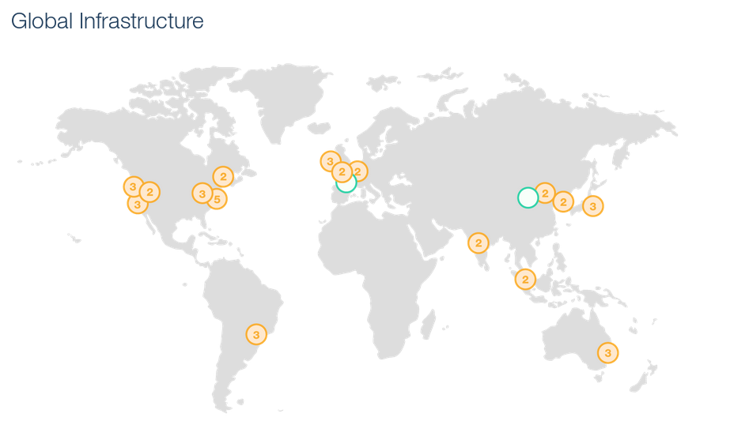

# Présentation 

Pour commencer j'aimerais clarifier un point important, je ne suis pas un expert de **AWS (Amazon Web Services)** , j'ai eu la chance de jouer un peu avec et je partage ici mon expérience. Il risque donc d'y avoir des zones d'ombre auxquelles j'aurais de la difficulté à répondre , je m'en excuse d'avance. Par contre je pense pouvoir vous offrir une base pertinente vous permettant de vous débrouillez le moment venu :D. 

Ceci étant dit, nous allons faire de notre mieux !

## C'est quoi le cloud ?

{ align=right }

Avant de débuter on va juste clarifier un point sur c'est quoi le cloud, en ce moment on entend tous et n'importe quoi sur le sujet ... Donc 2 minutes pour faire le point et clarifier le __Buzz word__.

Le Cloud est omniprésents dans nos vie, listons quelques service courant de notre utilisation :

* Netflix : pour la diffusion de films / séries 
* Spotify : Pour la musique
* Dropbox : Afin d'échanger ou simplement stocker des fichiers
* FaceBook : Pour avoir des nouvelles de vos amis ou déprimer ( TODO statisique déprime)
* GitHub : Afin de conserver vos applications en cours de développement 
* Youtube : Pour suivre vos tutoriels  préférés ;-).
* Office365 : Pour rester enchainé avec M$ :P.
* ...

La liste peut être très longue, mais vous avez compris le concept, le virage vers le cloud est plus que marqué. Si nous prenons comme exemple le service Office traditionnellement une application native installé sur votre poste maintenant il est aussi disponible dans le cloud. Pourquoi , car maintenant nous sommes connecté en permanence , Ordinateur (portable / station fix) , téléphone , tablette , télévision , ... Nous désirons avoir le contenu partout en tout temps et le cloud vient répondre à ce désir ( pas sûr que je désire spécifier que c'est un besoin ;-) ).

Voici une représentation graphique :

**Oupss , pas la bonne image ;-)**

Comme nous pouvons le voir des clients __multi-platforme__, plusieurs type d'équipement , l'ensemble interroge le cloud et reçoit le contenue !
Comme vous pouvez le voir sur la deuxième image j'ai mis plusieurs building, car si nous prenons les majors de l'industrie du cloud , les serveurs sont répartie dans plusieurs région assurant une haute disponibilité et une proximité avec les utilisateurs. 

Sous l'icons du nuage et des serveurs ça ressemble à quoi :

   

C'est beau !!! Bon pour les sysadmins qui voit ça puis qui complexe un peu , tous les services cloud ne sont pas aussi beau , il y a aussi les petits services cloud qui doivent être plus comme ça : 

    

Comme vous pouvez le voir , les images inclut un HUMAIN sur l'image , car faut pas ce faire d'illusion ceci est possible grâce à tous ces sysadmins , développeurs, ingénieurs, network Dudes ... 
Donc le 28 Juillet 2017 , pour la [journée du sysadmin](http://sysadminday.com/) allé donc remercier le/la/les personnes qui sans eux rien de tous cela ne serait possible :D.

En conclusion, le cloud c'est juste un / des serveurs hébergé :P , il y a tous de même quelque principe que sont présent :

* **Utilisation sur demande / facturation (On Demande)** : Il est possible de définir la quantité utilisé , et bien entendu n'être facturé que pour ce que l'on utilise réellement. Utilisation plus important un mois , factures élevé , le mois suivant s'il y a réduction de l'utilisation facture moins salé.
* **Infrastructure évolutive (Scalable)** : Le cloud offre une chose fabuleuse qui est de pouvoir augmenter ou réduire le nombre de machine selon le besoin , ceci est bien entendu en relation avec le point précédent qui est l'utilisation sur demande. 
    * Afin de comprendre le concept prenons un service de diffusion de contenu vidéo.
        1. À 6:00 du matin le nombre de client doit être réduit, les gens se lève ou se prépare pour aller au boulot pour certain ils sont en route. Le nombre de serveurs requis afin d'assurer le service ne doit pas être très élevé.
        2. À 12:00 pendant le repas certain en profite pour écouter leur série , pendant le lunch. Le nombre de serveurs pour assurer le service doit être augmenté proportionnellement à la demande.
        3. À 17:00 lors du retour à la maison , le nombre d'utilisateur réduit voir même change. Si nous prenons le cas du transport en commun les personnes utiliserons un téléphone portable. Est-ce le même serveur , la même quantité de ressource ... Encore une fois nous voyons une infrastructure évolutive.
        
    * Autre exemple , un site de vente en ligne , 99% du temps 4 serveurs répondent PARFAITEMENT à la demande des utilisateurs. Mais 3 fois par années ce nombre doit être de 10 serveurs :
        * Pendant le mois de Décembre
        * Pendant le vendredi noir
    Avec l'infrastructure évolutive , ils ne seront donc facturé que pour 4 serveurs et lors des périodes "chaudes", il augmenteront leur puissance de calcule. 
* **Infrastructure redondante (redundancy)** : L'ensemble des services de cloud offre une redondance de leur infrastructures, aujourd'hui avec une solution d'hébergement maison (__On Promise__) si votre serveur virtuel ou votre machine physique à un problème il est possible que votre service soit indisponible. Bien entendu vous pouvez avoir une solution de type __Load balancer__ , vous dupliquerez votre serveur physique ou votre machine virtuelle afin d'avoir une redondance en cas d'indisponibilité. Dans le cas d'un disque dur défectueux vous devrez faire le remplacement dans le système impacté. La solution cloud vous permet de ne plus vous souciez de ce problème , votre instance est disponible sur un __cluster__ qui gère l'indisponibilité d'un nœud. Ceci s'applique bien entendu sur l'ensemble de la chaîne de l'infrastructure :
    * Lien internet 
    * __Switch__ / Routeur 
    * Serveur virtuel (__hosts__)

Bien entendu je fait mention de l'infrastructure et non votre application , si votre application développé à un problème Amazon ne peut pas géré ce problème.

## Offre disponible 

De nos jours (2017 :P), si vous consultez un peu les offres d'emplois vous constaterez que la connaissance des technologies **cloud** est partout, que nous parlions de :

* [AWS - Amazon Web Services](https://aws.amazon.com/products/)
* [Google Cloud](https://cloud.google.com/products/)
* [Microsoft Azure](https://azure.microsoft.com/en-ca/services/)
* [Oracle Cloud](https://www.oracle.com/cloud/index.html)

Nous devons avoir cette corde à notre arc dans le future !! C'est une réalité à laquelle nous n'échapperons pas , est-ce une bonne chose ? La réponse est compliquée : 

* **OUI** :
    * Si vous êtes comme moi et que vous n'avez pas d'amour pour le matériel, ça évite beaucoup de problème :P. Pas besoin de trouver un collègue pour changer un CPU , une carte __PCI__ qui est problématique.
    * L'automatisation de la mise en place d'un nouveau système est simplifié plus besoin d'installer le serveurs , le câbler , identifier les câbles , ...
    * La possibilité de réaliser des déploiements dans plusieurs pays afin d'avoir un temps de réponse plus rapide , car plus proche du clients sans avoir la gestion d'un cabinet dans un centre de donnée.
    * La possibilité d'avoir une redondance d'équipement à moindre coût , ajouter ou réduire le nombre de serveurs dans un délais très court.
    * Avoir un API de fou pour vous permettre de faire plein de truc.
* **NON** :
    * Si vous êtes un paranoïaque sur la conservation de vos donnés, les géo-localisations des centres de données ne sont pas toujours en notre faveur. Si le centre de données est par exemple au États-Unis la législation est très peu clémente pour les citoyens non américains (__Patriot Acts__). Il est donc important de faire attentions.
    * Si vous êtes un administrateur réseaux, que vous appréciez la mise en place de __MPLS__, __QOS__, etc. Votre réalité risque d'être un peu chamboulé.

Sans allé dans le détail, il y a des pour et des contres ! Est-ce que l'utilisation du cloud est bon pour tous ... Je ne crois pas, par contre il y a clairement des avantages ! 
Nous allons voir les services disponibles chez Amazon, Google offre sensiblement les mêmes fonctionnalité ainsi que Microsoft Azure, la différence est dans les détail (prix , API , méthode de gestion , ... ). Suite à la présentation nous reviendrons sur la question : "Cloud ou PAS cloud ?!"

Pourquoi avoir choisie de présenter **AWS** au lieu d'un autre ? 

* **AWS** est disponible depuis plusieurs année et le service est mature, **l'API**  est très riche et il y a une grande communauté qui l'utilise (forum, exemple de script, ...) 
* **google** est très bien j'en suis certain , avec lui aussi un **API** riche , je crois que les 2 options sont très valide. Donc entre les 2 j'ai fait un choix.
* **MS Azure** est surement très bien aussi , je ne peux pas me prononcer sur **l'API** ne l'ayant pas du tous analysé. Bon mais le problème c'est pas le mot **azure** mais bien __microsoft__ :P . Et oui naturellement j'ai un moment de recule , après tant d'année :P.
* **Oracle cloud** ben c'est oracle :P , avec tous les combats contre le libre difficile de vouloir aller avec eux :P (c'est une prise de position :P ) . Par contre j'avais analysé rapidement les possibilités de **l'API** et ce dernier était clairement moins riche que **AWS ou google**. Je pense que la solution cloud d'oracle est intéressante si vous avez besoin d'utiliser une base de données __oracle__ pour le stockage. Sinon je ne vois pas trop l'intérêt mais je peux me tromper :P.

Bon ceci étant clarifier, débutons l'analyse de **AWS** !

## Présentation des produits 

Nous allons voir le nombre de services offert par Amazon est impressionnant , bien entendu je ne couvrirai pas tous , nous aurions assez de matière pour l'année :P , de plus j'ai pas les connaissances sur l'ensemble. 

Voici une copie d'écran des services disponibles :

Nous allons regrouper les services par fonctionnalité :

* [**Traitement, calcule** (**COMPUTE**)](https://aws.amazon.com/products/compute/) {align=right}
    * [Amazon Lightsail](https://amazonlightsail.com/) : l'équivalent d'une machine virtuel privé hébergé chez Amazon , une quantité de mémoire , CPU , un disque dur et une quantité de transfert de données permis. La principale particularité est que les ressources sont réservé pour votre machine. Vous pouvez consulter la [liste des fonctionnalités](https://amazonlightsail.com/features/). 

        | Prix/mois  | Mémoire | CPU     | Disque Dur | Transfert |
        |-----------:|:-------:|:-------:|:----------:|:---------:|
        |$5          |  512 MB |  1 Core | 20 GB SSD  | 1 TB *    |
        |$10         |  1 GB   |  1 Core | 30 GB SSD  | 2 TB *    |
        |$20         |  2 GB   |  1 Core | 40 GB SSD  | 3 TB *    |
        |$40         |  4 GB   |  2 Core | 60 GB SSD  | 4 TB *    |
        |$80         |  8 GB   |  2 Core | 80 GB SSD  | 5 TB *    |
            Prix pour AWS Lightsail (2017-03-08)
    * [Amazon EC2](https://aws.amazon.com/products/compute/#ec2) : Probablement le service d'Amazon le plus connu qui permet d'avoir une machine sur demande, la machine virtuel peut être initialisé pour 1 heure ou 2 puis éteinte la facturation est réaliser uniquement pour le temps d'utilisation. De loin le service le plus flexible d'Amazon . Il y a plusieurs [type d'instance](https://aws.amazon.com/ec2/instance-types/) , nous aurons l'occasion de le voir en détail plus tard. En gros les types varie selon l'utilisation de notre besoin, certaines ont plus de mémoire , d'autre plus de CPU , plus de stockage , ... Bien entendu chaque [type à un prix par heure](https://aws.amazon.com/ec2/pricing/on-demand/) nous y reviendrons aussi :D.
    * [Amazon EC2 Container](https://aws.amazon.com/ecs/) : Comme Docker est partout , partout, partout :D, Amazon offre aussi un service de conteneur. Pour ce service il n'y a pas de coût additionnel. Vous avez besoin d'une ou plusieurs instance [Amazon EC2](https://aws.amazon.com/products/compute/#ec2) et Amazon les configures adéquatement (__cluster__) afin que vous puissiez déployer vos conteneur sur les systèmes.
* [**Stockage des données**](https://aws.amazon.com/products/storage/) {align=right}
    * [Amazon Elastic Block Storage - EBS](https://aws.amazon.com/ebs/) : Système de stockage dédier d'Amazon, nous aurons l'occasion de le voir plus loin. Ce système nous permet d'attaché un disque dur à une instance. Ceci est du stockage dédier qui peut être agrandie et qui à l'avantage d'être répliqué chez Amazon, il est aussi possible de réaliser des __snapshots__ des disques dur. Plusieurs [type de stockage](https://aws.amazon.com/ebs/pricing/) est disponible bien entendu le prix change si vous utilisez un __SSD__ ou autre. 
    * [Amazon Amazon Elastic File System - EFS](https://aws.amazon.com/efs/) : Service de partage de fichiers , en gros ceci est un serveur de fichier qui vous permet de partager des données entre vos instances __EC2__. Contrairement au système __EBS__ qui est attaché à UNE instance __EC2__ le service **EFS** peut être accédé par plusieurs instances __EC2__. Rien n'est gratuit voir la [page des prix](https://aws.amazon.com/efs/pricing/)
    * [Amazon S3](https://aws.amazon.com/s3/) : Service de partage de fichier très populaire d'Amazon qui offre une quantité disponible de stockage à un prix hallucinant. Ceci est un service web qui permet de pousser et récupérer des fichiers sur les serveurs d'Amazon. [Les prix au gigs](https://aws.amazon.com/s3/pricing/) sont à tombé parterre .
* [**Base de données**](https://aws.amazon.com/products/databases) {align=right}
    * [Amazon Relational Database service -RDS](https://aws.amazon.com/rds/): Ce service vous offre la possibilité d'avoir une base de données relationnel, plusieurs type de base de données sont disponible : [Amazon Aurora](https://aws.amazon.com/rds/aurora/details/), [MySQL](https://aws.amazon.com/rds/mysql/details/), [MariaDB](https://aws.amazon.com/rds/mariadb/details/), [Oracle](https://aws.amazon.com/rds/oracle/details/), [Microsoft SQL Server](https://aws.amazon.com/rds/sqlserver/details/), et [PostgreSQL](https://aws.amazon.com/rds/postgresql/details/). Bien entendu le prix varie selon le type choisie :D. Si nous prenons par exemple [le prix pour Mysql](https://aws.amazon.com/rds/mariadb/pricing/) vous constaterez aussi que le type de machine influencera le prix.
    * [Amazon Aurora](https://aws.amazon.com/rds/aurora/) : Ce veut une base de donnée relationnel compatible __MySQL__ ou __Postgres__ équivalent au offre commerciel pour 1 /10 du prix. Amazon prétend que ce service est 5 fois plus rapide qu'un __MySQL__ classique. Amazon vous offre des méthodes de gestion avec une haute disponibilité. J'ai malheureusement jamais essayé le produit !
    * Solution __NoSQL__ [Redis , memcache - Elasticache](https://aws.amazon.com/elasticache/) et [dynamodb](https://aws.amazon.com/dynamodb/) : 2 service de __NoSQL__ disponible, une solution maison d'Amazon avec __Dynamodb__ ainsi que elasticache qui repose sur des produits libre __Redis__ ou __memcache__.
    * [Amazon Redshift](https://aws.amazon.com/redshift/) : Si vous avez des péta octets de données c'est pour vous, bien entendu jamais essayé j'ai pas autant de donnée
* [**Réseautique**](https://aws.amazon.com/products/networking/) {align=right}
    * [Amazon VPC(Virtual Private Cloud)](https://aws.amazon.com/vpc/) : ce service vous offre la possibilité de regrouper vos instances dans des sous-réseaux. Si vous gérez actuellement un réseau d'entreprise vous avez probablement plusieurs __DMZ__ afin de segmenté les systèmes. [VPC](https://aws.amazon.com/vpc/) vous permet de réaliser exactement la même configuration, bien entendu nous l'avons en IPv4 et IPv6 :
        * Division  des segments VPC IP publique  / privé
        * Contrôle des accès en entré et sortie aux segments, Logs le trafic dans les 2 sens
        * Définition des permissions d'accès par segment au système de stockage S3
        * Possibilité de réalisé un pont entre le VPC et l'infrastructure interne de l'entreprise (VPN) 
    * [Amazon Direct Connect (VLAN)](https://aws.amazon.com/directconnect/) : ce service permet de connecter votre infrastructure __Datacenter__ , __bureau__, ... Avec votre __VPC__ cependant ceci ne transige pas par un VPN mais une connexion dédié , ceci utilise le protocole standard 802.1q VLANs.
    * [Elastic Load Balancing](https://aws.amazon.com/elasticloadbalancing/): Service de __load balancer__ offert par Amazon , vous permet de distribuer la charge , assurer une haute disponibilité de vos environnements.
    * [Amazon Route 53 (DNS)](https://aws.amazon.com/route53) : Service d'Amazon pour la gestion de vos __DNS__ , bien entendu ceci n'est pas simplement la résolution DNS comme le réalise __GoDaddy__. Amazon offre la possibilité de validation de la santé de l'IP de destination et par exemple de démarrer une instance EC2 pour afficher un message d'indisponibilité de service.

Je vais arrêter ici a liste des services, car au nombre je vais y passer la semaine , je vous laisse explorer le reste à la [page des produits](https://aws.amazon.com/products/) , vous avez tous de l'intelligence artificiel , à la détection d'image , système de sécurité HSM , ...

Amazon offre plusieurs lieu où vos services peuvent être déployé, le prix bien entendu fluctue ...

Nous allons maintenant voir quelque service en détail, nous allons prendre en main le service d'AWS :D . 

