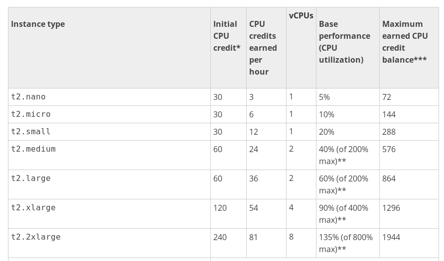

# Service EC2 

Fini la présentation haut niveau du service de cloud ou le listing des produits passons avec au service [AWS EC2](https://aws.amazon.com/ec2/details/) en "détail" (Petit rappel , je vais vous présenter ce que je connais, je vous invite à poursuivre ...)

Telle que mentionné [EC2](https://aws.amazon.com/ec2/details/) est le service de machine virtuelle d'Amazon, le terminologie utilisé par Amazon pour nommé cette machine est **INSTANCE**. Lors de la lecture de documentation vous aurez donc le terme **instance EC2**.
Nous allons débuter avec ce service ceci nous permettra de voir l'ensemble de l'écosystème qui l'entoure :

* réseautique
* Stockage 
* ...

Regardons de haut niveau ce qu'est une instance [EC2](https://aws.amazon.com/ec2/details/) :

* La première chose est de déterminer le lieu géographique où l'instance sera mise en marche. L'objectif est d'avoir le service le plus proche de vos utilisateurs afin que le temps de réponse soit optimal. Pourquoi traversé l'atlantique à chaque communication si la majorité de vos utilisateurs sont en France . Voici le lien définissant l'ensemble des [centre de données d'Amazon](https://aws.amazon.com/about-aws/global-infrastructure/) .
* Il existe plusieurs type d'instance [EC2](https://aws.amazon.com/ec2/details/) , chaque type à des spécifications particulière ( + CPU, + mémoire, + disque dur , disque dur avec + __d'I/O__ (__ssd__) , + GPU , ...) . Nous allons voir les différents type d'instance disponible dans la prochaine section . Bien entendu le prix change selon le type . L'objectif est de sélectionner celle selon vos besoins , elles sont regroupées :
    * __General Purpose__ : Utilisation général 
    * __Compute Optimized__ : Optimisation pour l'utilisation CPU
    * __Memory Optimized__ : Optimisation pour l'utilisation de la mémoire
    * __Accelerated Computing Instances__ : Optimisation avec accélération de traitement de calcul (__GPU__)
    * __Storage Optimizeda__ : Optimisation pour le stockage.
* Suite à la sélection de l'instance , nous avons le choix de "l'image" système d'exploitation / distribution que nous désirons avoir sur cette instance, nous avons les gros joueurs du jours. Voici une liste mais nous y reviendrons :
    * GNU/Linux : RedHat, Ubuntu , Debian , ... 
    * MS Windows : 2008 __R2__, 2012 
    * __FreeBSD__ 
    * Amazon/GNU/Linux : version de RedHat modifier 
    * __Solaris__ (à valider s'il est toujours présent)
* Nous allons bien entendu attribuer un peu de stockage à cette machine , il existe plusieurs type disponible comme toujours le prix varie :D c'est le truc 
    * __SSD__ 
    * Disque classique
    * Tape (__ouin__ j'avoue que je l'ai pas encore compris, mais je vais faire quelque recherche quand nous y serons :P)
* Configuration réseau, telle que mentionné plus tôt, il est possible de définir des segments interne à AWS ainsi que des règles de __firewall__ :
    * Segment réseaux __VPC__ 
    * Règles de __firewall__ de l'instance.
    * Assignation d'une adresse IP externe statique ou dynamique

Voici ce que je vous propose pour la présentation du service , nous allons faire la théorie sur les types d'instance __d'EC2__ ainsi que les images disponible (système d'exploitation) , nous laisserons le stockage ainsi que la partie réseau de côté dans un premier temps.
Juste pour avoir un jouet tous de suite avec quoi s'amuser :P , une fois la chose faite nous reviendrons afin de mieux comprendre la partie réseau , le stockage ainsi que les autres mécanismes autour __d'EC2__.

C'est partie !!

TODO Ajout imgs

## Type d'instance EC2

Nous devons définir quelle est le type de matériel que nous désirons avoir pour notre instance __EC2__ , voici la [documentation officiel Amazon sur le sujet](http://docs.aws.amazon.com/AWSEC2/latest/UserGuide/instance-types.html) .
Le choix est toujours difficile et le sera toujours , personne n'a envie de choisir une poubelle, nous désirons avoir de la PERFORMANCE. Bien entendu le prix varie en fonction de la puissance du système choisie. Ceci étant dit, rappelons nous le principe nous devons être plus flexible , optimiser la facture pour NOS besoin. Le choix de l'instance que nous réalisons au début n'est PAS obligatoirement le type d'instance que nous utiliserons dans le future. 
En effet nous verrons que nous pouvons modifier le type d'instance dans le temps que ce soit pour augmenter ou réduire cette dernière.

Mais avant de parler de changer une instance existante faudrait peut-être débuter par la création :P. 

Voici les types d'instance disponible aujourd'hui (2017-03-16) 

TODO : Voir pour ajouter des lignes dans le tableau ...

| Regroupement d'instance | Type d'instance disponible  |
|:------------------------|:----------------------------:|
| Utilisation général     | t2.nano , t2.micro , t2.small , t2.medium , t2.large , t2.xlarge , t2.2xlarge , m4.large , m4.xlarge , m4.2xlarge , m4.4xlarge , m4.10xlarge , m4.16xlarge , m3.medium , m3.large , m3.xlarge , m3.2xlarge |
| Optimisation pour le calcule | c4.large , c4.xlarge , c4.2xlarge , c4.4xlarge , c4.8xlarge , c3.large , c3.xlarge , c3.2xlarge , c3.4xlarge , c3.8xlarge |
| Optimisation pour la mémoire | r3.large , r3.xlarge , r3.2xlarge , r3.4xlarge , r3.8xlarge , r4.large , r4.xlarge , r4.2xlarge , r4.4xlarge , r4.8xlarge , r4.16xlarge , x1.16xlarge , x1.32xlarge |
| Optimisation pour le stockage| d2.xlarge , d2.2xlarge , d2.4xlarge , d2.8xlarge , i2.xlarge , i2.2xlarge , i2.4xlarge , i2.8xlarge , i3.large , i3.xlarge , i3.2xlarge , i3.4xlarge , i3.8xlarge , i3.16xlarge |
| Optimisation pour le calcule extrême | p2.xlarge , p2.8xlarge , p2.16xlarge , g2.2xlarge , g2.8xlarge |

Comme vous pouvez le constater ce n'est pas le choix qui manque , mais trop de choix perd le client , moi le premier. Quelle instance choisir , même si nous pouvons la modifier par la suite il nous faut un point de départ. 

Bien entendu nous allons faire notre choix dans les 5 regroupements disponible , passons chaque groupe , vous avez la liste disponible sur le site d'amazon [type d'instance](https://aws.amazon.com/ec2/instance-types/). Je vous invite à consulter le site pour avoir la dernière mise à jour, les principes généraux ne change pas mais il est possible que le type d'instance __t2.medium__ présenter ici contienne 4 Gigs aujourd'hui, mais que dans 6 mois Amazon l'augmente à 6 Gigs. Ce sera encore plus significatif lors de la spécification du CPU. 

### Utilisation général 

Comme sont nom l'indique l'objectif de ce regroupement est d'avoir du matériel pour une utilisation "classique" sans particularité particulière . Bien que ce soit une utilisation général ceci ne veut pas dire que ce ne sont pas des machines performantes ou base de gamme. 

Pour mettre en perceptive voici les extrêmes :

|                 | Nom           | vCPU   |  Memoire   | Stockage      |
|-----------------|:-------------:|-------:|-----------:|--------------:|
| Plus petite     | t2.nano       |  1     |   0.5 Gigs | HD classique  |
| Plus Grosse     | m4.16xlarge   |  64    |   256 Gigs | HD classique  |
| Grosse avec SSD | m3.2xlarge    |  8     |   30 Gigs  | HD SSD        |


Comme vous pouvez le voir même dans le regroupement "général", nous avons des instances sous stéroïdes :D. Sous le regroupement "général" nous avec 3 regroupement **T2,M4 et M3** passons de la plus petite machine à la plus grosse .

#### Instance T2.\*

Voici les spécifications pour les instances de type **T2**, au risque de me répété si vous n'avais pas lu le texte avant , valider sur le site d'Amazon si ceci n'a pas changer !!

| Model    | vCPU |CPU Crédits/h|CPU Crédit init|  Mem (GiB) |   Storage | Prix US/heure (Us Est)       | Prix US/heure (Canada) | Prix US/heure (Francfort) |
|:---------|:----:|:-----------:|:-------------:|-----------:|:---------:|-----------------------------:|-----------------------:|--------------------------:|
|t2.nano   |  1   |  3          | 30            | 0.5        | EBS-Only  | $0.0059(linux) / $0.0082(win)| $0.0065(linux)         | $0.0068 (linux)           |
|t2.micro  |  1   |  6          | 30            |  1         | EBS-Only  | $0.012(linux) / $0.017(win)  | $0.013 (linux)         | $0.014 (linux)            |
|t2.small  |  1   |  12         | 30            |  2         | EBS-Only  | $0.023(linux) / $0.032(win)  | $0.026 (linux)         | $0.027 (linux)            |
|t2.medium |  2   |  24         | 60            |  4         | EBS-Only  | $0.047(linux) / $0.065(win)  | $0.052 (linux)         | $0.054 (linux)            |
|t2.large  |  2   |  36         | 60            |  8         | EBS-Only  | $0.094(linux) / $0.122(win)  | $0.103 (linux)         | $0.108 (linux)            |
|t2.xlarge |  4   |  54         | 120           |  16        | EBS-Only  | $0.188(linux) / $0.229(win)  | $0.206 (linux)         | $0.216 (linux)            |
|t2.2xlarge|  8   |  81         | 120           |  32        | EBS-Only  | $0.376(linux) / $0.438(win)  | $0.412 (linux)         | $0.432 (linux)            |
    : https://aws.amazon.com/ec2/instance-types/ ( date : 2017-03-17 )

Amazon indique que ces machines sont exécuté sur des processus __Intel Xeon__ à haute fréquence, bien entendu ces instance sont dans les moins chère de l'offre. Comme vous pouvez le constater il y a un peu de tous , des machines avec peu de vCPU et peu de mémoire , ainsi que des machines plus puissante.
J'ai indiqué les prix, cependant ceci est en date du 17 mars 2017, les prix change beaucoup et généralement à la baisse , les prix indiqués sont ceux pour une utilisation à la demande. Si vous planifiez avoir la machines pour une longue durée , disponible 24/7 une autre liste de prix est disponible. [Prix des instances](https://aws.amazon.com/ec2/pricing/on-demand/) .

Mon objectif en affichant les prix est principalement pour vous démontrer les différences entre les instances et offrir un idée globale du coût, comme vous pouvez le voir ceci diffère avec le système d'exploitation ainsi que la géo-localisation du centre de donnée où est exploité l'instance.

Décortiquons l'offre des instances :

* **vCPU** : Nous avons un nombre N de CPU disponible sur la machine , ceci nous permettra d'avoir plusieurs processus en exécution en même temps sur la machine
* **CPU Crédits /heure** , **CPU Crédit init** : Je vais faire une section tous de suite après ... Patience l'explication en une ligne est difficile
* **Mémoire** : Le nombre de Gigs alloué pour votre machine ceci est de la mémoire alloué uniquement pour vous , ce n'est PAS partagé.
* **Stockage** : Ces instances n'offre que des disques classique comme stockage.
* **Prix US / heure** : Ces instances sont facturés à l'heure , les machines GNU/Linux n'obligeant pas la mise en place de licence sont les moins chère ;-), je vous ai mis le prix d'une machines Windows comme référence, Ceci offre une idée. Comme vous pouvez le voir le prix varie selon le centre de donnée. Les États-Unis sont le lieux le moins chère (sponsorisé par la NSA ;-) ) . À première vue la coût le plus élevé est au centre de donnée d'Amérique du sud (Sao Paulo- Brézil) 


##### Crédits CPU

Site web d'Amazon avec l'information original: [T2 instances cpu credits](http://docs.aws.amazon.com/AWSEC2/latest/UserGuide/t2-instances.html#t2-instances-cpu-credits)

Cette section est très importante, car vue le prix vous allez probablement vouloir choisir ce type d'instance, si ce n'est pas vous ce sera le responsable du portefeuille de votre entreprise :P. L'introduction du concept étant non conventionnel dans un environnement interne (On Promise), nous devons le connaître , le comprendre afin de l'identifier si le problème survient. Passons au explication maintenant !

Il y a plusieurs valeurs définie pour un crédits de CPU selon l'instance de 1 jusqu'à 81 , mais **que veut dire 1 crédits CPU ??** Voici la définition.

* 1 crédit CPU == 1 vCPU utilisé à 100% pendant 1 minutes !! 
* 1 crédit CPU == 1 vCPU utilisé à 50% pendant 2 minutes !! :D 
* 1 crédit CPU == 2 vCPU utilisé à 25% pendant 2 minutes !! :D 

Vous comprenez le concept. Si vous regardez le tableau plus haut vous pouvez voir la colonne __CPU Crédits init__ , lors de l'initialisation de l'instance cette dernière à automatiquement N crédits disponible. Dans le cadre de __t2.nano__ nous avons 30 crédits de CPU disponible. Par la suite à chaque **heure** l'instance reçoit 3 crédits de CPU additionnel. L'objectif des crédits alloué à l'initialisation est d'offrir une expérience agréable sinon nous serions vite à cours de ressources.




    :http://docs.aws.amazon.com/AWSEC2/latest/UserGuide/t2-instances.html#t2-instances-cpu-credits

* \*\*\* : La valeur indiqué n'inclue pas les crédits CPU initialement alloué au système , exemple pour l'instance de type __t2.nano__ la valeur "réelle" est : 102 , par contre une fois les 30 crédits initiales consommé la valeur maximal est 72 !


**Expiration des crédits CPU**

Les crédits CPU initiaux n'expire jamais , cependant ce sont les premiers utilisés, par la suite chaque crédit alloué à l'instance expire 24 heures après leurs assignations. La validation des crédits CPU est un processus au 5 minutes. Quand vous arrêtez votre instance (__STOP__) les crédits CPU sont aussi supprimé , cependant lors du redémarrage ce dernier recevra une nouvelle fois les crédits CPU initiaux . 

Prenons un exemple, car j'en convient ce n'est pas toujours claire sans exemple : Prenons une instance de type __t2.small__ .

| Model    | vCPU |CPU Crédits/h|CPU Crédit init|  Mem (GiB) | Base performance (CPU utilization) | Maximum Crédit CPU | 
|:---------|:----:|:-----------:|:-------------:|-----------:|:----------------------------------:|-------------------:|
|t2.small  |  1   |  12         | 30            |  2         | 20%                                | 288                |

Disons que nous utilisons uniquement 5% du CPU de l'instance ( 5% pendant 60 minutes) , le système consommera 3 crédit CPU par heure ( 20% / 4 = 5% CPU utilisation et / ou 12 crédits / 4 = 3 crédit CPU ). Donc sur les 12 crédits alloué à chaque heure il y a un surplus de 9 crédits , ces derniers **doivent** être utilisé dans les 24 heures sinon ils sont perdus. De plus si l'instance accumule plus de 288 crédit CPU chaque crédits additionnel seront perdu.

**Quand il n'y a plus de crédit de CPU**

Ça marche beaucoup mieux :P , non évidement les problèmes commences et le système n'est plus utilisable, comme dirait Amazon vous n'aurez pas une expérience agréable ... Heu c'est le moins que l'on puisse dire :P , bien entendu les crédits CPU seront alloué dans le temps donc l'instance redeviendra fonctionnel cependant vous aurez une indisponibilité de service ! Ça c'est ce que dis Amazon, malheureusement je ne pourrais pas toujours partagé des expériences concret, mais dans ce cas je peux :D , donc profitons en ! 
**Prévenir / visualiser le problème de crédit CPU**

C'est bien beau de constater le problème une fois qu'il est présent , mais bon rendu avec un __load__ si élevé que je ne peux plus rien faire même établir une connexion __SSH__ est difficile , c'est une mince consolation . 

Effectivement la question est comment visualiser l'état du CPU afin de migré l'instance avant que l'état du système ne soit catastrophique !!!

Amazon offre le système [CloudWatch](https://aws.amazon.com/cloudwatch/) , est en mesure de __monitorer__ et __grapher__ :

*  Amazon EC2 instances.
*  Amazon EBS stockage.
*  Elastic Load Balancers.
*  Amazon RDS base de données.
*  Prendre vos logs applicatifs.

Il y a 2 mode de fonctionnement pour __CloudWatch__ 

* __Basic Monitoring__ (**gratuite**) : 7 métriques pré sélectionnés sont disponible , la collecte des informations sur l'instance est réalisé au 5 minutes. De plus il y une validation pour 3 statuts telle que validation que l'instance est allumé, ... 
* __Detailed Monitoring__ (**payant selon l'utilisation**) : Bien entendu nous conservons le monitoring de base mais cette fois avec une intervalle à la minutes , de plus d'autre métriques sont disponible. Il est aussi possible de faire de l'agrégation entre le type de l'instance et le système en cours d'utilisation. 

ICI ICI ICI : TODO mettre un exemple de CloudWatch

* Référence :
    * [AWS - T2 instances cpu credits](http://docs.aws.amazon.com/AWSEC2/latest/UserGuide/t2-instances.html#t2-instances-cpu-credits) 
    * [Understanding cpu steal time when should you be worried - cpu steal](http://blog.scoutapp.com/articles/2013/07/25/understanding-cpu-steal-time-when-should-you-be-worried)


A lire : http://docs.aws.amazon.com/AWSEC2/latest/UserGuide/concepts_micro_instances.html

#### Instance M4.\*

Voici les spécifications pour les serveurs de type **M4** 

| Model     | vCPU | ECU   | Mem (GiB)| Storage| dédié EBS Bandwidth (Mbps) | Prix US/heure (Us Est)    | Prix US/heure (Canada) | Prix US/heure (Francfort) |
|:----------|:----:|:-----:|:--------:|:------:|----------------- ---------:|:-------------------------:|-----------------------:|--------------------------:|
|m4.large   |  2   | 6.5   | 8        |EBS-Only|    450                     |$0.108(linux) / $0.203(win)| $0.119(linux)          | $0.129 (linux)            |
|m4.xlarge  |  4   | 13    | 16       |EBS-Only|    750                     |$0.215(linux) / $0.404(win)| $0.237(linux)          | $0.257 (linux)            |
|m4.2xlarge |  8   | 26    | 32       |EBS-Only|   1,000                    |$0.431(linux) / $0.809(win)| $0.474 (linux)         | $0.513 (linux)            |
|m4.4xlarge |  16  | 53.5  |  64      |EBS-Only|   2,000                    |$0.862(linux) / $1.618(win)| $0.948 (linux)         | $1.026 (linux)            |
|m4.10xlarge|  40  | 124.5 | 160      |EBS-Only|   4,000                    |$2.155(linux) / $4.045(win)| $2.37 (linux)          | $2.565 (linux)            |
|m4.16xlarge|  64  | 188   | 256      |EBS-Only|  10,000                    |$3.447(linux) / $6.471(win)| $3.792 (linux)         | $4.104 (lnux)             |
    : https://aws.amazon.com/ec2/instance-types/ ( date : 2017-03-17 )

Spécification technique :

* **CPU** :  __3.3 GHz Intel Xeon® E5-2686 v4 (Broadwell) processors ou 2.4 GHz Intel Xeon® E5-2676 v3 (Haswell) processors__

Quelle est la GROSSE différence entre ces instances et les instances **T2** ?

1. Le CPU a une réservation d'utilisation plus besoin de faire le calcule avec les crédits d'utilisation lors des augmentations d'utilisation de l'instance. Vous avez toujours des crédits, mais j'ai pas dis toujours du CPU :P .
2. **ECU ==  EC2 Compute Units** , cette notion fut introduite par Amazon afin de garantir une disponibilité de CPU , car Amazon n'a pas un type de CPU dans la composition de son parc. L'objectif est d'assurer une performance peut importe le CPU réelle où l'instance est en exécution  [FAQ](https://aws.amazon.com/ec2/faqs/#What_is_an_EC2_Compute_Unit_and_why_did_you_introduce_it). 
3. Il y a un accès au ressources du disque dur garantie afin d'assurer la performance d'accès disque .

Comme l'ensemble des instances d'Amazon (en dehors du type **T2**) utilise le système d'**ECU** nous y reviendrons un peu plus tard. Dans la section [ECU Compute Units](#ecu-compute-units) .

* Pourquoi choisir **M4** plutôt que **T2** :
    * Vous avez besoin d'une utilisation __CPU__ plus grande et ceci de manière constante 
    * Vous avez des accès disque "important" sans être excessif (__SSD__)
    * Vous avez besoin de mémoire et CPU 
    * Vous avez un peu plus d'argent :P

 
#### Instance M3.\*

Voici les spécifications pour les serveurs de type **M3** 

| Model     | vCPU | ECU   | Mem (GiB)| Storage  |  Prix US/heure (Us Est)    | Prix US/heure (Canada) | Prix US/heure (Francfort) |
|:----------|:----:|:-----:|:--------:|:--------:|:--------------------------:|-----------------------:|--------------------------:|
|m3.medium  |  1   | 3     |  3.75    |1 x 4 SSD | Non Disponible             |Non Disponible          |    $0.079 (linux)         |
|m3.large   |  2   | 6.5   |  7.50    |1 x 32 SSD| Non Disponible             |Non Disponible          |    $0.158 (linux)         |
|m3.xlarge  |  4   | 13    |  15      |2 x 40 SSD| Non Disponible             |Non Disponible          |    $0.315 (linux)         |
|m3.2xlarge |  8   |  26   |  30      |2 x 80 SSD| Non Disponible             |Non Disponible          |    $0.632 (linux)         |
    : https://aws.amazon.com/ec2/instance-types/ ( date : 2017-03-17 )

Spécification technique :

* **CPU** :  __High Frequency Intel Xeon E5-2670 v2 (Ivy Bridge) Processors__

Quelle est la GROSSE différence entre ces instances et les instances **M4** ?

1. Le CPU a une cadence plus importante que la version __M4__.
3. L'instance vient avec des disques __SSD__ , plus grande performance __d'I/O__
2. L'instance **M3** n'est cependant pas disponible partout comme vous pouvez le voir dans le tableau ci-dessus. Nous l'avons sur la côte Ouest américain, mais pas sur la côte Est. Indisponible au Canada , etc .

Comme l'ensemble des instances d'Amazon (en dehors du type **T2**) utilise le système d'**ECU** nous y reviendrons un peu plus tard. Dans la section [ECU Compute Units](#ecu-compute-units) .

* Pourquoi choisir **M3** plutôt que **M4** :
    * Vous avez des accès disque "intensif" **SSD**


### Optimisation pour le calcule

Ces instances ont une plus grande puissance de calcul, nous parlons ici de calcul réalisé avec un processeur classique, nous verrons plus tard qu'il existe aussi des instances offrant des processeurs __GPU__ afin de réaliser des calcules encore plus puissant . Nous retrouvons 2 classes d'instance avec un disque dur "classique" et avec des disques **SSD**. 

Voici des exemples d'utilisation mentionné par Amazon :

* Serveurs web très sollicité 
* Traitement en lot (batch)
* Analyse distribué
* Jeux __MMO__
* Encodage vidéos.


#### Instance C4.\*

Voici les spécifications pour les serveurs de type **C4** 

| Model     | vCPU | ECU   | Mem (GiB)| Storage  |  Prix US/heure (Us Est)    | Prix US/heure (Canada) | Prix US/heure (Francfort) |
|:----------|:----:|:-----:|:--------:|:--------:|:--------------------------:|-----------------------:|--------------------------:|
|c4.large   |  2   | 8     |  3.75    |EBS Only  |$0.1 (linux)/$0.192 (win)   | $0.11 (linux)          | $0.114 (linux)            |
|c4.xlarge  |  4   | 16    |  7.50    |EBS Only  |$0.199 (linux)/$0.383 (win) | $0.218 (linux)         | $0.227 (linux)            |
|c4.2xlarge |  8   | 31    |  15      |EBS Only  |$0.398 (linux)/$0.766 (win) | $0.438 (linux)         | $0.454 (linux)            |
|c4.4xlarge | 16   | 62    |  30      |EBS Only  |$0.796 (linux)/$1.532 (win) | $0.876 (linux)         | $0.909 (linux)            |
|c4.8xlarge | 36   | 132   |  60      |EBS Only  |$1.591 (linux)/$3.091 (win) | $1.75 (linux)          | $1.817 (linux)            |
    : https://aws.amazon.com/ec2/instance-types/ ( date : 2017-03-17 )

Spécification technique :

* **CPU** :  __High frequency Intel Xeon E5-2666 v3 (Haswell) processors optimized specifically for EC2__

Quelle est la GROSSE différence entre ces instances et les instances **M\*** ?

1. Le CPU a une cadence plus importante que les version __M\*__.
2. Le CPU est optimisé pour l'environnement __EC2__
3. Avec la plus grosse instance (__c4.8xlarge__) vous avez la possibilité de contrôler la configuration du  processeur __C-state__ et __P-state__ . (Prendre note que j'ai AUCUNE idée de ce que ça veut dire :P , mais c'est sur le site :D )
4. Option du [réseau renforcé (enhanced-networking)](https://aws.amazon.com/ec2/details/#enhanced-networking), en gros ceci utilise un autre driver qui permet un plus grande performance réseaux augmentant la capacité sans affecté les performances __CPU__. Ceci n'est pas actif par défaut vous aurez quelques opération à réalisé voir [la documentation](http://docs.aws.amazon.com/AWSEC2/latest/UserGuide/sriov-networking.html)

Comme l'ensemble des instances d'Amazon (en dehors du type **T2**) utilise le système d'**ECU** nous y reviendrons un peu plus tard. Dans la section [ECU Compute Units](#ecu-compute-units) .

* Pourquoi choisir **C4** plutôt que **M\*** :
    * Vous avez des besoin de traitement CPU plus élevé.


#### Instance C3.\*

Tout comme pour les instances __M4 -> M3__ vous retrouvez le même système C4 mais avec un stockage **SSD** au lieu du stockage classique __EBS__.
Nous retrouvons la même limitation soit ces instances ne sont pas disponible sur l'ensemble des __région__ site d'Amazon.

Je ne referai pas le tableau , vous avez compris le concept vous pouvez le consulter sur Amazon : [prix](https://aws.amazon.com/ec2/pricing/on-demand/)

* Pourquoi choisir **C3** plutôt que **C4** :
    * Vous avez des besoin d'accès disque plus élevé


### Optimisation de la mémoire 

ICI ICI ICI

### ECU Compute Units

Analysons justement cette question de **ECU**, telle que mentionné plus haut, cette valeur permet de "garantir" une performance du __CPU__ peut importe l'architecture du serveur. Cette standardisation permet donc de réaliser une comparaison des offres d'Amazon peut importe le CPU réellement attribué pour l'instance . Super on comprend le pourquoi , maintenant 1 **ECU** ça équivaut à quoi ?  Notre / votre problème en déplaçant nos applications du mode interne vers le cloud est que nous perdons le liens avec le matériel où le système est en exécution. 
Cette segmentation entre le physique et le matériel fut déjà introduite avec l'arrivée de la virtualisation, cependant s'il y avait un problème nous pouvions voir le serveur vmware où la Machine Virtuelle était en exécution et voir l'architecture CPU. Avec le cloud cette méthode n'est plus possible , nous pouvons voir quelle type de CPU l'instance utilise (__/proc/cpuinfo__) , mais nous ne savons pas l'ensemble des mécanismes mis en place par le fournisseur de service afin de garantir la disponibilité des ressources **partagées** !

Bon d'accord, mais c'est quoi **1 ECU** :P , voici la meilleur définition que j'ai :

```
1 ECU est défini comme une puissance de calcul (computer power) de 1.0 à 1.2 Ghz d'un serveur de 2007 
```

Avouez c'est super claire !!! Donc reprenons avec un exemple concret 

| Model     | vCPU | ECU   | Mem (GiB)|
|:----------|:----:|:-----:|:--------:|
|m4.xlarge  |  4   | 13    | 16       |

Donc la machine __m4.xlarge__ avec 4 __vCPUs__ (13 __ECU__) et 16 Gigs de __Ram__ :

* **ECU par vcpu** : 13 / 4 = 3.25 
*

TODO : ref: https://medium.com/devoops-and-universe/database-performance-aws-vs-bare-metal-452f64481b07#.72oayts8o
ref ECU : https://www.datadoghq.com/blog/are-all-aws-ecu-created-equal/
https://www.servethehome.com/aws-ec2-c4-instances-benchmarked/

#### Exemple concret d'utilisation trop grande du CPU

Voici ce qui ce passera sur un système GNU/Linux si vous utilisez plus de CPU que disponible :

Mise en contexte en juillet 2016 nous avions pris la machine suivante :

| Model    | vCPU | ECU         | Mem (GiB)     | stockage   | prix US / heure| 
|:---------|:----:|:-----------:|:-------------:|-----------:|:--------------:|
|m4.xlarge |   4  |  13         |        16     |EBS Only    | $0.239         |

Nous roulions simulions des clients pour des testes de charges , chaque machines démarrais un nombre élevé de processus beaucoup de processus __forké__. 
Finalement prendre une machine avec du crédits CPU n'était pas une bonne idée, car l'expérience d'Amazon ne fut pas optimal dû à une erreur de compréhension du système !! L'apprentissage a son lot de conséquence , __Ha well :D__ aujourd'hui on a compris :D !! 

Donc voici ce qui est arrivé lors de l'exécution des application ...

Le __LOAD average__ va monter en FLÈCHE , nous avons 4 __vCPU__ !!! :

```bash
[user@ip-172-31-31-188 ~]$ uptime
11:54:36 up  3:33,  2 users,  load average: 6917.16, 7330.14, 4297.11
```

* __Rappel__ : je présume que certain non pas suivie les cours précédent ,  voir oublié la notion sur le __load average__ la valeur qui est donné 6917.16 (première valeur ) est le nombre de processus qui furent en attente de temps de CPU, il y a 5 minutes :P. 7330.14 représente le nombre de processus qui furent en attente de CPU il y a 10 minutes et pour finir 4297.11 pour les 15 dernière minutes. 

Mais pourquoi la charge du serveur est si élevé ? Comme l'instance n'a plus de crédit CPU le système n'alloue plus de temps CPU au processus , donc ces derniers sont en attentes d'avoir du temps de traitement disponible. Dans la situation présente nous avons déjà eu de la chance d'être en mesure de nous connecter :P , en fait nous avions du attendre d'avoir des crédits CPU  d'alloué!

```bash
[user@ip-172-31-31-188 ~]$ top
top - 11:59:24 up  3:37,  2 users,  load average: 8698.37, 8211.48, 5483.36
Tasks: 2913 total, 527 running, 2379 sleeping,   0 stopped,   7 zombie
%Cpu(s):  0.5 us, 53.7 sy,  0.0 ni,  0.0 id,  0.0 wa,  0.0 hi,  0.0 si, 45.8 st
KiB Mem : 15238296 total,   154112 free, 14480556 used,   603628 buff/cache
KiB Swap:        0 total,        0 free,        0 used.   185056 avail Mem
```

Entre l'instruction __top__ et __uptime__ nous voyons que la charge à encore augmentée :P. 

J'aimerai porter votre attention sur la ligne **%Cpu(s)** :

* **53,7 sys** : 53,7% du  __vcpu__ est pour le système d'exploitation , ceci est élevé car le système est déjà pris à la gorge ce devrais être moins , mais il doit géré les processus qui n'ont pas d'accès CPU.
* **45.8 st** : __st__ == **steal** de l'anglais **voler** en d'autre terme le système essaye d'avoir du temps de CPU , mais le gestionnaire de ressource dans le cas de Amazon __Xen__ limite l'accès. 

Vous avez un très bonne article sur le cas : [http://blog.scoutapp.com/articles/2013/07/25/understanding-cpu-steal-time-when-should-you-be-worried](http://blog.scoutapp.com/articles/2013/07/25/understanding-cpu-steal-time-when-should-you-be-worried).

Prendre note que nous parlons d'Amazon, mais vous pourriez avoir le même problème dans votre compagnie s'il y a de la limitation de ressource CPU avec le système de virtualisation en place. 

Je voulais vous offre un exemple concret d'un problème de crédit CPU , car lorsque le problème est survenue nous ne savions pas comment identifier le problème!


    

## Image -  Amazon Machine Image (AMI) EC2, système d'exploitation
## Stockage disponible pour l'instance EC2
## Amazon CloudWatch (https://aws.amazon.com/cloudwatch/)
## Auto Scaling (https://aws.amazon.com/autoscaling/)
## Resize instance (http://docs.aws.amazon.com/AWSEC2/latest/UserGuide/ec2-instance-resize.html)
## Elastic Load Balancing (https://aws.amazon.com/elasticloadbalancing/)
## VM Import/Export (https://aws.amazon.com/ec2/vm-import/)
## Systems Manager API

# idée raw 

* Présentation des services haut niveau
* Présentation de EC2
* explication des reseaux
    * ip static 
* Le système de conteneur dans aws
* route 53
* S3


# Alors Cloud ou pas cloud ?
