# Opération simple avec EC2 et compréhension des bases du réseau AWS

Je n'aurais pas la prétention de dire que nous allons voir l'ensemble des possibilités avec __EC2__ , le nombre de possibilité est tellement grande et mon expérience trop mince pour couvrir l'ensemble des possibilités !!

Je vais comme toujours faire de mon mieux, en respectant mes intérêts :P , nous verrons par la suite où ceci nous mène . 
Pour débuter nous allons :

* comprendre un peu mieux les aspects **Réseau et sécurité** , l'objectif est de voir comment assurer l'accès aux instances __EC2__ via le système de clé ssh, donc le contrôle d'accès. 
* Par la suite nous verrons comment faire communiquer les instances entre elle, en comprenant la limitation des accès réseaux en place. À ce stade nous ne verrons pas la gestion des réseaux, j'espère le voir plus tard.

## Réseau et sécurité

Nous allons voir les bases de la configuration pour notre instance __EC2__, pour ceux qui ont déjà eu la chance de jouer avec __AWS__ ceci sera peut-être connu , bien que je pense qu'il a toujours des clarifications à extraire d'une formation.

* Compréhension de l'utilisation des clés ssh.
* Contrôle d'accès au instance.
* Communication réseau entre les instances .
    * __VPC__
    * Sous-réseaux __subnet__

Référence : [Network and Security](http://docs.aws.amazon.com/fr_fr/AWSEC2/latest/UserGuide/EC2_Network_and_Security.html)

### Clé de connexion ssh

Lors de la démonstration de la création de l'instance __EC2__ nous avons créer une clé SSH pour être en mesure d'établir une connexion sur la machine. Cette clé __ssh__ fut assigné à l'utilisateur __ec2-user__. Nous l'avions généré à la volé avec l'interface d'Amazon, pour rappel la clé __SSH__ se divise en 2 partie : 

* Clé privé : Cette dernière est critique pour la sécurité de la communication, en fait l'ensemble de la sécurité est basé sur le fait que cette clé n'est pas compromise. Lors de la génération par Amazon, la clé fut téléchargé et telle que mentionné par le service il ne fallait pas la perdre , car aucune copie n'est conservé chez Amazon. Si nous perdons la clé nous ne serons plus en mesure d'établir de connexion sur notre instance, à moins d'assigner une nouvelle paire de clé . Nous le verrons plus tard...
* Clé publique : Cette dernière est installé sous l'utilisateur, dans notre cas __ec2-user__ et elle est associé à la clé privé. Comme son nom l'indique elle est publique non critique au niveau sécurité.

Si vous voulez plus d'information sur le système __SSH__ et les clés privées je vous invite à consulter le site de formation : [X3rus moodle ssh](http://moodle.x3rus.com/mod/lesson/view.php?id=89&pageid=29)

Je voulais clarifier ce point afin de mettre tous le monde au même niveau.
Bien entendu le fait que l'ensemble de la sécurité est basé sur la clé privée et que cette dernière est généré sur un environnement que l'on ne contrôle pas c'est pas super . Nous verrons un peu plus tard comment générer ou installé NOTRE clé ssh afin qu'elle ne soit pas généré sur les systèmes d'Amazon. Mais avant d'en arriver là nous prendrons la vois de la simplicité en utilisant leur système.

* Particularité Amazon et le système de clé
    * Les clés utilisées par Amazon sont des clés **RSA SSH-2 2048 bits**.
    * Vous pouvez définir jusqu'à **5000 paires de clés par région**.
    * Chaque pair de clé doit avoir un nom.
    * Uniquement la clé publique est conservé chez Amazon.

#### Création d'une clé ssh avec AWS

Comme nous l'avons déjà vu , nous pouvons faire la création d'une nouvelle clé directement lors de la création d'une instance, cependant si nous automatisons la création via un script se sera compliquer de réaliser en plus la création de la clé.

Il est donc possible de pré générer la clé de connexion , voici les étapes.

1. Ouvrez la console d'Amazon __EC2__  [https://console.aws.amazon.com/ec2/](https://console.aws.amazon.com/ec2/) et sélectionnez **Key Pairs**

    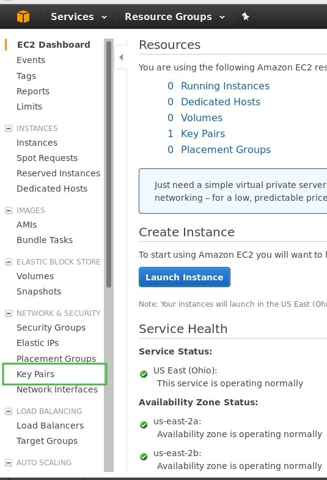
2. Vous aurez la liste des clés présente dans la région , pour rappel chaque région est "indépendante", mais interconnecter. 

    
3. Cliquez sur le bouton de création d'un pair de clé **Creation Key Pair** et assigné lui un nom adéquat !!

    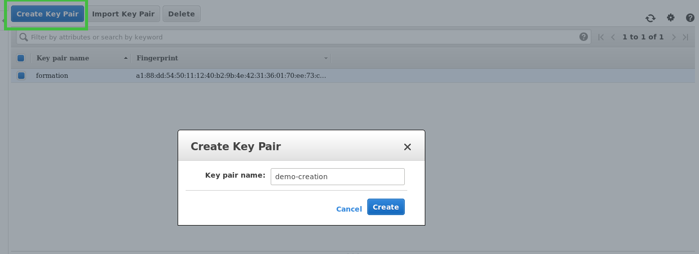
4. Une fois l'opération réalisé , le système vous offrira de télécharger la clé 

    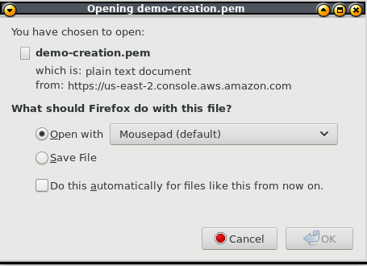


#### Suppression d'une clé 

On va tous de suite couvrir cette partie. 

1. Ouvrez la console d'Amazon __EC2__  [https://console.aws.amazon.com/ec2/](https://console.aws.amazon.com/ec2/) et sélectionnez **Key Pairs**

    
2. Vous aurez la liste des clés présente dans la région , pour rappel chaque région est "indépendante", mais interconnecter. 

    
3. Clique droit ou sélectionnez la clé et faire **delete**


**Conséquence ??**

* Vous ne pourrez plus assigné cette clé aux nouvelle instances, bien entendu si vous avez réalisé une copie de la clé publique préalablement vous pourrez remettre cette clé disponible dans __AWS__.
* L'ensemble des instances qui ont actuellement la clé de configurons ne seront PAS impacté par la suppression.
* Par contre , si vous utilisez un système __d'auto scaling__ qui démarre des instances automatiquement lors de la monté en charge sur un service , ces dernières ne pourront plus être instancié !!

#### Importation d'une clé ssh avec AWS

Telle que mentionné, il est aussi possible d'importer une clé ssh dans votre compte Amazon dans la région sélectionné ! 
Bien entendu il est faut préalablement générer la paire de clé ( publique et privé ) , voici les étapes bien entendu sous GNU/Linux pour les utilisateur d'un autre système __google is your friend :P__ .

* Génération de la clé 

1. Nous utiliserons la commande **ssh-keygen** :

```bash
$ ssh-keygen -t rsa -b 2048
Generating public/private rsa key pair.
Enter file in which to save the key (/home/VotreUtilisateur/.ssh/id_rsa): /home/VotreUtilisateur/.ssh/aws_training    
Enter passphrase (empty for no passphrase):
Enter same passphrase again:
Your identification has been saved in /home/VotreUtilisateur/.ssh/aws_training.
Your public key has been saved in /home/VotreUtilisateur/.ssh/aws_training.pub.
The key fingerprint is:
SHA256:GnJiBmhwW07rr0mcXuqGWtmBmRUrv5cjR/+enp4D4ug VotreUtilisateur@hostname
The key's randomart image is:
+---[RSA 2048]----+
|. . +            |
|.o = +           |
|..+ =            |
|.  X             |
|  + O + S        |
|   * X.=.        |
|  o.BoO...       |
| ..ooO.. ..+     |
|.. +E    +O.     |
+----[SHA256]-----+

```
2. Ceci aura généré 2 fichier sous le répertoire $HOME/.ssh/ , le fichier .pub est la clé **publique** et le fichier sans extension la clé privé.

```bash
 $ ls -ltr /home/VotreUtilisateur/.ssh/
 total 28
 -rw-r--r-- 1 VotreUtilisateur VotreUtilisateur   33 Sep 27  2016 config
 -rw-r--r-- 1 VotreUtilisateur VotreUtilisateur 9710 Mar 27 15:04 known_hosts
 -rw-r--r-- 1 VotreUtilisateur VotreUtilisateur  394 Apr 20 08:36 aws_training.pub
 -rw------- 1 VotreUtilisateur VotreUtilisateur 1766 Apr 20 08:36 aws_training
```
3. Voici le contenu de la clé publique : 

```bash
$ cat /home/VotreUtilisateur/.ssh/aws_training.pub
ssh-rsa AAAAB3NzaC1yc2EAAAADAQABAAABAQC8cVFsE0eyLzkm6d6hc8bEqgVPmitFeWhR5fd7bX+/D2nkY25E3qngJUdYi3gsp9JV5Sb9W5jhIJbhs5+OAhblenLauYkdyVATMT7epQzHt3j79+77N+0cV/WNFK9F5Fw+eCLutfHWJdLRn+eVDZoybg4SaPEMKy34SoCzC9wMUByisDcoZbH823/pk7m5DtkmkveWmjAHiUgV7a4U8f3Rl/oWKaMM40Xi/rNECI03oHyS4iuCDNs6b8Ix1vx8et9oddklYP1UedQuixJlkejflk38u98mfejiuy498nmclkehwiuyf3nr3h98ujpocxaoieu98ehfkjnoi32joic5 VotreUtilisateur@hostname
```

Maintenant que nous avons la clé publique nous allons pouvoir l'importer dans __AWS__.


1. Ouvrez la console d'Amazon __EC2__  [https://console.aws.amazon.com/ec2/](https://console.aws.amazon.com/ec2/) et sélectionnez **Key Pairs**

2. Sélectionnez **import key pair**

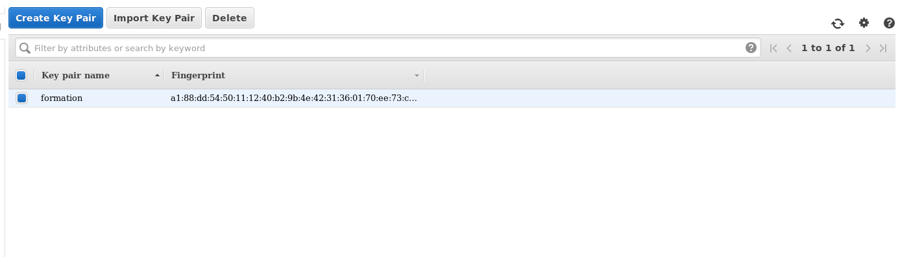
3. Entrez le nom de la clé et copier coller le contenu du fichier __.pub__

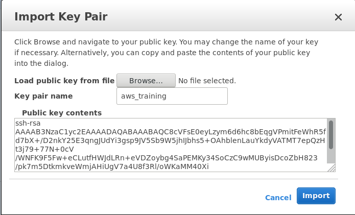

Et voilà pas plus compliquer que ça !!

#### Perte de la clé (oupsss )

{ align=right }

Dans la cas de la perte de la clé privé, si vous n'avez pas d'autre utilisateur que celle par défaut __d'EC2__ vous ne serez plus en mesure d'établir une connexion à l'instance. Bien entendu ceci est critique, donc assurez vous de conserver la clé dans un lieu pris en sauvegarde, et sécurisé je vous suggère fortement d'utiliser un système de gestion de mot de passe qui est en mesure de prendre en charge les fichiers.

Bon si la catastrophe est déjà arrivé vous faites quoi ? 

Si votre instance comme stockage des disques __EBS__, vous pourrez éteindre votre instance et assigné le disque dur que l'instance problématique à une nouvelle instance démarrer . Par la suite vous aurez la libertés de changer les configurations ssh pour reprendre la main dessus . 
Voici le lien explicatif d'Amazon , j'espère avoir le temps de faire une démonstration plus tard , je l'ai mis dans la liste des choses à couvrir.

Référence Amazon : [http://docs.aws.amazon.com/fr\_fr/AWSEC2/latest/UserGuide/ec2-key-pairs.html#replacing-lost-key-pair](http://docs.aws.amazon.com/fr_fr/AWSEC2/latest/UserGuide/ec2-key-pairs.html#replacing-lost-key-pair)

### Pare-feu ou Groupes de sécurité 

Amazon nomme  son pare-feu **Groupe de sécurité** , ce dernier est donc un __firewall__ logiciel qui peut être modifier lors de l'initialisation de l'instance . L'avantage du système se trouve dans le mot __groupe__ :P , en fait il est possible d'ajouter plusieurs groupe à une instance ceci permet donc de faire des type de configuration ou ... __groupe__ :P  qui pourront s'appliquer à plusieurs instance utilisant la même définition .

La mise en place d'un groupe de sécurité est obligatoire lors du démarrage d'une instances __EC2__ , même si vous laissé l'ensemble ouvert ! Comme toujours les groupe de sécurité sont restreint par région ! Lors qu'une instance utilise un groupe de sécurité vous ne pouvez pas le modifier ( renommer , supprimer, ...) par contre il est possible de modifier le contenu des règles ( ajout ou suppression ).
Le changement sera pris en considération est automatiquement appliqué au instance qui sont associés au groupe de sécurité.

Vous pouvez définir jusqu'à 500 groupes de sécurités par région !! Chaque groupe de sécurité peuvent contenir jusqu'à 100 règles. 

#### Particularité des groupes de sécurité

* **Trafic sortant** 
    * L'ensemble du trafic sortant est permis par défaut
* **Trafic entrant**
    * Vous ne pouvez définir que des règles permissives, il n'y a pas d'option pour définir une règle qui bloque
    * L'ensemble des règles sont géré avec l'état ( __states full__  ) , si vous envoyez une demande à partir de votre instance, le trafic de la réponse à cette demande est autorisé, indépendamment des règles entrantes des groupes de sécurité. Pour les groupes de sécurité VPC, cela signifie aussi que les réponses au trafic entrant autorisé ont le droit d'être acheminées vers l'extérieur, indépendamment des règles sortantes.
* **Général** 
    * Il est possible de modifier à tous moment les règles ces dernières s'appliqueront à l'ensemble des instances utilisant le groupe de sécurité. Il y a bien entendu une brève période avant l'application réelle le temps de propagation de la configuration !
    * Il est possible d'assigner plusieurs groupe de sécurité à une instances , ces groupes formeront un tous. Ceci peut être particulièrement intéressant de regrouper vos règles selon les rôles de la machines. 

Une règle est composé de : 

* **Protocole** : Par exemple __TCP__ , __UDP__ ou __ICMP__ les protocoles les plus courant.
* **Port** : Pour les protocoles __TCP__ ou __UDP__ vous pouvez définir un port ou un range de port en utilisant la notation 1000-1500 
* **ICMP code et type** : Pour le protocole __ICMP__ vous pouvez définir le type et le code
* **Source et Destination** : Bien entendu il est possible de définir la source et / ou la destination en spécifiant une adresse IP spécifique ( 66.23.18.23/32) ainsi que des segments réseaux plus large ( 82.23.23.43/29)  est composé de : 

#### Création d'un groupe de sécurité

Voici un exemple de création d'un groupe de sécurité :

1. Ouvrez la console d'Amazon __EC2__  [https://console.aws.amazon.com/ec2/](https://console.aws.amazon.com/ec2/) et sélectionnez **Security Groups**

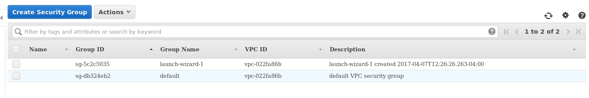
2. Définir le nom du groupe , vous pouvez l'associer à un __VPC__ , le nom bien que arbitraire je vous encourage à mettre quelque chose de bien .

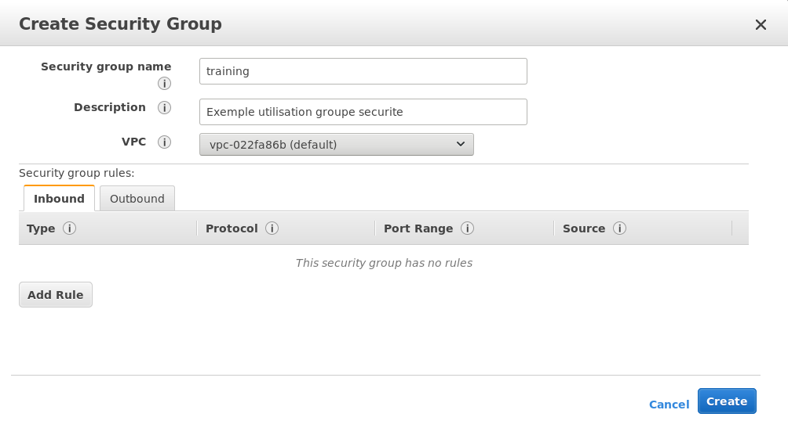
3. Définition des ports et réseau permit pour le trafic entrant

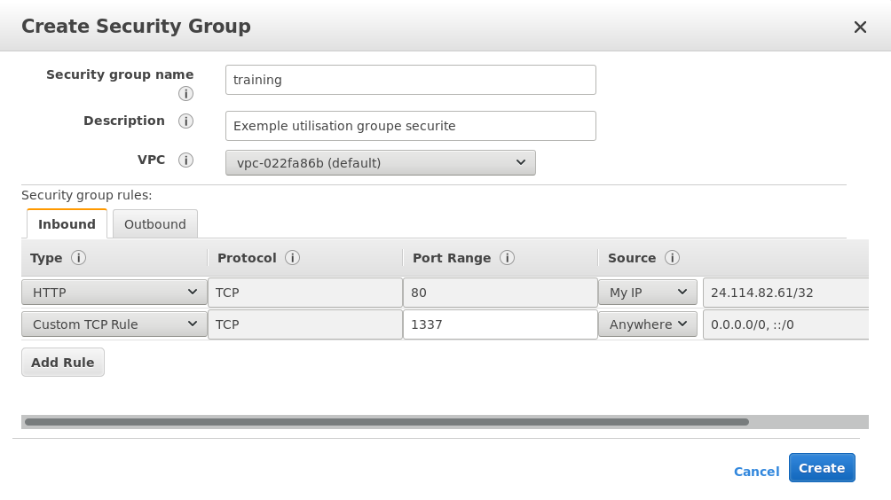
4. Définition des ports et réseau pour le trafic sortant

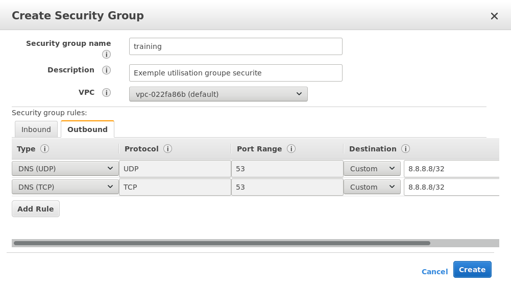

Et voilà on peut dire que Amazon nous facilite beaucoup la vie :D.

#### Démonstration communication entre 2 instance EC2

Maintenant que nous avons visualiser ce qu'est le système de pare feu sous Amazon je pense qu'une petite démonstration s'impose pour que lorsque vous désirerez mettre en place la solution vous soyez en mesure de comprendre où ça peut loquer.

Voici la situation j'ai démarrer 2 instances __EC2__ et nous allons nous s'assurer que nous sommes en mesure de communiquer entre elle, vous pouvez vous imaginez que ceci est le serveur web et une base de donnée . J'ai utilisé 2 instance de type **t2.nano** car je n'ai pas besoin de performance, mais uniquement de la __stack__ IP pour valider la communication.

Note : J'ai du prendre une image Linux Amazon, car le type RedHat 7 n'est pas possible pour le système **t2.nano** , c vraie qu'il n'y a pas beaucoup de CPU ni mémoire ... Bon encore une fois m'en fou un peu car je veux juste le __kernel__ et la carte réseau.

* Visualisation des 2 instances : 

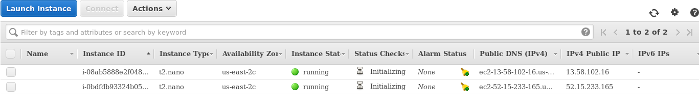

* Établissement de connexion sur chaque instance et visualisation de l'état 

```bash
$ ssh -i aws_training ec2-user@ec2-52-15-233-165.us-east-2.compute.amazonaws.com

        __|  __|_  )
        _|  (     /   Amazon Linux AMI
        ___|\___|___|

https://aws.amazon.com/amazon-linux-ami/2017.03-release-notes/
2 package(s) needed for security, out of 2 available
Run "sudo yum update" to apply all updates.
[ec2-user@ip-172-31-46-78 ~]$
[ec2-user@ip-172-31-46-78 ~]$ hostname
ip-172-31-46-78
[ec2-user@ip-172-31-46-78 ~]$ cat /proc/cpuinfo | grep name
model name      : Intel(R) Xeon(R) CPU E5-2676 v3 @ 2.40GHz
[ec2-user@ip-172-31-46-78 ~]$ ip addr show eth0
2: eth0: <BROADCAST,MULTICAST,UP,LOWER_UP> mtu 9001 qdisc pfifo_fast state UP group default qlen 1000
    link/ether 0a:67:07:39:7f:dd brd ff:ff:ff:ff:ff:ff
    inet 172.31.46.78/20 brd 172.31.47.255 scope global eth0
[ec2-user@ip-172-31-46-78 ~]$ route -n
Kernel IP routing table
Destination     Gateway         Genmask         Flags Metric Ref    Use Iface
0.0.0.0         172.31.32.1     0.0.0.0         UG    0      0        0 eth0
169.254.169.254 0.0.0.0         255.255.255.255 UH    0      0        0 eth0
172.31.32.0     0.0.0.0         255.255.240.0   U     0      0        0 eth0
```

```bash

       __|  __|_  )
       _|  (     /   Amazon Linux AMI
       ___|\___|___|

https://aws.amazon.com/amazon-linux-ami/2017.03-release-notes/
2 package(s) needed for security, out of 2 available
Run "sudo yum update" to apply all updates.
[ec2-user@ip-172-31-33-230 ~]$ hostname
ip-172-31-33-230
[ec2-user@ip-172-31-33-230 ~]$ cat /proc/cpuinfo | grep name
model name      : Intel(R) Xeon(R) CPU E5-2676 v3 @ 2.40GHz
[ec2-user@ip-172-31-33-230 ~]$ ip addr show eth0
2: eth0: <BROADCAST,MULTICAST,UP,LOWER_UP> mtu 9001 qdisc pfifo_fast state UP group default qlen 1000
    link/ether 0a:d9:3e:f0:f1:d5 brd ff:ff:ff:ff:ff:ff
    inet 172.31.33.230/20 brd 172.31.47.255 scope global eth0
[ec2-user@ip-172-31-33-230 ~]$ route -n
Kernel IP routing table
Destination     Gateway         Genmask         Flags Metric Ref    Use Iface
0.0.0.0         172.31.32.1     0.0.0.0         UG    0      0        0 eth0
169.254.169.254 0.0.0.0         255.255.255.255 UH    0      0        0 eth0
172.31.32.0     0.0.0.0         255.255.240.0   U     0      0        0 eth0
```

Donc nous avons :

* __ip-172-31-33-230__ , avec l'IP 172.31.33.230/20 
* __ip-172-31-46-78__ , avec l'IP 172.31.46.78/20

Juste pour être certain que tous le monde soit sur la même longueur d'onde les 2 machines SONT sur le MÊME réseau, si vous avez besoin :

```bash
$ ipcalc 172.31.33.230/20
Address:   172.31.33.230        10101100.00011111.0010 0001.11100110
Netmask:   255.255.240.0 = 20   11111111.11111111.1111 0000.00000000
Wildcard:  0.0.15.255           00000000.00000000.0000 1111.11111111
=>
Network:   172.31.32.0/20       10101100.00011111.0010 0000.00000000
HostMin:   172.31.32.1          10101100.00011111.0010 0000.00000001
HostMax:   172.31.47.254        10101100.00011111.0010 1111.11111110
Broadcast: 172.31.47.255        10101100.00011111.0010 1111.11111111
Hosts/Net: 4094                  Class B, Private Internet
```

J'installe __telnet__ sur les 2 instances  , car je suis vieux puis j'aime bien :

```bash
[ec2-user@ip-172-31-46-78 ~]$ sudo yum install telnet
[ec2-user@ip-172-31-33-230 ~]$ sudo yum install telnet

```

Si j'essaye depuis la première instance de communiquer avec la seconde sur le port 22 , PAS de problème :D 

```bash
[ec2-user@ip-172-31-46-78 ~]$ telnet 172.31.33.230 22
Trying 172.31.33.230...
Connected to 172.31.33.230.
Escape character is '^]'.
SSH-2.0-OpenSSH_6.6.1
^]
telnet> q
Connection closed.

```

Teste de connexion interne à l'instance 172-31-33-230 , pour valider que l'ensemble fonctionne avant d'essayer entre les instances.

```bash
[ec2-user@ip-172-31-33-230 ~]$ nc -l 2222
[ WAIT ... ] 

[ec2-user@ip-172-31-33-230 ~]$ sudo netstat -lntp | grep 2222
tcp        0      0 0.0.0.0:2222                0.0.0.0:*                   LISTEN      2707/nc

[ec2-user@ip-172-31-33-230 ~]$ telnet 172.31.33.230 2222                                                                                                      
Trying 172.31.33.230...
Connected to 172.31.33.230.
Escape character is '^]'.
TOTO
communication LOCAL
^]
telnet> q
Connection closed.

``` 

Résultat sur l'autre terminal  :

```bash
[ec2-user@ip-172-31-33-230 ~]$ nc -l 2222
TOTO
communication LOCAL
[ec2-user@ip-172-31-33-230 ~]$
```

Maintenant depuis l'autre serveur :

```bash
[ec2-user@ip-172-31-33-230 ~]$ nc -l 2222
[ WAIT ... ]

[ec2-user@ip-172-31-33-230 ~]$ sudo netstat -lntp | grep 2222                                                                                                 
tcp        0      0 0.0.0.0:2222                0.0.0.0:*                   LISTEN      2715/nc
```

Tentative de connexion : 

```bash
[ec2-user@ip-172-31-46-78 ~]$ telnet 172.31.33.230 2222
Trying 172.31.33.230...
telnet: connect to address 172.31.33.230: Connection timed out
```

Visualisation des règles de pare-feu :

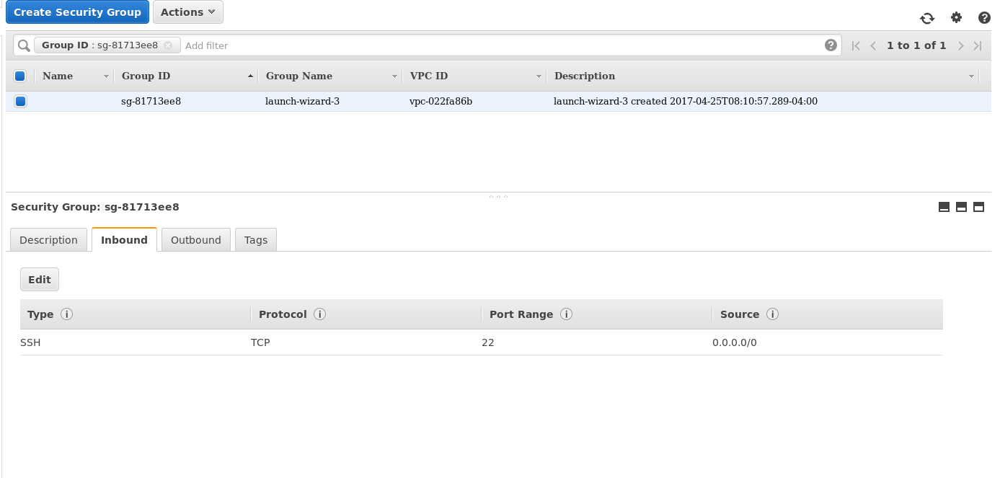

Ajout de la règles requise uniquement pour le segment réseaux :


Validation du comportement après l'ajout :

```bash
[ec2-user@ip-172-31-46-78 ~]$ telnet 172.31.33.230 2222
Trying 172.31.33.230...
Connected to 172.31.33.230.
Escape character is '^]'.
MALADE
Juste le temps de changer de fenetre
^]
telnet> q
Connection closed.
[ec2-user@ip-172-31-46-78 ~]$


[ec2-user@ip-172-31-33-230 ~]$ nc -l 2222
MALADE
Juste le temps de changer de fenetre

```

### Organisation de votre réseau chez Amazon (VPC)

Pour la démonstration réalisé ci-dessus nous avons vu le système de groupe de sécurité, en d'autre mot le système de pare feu inclus avec les __EC2__. Nous allons maintenant continuer avec la réseautique des instances __EC2__, nous allons voir le concept de **VPC** **Amazon Virtual Private Cloud (Amazon VPC)**. 

Une description simple du __VPC__ est un réseau virtuel privé qui vous ai dédié , il est possible de le segmenté en sous réseau, un peu comme lors que nous segmentons le réseau interne d'une entreprise. Lors de l'initialisation de nos instances __EC2__ ces dernières étaient déjà dans un __VPC__ . Si nous regardons la description de nos instances :


Ce __VPC__ fut créé automatiquement et par défaut l'ensemble des instances __EC2__ que nous allons créer seront dans ce __VPC__ . 

En fait il y a 2 type de réseaux :

* __EC2-classic__
* __VPC__ 

Je ne couvrirai PAS le réseau __EC2-classic__, car voici la liste des instances qui doivent être obligatoirement instanciées dans un __VPC__ : 

* __C4__
* __I3__
* __M4__
* __P2__
* __R4__
* __T2__
* __X1__

Comme vous pouvez le constater ceci est l'ensemble des instances, donc par soucis d'économie d'effort je vais me concentrer sur le __VPC__ par contre si vous désirez approfondir l'aspect __EC2-classic__ et au moins comprendre la différence avec les __VPC__ , je vous invite à consulter cette page : [http://docs.aws.amazon.com/fr\_fr/AWSEC2/latest/UserGuide/using-vpc.html#differences-ec2-classic-vpc](http://docs.aws.amazon.com/fr_fr/AWSEC2/latest/UserGuide/using-vpc.html#differences-ec2-classic-vpc) . Cependant prendre note que les comptes créés après le 04-12-2013 prennent uniquement en charge __EC2-VPC__ !

Comme l'aspect des coûts est critique clarifions une chose tous de suite : Il n'y a **AUCUN COÛT** pour ce service !! Le coût est pour ce que vous mettez dans le __VPC__ en d'autre mot les instances __EC2__, le balancer de charge , ... 
Vous aurez un coût si votre __VPC__ est connecter avec un __VPN__ , mais ceci est en dehors du cadre (__scope__) ici. 

J'avais fait mention de __PCI__ lors de la présentation du cloud , les __VPC__ sont conforme aux normes __PCI__ [lien](http://docs.aws.amazon.com/fr_fr/AmazonVPC/latest/UserGuide/VPC_Introduction.html#pci-compliance).

Que pouvons nous mettre dans un __VPC__ en d'autre mot dans notre réseau dédié chez Amazon ? 

| Service                | Rubrique correspondante                          |
|------------------------|--------------------------------------------------|
| AWS Data Pipeline      | [Launching Resources for Your Pipeline into a VPC](http://docs.aws.amazon.com/datapipeline/latest/DeveloperGuide/dp-resources-vpc.html) |
| Amazon EC2             | [Amazon EC2 and Amazon VPC](http://docs.aws.amazon.com/AWSEC2/latest/UserGuide/using-vpc.html) |
| Auto Scaling           | [Auto Scaling and Amazon VPC](http://docs.aws.amazon.com/autoscaling/latest/userguide/autoscalingsubnets.html)|
| Elastic Beanstalk      | [Using AWS Elastic Beanstalk with Amazon VPC](http://docs.aws.amazon.com/elasticbeanstalk/latest/dg/AWSHowTo-vpc.html) |
| Elastic Load Balancing | [Setting Up Elastic Load Balancing](http://docs.aws.amazon.com/elasticloadbalancing/latest/userguide/setting-up-elb.html) |
| Amazon ElastiCache     | [Using ElastiCache with Amazon VPC](http://docs.aws.amazon.com/AmazonElastiCache/latest/UserGuide/ManagingVPC.html)|
| Amazon EMR             | [Select a Subnet for the Cluster](http://docs.aws.amazon.com/emr/latest/DeveloperGuide/emr-plan-vpc-subnet.html)|
| AWS OpsWorks           | [Running a Stack in a VPC](http://docs.aws.amazon.com/opsworks/latest/userguide/workingstacks-vpc.html) |
| Amazon RDS             | [Amazon RDS and Amazon VPC](http://docs.aws.amazon.com/AmazonRDS/latest/UserGuide/Overview.RDSVPC.html) |
| Amazon Redshift        | [Managing Clusters in a VPC](http://docs.aws.amazon.com/redshift/latest/mgmt/managing-clusters-vpc.html) |
| Amazon Route 53        | [Working with Private Hosted Zones](http://docs.aws.amazon.com/Route53/latest/DeveloperGuide/hosted-zones-private.html) |
| Amazon WorkSpaces      | [Create and Configure Your VPC](http://docs.aws.amazon.com/workspaces/latest/adminguide/gsg_create_vpc.html) |

#### Comprendre le __VPC__ 

Pour les besoins de l'explication je vais utiliser la configuration actuelle avec laquelle nous avons travailler pour détailler le tous , pour ceux que ça intéresse moins vous pouvez toujours consulter la documentation sur Amazon . [Concept du VPC](http://docs.aws.amazon.com/fr_fr/AmazonVPC/latest/UserGuide/VPC_Introduction.html#Overview).

Nous allons visualiser le __VPC__ actuel , nous allons donc sélectionner le service __VPC__ dans la liste des produits disponible dans Amazon 

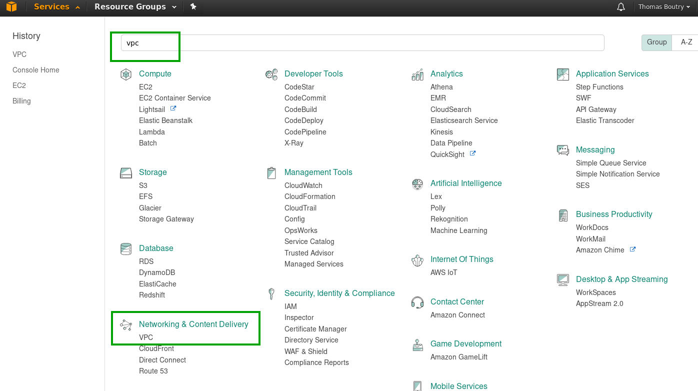

Nous aurons la visualisation du / des __VPC__ disponible :

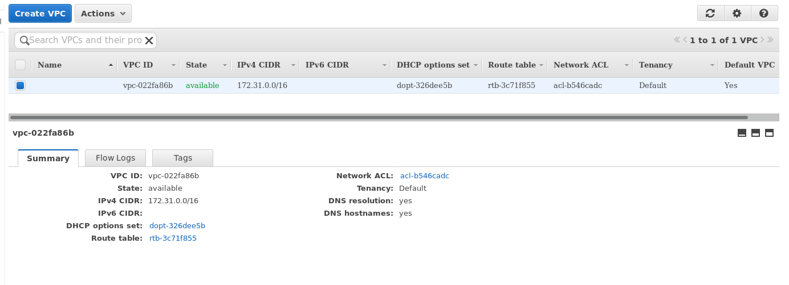

Donc notre __VPC__ à une plage d'adresse IP : 172.31.0.0/16 

```bash
$ ipcalc 172.31.0.0/16
Address:   172.31.0.0           10101100.00011111. 00000000.00000000
Netmask:   255.255.0.0 = 16     11111111.11111111. 00000000.00000000
Wildcard:  0.0.255.255          00000000.00000000. 11111111.11111111
=>
Network:   172.31.0.0/16        10101100.00011111. 00000000.00000000
HostMin:   172.31.0.1           10101100.00011111. 00000000.00000001
HostMax:   172.31.255.254       10101100.00011111. 11111111.11111110
Broadcast: 172.31.255.255       10101100.00011111. 11111111.11111111
Hosts/Net: 65534                 Class B, Private Internet
```

Nous pouvons donc avoir jusque 65532 machines dans se segment réseaux , si on le remplie ça fera plein d'argent ($$$) pour Amazon :P. 

Bon pour ceux qui pensent, __ouin__ y commence à me perdre avec ces segments réseaux , j'ai un cours sur le réseau aussi :P, mais on va essayer de faire sans ...

Reprenons notre testes réalisé un peu plus tôt entre les 2 instances pour la communications réseau et l'ouverture des ports . 

Nous avions 2 machines :

* 172.31.46.78/20
* 172.31.33.230/20 

Ces 2 machines  avec comme route par défaut : 172.31.32.1/32

Analysons les adresses IP avec le segment réseau :

* Segment réseau du __VPC__ : 172.31.0.0/16
* Segment réseau des 2 machines que nous avons instancié : 172.31.32.0/20 ( machine 172.31.46.78/20, 172.31.33.230/20)

        ```bash
        $ ipcalc 172.31.46.78/20
        Address:   172.31.46.78         10101100.00011111.0010 1110.01001110
        Netmask:   255.255.240.0 = 20   11111111.11111111.1111 0000.00000000
        Wildcard:  0.0.15.255           00000000.00000000.0000 1111.11111111
        =>
        Network:   172.31.32.0/20       10101100.00011111.0010 0000.00000000
        HostMin:   172.31.32.1          10101100.00011111.0010 0000.00000001
        HostMax:   172.31.47.254        10101100.00011111.0010 1111.11111110
        Broadcast: 172.31.47.255        10101100.00011111.0010 1111.11111111
        Hosts/Net: 4094                  Class B, Private Internet
        ```
* Représentation graphique de la situation

        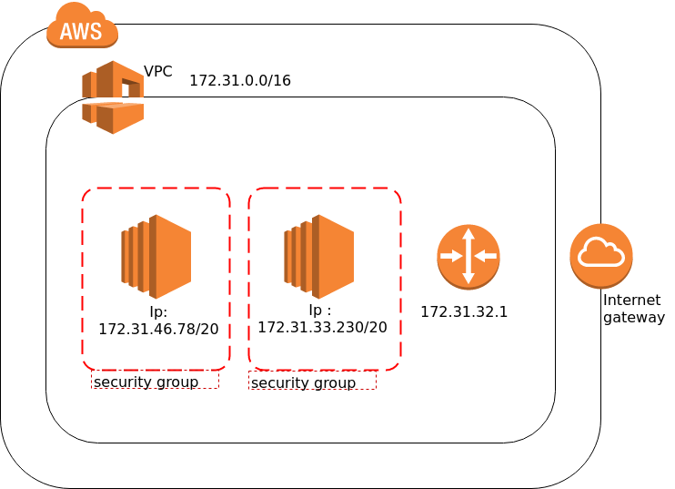

Comme vous pouvez le constater le segment réseau où évolue nos instances Amazon que nous avons démarrer est plus petit que celle qui nous est alloué . 172.31.32.0/20 est plus petit que 172.31.0.0/16 . Pourquoi ? Comment expliquer cette situation , pour le moment ceci n'est pas critique, car nous sommes loin de 4094 instances, par contre nous devons comprendre cette situation.

Nos 2 instances définie évolue dans 1 sous-réseaux distinct , qui fut créé automatiquement par Amazon lors de l'initialisation des instances ! Reprenons le schéma présenté plus haut en ajoutant cette réalité de sous-réseau.

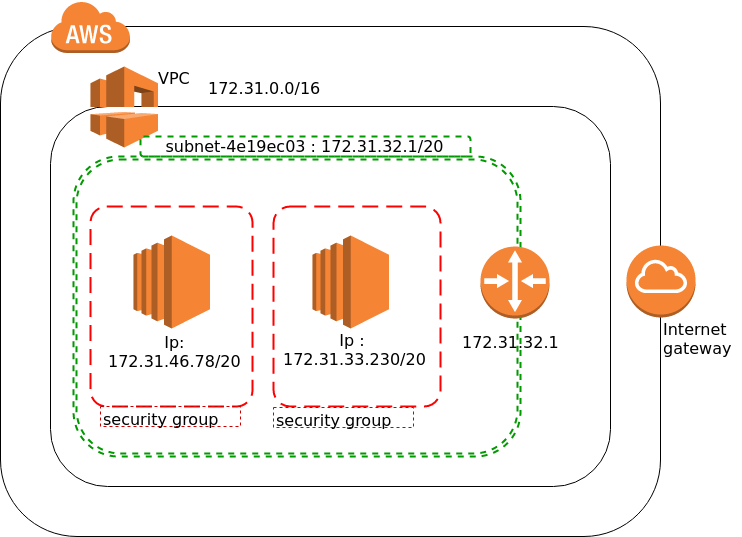

Lors de la visualisation de l'instance nous pouvons voir clairement le sous-réseau (__subnet__) :


Nous pouvons voir l'ensemble des sous réseaux créer en allant dans l'interface de gestion __d'AWS__ . 

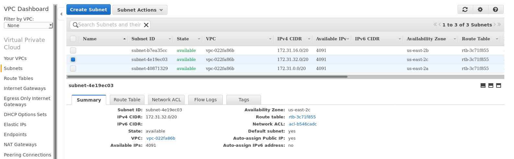

Comme vous pouvez le voir il y a 3 sous-réseaux présent , bien que je n'ai JAMAIS définie manuellement de sous-réseau pour mes instances l'ensemble fut réalisé automatiquement par Amazon, bien entendu le but est de me "sécurisé" :P.


##### Comprendre les sous-réseaux __VPC__ 

Donc les sous-réseaux permette de réaliser une segmentation réseau de votre __VPC__chez Amazon, pour les personnes réalisant pas mal de réseau le concept est évidant pour les autres je vais prendre quelques minutes pour développer .

L'objectif ici est de segmenter les machines selon leur rôles afin de limiter les possibilités de communication , l'objectif principale est de faire en sorte que si une machines est compromise cette dernière ne pourra pas être utilisé pour compromettre les autres !

Prenons 2 applications "classique" développé en mode 3 tiers :

* Service frontal, répondant au requête des clients  : Apache ou __Ngnix__ 
* Service applicatif, réalisant l'ensemble des traitements (__processing power__) : __Tomcat__ ou application python
* Service de stockage de donnée (__backend__) : __Mysql__ ou __postgesql__ 

Voici une représentation d'une segmentation possible de l'infrastructure :

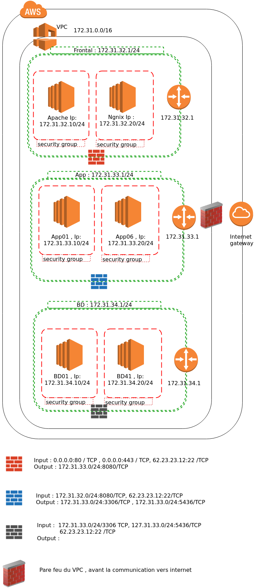

Donc nous avons 3 sous réseau dans le même __VPC__ :

* Frontal : 172.31.32.1/24 : comprenant 2 machines Apache et Ngnix avec comme passerelle par défaut 172.31.32.1.
* Applicatif : 172.31.33.1/24 : comprenant 2 machines App01 et App06 comme passerelle par défaut 172.31.33.1.
* BD : 172.31.34.1/24 : comprenant 2 machines BD01 et BD41 avec comme passerelle par défaut 172.31.34.1.

Comme nous pouvons le voir chaque sous-réseau à ses règles de pare feu qui permet de limité les communications avec le restes des réseaux , nous avons donc 3 pare feu pour les __subnet__ . Ceci vous permet de limiter l'accès pour l'ensemble de la "zone" . Ceci permet de gérer à plus haut niveau pour un regroupement de machine. 
Bien entendu l'objectif est de limiter l'accès aux machine , dans l'exemple ci-dessus si une machines dans le réseau **frontal** est compromise , l'attaquant  ne sera pas en mesure d'établir une connexion **ssh** vers le serveur applicatif !

Bien que la présence d'un pare feu est toujours présent lors de la définition d'un sous-réseau sont utilisation est optionnel. Vous pouvez laisser l'ensemble des communications ouverte et faire la gestion des règles uniquement au niveau du groupe de sécurité des instances. Prendre note que par défaut le __VPC__ ainsi que son sous-réseau par défaut n'a PAS de limitation d'accès.

Si vous désirez mettre en place une restriction il y a quelque point important à savoir ( Faites pas la même erreur que moi :P ) :

* **Les listes ACL réseau sont sans état. Les réponses au trafic entrant autorisé sont soumises aux règles du trafic sortant (et vice versa).**
* Vous pouvez créer une __ACL__ personnalisée et l'associer à un sous-réseau. Par défaut, chaque liste ACL réseau personnalisée refuse tout trafic entrant et sortant jusqu'à ce que vous ajoutiez des règles. 
* Le sous réseau ne peut n'avoir que UNE  __ACL__ associé , contrairement à une instance qui peut avoir plusieurs groupe de sécurité associer. 
* Chaque règles dans __l'ACL__ est numéroté de 100 au maximum  32 766 , lors du traitement d'un paquet les règles sont traité du numéro le plus petit au plus grand. Si une règle concorde au paquet il arrête l'analyse des règles et sorte (Accepté ou Refusé)
* Les règles sont entrantes et sortantes , et chaque règle peut autoriser ou refuser le trafic. 

    :référence [http://docs.aws.amazon.com/fr\_fr/AmazonVPC/latest/UserGuide/VPC\_ACLs.html](http://docs.aws.amazon.com/fr_fr/AmazonVPC/latest/UserGuide/VPC_ACLs.html)

Dans la liste précédente , le plus problématique est que les règles de pare feu sont **SANS ÉTAT** (__State less__) donc __L2__. [Ref](https://en.wikipedia.org/wiki/Stateful_firewall). 

Pour les personnes moins confortables avec le concept de pare feu avec gestion d'état (__StateFull__) et (__StateLess__), une information "ultra" rapide , je vous invite à chercher plus d'information. Soit dit en passant , il y a une playlist de vidéo explicatif sur [les concepts réseau sur  ma chaine Youtube](https://www.youtube.com/playlist?list=PLrspRZ5MjONxKHTRosSqh2K3Ufomebk0g)

Prenons une communication réseau "classique" 

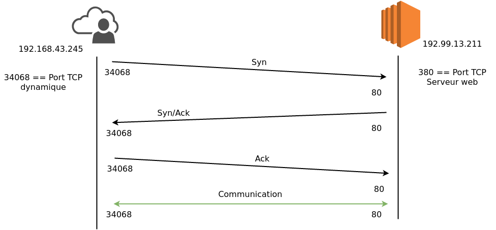

Et la capture réseau dans __wireshark__ 

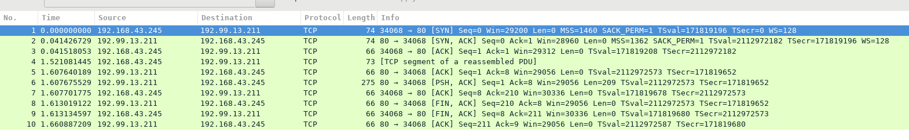

Comme vous pouvez le voir :

1. Le client (192.168.43.245) communique vers le serveur web (192.99.13.211) sur le **port 80** 
2. La communication provient du port dynamique ou éphémère du **port client 34068**, prendre note que actuellement c'est ce numéro si je refait une autre connexion le port va changer.

* Situation avec un **pare feu AVEC état (statefull)** : 
    * Si la règle indique que les communications entrante sont permit sur le port sur le port 80 il laissera les communications sortir vers un autre port pour la communication en cours. En d'autre mot il ne traite pas chaque paquet indépendamment mais il regarde l'état de la communication s'il a déjà permis un paquet en relation avec cette communication.
* Situation avec un **pare feu SANS état (stateless)** :
    * Chaque paquet est traité indépendamment des communications précédente. En d'autre mot si nous avons indiqué que la communication vers le port 80 est permet le paquet __SYN__ sera transmis . Mais si le paquet vers le port 34068 ne sera pas permit en sortie à moins qu'il soit explicitement définie.

Pas besoin de vous dire qu'une fois avoir travaillé avec des pare feu avec état revenir au mode sans état est plutôt pénible ( le vrai mot c'est casse couilles :P) .

Vous me direz donc mais comment faire alors pour permettre le retour de communication sur les ports dynamique ou éphémère dans le cas d'une communication __TCP__ ? Simple ouvrir les ports voici une représentation possible :

|Protocole| ports      | IP Destination | Action    | Description |
|:--------|:----------:|----------------|----------:|-------------|
| TCP     | 1024-65535 | 0.0.0.0/0      | AUTORISER | Autorise les réponses sortantes vers l'ordinateur distant cette règle est requise pour autoriser le trafic de réponse pour les demandes entrantes.  |

Donc à la lumière en prenant en considération le problème de l'état des communications (__stateless__) pour la définition des règles de pare feu sur le __VPC__ je pense que l'utilisation la plus réaliste est de l'utiliser uniquement pour réaliser de la limitation par __IP__ et non par port. La raison est simple vous serez obligé de laisser un nombre de trou béant dans votre pare feu pour l'ensemble des retours.

Les groupes de sécurité (pare feu au niveau instance EC2) est toujours présent si vous désirez réalisé de la gestion par instance ! 
Pour finir vous avez aussi un pare feu (__firewall__) pour l'ensemble des communications qui sort du __VPC__.

Je sais ceci fait beaucoup de __firewall__ à différent niveau , bien entendu il n'est pas obligatoire de les activer tous , par exemple par défaut les règles définie dans le __firewall__ du __VPC__ sont ouvert au complet . Réalisons une liste des __firewalls__ du plus spécifique au plus général.

1. __sécurity group__ : __firewall__ de la machine / instance __EC2__ (**statefull**)
2. __firewall__ du sous-réseau : __firewall__ appliqué à un regroupement de machines / instances (**stateless**)
3. __firewal__ du __VPC__ : __firewall__ du regroupement de sous réseau (**stateless**).


Selon votre niveau de maturité et bien entendu de vos besoins il est possible de créer d'autre __VPC__ qui regrouperont d'autre __sous-réseaux__ honnêtement pour le moment je ne vois pas le requis ... Cependant je voulais le signaler.

Si vous voulez vous compliquer la vie , rien ne vous empêche d'ajouter un __firewall__ sur la machine avec **iptables** ou **nf** , bon après trop de pare feu ne facilite pas l'analyse lors de problématique. 


##### Possibilité avec le__VPC__ 

Le système __VPC__ vous offre les fonctionnalités suivante

* Attribuer des adresses IPv4 privées statiques à vos instances qui persistent lors des démarrages et des arrêts.

    Si vous avez jouez avec Amazon vous avez constatez que les IP assignées au instances change à chaque démarrage, bien entendu vous pouvez définir des adresses IP fixe. Ceci peut être pratique pour plusieurs service __DNS__ , __NTP__, ... Cependant si votre objectif est de mettre en place une solution **Cloud**, donc qui peut grandir selon les besoins , faite attention au restriction d'adresses IP . Le système de découvert __discovery__ système est plus approprié.
* Vous pouvez aussi associer un bloc d'adresse CIDR IPv6 à votre VPC et attribuer des adresses IPv6 à vos instances.
 
   __L'IPv6__ est à nos portes bien que pour le moment tous le monde le met de côté il est bien de savoir que le moment venu notre environnement AWS est prêt , il reste juste à nous d'être prêt.
* Attribuer des adresses IP multiples à vos instances.

    L'assignation d'adresse IP multiple pour une machine est tous de même pratique attention à la gestion de l'IP sortant surtout pour les règles de pare feu.
* Définir des interfaces réseau et attacher une ou plusieurs interfaces réseau à vos instances.
* Changer les membres d'un groupe de sécurité pour vos instances pendant qu'elles s'exécutent.
* Contrôler le trafic sortant de vos instances (filtrage sortant) ainsi que le trafic entrant vers vos instances (filtrage entrant).

    J'aime contrôler le trafic sortant de mes machines ceci me permet d'avoir un plus grand sentiment de sécurité, l'attaquant n'étant pas en mesure d'utiliser ma machine pour récupérer plus d'outils ou attaque d'autre machine. Bien entendu ceci demande une plus grande gestion / connaissance de l'écosystème.
* Ajouter une couche de contrôle d'accès supplémentaire à vos instances sous la forme de listes de contrôle d'accès (ACL) réseau
* Exécuter vos instances sur un matériel à client unique


#### Journaux de flux VPC

Comme nous avons pu le voir le nombre de pare feu que nous pouvons mettre en plus est significatif, la sécurité c'est bien mais ... Ça peut vite devenir un enfer pas uniquement pour l'attaquant, mais pour l'exploitant. Lors de la mise en place d'un service s'il y a un problème de communication dans quelle __firewall__ le paquet est bloqué ?

1. Le pare feu du sous-réseau ?? 
2. Le pare feu du VPC ?? Si vous avez 2 __VPC__ avec chacun des sous-réseaux ... __ishh__
3. Est-ce au niveau du __sécurity group__ de la machine qui envoie ou reçoit ?

Sans critique aucune , mais quand on demande le flux réseau aux développeurs c'est souvent , faut que les ports X, Y , Z soient ouvert. J'en convient mais qui communique avec qui , nous avons besoin de la source et destination. Il arrive aussi que même les ports de communications n'est pas claire pour le développeurs. On aura bien beau critiquer et bloquer le déploiement , nous nous devons d'accompagner nos partenaires professionnels dans l'exercice.

Puis soyons honnête nous aussi parfois on le sait pas trop quand on met en place un nouveau produit libre :P.

Autre utilisation en dehors de l'analyse de problématique , le journal de flux contient aussi aussi le nombre de donnée transmise ainsi que le nombre de paquets. Il est donc intéressant de penser que le journal de flux peut aussi nous aider pour l'analyse de performance de l'application afin d'identifier les requêtes problématique et voir ou mettre de l'effort pour la réduction des données.

Concrètement , vous développez une application web et lors dans votre application il y a BEAUCOUP , BEAUCOUP de donnée qui sont transmise à l'utilisateur. Par exemple quand la personne va sur la page des clients il y a 1 millions de client et la personne doit attendre le chargement de la page car il y a un tableau avec l'ensemble des données . Pourtant l'utilisateur ne va extraire que 90% 1 client voir 2 ou 3 , il pourrait être intéressant de visualiser le transfert de donnée pour cette page. Bon ici l'exemple est simple et évident, mais j'essaye d'offrir une idée générale :P. (si vous avez mieux :P, envoyé moi un message :P  ) .

Autre suggestion , votre facture Amazon a explosé le dernier moi dû à une quantité de donnée transférer sur Internet , qui réalise ces envoie ??!!?? Le journal de flux pourra offrir l'information pertinent en corrélation avec le temps pour les instances !

Le système de journaux de flux vient nous aider afin d'identifier les communications au niveau des :

* Sous-réseaux
* VPC 

##### PRIX

Bon parlons prix , c'est gratuit ... Heu enfin presque :P , juste pour faire compliquer un peu :D. La fonctionnalité de mise en place des journaux de flux est gratuite, cependant les **logs** / données sont transmises au service [CloudWatch](https://aws.amazon.com/cloudwatch/) et c'est à ce moment que l'on paye :P. Vous pouvez le dire c'est bien fait pareille :P. Comme toujours le prix change selon la région voici le [lien pour les prix](https://aws.amazon.com/cloudwatch/pricing/).

* Amazon CloudWatch Logs, voici une vue rapide : 

|                   |par GB ingested   | per GB archived per month  |
|-------------------|:----------------:|:--------------------------:|
| Us Ouest (Oregon) | $0.50            | $0.03                      |
| Canada  (Central) | $0.55            | $0.033                     |
| EU (Frankfurt)    | $0.63            | $0.0324                    |

C'est  pas énorme, mais ça monte très vite :P, pour diagnostique ceci est bien pour conserver l'information de manière permanente faut faire une étude :P.


##### Fonctionnement

La définition d'un journal de flux va être réalisé sur un sous-réseau ou un __VPC__ , telle que mentionné plus tôt les données seront disponible dans l'outil __CloudWatch__ .

Lors de la création du journal de flux vous devez spécifier les informations suivante :

* Trafic accepté, refusé ou tout le trafic
* Un nom de journal
* Un nom de rôle [IAM (AWS Identity and Access Management)](https://aws.amazon.com/fr/iam/details/?nc1=h_ls) , nous couvrirons peut-être plus tard ce point.
* Destination Log Group : Dans quelle groupe de logs dans __CloudWatch__ les informations seront contenu.

Comme vous pouvez le constater, il n'y a pas la possibilité de définir des filtres sur le port ,l'adresse IP source ou destination voir le protocole, le filtrage est uniquement sur le trafic **accepté ou refusé** . Le journal de flux capture l'ensemble du trafic et le transmet au __CloudWatch__ , le filtrage du contenu sera réalisé lors de la consultation des données. 

Rapidement le rôle __IAM__ , ces rôles sont en fait des configurations de sécurité , ceci permet de définir accès granulaire à des services , donc si vous avez une armé d'administrateur qui sont relier à votre compte il est probable que tous le monde ne peux pas tous faire. Donc ceci vous permet d'indiquer grâce au rôle qui pourra consulter les logs. Nous y reviendrons peut-être plus tard , dans notre cas étant __super-ultimate-god__ du compte AWS, le problème n'est pas présent. En entrant un rôle inexistant le système AWS va faire la création automatique du groupe et éventuellement nous pourrons l'associer à un groupe d'utilisateurs.

Information importante : **Les journaux de flux ne capturent pas de flux de journaux en temps réel pour vos interfaces réseau**, attendez vous à avoir un délai entre la mise en place de la configuration et la visualisation des données dans __CloudWatch__. Le temps varie selon la littérature que j'ai parcouru on parle entre 10 et 15 minutes :-/.


##### Limitation du journal de flux

Voyons la liste de ce qui n'est pas possible avec le journal de flux :

* Réalisation d'un filtrage granulaire (port, IP, protocole ,...) avant le transfert vers __CloudWatch__ 
* Impossible d'ajouter des __TAGs__ à la configuration d'un journal ( ceci est principalement pour de la gestion )
* Si votre interface réseau comporte plusieurs adresses IPv4 et que le trafic est envoyé vers une adresse IPv4 privée secondaire, le journal de flux affiche l'adresse IP privée principale dans le champ de l'adresse IPv4 de destination. 
* Tous le trafic n'est pas capturé , voici la liste des éléments ignorés :
    * Le trafic DNS en destination des serveurs DNS d'Amazon ( si vous utilisez VOTRE serveur DNS l'information sera contenu ).
    * Le trafic d'activation de licence Windows vers le serveur d'activation de licence Amazon.
    * Le trafic vers l'IP 169.254.169.254 , se sont des [métadonnées utilisé par AWS](http://docs.aws.amazon.com/fr_fr/AWSEC2/latest/UserGuide/ec2-instance-metadata.html) .
    * Le trafic __DHCP__.
    * Le trafic vers l'adresse IP réservée pour le routeur VPC par défaut.

#### VPC interconnexion avec le réseau corporatif

Le système de __VPC__ vous permet aussi d'établir une connexion sécurisé avec votre infrastructure corporatif ! Ceci vous permet d'avoir un lien direct avec vos instance __EC2__ en toute sécurité via un __VPN__. 

**ATTENTION** : Ceci n'est PAS gratuit !! Vous aurez des coûts relier au transfert de donnée , je vous laisserai le plaisir de valider le coût selon votre configuration :P.

Voici une représentation graphique de la configuration :

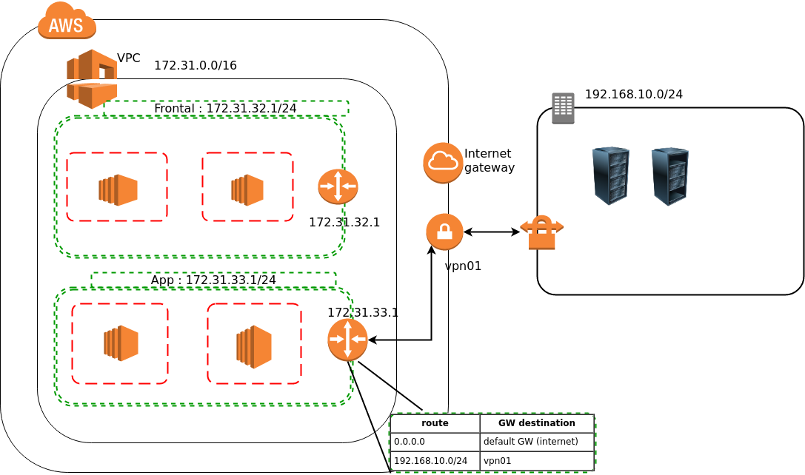

Bien entendu il y aura de la configuration à réalisé dans votre réseau interne pour permettre  la communication avec AWS par ce VPN . 

#### Limite de déploiement de __vpc__ 

Il existe plusieurs limitation par défaut ainsi que des limitations "dur" , en d'autre mot certain configuration sont présente uniquement par défaut et peuvent être augmenté sur demande . D'autre sont des limitations "dur" qui ne peuvent pas être changé . 

Je ne réécrirais pas l'ensemble ici , je vais uniquement fournir les liens vers la page d'Amazon :

* [VPC et sous-réseaux](http://docs.aws.amazon.com/fr_fr/AmazonVPC/latest/UserGuide/VPC_Appendix_Limits.html#vpc-limits-vpcs-subnets)
* [Adresses IP Elastic (IPv4)](http://docs.aws.amazon.com/fr_fr/AmazonVPC/latest/UserGuide/VPC_Appendix_Limits.html#vpc-limits-eips)
* [Journaux de flux](http://docs.aws.amazon.com/fr_fr/AmazonVPC/latest/UserGuide/VPC_Appendix_Limits.html#vpc-limits-flow-logs)
* [Passerelles](http://docs.aws.amazon.com/fr_fr/AmazonVPC/latest/UserGuide/VPC_Appendix_Limits.html#vpc-limits-gateways)
* [Listes ACL réseau](http://docs.aws.amazon.com/fr_fr/AmazonVPC/latest/UserGuide/VPC_Appendix_Limits.html#vpc-limits-nacls)
* [Interfaces réseau](http://docs.aws.amazon.com/fr_fr/AmazonVPC/latest/UserGuide/VPC_Appendix_Limits.html#vpc-limits-enis)
* [Tables de routage](http://docs.aws.amazon.com/fr_fr/AmazonVPC/latest/UserGuide/VPC_Appendix_Limits.html#vpc-limits-route-tables)
* [Groupes de sécurité](http://docs.aws.amazon.com/fr_fr/AmazonVPC/latest/UserGuide/VPC_Appendix_Limits.html#vpc-limits-security-groups)
* [Connexions d'appairage de VPC](http://docs.aws.amazon.com/fr_fr/AmazonVPC/latest/UserGuide/VPC_Appendix_Limits.html#vpc-limits-peering)
* [Points de terminaison d'un VPC](http://docs.aws.amazon.com/fr_fr/AmazonVPC/latest/UserGuide/VPC_Appendix_Limits.html#vpc-limits-endpoints)
* [Connexions VPN](http://docs.aws.amazon.com/fr_fr/AmazonVPC/latest/UserGuide/VPC_Appendix_Limits.html#vpc-limits-vpn)

http://docs.aws.amazon.com/fr_fr/AmazonVPC/latest/UserGuide/VPC_Appendix_Limits.html
http://docs.aws.amazon.com/fr_fr/AmazonVPC/latest/UserGuide/VPC_Introduction.html#CurrentCapabilities


#### Démonstration création de sous-réseaux et mise en place du journal de flux

Maintenant que nous avons couvert le principe du __VPC__ , des sous-réseaux et du journal de flux , il est important de faire une petite démonstration pratique de la réalisation de ces configurations . Car peu importe le texte théorique que nous pourrions rédigé la pratique apporte toujours énormément de clarification. 

Voici le scénario que nous allons mettre en place  :

* Création de 2 sous-réseaux ( __Frontal__ et __BD__) .
    * Mise en place __d'ACL__ serrées pour la sécurité des réseaux.
* Création des instances __EC2__ avec des groupes sécurité plus large.
    * Mise en place d'un serveur Web dans le réseau __Frontal__ .
        * Configuration de 2 __virtualHosts__ , communiquant avec 2 bases de donnée __Mysql__.
    * Mise en place de 2 serveur __Mysql__ dans le réseau __BD__ .
        * Configuration de chaque serveur __Mysql__ pour chaque application web (__VirtualHost__).


L'ensemble du déploiement applicatif sera réalisé avec **docker** afin de transférer l'application sous être obligé de réaliser la configuration sur les serveurs :P. Puis nous sommes confortable dans l'utilisation de docker :) .

Nous allons aussi introduire une erreur de configuration afin de voir l'intérêt d'utiliser le journal de flux.

##### Création des sous-réseaux

Nous allons donc faire la création de 2 sous-réseaux dans le __VPC__ qui fut créé initialement pour le moment je ne vois pas le requis de créer un __VPC__ autre , ceci pourrait être pertinent si nous désirions avec une séparation plus importante que les sous-réseaux . Si vous avez plusieurs départements utilisant __AWS__ ceci peut être intéressant , ou si vous désirez qu'un certain __VPC__ soit connecté avec votre réseau corporatif à l'interne (bureau ou centre de donnée).

* Définition des sous-réseaux
    * BD : 172.31.50.0/27
    * Frontal : 172.31.60.0/27
 
Comme encore nombre d'entre vous l'annotation __/27__ peut être obscure , la commande **ipcalc** est la pour vous :

```bash
$ ipcalc 172.31.60.0/27
Address:   172.31.60.0          10101100.00011111.00111100.000 00000
Netmask:   255.255.255.224 = 27 11111111.11111111.11111111.111 00000
Wildcard:  0.0.0.31             00000000.00000000.00000000.000 11111
=>
Network:   172.31.60.0/27       10101100.00011111.00111100.000 00000
HostMin:   172.31.60.1          10101100.00011111.00111100.000 00001
HostMax:   172.31.60.30         10101100.00011111.00111100.000 11110
Broadcast: 172.31.60.31         10101100.00011111.00111100.000 11111
Hosts/Net: 30                    Class B, Private Internet
```

Définissons nos __ACL__ tous de suite :

| Subnet  | Règle  | Source         | Destination    | Port    | Autorisation | Description                                    |
|---------|-------:|:--------------:|:--------------:|:-------:|-------------:|-----------------------------------------------:|
| BD      | INPUT  | 0.0.0.0/0      | 172.31.50.0/27 | 22      | ACCEPT       | Accès SSH aux instances BD                     | 
| BD      | INPUT  | 172.31.60.0/27 | 172.31.50.0/29 | 3306    | ACCEPT       | Accès à __MySql__ depuis les instances Frontal |
| BD      | OUTPUT | 0.0.0.0/0      | 0.0.0.0/0      | __ANY__ | DENY         | Refuse les communications vers l'externe       |
| Frontal | INPUT  | 0.0.0.0/0      | 172.31.60.0/27 | 22      | ACCEPT       | Accès SSH aux instances Frontal                | 
| Frontal | INPUT  | 0.0.0.0/0      | 172.31.60.0/27 | 80      | ACCEPT       | Accès Web connexion pour le service Apache     | 
| Frontal | OUTPUT | 0.0.0.0/0      | 0.0.0.0/0      | __ANY__ | DENY         | Refuse les communications vers l'externe       |

Nous allons débuter par la création des __ACL__ puis les sous-réseaux , car lors de la création du sous-réseaux nous devrons faire l'association de __l'ACL__ associé.


1. Ouvrez la console d'Amazon __EC2__  [https://console.aws.amazon.com/ec2/](https://console.aws.amazon.com/ec2/) et sélectionnez **VPC**
2. Sélectionnez **Network ACL**, vous devriez avoir quelque comme ceci :

    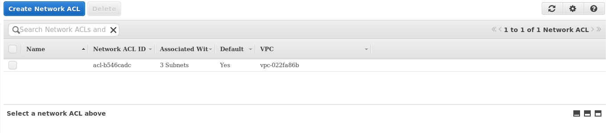

3. Cliquez sur **Create Network ACL**, débutons par __l'ACL__ de la base de donnée.
4. Identifier le nom de l'ACL pour , quelque chose de significatif __SVP__ :P , n'ayant que 1 __VPC__ le choix est simple :)

    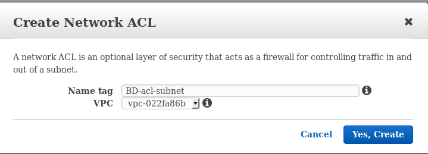

5. Visualisons les configurations par défaut lors de la création d'une __ACL__:

    * En entré :

    
    * En sortie : 

    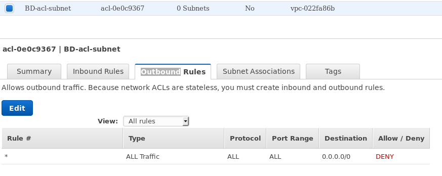

6. Édition des règles d'entrée pour représenter le contenu du tableau , vous constaterez que nous ne pouvons pas définir la destination dans le cadre des __ACL__ en INPUT la règle s'applique donc sur l'ensemble du __subnet__ nous devrons utiliser les __security groups__ afin d'avoir la granularité sur la machine.

    * Édition :

    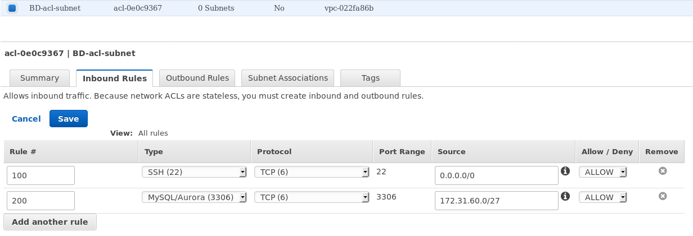
    * Résultat (c'est surtout pour démontrer que automatiquement __AWS__ rajouter la règles de REFUS ) **stateless** donc range de ports énorme: 

    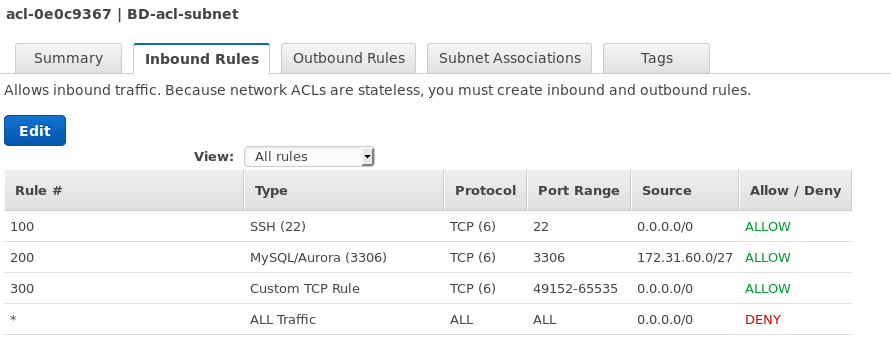

7. Édition des règles de sortie, dans notre cas aucune opération n'est requise. **stateless** donc range de port énorme

    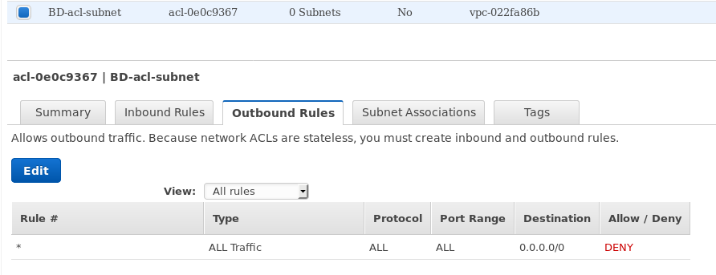

8. Cliquez sur **Create Network ACL**, débutons par __l'ACL__ des services frontal .

    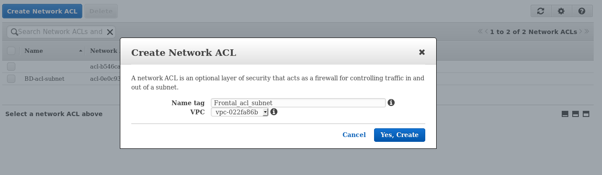

9. Édition des règles d'entrée pour représenter le contenu du tableau , vous constaterez que nous ne pouvons pas définir la destination dans le cadre des __ACL__ en INPUT la règle s'applique donc sur l'ensemble du __subnet__ nous devrons utiliser les __security groups__ afin d'avoir la granularité sur la machine.

    * En entré :

    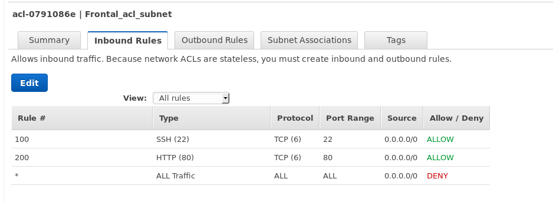

    * En sortie :

    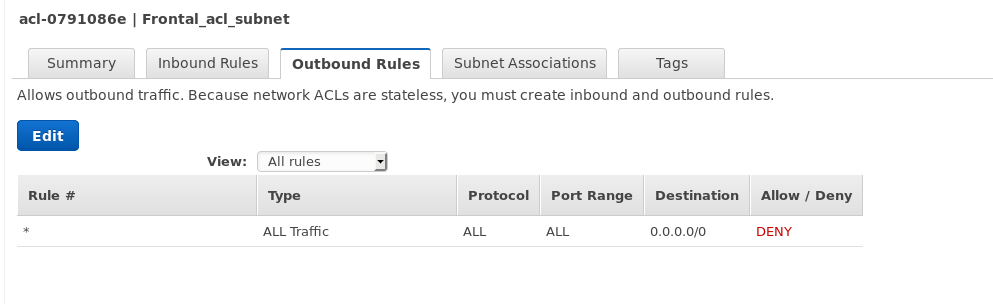


Maintenant que nous avons nos __ACL__ passons à la création des sous-réseaux . 
    * BD : 172.31.50.0/27
    * Frontal : 172.31.60.0/27

1. Toujours dans le service __VPC__ nous allons procéder à création du sous-réseaux BD pour débuter , sélectionnez **Subnets** puis **Create Subnet** .

    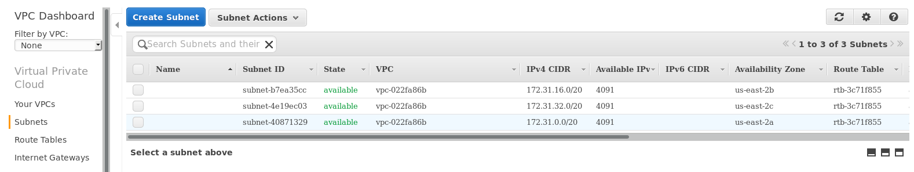

2. Création de notre sous-réseau avec un nom significatif ( j'insiste :P )

    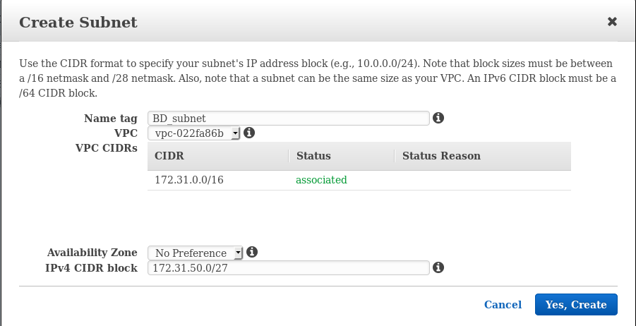

3. Association de __l'ACL__ BD avec le réseau BD (onglet __ACL__)

    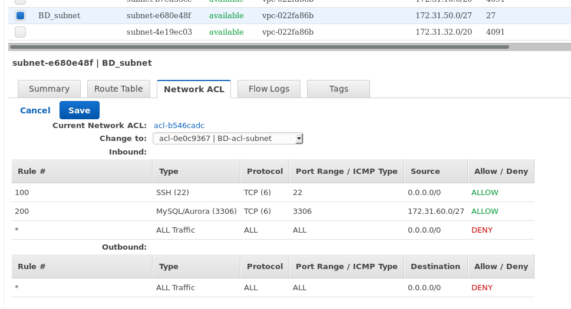

4. Résumé de la configuration configuration du segment réseau BD. J'aimerai porter votre attention sur le fait que ce segment n'a PAS d'assignation d'adresse IP publique automatique : **Auto-assign Public IP: no**. Ceci n'est pas requis , car les machines n'ont pas de service publique sur internet pourquoi ouvrir les machines sur Internet ? :D

    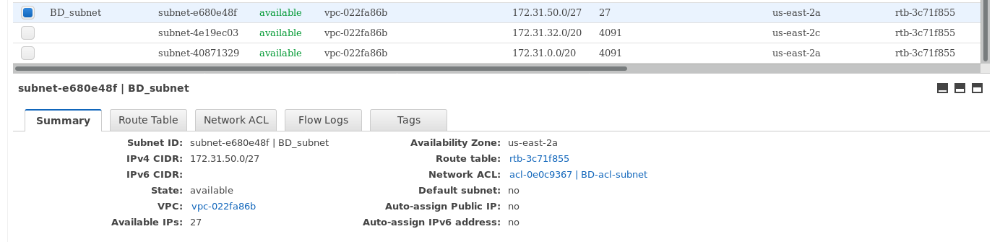

5. Création du sous-réseau Frontal pour le service Apache . 

    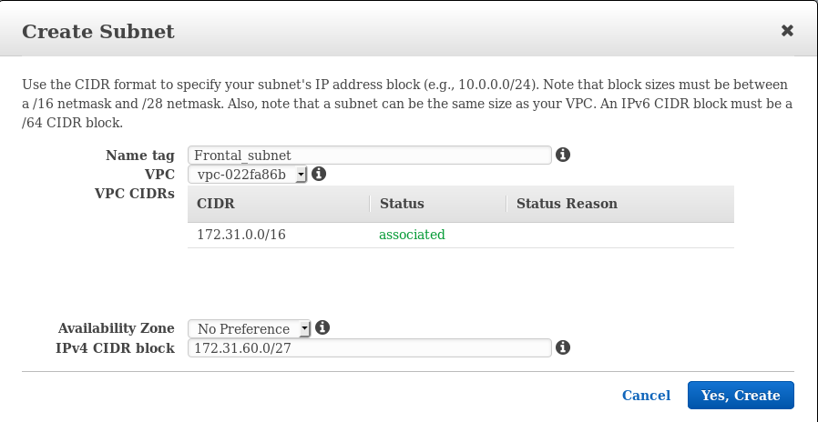

6. Association de __l'ACL__ pour le réseau frontal.

    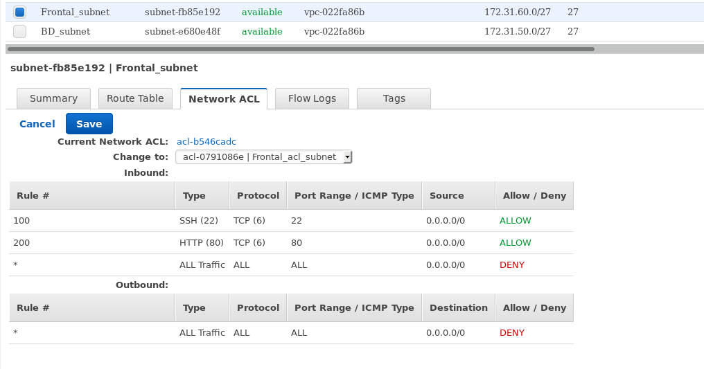

7. Nous allons assigner une adresse IP publique IPv4 automatiquement pour le réseau Frontal .

    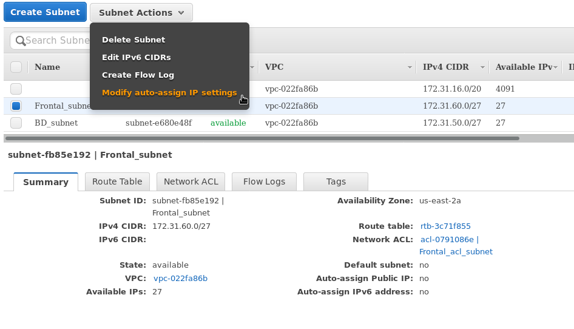
    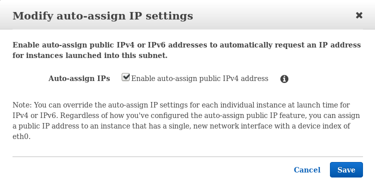

8. Voici le résumé de la configuration du segment Frontal, très semblable au segment BD mais avec l'assignation d'IP publique automatique.

    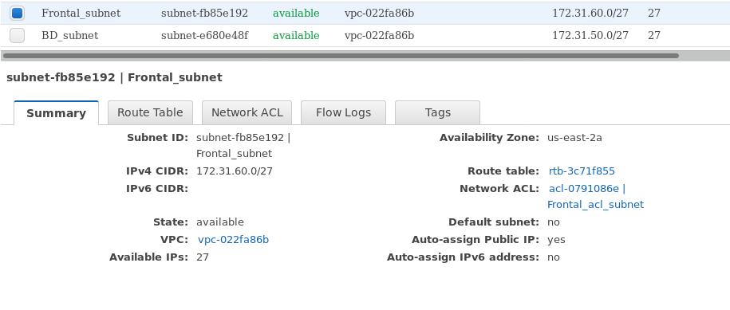

Référence : 

* [http://docs.aws.amazon.com/fr\_fr/AmazonVPC/latest/UserGuide/VPC\_Appendix\_NACLs.html](http://docs.aws.amazon.com/fr_fr/AmazonVPC/latest/UserGuide/VPC_Appendix_NACLs.html)

##### Création du groupe de(s) sécurité(s)

Nous allons définir 2 groupe de sécurité qui sera appliqué au 2 type d'instances Apache et BD . Nous ne réaliserons pas de configuration particulière pour distingué la Base de donnée Pi de contacts.
L'objectif est de simplifier la configuration , sinon ça devient vite compliqué. Bien entendu nous aurions pu aussi définir une configuration de groupe de sécurité ouvert et se fier uniquement sur la configuration du sous réseau __VPC__ . Je suis cependant moins confortable avec cette solution car si nous déplaçons notre instance dans un autre sous réseau nous n'aurons pas / plus de sécurité réseau.

De plus nous allons en profiter pour nous rafraichir la mémoire sur le groupe de sécurité :D.

1. Ouvrez la console d'Amazon __EC2__  [https://console.aws.amazon.com/ec2/](https://console.aws.amazon.com/ec2/) et sélectionnez **EC2**
2. Sélectionnez **Security Groups**, vous devriez avoir quelque comme ceci :

    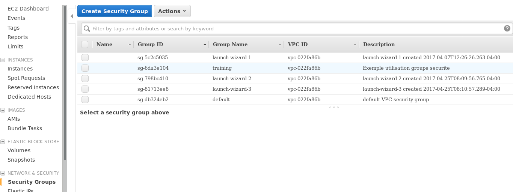

3. Création du groupe de sécurité pour le serveur Apache 

    * Entré

    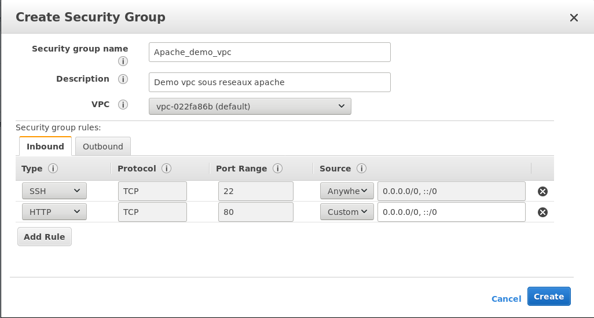

    * Sortie, comme vous pouvez le voir je ne met pas de restriction pour la sortie je ne le ferais pas pour le groupe de sécurité , je vais faire cette gestion au niveau du sous réseau __VPC__ bien entendu ceci est un choix, libre à vous !

    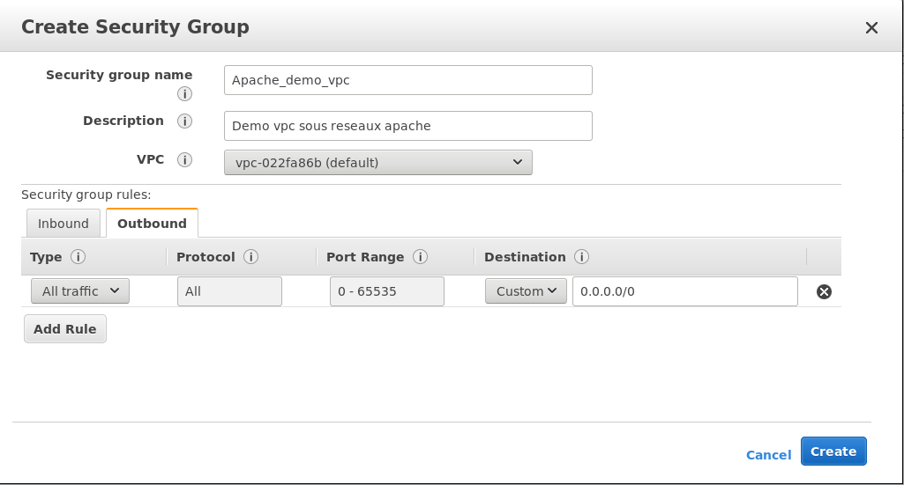

4. Création du groupe de sécurité pour les serveur de BD 

    * Entré

    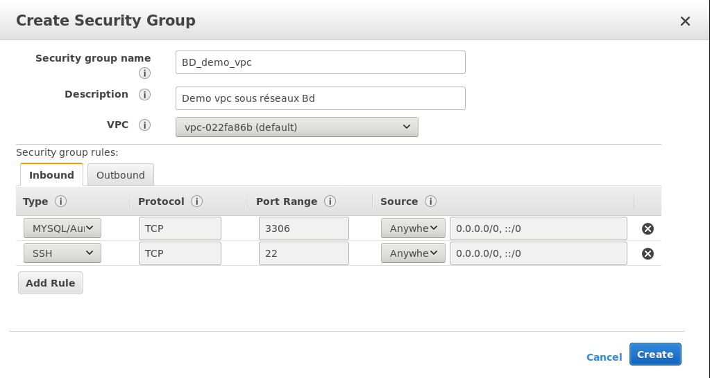

    * Sortie , tous est ouvert comme pour le groupe de sécurité apache.

##### Préparation des conteneurs 

Comme la formation n'est pas orienter __docker__, mais que nous en avons fait beaucoup dans le passé, j'ai réalisé une documentation "extra" pour les personnes que ça intéresse. L'objectif était de ne pas surcharger la documentation Amazon , suite le [lien vers préparation environnement Apache , BD](./extra/01-preparation-env-Apache-BD-with-docker.md).

Pourquoi utiliser Docker ? Mon objectif est simple réduire mon coût !!! Le fait d'utiliser Docker m'offre la possibilité de faire l'ensemble des testes et préparation en dehors d'une  instances Amazon qui m'est facturé à l'heure. Donc si je me bat un peu avec Apache et / ou Mysql dans mon conteneur pas de problème je n'ai pas de frais. :D

Le fait que je vais pouvoir transmettre le conteneur facilement ou le reconstruire m'assure que se sera identique à mon environnement interne.

##### Création des instances web et BD

Bon maintenant que l'ensemble des opérations **SANS Frais** fut réalisé c'est le moment de passé à l'étape qui nous occasionnera un coût :P.

Nous allons créer 3 instances :

* 1 Apache : dans le segment Frontal
* 2 BD : dans le segment BD

1. Ouvrez la console d'Amazon __EC2__  [https://console.aws.amazon.com/ec2/](https://console.aws.amazon.com/ec2/) et sélectionnez **EC2**

2. Cliquez sur **Launch Instance**
3. J'ai choisie une instance RedHat 7.3 
4. Instance type : **t2.small**
5. Sélection du sous-réseau

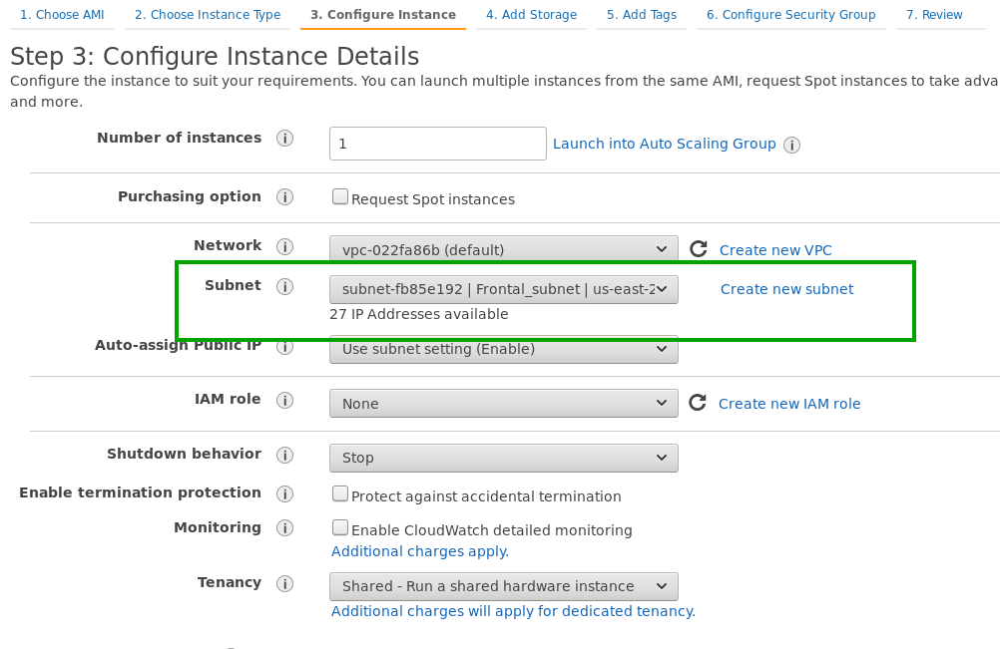

6. Sélection du groupe de sécurité 

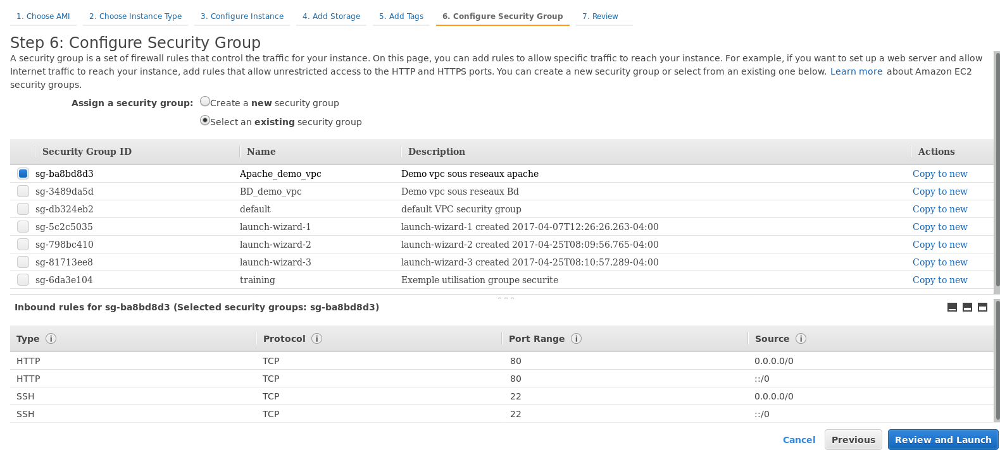

7. Sélection de la clé ssh 


**IMPORTANT** : lors de l'assignation d'une instance __EC2__ à un sous réseau , il ne sera PAS possible dans le future de l'assigner à un autre sous réseau !

##### Création du journal de flux pour identifier le problème

Nous allons réaliser la création des journaux de flux tous de suite , car telle que mentionné plus tôt la mise en place des journaux peuvent prendre entre 10 et 15 minutes pour que nous commencions à recevoir des données. Dans ce contexte ceci ne m'a pas aidé pour identifier les problématiques de configuration et la patience n'est pas toujours facile ... 

Nous avons 2 lieux où nous pouvons définir des journaux , sur le sous réseau et sur l'interface de l'instance __EC2__ ! 

Nous allons faire les 2 afin de voir le fonctionnement . Débutons avec le sous-réseau .

Référence : [https://blog.flowlog-stats.com/2016/05/01/enabling-flow-logs-on-aws/](https://blog.flowlog-stats.com/2016/05/01/enabling-flow-logs-on-aws/)

###### Création du groupe de log sous CloudWatch

Avant toute chose nous devons faire la création du groupe de logs dans __CloudWatch__ ce groupe permet de contenir un regroupement de logs , nous allons faire la création de 2 groupes :

* __subnetLogs__ : Pour le contenu des logs par sous réseau .
* __interfacesLogs__ : Pour le contenu des logs sur une interface. 


1. Ouvrez la console d'Amazon __EC2__  [https://console.aws.amazon.com/ec2/](https://console.aws.amazon.com/ec2/) et sélectionnez **CloudWatch**

2. Dans le menu de gauche sélectionnez **Logs**

3. Cliquez sur **Action** et **Create log group**

    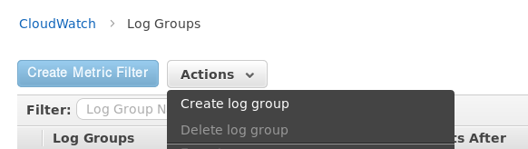

4. Création du groupe , juste entrer le nom du groupe 

    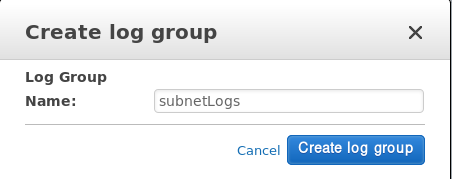

Et voilà , prendre note que c'est très important de le faire avant j'ai eu plein de doute sur la fonctionnalité de ma configuration en essayant de le faire après . Ça "semble" fonctionné quand tu le fais après cependant déjà que ça prend 10 à 15 minutes pour avoir les données, j'ai l'impression que la non création du groupe de logs avant le journal du flux augmente le délais de propagation des informations dans le groupe de logs.

###### Création du journal de flux sur le sous réseau

1. Ouvrez la console d'Amazon __EC2__  [https://console.aws.amazon.com/ec2/](https://console.aws.amazon.com/ec2/) et sélectionnez **VPC**

2. Dans le menu de gauche sélectionnez **Subnet**

3. Sélectionnez votre sous réseau et sélectionné l'onglet **flow logs**

    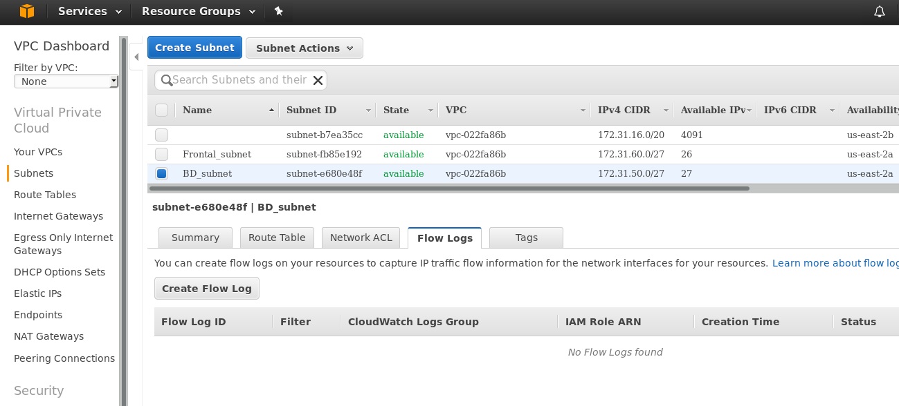

4. Cliquez sur le bouton  **Create flow log**

    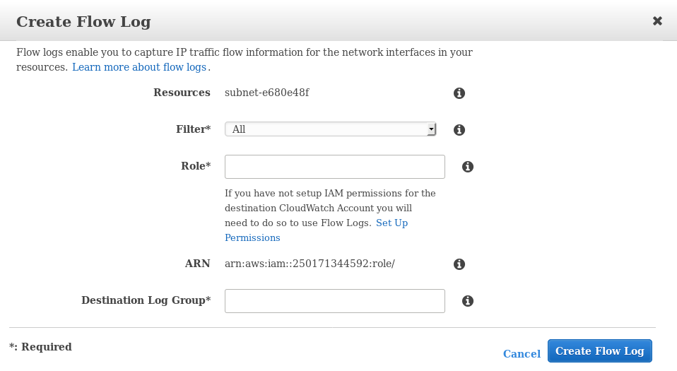

5. Pour le filtre vous pouvez définir, **ALL** : pour toutes les communications , **Accept** : uniquement les communication autorisées , **REJECT** : uniquement les paquets refusés.

6. Si c'est votre premier journal vous devrez définir un __Role IAM__ pour permettre le transfert des logs vers __cloudWatch__ , pour ce faire cliquer sur le lien **Set up Permissions** .

    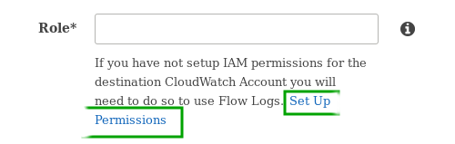

    Nous verrons beaucoup plus loin le concept de **IAM (AWS Identity and Access Management)** , en gros ceci est le système de permission dans __AWS__ notre objectif lors de la création de ce rôle est de permettre un service __AWS__ ( ici le __VPC__ ) de transmettre des données à un autre service dans le cas présent __CloudWatch__. Pour les gens qui veulent avoir plus d'information tous de suite voici le lien : [IAM](http://docs.aws.amazon.com/fr_fr/IAM/latest/UserGuide/id_roles.html) . Je vais partir du principe que l'on a pas encore de rôle, nous allons donc faire la création

7. Vous devrez définir un nom , lorsque vous cliquez sur le lien il remplira le formulaire avec le nom du rôle : **flowLogsRole** , vous pouvez le changer... Pour les curieux vous pouvez visualiser la syntaxe de la définition du rôle . Puis cliquez sur **Allow**

    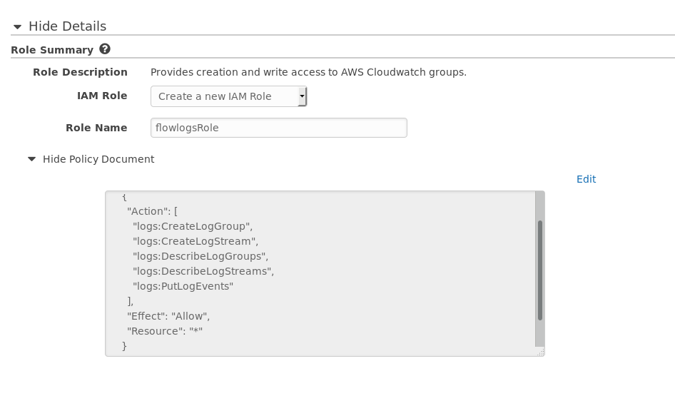

8. Vous devez fournir le log groupe dans lequel les logs seront transmis , nous avons créé nos 2 groupe précédemment , nous utiliserons donc le groupe __subnetLogs__ dans le cas présent

Voici le résultat : 

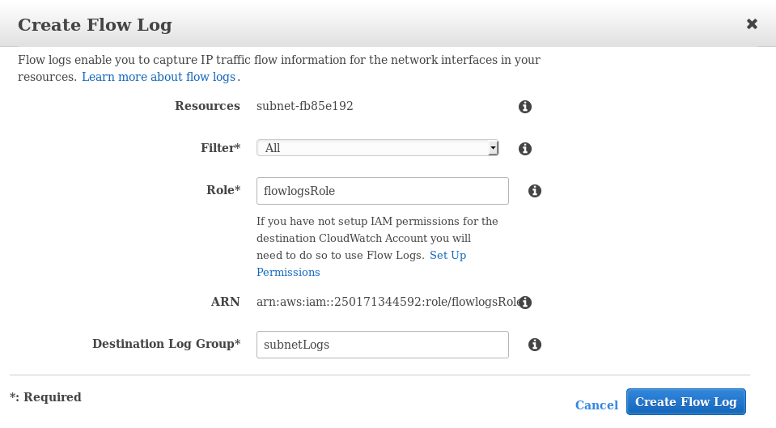

###### Création du journal de flux sur l'interface de l'instance

Réalisons la même opération mais sur l'interface d'une instance __EC2__ , l'objectif est d'avoir la visibilité sur l'ensemble des points , ceci nous permet d'identifier adéquatement le flux . Prendre note que l'instance n'a pas besoin d'être en exécution pour mettre en place la configuration !


1. Ouvrez la console d'Amazon __EC2__  [https://console.aws.amazon.com/ec2/](https://console.aws.amazon.com/ec2/) et sélectionnez **EC2**

2. Voici les instances en utilisation :

    

3. Dans le menu de gauche sélectionnez **Network Interface**

    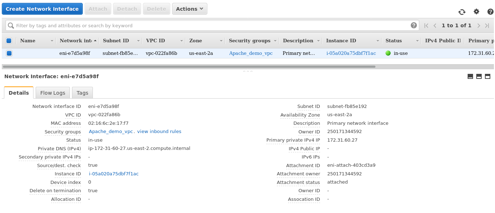

4. Sélectionnez votre interface et cliquez sur l'onglet **Flow Logs** puis **Create Flow Log** , si vous avez définie déjà des journaux de flux sur le réseau vous devriez voir des configurations avec l'identifier __Inherited From__ le nom du sous réseau.

    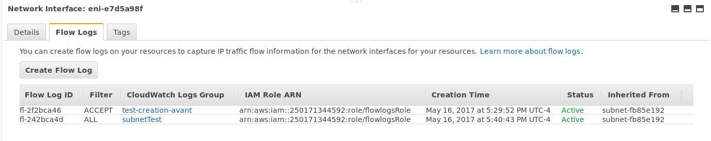

5. Cliquez sur **Create Flow Logs** 

6. Définir le filtre (__ALL__, __Accept__ ou __Reject__) , pour le Rôle vous pouvez réutiliser celui utilisé lors de la création du flux de l'interface , Sinon créez le "rôle" / "permission" __Set Up Permissions__.

    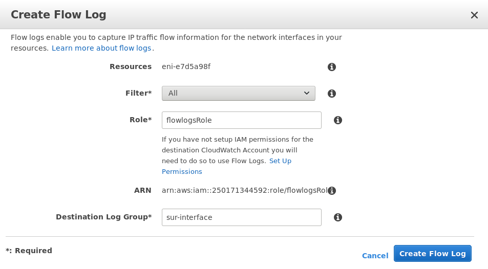

7. Voici le résultat de l'opération 

    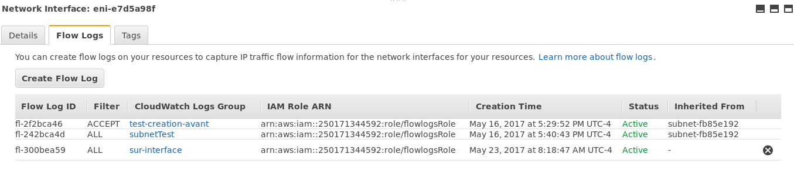

Nous avons maintenant nos journaux de flux de créé , mais ça ne fonctionnera pas tous de suite :-/ malheureusement ceci prend 10 à 15 minutes pour que ce soit actif. Donc pas de panique si vous n'avez pas vos données tous de suite , ceci ne veut pas dire que votre configuration est mauvaise !! 
Donné un peu de temps au système de ce mettre en place , ne faite pas comme moi , puis changer plein de configuration et pas comprendre pourquoi ça marche pas et finalement refaire la configuration !

##### Configuration des instances et déploiement des conteneurs 

Configuration de l'instance afin d'avoir **Docker-CE** de présent 

1. Connexion SSH

    ```bash
    $  ssh -i aws_training ec2-user@13.58.122.219
    ```

2. Mise en place du __repository yum__ pour docker 

    ```bash
    [ec2-user@ip-172-31-60-4 ~]$ sudo yum install -y yum-utils && sudo yum-config-manager --add-repo https://download.docker.com/linux/centos/docker-ce.repo  && sudo yum makecache fast && sudo yum install docker-ce

    [ec2-user@ip-172-31-60-27 ~]$ curl "https://bootstrap.pypa.io/get-pip.py" -o "get-pip.py"
    [ec2-user@ip-172-31-60-27 ~]$ sudo python get-pip.py
    [ec2-user@ip-172-31-60-27 ~]$ sudo pip install docker-compose
    ```

3. Validation de docker :

    ```bash
    [ec2-user@ip-172-31-60-27 ~]$ sudo docker ps
    CONTAINER ID        IMAGE               COMMAND             CREATED             STATUS              PORTS               NAMES
    ```

4. Je vais faire le transfert de la configuration du service apache, a défaut d'avoir poussé mon image sur [hub.docker.com](http://hub.docker.com), je vais transférer l'ensemble du __DockerFile et docker-compose__.

    ```bash
    $ scp -i ~/.ssh/aws_training -r Apache/ ec2-user@52.14.54.45:.
    Enter passphrase for key '/home/xerus/.ssh/aws_training': 
    ```

5. Création de l'image sur le conteneur .

    ```bash
    [ec2-user@ip-172-31-60-27 Apache]$ docker-compose build
    Building apache
    [.... ]
    ```

6. Erreur reçu 

    ```
    Err http://security.debian.org jessie/updates InRelease
      
    Err http://security.debian.org jessie/updates Release.gpg
      Cannot initiate the connection to security.debian.org:80 (2610:148:1f10:3::73). - connect (101: Network is unreachable) [IP: 2610:148:1f10:3::73 80]

    ```

7. Dans CloudWatch 

    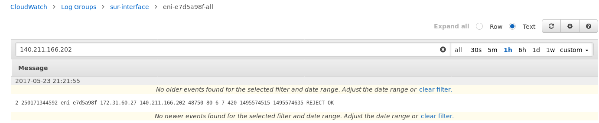

##### Validation du déploiement avec la visualisation des pages web


##### Consultation dans cloudwatch et extraction de l'information

Regardons dans __CloudWatch__ ce que ceci nous donne .

1. Ouvrez la console d'Amazon __CloudWatch__  [https://console.aws.amazon.com/ec2/](https://console.aws.amazon.com/cloudwatch/)

2. Allez dans la section **logs** et sélectionnez votre groupe de logs puis le nom de l'interface 

    TODO : Ajouter une image

3. Voici un exemple de logs pour l'interface 

    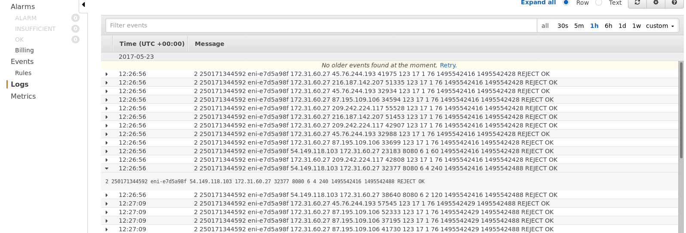


Comme vous pouvez le voir j'ai "ouvert" (__Expand__) une ligne 

> 2 250171344592 eni-e7d5a98f 54.149.118.103 172.31.60.27 32377 8080 6 4 240 1495542416 1495542488 REJECT OK

C'est un peu cryptique à première vue , mais on va regarder ce que chaque colonne signifie , un tableau descriptif des colonnes :

|Champ         |   Description |
|:-------------|:---------------|
|**Version**   | Version des journaux de flux VPC |
|**id-compte**   | ID de compte AWS pour le journal de flux |
|**id-interface**    | ID de l'interface réseau à laquelle le flux de journaux s'applique |
|**adrsrce**     | Adresse IPv4 ou IPv6 source. L'adresse IPv4 de l'interface réseau correspond toujours à son adresse IPv4 privée. |
|**adrdest**     | Adresse IPv4 ou IPv6 de destination. L'adresse IPv4 de l'interface réseau correspond toujours à son adresse IPv4 privée. |
|**portsrce**    | Port source du trafic |
|**portdest**    | Port de destination du trafic |
|**protocole**   | Numéro de protocole IANA du trafic (pour plus d'informations, consultez la page [Assigned Internet Protocol Numbers](http://www.iana.org/assignments/protocol-numbers/protocol-numbers.xhtml)) |
|**paquets**     | Nombre de paquets transférés au cours de la fenêtre de capture |
|**octets**  | Nombre d'octets transférés au cours de la fenêtre de capture |
|**début**   | Heure de début de la fenêtre de capture, en secondes Unix |
|**fin**     | Heure de fin de la fenêtre de capture, en secondes Unix |
|**action**  | Action associée au trafic : \
               * ACCEPT : le trafic enregistré a été autorisé par les groupes de sécurité ou les listes ACL réseau. \
               * REJECT : le trafic enregistré n'a pas été autorisé par les groupes de sécurité ou les listes ACL réseau. |

Donc si nous reprenons notre exemple ci-dessus :

| Version | id-compte | id-interface | IP Source | IP Destination | Port Source | Port Destination | Protocole | # paquets | # octets | début | fin | action |
|:--------|:---------:|:-------------|:---------:|:--------------:|:-----------:|:----------------:|:---------:|:---------:|:--------:|:-----:|:---:|:------:|
|2| 250171344592| eni-e7d5a98f| 54.149.118.103| 172.31.60.27| 32377| 8080| 6| 4| 240| 1495542416| 1495542488| REJECT OK|

Étrangement l'IP 54.149.118.103 appartient à Amazon :

```bash
$ dig -x 54.149.118.103
[ ... ]
;; ANSWER SECTION:
103.118.149.54.in-addr.arpa. 300 IN     PTR     ec2-54-149-118-103.us-west-2.compute.amazonaws.com.
[...]
```

Mais effectivement le port 8080 n'est pas autorisé dans le pare feu c'est donc un succès bien que je ne comprend pas la source du trafic :D.

A voir :

* https://blog.flowlog-stats.com/2016/05/01/enabling-flow-logs-on-aws/
