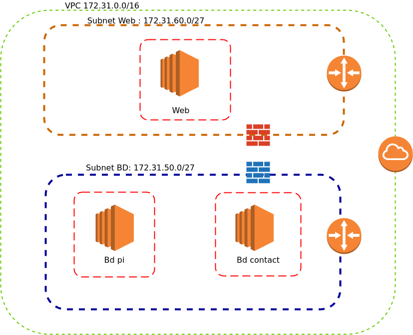

# Démonstration de réalisation

## Démonstration création de sous-réseaux et mise en place du journal de flux

Maintenant que nous avons couvert le principe du __VPC__ , des sous-réseaux et du journal de flux , il est important de faire une petite démonstration pratique de la réalisation de ces configurations . Car peu importe le texte théorique que nous pourrions rédigé la pratique apporte toujours énormément de clarification. 

Voici le scénario que nous allons mettre en place  :

* Création de 2 sous-réseaux ( __Frontal__ et __BD__) .
    * Mise en place __d'ACL__ pour la sécurité des sous-réseaux.
* Création des instances __EC2__ avec des groupes sécurité 
    * Mise en place d'un serveur Web dans le réseau __Frontal__ .
        * Configuration de 2 __virtualHosts__ , communiquant avec 2 bases de donnée __Mysql__.
    * Mise en place de 2 serveurs __Mysql__ dans le réseau __BD__ .
        * Configuration de chaque serveur __Mysql__ pour chaque application web (__VirtualHost__).

Voici un schéma du réseau :



L'ensemble du déploiement applicatif sera réalisé avec **docker** afin de transférer l'application sans être obligé de réaliser la configuration sur les serveurs :P. Puis nous sommes confortable dans l'utilisation de docker :) .

Nous allons aussi introduire une erreur de configuration afin de voir l'intérêt d'utiliser le journal de flux.

### Création des sous-réseaux

Nous allons donc faire la création de 2 sous-réseaux dans le __VPC__ qui fut créé initialement pour le moment je ne vois pas le requis de créer un __VPC__ autre , ceci pourrait être pertinent si nous désirions avoir une séparation plus importante que les sous-réseaux . Si vous avez plusieurs départements utilisant __AWS__ ceci peut être intéressant , ou si vous désirez qu'un certain __VPC__ soit connecté avec votre réseau corporatif à l'interne (bureau ou centre de donnée).

* Définition des sous-réseaux
    * BD : 172.31.50.0/27
    * Frontal : 172.31.60.0/27
 
Comme encore nombre d'entre vous l'annotation __/27__ peut être obscure , la commande **ipcalc** est la pour vous :

```bash
$ ipcalc 172.31.60.0/27
Address:   172.31.60.0          10101100.00011111.00111100.000 00000
Netmask:   255.255.255.224 = 27 11111111.11111111.11111111.111 00000
Wildcard:  0.0.0.31             00000000.00000000.00000000.000 11111
=>
Network:   172.31.60.0/27       10101100.00011111.00111100.000 00000
HostMin:   172.31.60.1          10101100.00011111.00111100.000 00001
HostMax:   172.31.60.30         10101100.00011111.00111100.000 11110
Broadcast: 172.31.60.31         10101100.00011111.00111100.000 11111
Hosts/Net: 30                    Class B, Private Internet
```

Définissons nos __ACL__ tous de suite :

| Subnet  | Règle  | Source         | Destination    | Port    | Autorisation | Description                                    |
|---------|-------:|:--------------:|:--------------:|:-------:|-------------:|-----------------------------------------------:|
| BD      | INPUT  | 0.0.0.0/0      | 172.31.50.0/27 | 22      | ACCEPT       | Accès SSH aux instances BD                     | 
| BD      | INPUT  | 172.31.60.0/27 | 172.31.50.0/27 | 3306    | ACCEPT       | Accès à __MySql__ depuis les instances Frontal |
| BD      | OUTPUT | 0.0.0.0/0      | 0.0.0.0/0      | __ANY__ | DENY         | Refuse les communications vers l'externe       |
| Frontal | INPUT  | 0.0.0.0/0      | 172.31.60.0/27 | 22      | ACCEPT       | Accès SSH aux instances Frontal                | 
| Frontal | INPUT  | 0.0.0.0/0      | 172.31.60.0/27 | 80      | ACCEPT       | Accès Web connexion pour le service Apache     | 
| Frontal | OUTPUT | 0.0.0.0/0      | 0.0.0.0/0      | __ANY__ | DENY         | Refuse les communications vers l'externe       |

Nous allons débuter par la création des __ACL__ puis les sous-réseaux , car lors de la création du sous-réseaux nous devrons faire l'association de __l'ACL__ associé.


1. Ouvrez la console d'Amazon __EC2__  [https://console.aws.amazon.com/ec2/](https://console.aws.amazon.com/ec2/) et sélectionnez **VPC**
2. Sélectionnez **Network ACL**, vous devriez avoir quelque comme ceci :

    

3. Cliquez sur **Create Network ACL**, débutons par __l'ACL__ de la base de donnée.
4. Identifier le nom de l'ACL pour , quelque chose de significatif __SVP__ :P , n'ayant que 1 __VPC__ le choix est simple :)

    

5. Visualisons les configurations par défaut lors de la création d'une __ACL__:

    * En entré :

    
    * En sortie : 

    

6. Édition des règles d'entrée pour représenter le contenu du tableau , vous constaterez que nous ne pouvons pas définir la destination dans le cadre des __ACL__ en INPUT la règle s'applique donc sur l'ensemble du __subnet__ nous devrons utiliser les __security groups__ afin d'avoir la granularité sur la machine.

    * Édition :

    
    * Résultat (c'est surtout pour démontrer que automatiquement __AWS__ rajouter la règles de REFUS ) **stateless** donc range de ports énorme: 

    

7. Édition des règles de sortie, dans notre cas aucune opération n'est requise. **stateless** donc range de port énorme

    

8. Cliquez sur **Create Network ACL**, débutons par __l'ACL__ des services frontal .

    

9. Édition des règles d'entrée pour représenter le contenu du tableau , vous constaterez que nous ne pouvons pas définir la destination dans le cadre des __ACL__ en INPUT la règle s'applique donc sur l'ensemble du __subnet__ nous devrons utiliser les __security groups__ afin d'avoir la granularité sur la machine.

    * En entré :

    

    * En sortie :

    


* Maintenant que nous avons nos __ACL__ passons à la création des sous-réseaux . 
    * BD : 172.31.50.0/27
    * Frontal : 172.31.60.0/27

1. Toujours dans le service __VPC__ nous allons procéder à création du sous-réseaux BD pour débuter , sélectionnez **Subnets** puis **Create Subnet** .

    

2. Création de notre sous-réseau avec un nom significatif ( j'insiste :P )

    

3. Association de __l'ACL__ BD avec le réseau BD (onglet __ACL__)

    

4. Résumé de la configuration configuration du segment réseau BD. J'aimerai porter votre attention sur le fait que ce segment n'a PAS d'assignation d'adresse IP publique automatique : **Auto-assign Public IP: no**. Ceci n'est pas requis , car les machines n'ont pas de service publique sur internet pourquoi ouvrir les machines sur Internet ? :D . Bon finalement lors des TESTES j'ai constaté que ce n'était pas possible, car quand nous stipulons pas d'adresse IP publique ceci est VRAIMENT pas d'adresse IP publique même pour la communication à l'externe !! En d'autre mot si la machine n'a pas d'IP impossible de faire les mise à jour du système d'exploitation ou l'installation d'application , ce qui est plutôt limitatif.

    

5. Création du sous-réseau Frontal pour le service Apache . 

    

6. Association de __l'ACL__ pour le réseau frontal.

    

7. Nous allons assigner une adresse IP publique IPv4 automatiquement pour le réseau Frontal .

    
    

8. Voici le résumé de la configuration du segment Frontal, très semblable au segment BD mais avec l'assignation d'IP publique automatique.

    

Référence : 

* [http://docs.aws.amazon.com/fr\_fr/AmazonVPC/latest/UserGuide/VPC\_Appendix\_NACLs.html](http://docs.aws.amazon.com/fr_fr/AmazonVPC/latest/UserGuide/VPC_Appendix_NACLs.html)

### Création du groupe de(s) sécurité(s)

Nous allons définir 2 groupe de sécurité qui sera appliqué au 2 type d'instances Apache et BD . Nous ne réaliserons pas de configuration particulière pour distingué la Base de donnée Pi de contacts.
L'objectif est de simplifier la configuration , sinon ça devient vite compliqué. Bien entendu nous aurions pu aussi définir une configuration de groupe de sécurité ouvert et se fier uniquement sur la configuration du sous réseau __VPC__ . Je suis cependant moins confortable avec cette solution car si nous déplaçons notre instance dans un autre sous réseau nous n'aurons pas / plus de sécurité réseau.

De plus nous allons en profiter pour nous rafraichir la mémoire sur le groupe de sécurité :D.

1. Ouvrez la console d'Amazon __EC2__  [https://console.aws.amazon.com/ec2/](https://console.aws.amazon.com/ec2/) et sélectionnez **EC2**
2. Sélectionnez **Security Groups**, vous devriez avoir quelque comme ceci :

    

3. Création du groupe de sécurité pour le serveur Apache 

    * Entré

    

    * Sortie, comme vous pouvez le voir je ne met pas de restriction pour la sortie je ne le ferais pas pour le groupe de sécurité , je vais faire cette gestion au niveau du sous réseau __VPC__ bien entendu ceci est un choix, libre à vous !

    

4. Création du groupe de sécurité pour les serveur de BD 

    * Entré

    

    * Sortie , tous est ouvert comme pour le groupe de sécurité apache.

### Préparation des conteneurs 

Comme la formation n'est pas orienter __docker__, mais que nous en avons fait beaucoup dans le passé, j'ai réalisé une documentation "extra" pour les personnes que ça intéresse. L'objectif était de ne pas surcharger la documentation Amazon , suite le [lien vers préparation environnement Apache , BD](./extra/01-preparation-env-Apache-BD-with-docker.md).

Pourquoi utiliser Docker ? Mon objectif est simple réduire mon coût !!! Le fait d'utiliser Docker m'offre la possibilité de faire l'ensemble des testes et préparation en dehors d'une  instances Amazon qui m'est facturé à l'heure. Donc si je me bat un peu avec Apache et / ou Mysql dans mon conteneur pas de problème je n'ai pas de frais. :D

Le fait que je vais pouvoir transmettre le conteneur facilement ou le reconstruire m'assure que se sera identique à mon environnement interne.

### Création des instances web et BD

Bon maintenant que l'ensemble des opérations **SANS Frais** fut réalisé c'est le moment de passé à l'étape qui nous occasionnera un coût :P.

Nous allons créer 3 instances :

* 1 Apache : dans le segment Frontal
* 2 BD : dans le segment BD

1. Ouvrez la console d'Amazon __EC2__  [https://console.aws.amazon.com/ec2/](https://console.aws.amazon.com/ec2/) et sélectionnez **EC2**

2. Cliquez sur **Launch Instance**
3. J'ai choisie une instance RedHat 7.3 
4. Instance type : **t2.small**
5. Sélection du sous-réseau


6. Sélection du groupe de sécurité 


7. Sélection de la clé ssh 


**IMPORTANT** : lors de l'assignation d'une instance __EC2__ à un sous réseau , il ne sera PAS possible dans le future de l'assigner à un autre sous réseau !

### Création du journal de flux pour identifier le problème

Nous allons réaliser la création des journaux de flux tous de suite , car telle que mentionné plus tôt la mise en place des journaux peuvent prendre entre 10 et 15 minutes pour que nous commencions à recevoir des données. Dans ce contexte ceci ne m'a pas aidé pour identifier les problématiques de configuration et la patience n'est pas toujours facile ... 

Nous avons 2 lieux où nous pouvons définir des journaux , sur le sous réseau et sur l'interface de l'instance __EC2__ ! 

Nous allons faire les 2 afin de voir le fonctionnement . Débutons avec le sous-réseau .

Référence : [https://blog.flowlog-stats.com/2016/05/01/enabling-flow-logs-on-aws/](https://blog.flowlog-stats.com/2016/05/01/enabling-flow-logs-on-aws/)

#### Création du groupe de log sous CloudWatch

Avant toute chose nous devons faire la création du groupe de logs dans __CloudWatch__ ce groupe permet de contenir un regroupement de logs , nous allons faire la création de 2 groupes :

* __subnetLogs__ : Pour le contenu des logs par sous réseau .
* __interfacesLogs__ : Pour le contenu des logs sur une interface. 


1. Ouvrez la console d'Amazon __EC2__  [https://console.aws.amazon.com/ec2/](https://console.aws.amazon.com/ec2/) et sélectionnez **CloudWatch**

2. Dans le menu de gauche sélectionnez **Logs**

3. Cliquez sur **Action** et **Create log group**

    

4. Création du groupe , juste entrer le nom du groupe 

    

Et voilà , prendre note que c'est très important de le faire avant j'ai eu plein de doute sur la fonctionnalité de ma configuration en essayant de le faire après . Ça "semble" fonctionné quand tu le fais après cependant déjà que ça prend 10 à 15 minutes pour avoir les données, j'ai l'impression que la non création du groupe de logs avant le journal du flux augmente le délais de propagation des informations dans le groupe de logs.

#### Création du journal de flux sur le sous réseau

1. Ouvrez la console d'Amazon __EC2__  [https://console.aws.amazon.com/ec2/](https://console.aws.amazon.com/ec2/) et sélectionnez **VPC**

2. Dans le menu de gauche sélectionnez **Subnet**

3. Sélectionnez votre sous réseau et sélectionné l'onglet **flow logs**

    

4. Cliquez sur le bouton  **Create flow log**

    

5. Pour le filtre vous pouvez définir, **ALL** : pour toutes les communications , **Accept** : uniquement les communication autorisées , **REJECT** : uniquement les paquets refusés.

6. Si c'est votre premier journal vous devrez définir un __Role IAM__ pour permettre le transfert des logs vers __cloudWatch__ , pour ce faire cliquer sur le lien **Set up Permissions** .

    

    Nous verrons beaucoup plus loin le concept de **IAM (AWS Identity and Access Management)** , en gros ceci est le système de permission dans __AWS__ notre objectif lors de la création de ce rôle est de permettre un service __AWS__ ( ici le __VPC__ ) de transmettre des données à un autre service dans le cas présent __CloudWatch__. Pour les gens qui veulent avoir plus d'information tous de suite voici le lien : [IAM](http://docs.aws.amazon.com/fr_fr/IAM/latest/UserGuide/id_roles.html) . Je vais partir du principe que l'on a pas encore de rôle, nous allons donc faire la création

7. Vous devrez définir un nom , lorsque vous cliquez sur le lien il remplira le formulaire avec le nom du rôle : **flowLogsRole** , vous pouvez le changer... Pour les curieux vous pouvez visualiser la syntaxe de la définition du rôle . Puis cliquez sur **Allow**

    

8. Vous devez fournir le log groupe dans lequel les logs seront transmis , nous avons créé nos 2 groupe précédemment , nous utiliserons donc le groupe __subnetLogs__ dans le cas présent

Voici le résultat : 


#### Création du journal de flux sur l'interface de l'instance

Réalisons la même opération mais sur l'interface d'une instance __EC2__ , l'objectif est d'avoir la visibilité sur l'ensemble des points , ceci nous permet d'identifier adéquatement le flux . Prendre note que l'instance n'a pas besoin d'être en exécution pour mettre en place la configuration !


1. Ouvrez la console d'Amazon __EC2__  [https://console.aws.amazon.com/ec2/](https://console.aws.amazon.com/ec2/) et sélectionnez **EC2**

2. Voici les instances en utilisation :

    

3. Dans le menu de gauche sélectionnez **Network Interface**

    

4. Sélectionnez votre interface et cliquez sur l'onglet **Flow Logs** puis **Create Flow Log** , si vous avez définie déjà des journaux de flux sur le réseau vous devriez voir des configurations avec l'identifier __Inherited From__ le nom du sous réseau.

    

5. Cliquez sur **Create Flow Logs** 

6. Définir le filtre (__ALL__, __Accept__ ou __Reject__) , pour le Rôle vous pouvez réutiliser celui utilisé lors de la création du flux de l'interface , Sinon créez le "rôle" / "permission" __Set Up Permissions__.

    

7. Voici le résultat de l'opération 

    

Nous avons maintenant nos journaux de flux de créé , mais ça ne fonctionnera pas tous de suite :-/ malheureusement ceci prend 10 à 15 minutes pour que ce soit actif. Donc pas de panique si vous n'avez pas vos données tous de suite , ceci ne veut pas dire que votre configuration est mauvaise !! 
Donné un peu de temps au système de ce mettre en place , ne faite pas comme moi , puis changer plein de configuration et pas comprendre pourquoi ça marche pas et finalement refaire la configuration !

### Configuration des instances et déploiement des conteneurs 

* Configuration de l'instance afin d'avoir **Docker-CE** de présent , voici l'opération manuel 

1. Connexion SSH

    ```bash
    $  ssh -i aws_training ec2-user@13.58.122.219
    ```

2. Mise en place du __repository yum__ pour docker 

    ```bash
    [EC2-user@ip-172-31-60-4 ~]$ sudo yum install -y yum-utils && sudo yum-config-manager --add-repo https://download.docker.com/linux/centos/docker-ce.repo  && sudo yum makecache fast && sudo yum install docker-ce

    [ec2-user@ip-172-31-60-27 ~]$ curl "https://bootstrap.pypa.io/get-pip.py" -o "get-pip.py"
    [ec2-user@ip-172-31-60-27 ~]$ sudo python get-pip.py
    [ec2-user@ip-172-31-60-27 ~]$ sudo pip install docker-compose
    ```


* Voici l'opération **ansible** :

1. Copie des fichier de ansible disponible sous [extra/ansible-conf](./extra/ansible-conf) dans /tmp/ par exemple

```bash
$ cp -r ./extra/ansible-conf /tmp
```

2. Récupération des adresses IP publique des instances __EC2__ , et modification du fichier __ansible/hosts.cfg__  

```bash
$ vim /tmp/ansible-conf/hosts
```

3. Copie de la bonne clef privé dans le répertoire __/tmp/ansible-conf/ssh_keys/__

```bash
$ cp ~/.ssh/aws_training /tmp/ansible-conf/ssh_keys/
```

4. Exécution de ansible sur l'instance EC2 

```bash
$ cd git/training/aws/extra/ansible

$ docker-compose run --volume=/tmp/ansible-conf/:/etc/ansible/  ansible   /etc/ansible/playbooks/setup-dck.yml
```

* **MAGIE**

* Copie des fichiers de [docker-compose.yml](./extra/Apache/docker-compose_aws.yml) pour apache en modifier les IP de base de donnée

```bash
$ scp -i ~/.ssh/aws_training ./extra/Apache/docker-compose_aws.yml ec2-user@IP_APACHE:.
```

* Copie des fichiers de [docker-compose.yml](./extra/BD/docker-compose_aws_pi.yml) pour la BD pi

```bash
$ scp -i ~/.ssh/aws_training ./extra/BD/docker-compose_aws_pi.yml ec2-user@IP_DB_PI:.
$ scp -i ~/.ssh/aws_training ./extra/BD/docker-compose_aws_contact.yml ec2-user@IP_DB_CONTACT:.
```

* Bon la partie moins belle démarrage des conteneurs et insertion des données dans la BD.

```bash
$ scp -i ~/.ssh/aws_training  ec2-user@IP_APACHE docker-compose up -d 
$ scp -i ~/.ssh/aws_training  ec2-user@IP_BD_PI docker-compose up -d 
$ scp -i ~/.ssh/aws_training  ec2-user@IP_BD_CONTACT docker-compose up -d 
```

* Insertion pour PI :

```bash
ec2-user@IP_BD_PI $ mysql -u pi_usr -p 314  pi
CREATE TABLE pinum ( pi INT );
insert into pinum values (314);
insert into pinum values (3141);
insert into pinum values (31415);
insert into pinum values (314159);
insert into pinum values (3141592);
```

* Insertion pour Contact

```bash
ec2-user@IP_BD_CONTACT $ mysql -u con_usr -p tact  people
create table contacts ( id INT AUTO_INCREMENT PRIMARY KEY , nom VARCHAR(20) , prenom VARCHAR(20) );                                                    
insert into contacts (nom, prenom) values ('Bob','Marley');
insert into contacts (nom, prenom) values ('Didier','Deschamp');
insert into contacts (nom, prenom) values ('Anthony','B');
```


### Validation du déploiement avec la visualisation des pages web

* Si nous contactons l'IP de l'instance web __EC2__ nous aurons le message d'erreur : **Forbidden** ( c'est normal / voulu ) 


### Consultation dans cloudwatch et extraction de l'information

Regardons dans __CloudWatch__ ce que ceci nous donne .

1. Ouvrez la console d'Amazon __CloudWatch__  [https://console.aws.amazon.com/ec2/](https://console.aws.amazon.com/cloudwatch/)

2. Allez dans la section **logs** et sélectionnez votre groupe de logs puis le nom de l'interface 

    TODO : Ajouter une image

3. Voici un exemple de logs pour l'interface 

    


Comme vous pouvez le voir j'ai "ouvert" (__Expand__) une ligne 

> 2 250171344592 eni-e7d5a98f 54.149.118.103 172.31.60.27 32377 8080 6 4 240 1495542416 1495542488 REJECT OK

C'est un peu cryptique à première vue , mais on va regarder ce que chaque colonne signifie , un tableau descriptif des colonnes :

|Champ         |   Description |
|:-------------|:---------------|
|**Version**   | Version des journaux de flux VPC |
|**id-compte**   | ID de compte AWS pour le journal de flux |
|**id-interface**    | ID de l'interface réseau à laquelle le flux de journaux s'applique |
|**adrsrce**     | Adresse IPv4 ou IPv6 source. L'adresse IPv4 de l'interface réseau correspond toujours à son adresse IPv4 privée. |
|**adrdest**     | Adresse IPv4 ou IPv6 de destination. L'adresse IPv4 de l'interface réseau correspond toujours à son adresse IPv4 privée. |
|**portsrce**    | Port source du trafic |
|**portdest**    | Port de destination du trafic |
|**protocole**   | Numéro de protocole IANA du trafic (pour plus d'informations, consultez la page [Assigned Internet Protocol Numbers](http://www.iana.org/assignments/protocol-numbers/protocol-numbers.xhtml)) |
|**paquets**     | Nombre de paquets transférés au cours de la fenêtre de capture |
|**octets**  | Nombre d'octets transférés au cours de la fenêtre de capture |
|**début**   | Heure de début de la fenêtre de capture, en secondes Unix |
|**fin**     | Heure de fin de la fenêtre de capture, en secondes Unix |
|**action**  | Action associée au trafic : \
               * ACCEPT : le trafic enregistré a été autorisé par les groupes de sécurité ou les listes ACL réseau. \
               * REJECT : le trafic enregistré n'a pas été autorisé par les groupes de sécurité ou les listes ACL réseau. |

Donc si nous reprenons notre exemple ci-dessus :

| Version | id-compte | id-interface | IP Source | IP Destination | Port Source | Port Destination | Protocole | # paquets | # octets | début | fin | action |
|:--------|:---------:|:-------------|:---------:|:--------------:|:-----------:|:----------------:|:---------:|:---------:|:--------:|:-----:|:---:|:------:|
|2| 250171344592| eni-e7d5a98f| 54.149.118.103| 172.31.60.27| 32377| 8080| 6| 4| 240| 1495542416| 1495542488| REJECT OK|

Étrangement l'IP 54.149.118.103 appartient à Amazon :

```bash
$ dig -x 54.149.118.103
[ ... ]
;; ANSWER SECTION:
103.118.149.54.in-addr.arpa. 300 IN     PTR     ec2-54-149-118-103.us-west-2.compute.amazonaws.com.
[...]
```

Mais effectivement le port 8080 n'est pas autorisé dans le pare feu c'est donc un succès bien que je ne comprend pas la source du trafic :D.

A voir :

* https://blog.flowlog-stats.com/2016/05/01/enabling-flow-logs-on-aws/
