# Service Elastic Load Balancer 

Nous sommes à l'air de la disponibilité des services à presque 100%, l'indisponibilité de votre application peut être très coûteuse que nous parlions de vente direct ou de la perception des consommateurs. La concurrence est forte sur Internet, il est critique d'avoir notre système toujours disponible. Bien entendu tous le monde sera d'accord avec cette affirmation cependant l'informatique étant pour le moment géré et les applications créer par les humains, il y a toujours des erreurs ou problème. 

Les problèmes peuvent être multiple :

* Un Crash applicatif
* Une monté en charge trop important rendant le service indisponible
* Un problème avec le serveur au niveau du système d'exploitation 
* ...

Nous allons voir comment le service [Elastic Load Balancing](https://aws.amazon.com/fr/elasticloadbalancing/) va nous permettre d'améliorer la disponibilité de nos application. 

Avant de débutter avec l'explication du service d'amazon prenons quelques minutes pour faire le point sur le concept du Load Balancer / Balancer de charge 

## C'est quoi un balancer de charge ( Load Balancer )

## Load Balancer d'amazon  

### Prix

### Mise en place d'un balancer de charge statique

Dans l'exemple ci-dessous nous allons mettre en place un load balancer pour une application web, les 2 serveurs web seront mis en place initialisement manuellement. Nous allons donc mettre 2 serveurs GNU/Linux avec apache qui afficheront une page web simple . 

#### Mise en place de 2 instances EC2 

Création de 2 instances EC2 RedHat 7.3 

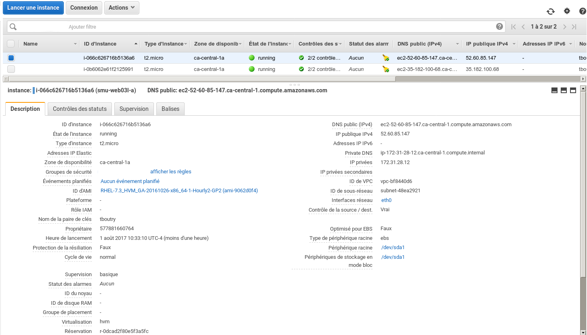

Nous avons donc 2 instances :

* Instance 1 :
  * IP privé : 172.31.28.12
  * IP publique : 52.60.85.147
* Instance 2 : 
  * IP privé : 172.31.28.188
  * IP publique : 35.182.100.68

Nous allons mettre en place le service apache sur les 2 instances 


```bash
$ ssh -i tboutry.pem ec2-user@52.60.85.147 
 # autre connexion sur la deuxième machine
$ ssh -i tboutry.pem ec2-user@35.182.100.68

 # Réalisation de la mise à jour du système avant tous pour s'assurer qu'il n'y a pas de faille de sécurité 
[ec2-user@ip-172-31-28-12 ~]$ sudo yum install upgrade

[ec2-user@ip-172-31-28-12 ~]$ sudo yum install httpd

[ec2-user@ip-172-31-28-188 ~]$ sudo systemctl start httpd.service
[ec2-user@ip-172-31-28-188 ~]$ sudo systemctl status httpd.service
● httpd.service - The Apache HTTP Server
   Loaded: loaded (/usr/lib/systemd/system/httpd.service; disabled; vendor preset: disabled)
      Active: active (running) since Tue 2017-08-01 10:47:36 EDT; 7s ago
           Docs: man:httpd(8)
           man:apachectl(8)
           Main PID: 9410 (httpd)
           Status: "Processing requests..."
           CGroup: /system.slice/httpd.service
                   ├─9410 /usr/sbin/httpd -DFOREGROUND
                   ├─9411 /usr/sbin/httpd -DFOREGROUND
                   ├─9412 /usr/sbin/httpd -DFOREGROUND
                   ├─9413 /usr/sbin/httpd -DFOREGROUND
                   ├─9414 /usr/sbin/httpd -DFOREGROUND
                   └─9415 /usr/sbin/httpd -DFOREGROUND
Aug 01 10:47:36 ip-172-31-28-188.ca-central-1.compute.internal systemd[1]: Starting The Apache HTTP Server...
Aug 01 10:47:36 ip-172-31-28-188.ca-central-1.compute.internal systemd[1]: Started The Apache HTTP Server.

[ec2-user@ip-172-31-28-188 ~]$ netstat -lntp 
(No info could be read for "-p": geteuid()=1000 but you should be root.)
Active Internet connections (only servers)
Proto Recv-Q Send-Q Local Address           Foreign Address         State       PID/Program name    
tcp        0      0 0.0.0.0:22              0.0.0.0:*               LISTEN      -                   
tcp        0      0 127.0.0.1:25            0.0.0.0:*               LISTEN      -                   
tcp6       0      0 :::80                   :::*                    LISTEN      -                   
tcp6       0      0 :::22                   :::*                    LISTEN      -                   
tcp6       0      0 ::1:25                  :::*                    LISTEN      -     
```

* Visualisation de la page web par défaut de RedHat , faire bien la validation des **DEUX** instance ceci évitera des problèmes ou des incompréhentions d'erreur par la suite .

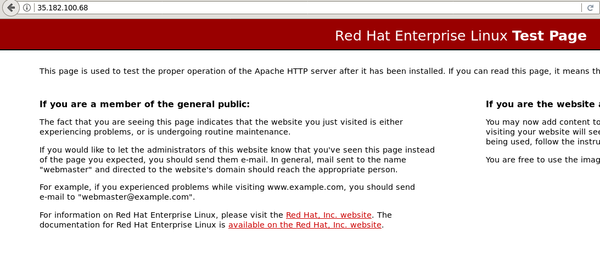

* Je vais modifier la page afin d'Avoir une page personnalisé , je fais ça car la page par défault de RedHat ne renvoie pas le code HTTP : 200 mais 403

```bash
[ec2-user@ip-172-31-28-188 ~]$ cat /var/www/html/index.html
Page Web de TEST :D 
```

#### Création du Balanceur de charge 

* Sélectionnez dans le menu de gauche (__Equilibrage de Charge__/**Equilibreurs de charge**)


* Cliquez sur **Créer un équilibreur de charge** 

* Comme nous allons mettre en place du http nous sélectionnerons l'équilibreur d'application 


* Identification du nom : 

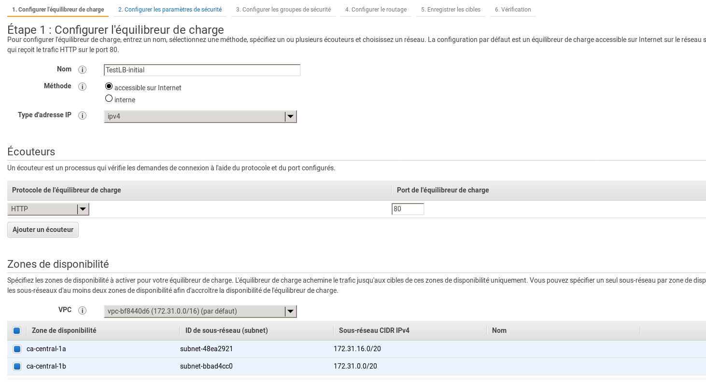

* Routage du balanceur de charge 

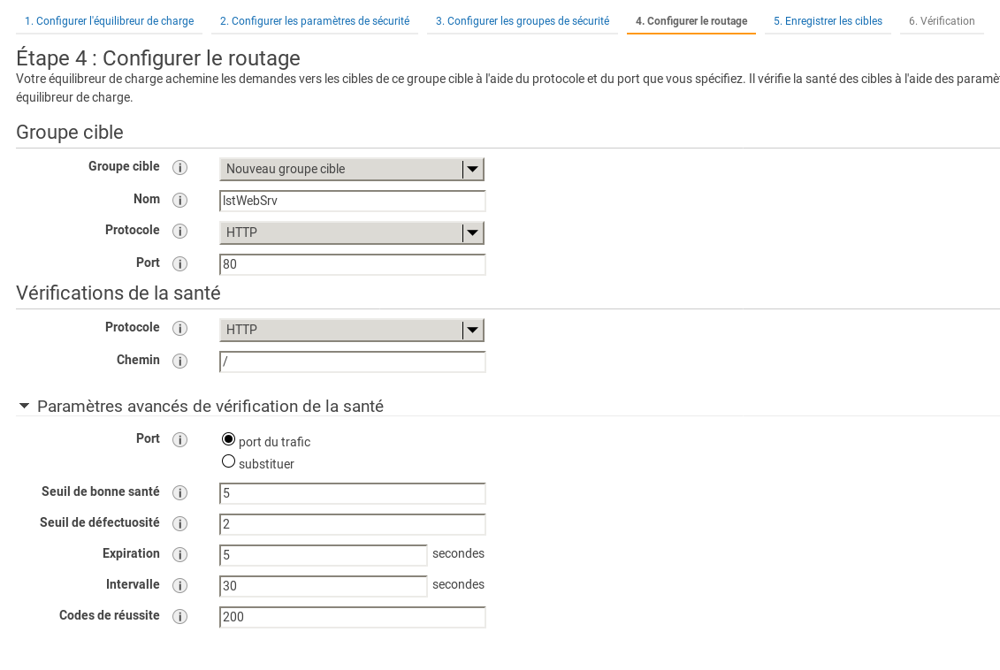

* **TODO** AJOUT d'information sur les différent champs 

* Ajout des instances EC2 pour le load balanceur 

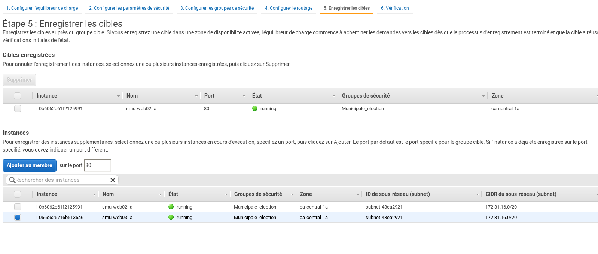

#### Visualisation de l'état et information du le balanceur 

Nous avons donc le balanceur de charge de disponible avec un groupe de machines (2) qui auquel le systèmes va transmettre les requêtes , si nous regardons la description de notre configuration nous avons quelques comme ceci :

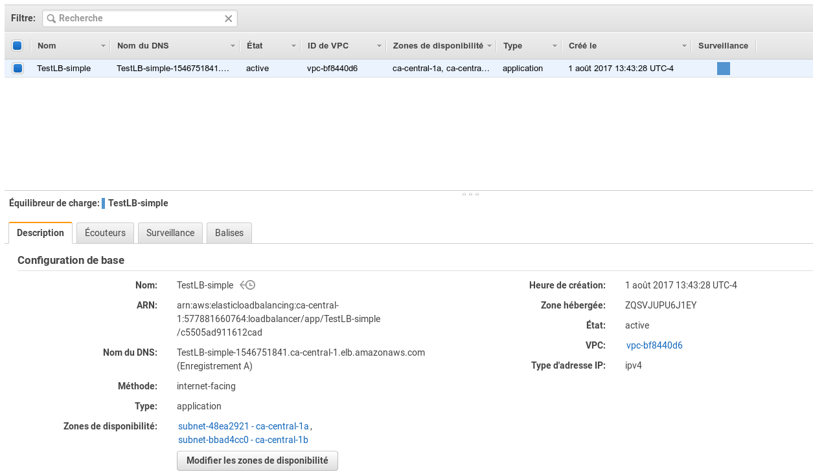

J'aimerai porter votre attention sur le champs **Nom du DNS** , Amazon vous offre un pointeur vers le balanceur de change avec le nom DNS nous allons pouvoir utiliser ce nom pour faire nos requêtes par le balanceur de charge .

Nous pouvons voir la configuration actuellement en place pour le port 80 ainsi que le groupe de machine qui lui sont associer **lstWebSrv**

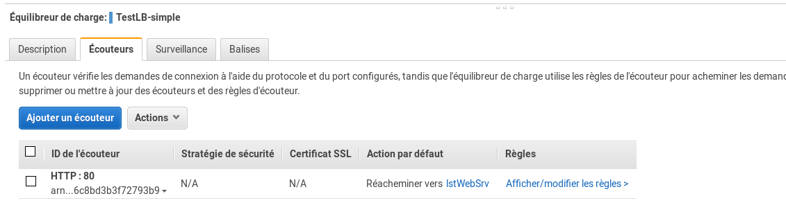

Si vous cliquez sur **lstWebSrv** vous pourrez voir les machines qui composent ce groupe , voici la description du groupe ... 

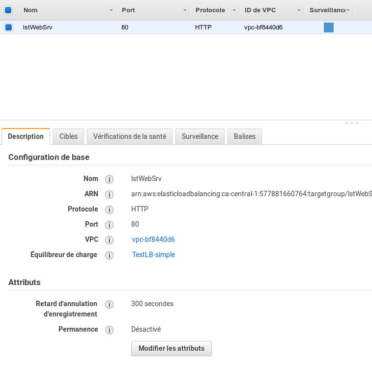

En cliquand sur l'onglet **cibles** vous aurez l'état du service par hôtes , comme vous pouvez le voir dans l'image ci-dessous le status est **healthy** donc en bonne santé :

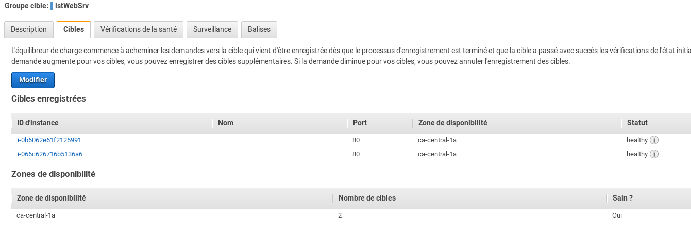

L'onglet Surveillance vous offre des graphiques sur l'état des différents hôtes , comme vous pouvez le voir dans l'images ci-dessous j'ai désactivé un des nodes qui composes le groupe pour faire un testes ... 

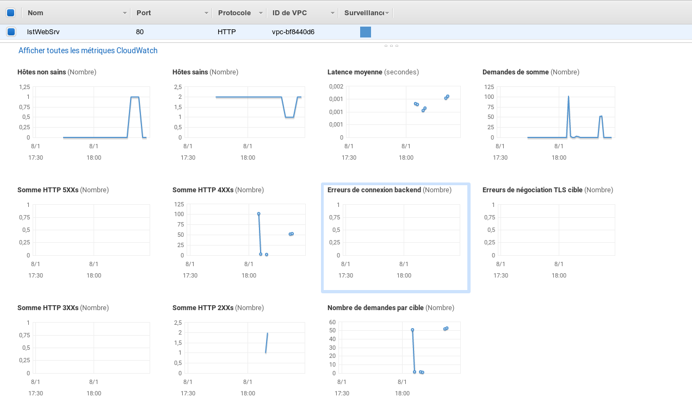

Si nous revenons à la configuration du balanceur de charge il y a aussi l'onglet Suveillance, contrairement à la section du groupe de machine ceci est principalement pour les fonctionnalités de balancement de charge. Nous voyons les codes d'erreur http , la quantité de traffique, ... 

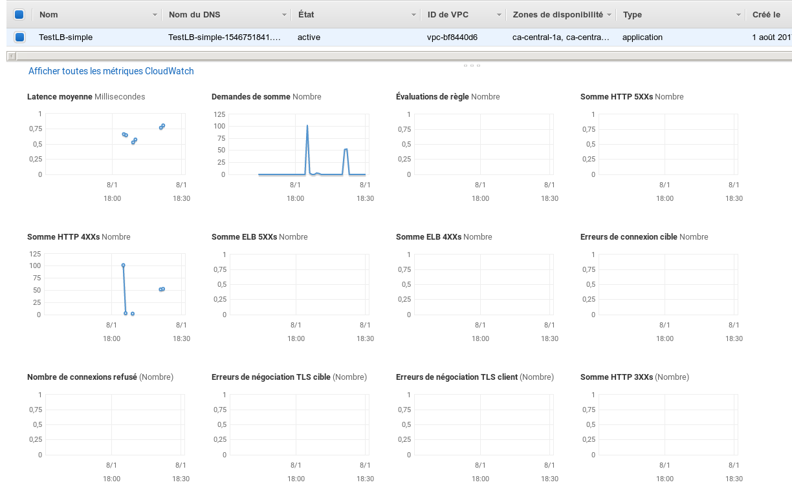

* Nous pouvons accéder à la page via la Balanceur de charge 

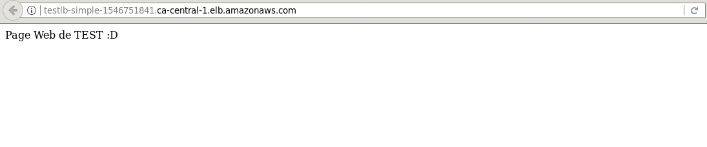
