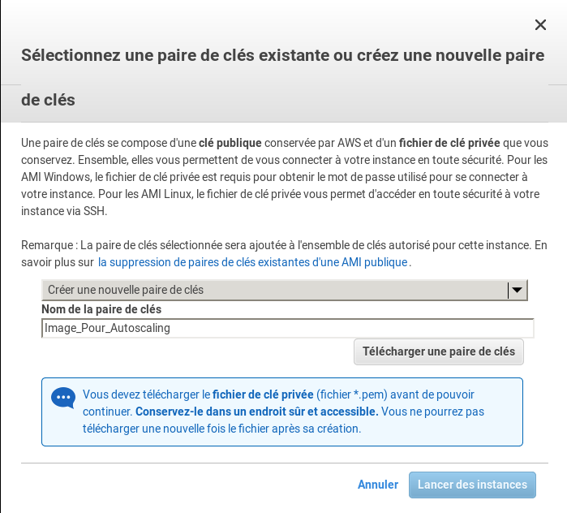
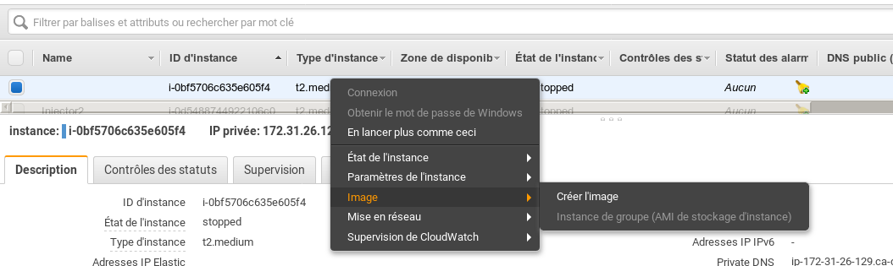
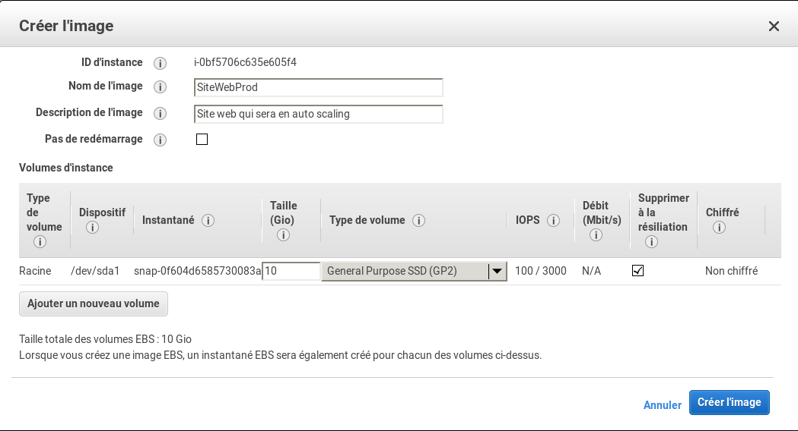

# Service Auto Scaling 

TODO : Ajouter une description du service et le but 

## Création d'une images EC2 

Nous désirons que des instances soit déployé automatiquement et qu'elle fasse partie d'un groupe de machine. Bien entendu nous n'allons par réaliser la configuration manuellement sur chaque instance générique démarrer automatiquement ceci ne suiverait pas l'idée général de l'automatisation. 

Nous allons donc voir comment faire la création d'une image Amazon pour ce besoin . 

Pour débuter nous allons créer une instance EC2 normalement que nous allons configurer . 

* Établir une connexion à la console de gestion d'Amazon 

* Allez dans la section EC2 ( rien de nouveau ici )

* Démarrer une nouvelle instance 

* Si nous regardons dans la liste des images disponible , nous n'avons aucune **AMI** de définie à ce jour , nous prendrons donc une instance de type RedHat ou peut importe votre distribution.


* On va donc choisir :
  * le type d'instance
  * Le nombre d'instance pour le moment à 1 car nous allons créer la RÉFÉRENCE
  * Je vais créer une nouvelle clé, car je veux la disocier de la mienne perso



### Configuration de l'instance 

Nous allons  donc établir la connection sur la machine pour faire la configuration, bien entendu cette partie sera bien différente pour vous, dans le cas présent ce sera une configuration d'un serveur web :

```bash
$ ssh -i Autoscaling-AMI.pem ec2-user@35.182.147.213
[ec2-user@ip-172-31-26-129 ~]$
[ec2-user@ip-172-31-26-129 ~]$ sudo yum upgrade 

[ec2-user@ip-172-31-26-129 ~]$ sudo yum install httpd vim 
[ec2-user@ip-172-31-26-129 ~]$ sudo vim /etc/httpd/conf.d/vhost.conf

[ec2-user@ip-172-31-26-129 html]$ sudo apachectl configtest
Syntax OK

  # plus mise en place du site web 

[ec2-user@ip-172-31-26-129 html]$ sudo systemctl start httpd.service
[ec2-user@ip-172-31-26-129 html]$ sudo systemctl enable httpd.service
Created symlink from /etc/systemd/system/multi-user.target.wants/httpd.service to /usr/lib/systemd/system/httpd.service.
```

* On reboot pou valider que tous fonctionne bien automatiquement au startup 

* Une fois l'Ensemble des correctif réaliser nous allons faire la création de l'instance 

### Création de l'image dans amazon

* Éteindre l'instance , je trouve que ceci est plus propre , peut-être que je suis vieux jeux aussi :P

* cliquez droit sur l'instance et selectioné **image** -> **création image**



* Définir le nom de l'image l'image et une courte description 



* Maintenant si vous créer un nouvelle instance vous aurez l'option de cette image :


## Création du groupe Auto Scaling


