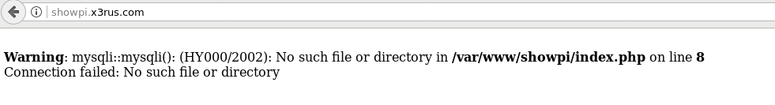

# Préparation des environnements docker pour la démonstration de l'utilisation des subnets

Petite documentation, couvrant la préparation des conteneurs Frontale et BD pour la démonstration de l'utilisation des subnets ainsi que des journaux de flux. Ceci ne sera pas couvert dans la formation vidéos , cependant pour ceux qui non pas suivie la formation Docker ou qui désire se rafraichir la mémoire ça peut être intéressant !

La séquence sera comme suit :

1. Préparation des images sur une machine de LAB.
    1. Conteneur Web, avec les 2 virtuals hosts.
    2. Création des 2 conteneurs de base de données .
2. Validation du bon fonctionnement sur l'environnement de LAB.
3. On pousse les conteneurs sur l'environnement AWS.

# Création du conteneur apache avec les 2 virtualhost

1. Création du fichier Dockerfile pour apache

    [Dockerfile](./Apache/Dockerfile)

2. Création des ""applications""  __showpi__ et __contacts__ , important de prendre en note le fait que j'utilise les variables d'environnement comme information de connexion BD !!

```php
<?php
$servername = getenv('BD_ADDR');
$username = getenv('BD_USER');
$password = getenv('BD_PASS');
$dbname = getenv('BD_DATABASE');

// Create connection
$conn = new mysqli($servername, $username, $password, $dbname);
// Check connection
if ($conn->connect_error) {
    die("Connection failed: " . $conn->connect_error);
    }
    //
    $sql = "SELECT pi, FROM pinum";
    $result = $conn->query($sql);

    if ($result->num_rows > 0) {
        // output data of each row
        while($row = $result->fetch_assoc()) {
            echo "PiNum : " . $row["pi"]. "<br>";
        }
    } else {
        echo "0 results";
    }
        $conn->close();
?> 
```

3. Création de la configuration [001-showpi.conf](./Apache/conf/001-showpi.conf) et [001-contact.conf](./Apache/conf/001-contact.conf)
    Prendre note que j'utilise 2 Virtualhost

    * showpi.x3rus.com
    * contacts.x3rus.com

4. Création de l'image et exécution
```bash
$ docker build -t vhost_test_aws  .
$ docker run --rm --name test_aws vhost_test_aws
```

5. test passant sans la BD , on a une erreur de connexion "normal", les informations BD ne furent pas transmise et je n'ai pas de BD disponible :P

* Modification de mon fichier __/etc/hosts/__
```bash
$ cat /etc/hosts  | grep showpi
172.17.0.2      showpi.x3rus.com
```




# Création des 2 conteneurs BD pour les sites web showpi et contacts 

1. Pour des fins de testes nous n'aurons qu'a faire un __docker-compose__, par la suite nous exécuterons 2 scripts pour la création de tables et des tables

2. __docker-compose.yml__:

```
version: '2'
services:
    db-pi:
        image: mysql:5.5
        container_name : 'showpi'
        hostname: dbpi.x3rus.com
        environment:
            - MYSQL_USER=pi_usr
            - MYSQL_PASSWORD=314
            - MYSQL_DATABASE=pi
            - MYSQL_RANDOM_ROOT_PASSWORD=yes
            - TZ=America/Montreal
            - TERM=xterm
    #   port:
    #       3306:3306
    db-contact:
        image: mysql:5.5
        container_name : 'showcontact'
        hostname: dbpi.x3rus.com
        environment:
            - MYSQL_USER=con_usr
            - MYSQL_PASSWORD=tact
            - MYSQL_DATABASE=people
            - MYSQL_RANDOM_ROOT_PASSWORD=yes
            - TZ=America/Montreal
            - TERM=xterm
    #   port:
    #       3306:3306

```

3. démarrage du service 

```bash
$ docker-compose up 
$ docker ps
CONTAINER ID        IMAGE               COMMAND                  CREATED              STATUS              PORTS               NAMES
ba8200c095d9        mysql:5.5           "docker-entrypoint..."   About a minute ago   Up About a minute   3306/tcp            showcontact
eaadc6b41886        mysql:5.5           "docker-entrypoint..."   About a minute ago   Up About a minute   3306/tcp            showpi
$ docker inspect showpi showcontact | grep IPAddress
    "SecondaryIPAddresses": null,
        "IPAddress": "",
        "IPAddress": "172.24.0.2",
    "SecondaryIPAddresses": null,
        "IPAddress": "",
        "IPAddress": "172.24.0.3",
```

4. Insertion de valeur bidon :

* Pi 
```sql
mysql> CREATE TABLE pinum ( pi INT );
mysql> insert into pinum values (314);
Query OK, 1 row affected (0.00 sec)

mysql> insert into pinum values (3141);
Query OK, 1 row affected (0.01 sec)

mysql> insert into pinum values (31415);
Query OK, 1 row affected (0.01 sec)

mysql> insert into pinum values (314159);
Query OK, 1 row affected (0.01 sec)

mysql> insert into pinum values (3141592);
Query OK, 1 row affected (0.01 sec)

```

* Contact 
```sql
mysql> create table contacts ( id INT AUTO_INCREMENT PRIMARY KEY , nom VARCHAR(20) , prenom VARCHAR(20) );                                                    
Query OK, 0 rows affected (0.01 sec)

mysql> insert into contacts (nom, prenom) values ('Bob','Marley');
Query OK, 1 row affected (0.00 sec)

mysql> insert into contacts (nom, prenom) values ('Didier','Deschamp');
Query OK, 1 row affected (0.01 sec)

mysql> insert into contacts (nom, prenom) values ('Anthony','B');
Query OK, 1 row affected (0.00 sec)

```
