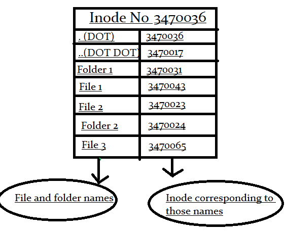

# Permission spécial fichier ( Sticky bits , SetUid , SetGid )

Petite capsule suite à une proposition d'un participant à la formation que j'apprécie. Nous allons voir les [Sticky bit](https://en.wikipedia.org/wiki/Sticky_bit), le [Setuid et SetGid](https://fr.wikipedia.org/wiki/Setuid) sous Linux . Je n'avais pas couvert cette partie lors de la présentation des permissions ou alors juste effleuré le concept. 

Nous allons prendre un peu de temps , ceci me donnera l'occasion de préparer la prochaine formation :P 

## Sticky bit 

Le sticky bit est utiliser pour réalisé une limitation de suppression de fichiers au propriétaire seulement , vous retrouverez cette permissions sur TOUS les systèmes GNU/Linux en utilisation. Si vous ne l'avez pas, car il y a eu une erreur de manipulation il est même possible que certaine application fonctionne mal . 

```bash
$ ls -ld /tmp/
drwxrwxrwt 11 root root 260 Aug  9 17:21 /tmp/
```

Donc ce répertoire tous le monde peut écrire dedans , car ceci est un répertoire temporaire pour les applications , mais si tous le monde peut écrire dedans il y a aussi un risque que n'importe qui supprime des données dedans. Grâce au **Sticky bit** ceci ne peut pas arrivé c'est une protection.

J'ai 2 utilisateurs pour le besoin de l'exercice :
* x3rus-formations : Utilisateur pour les formations
* x3rus : mon utilisateur "régulier"

* Je fait la création d'un fichier avec l'utilisateur x3rus-formations dans /tmp :

```bash
x3rus-formation $ touch /tmp/unFichier
x3rus-formation $ chmod 777 /tmp/unFichier
x3rus-formation $ ls -ld /tmp/unFichier       
-rwxrwxrwx 1 x3rus-formations x3rus-formations 0 Aug  9 17:30 /tmp/unFichier
```

* Si j'essaye de supprimer le fichier avec l'utilisateur x3rus ça ne fonctionnera PAS même si j'ai l'ensemble des permissions , à cause du sticky bit:

```bash
x3rus $ rm /tmp/unFichier 
rm: cannot remove '/tmp/unFichier': Operation not permitted
  # Pas de problème pour réaliser des modifications au conteneur 
x3rus $ echo "blabla " >> /tmp/unFichier
```

* Mais POURQUOI ? La raison est simple quand on comprend le système de fichier Linux, je sais pas si c'est à cause de l'âge mais bon ça fait partie du parcourt autant le partager .



Voici une représentation du FICHIER de type répertoire qu'est : **/tmp** , en fait ce fichier est une liste de pointeurs conteneur le nom donné par l'humain vers les inodes , les emplacements sur le disque du fichiers. Un jour on prendra peut-être le temps de voir la partie du fichier :P .
En d'autre mot on a les permissions de modifier le contenu du fichier donc l'inode de ce dernier, mais pas supprimer la référence que /tmp à du fichier. Comme le système de fichier ne libère pas l'inode tant qu'il y a une référence on peut pas le supprimer . Même si on peut écrire dedans.

* Alors qui peut ? L'utilisateur qui possède le fichier ou **ROOT** bien entendu 

```bash
x3rus-formations $ rm /tmp/unFichier
```

Bien entendu le **sticky bit** peut être assigné à n'importe quelle répertoire

## SetGID 

 $ sudo find  / -perm -g+s      
 find: ‘/run/user/1000/gvfs’: Permission denied                                 
 find: ‘/proc/4567/task/4567/fd/6’: No such file or directory
 find: ‘/proc/4567/task/4567/fdinfo/6’: No such file or directory
 find: ‘/proc/4567/fd/5’: No such file or directory                                                                                                            find: ‘/proc/4567/fdinfo/5’: No such file or directory                         
 /srv/docker/x3-gitlab/gitlab/data/git-data/repositories
 /srv/docker/x3-gitlab-f/gitlab/data/git-data/repositories
 /srv/docker/x3-gitlab-f2/gitlab/data/git-data/repositories
 /usr/bin/wall
 /usr/bin/locate

