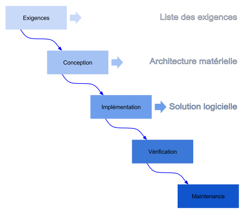
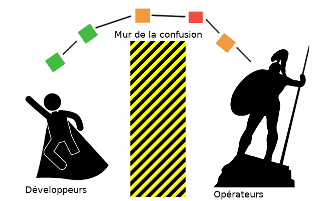
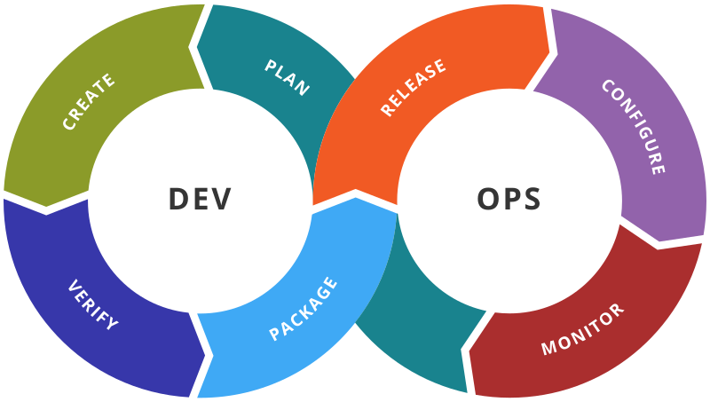
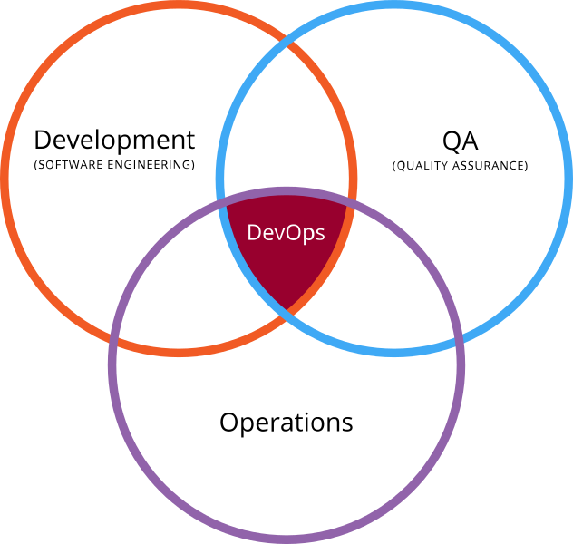
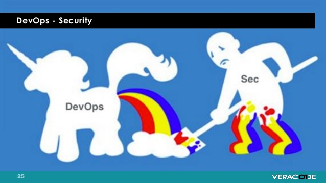

# Présentation de DevOps

Depuis environ 3 ans, le terme **devops** est arrivé dans le langage des gestionnaires, si nous regardons les offres d'emplois, on voit que même les banques ont emboité le pas. Bon c'est bien beau, mais comme bien souvent le terme est mal compris ou mal employé, nous allons essayer de clarifier le concept. 

Tel que mentionné, ceci est un concept donc sujet à interprétation, ce n'est pas une recette à appliquer bêtement, mais une méthode de travail. Il faut l'adapter à votre environnement, votre réalité tous en gardant les principes de base. Afin de comprendre le concept, nous allons partir de l'histoire qui a amené les organisations à considérer ce mode de travail. 

# Du mode classique à la méthode DevOps

Je pense que si nous comprenons le cheminement du changement de méthode, ceci simplifiera grandement la compréhension du concept.

Il y a pas si longtemps, l'ensemble du développement était réalisé en mode [**cascade**](https://fr.wikipedia.org/wiki/Cycle_de_d%C3%A9veloppement_(logiciel)#Mod.C3.A8le_en_cascade)  ou [**warterfall**](https://en.wikipedia.org/wiki/Waterfall_model) en anglais. 

Afin de m'assurer que l'on est tous sur la même longueur rapide clarification sur le mode en cascade, une petite image et on développe dessus 

L'idée de ce mode de développement est de :

1. Définir l'ensemble des requis applicatif en fait l'ensemble de l'application 
2. Suite à cette définir réalisation de l'architecture 
3. Réalisation du programme, peu de changement devrons avoir lieu, car l'ensemble des requis furent définie à l'étape 1. Dans la réalité les demandes de changement arrivent et retardent la livraison :P.
4. Validation 
5. Déploiement et maintenance applicatifs 

Ceci est en opposition avec le mode [**agile**](https://fr.wikipedia.org/wiki/M%C3%A9thode_agile) qui se veut un développement itératif . De nos jours ce mode de développement est le plus courant dans l’industrie.

Les méthodes agiles prônent 4 valeurs fondamentales :

* Individus et interactions plus tôt que processus et outils
* Fonctionnalités opérationnelles plutôt que documentation exhaustive
* Collaboration avec le client plutôt que contractualisation des relations
* Acceptation du changement plutôt que conformité aux plans

Pourquoi le mode **agile** à pris de l'ampleur ? Premièrement parce que le __client__ ou __demandeur__ est impliqué dans le développement dans les décisions des prochaines fonctionnalités à mettre en place. Tout le monde aime être impliqué :P , en plus de choisir les prochaines fonctionnalités il peut voir l'évolution et comprendre les problématiques rencontrées. Dans le mode **cascade** il attend un certain nombre de mois avant de voir un résultat. Cette inclusion du client fait aussi en sorte que grâce à ce dialogue s'il change d'avis, désolé, quand il change d'avis ceci sera dans a prochaine itération. Comme il y a régulièrement des livrables avec cette méthode, l'application peut être déployée , mise en production et continuer son évolution !! Le dernier point est important, car comme la concurrence est forte sur l'ensemble des services offert sur internet les nouvelles fonctionnalités doivent arriver régulièrement pour sustenter le client / utilisateurs. 
Résultat nous aurons beaucoup plus de livraison : version 1.0 , 1.1 , 1.2 à 1.8 puis la version 2 , 2.1 à 2.5 , peut-être dans des délais cours

Si nous revenons à la méthode **cascade** en comparaison , avec le mode **agile** l'idée est de livrer des fonctionnalités plus rapidement qui seront mis en production ! 

Ce changement de mode de travail des développeurs sera un des premiers tournants qui apportera le mouvement **DevOps** ! Car maintenant le nombre de mises à jour applicatif explose, l'équipe d'opération doit mettre en place régulièrement les nouvelles versions et bien entendu les correctifs qui en découlent suite à la détection de problème en production. 

## Développeurs Vs Opérateurs

La situation sur-le-champ de bataille est donc la suivante :

* Le Développeur qui se prend pour un super Héros, il désire pousser ces fonctionnalités "SANS BUGS" qu'il a développés  ( et oui j'étais un Opérateur :P ) 

* L'opérateur qui se prend pour le gardien de la sécurité et de la stabilité de l'application, il protège la compagnie, contre les aberrations du devs !!

Faut dire que souvent l'opérateur est sur appel la nuit et les week-ends il a tous intérêt à s'assurer de la stabilité s'il ne veut pas être réveille en pleine nuit ou pendant un match de foot :P.

Résultat voici une représentation de l'état des relations entre les 2 équipes :

Si en plus votre organisation est de taille moyenne et que les 2 équipes ne sont pas physiquement proches, les frustrations sont nombreuses et les critiques entre les 2 équipes sont nombreuses . Bien entendu ceci est dû à une incompréhension des 2 réalités.

Résultat , l'opérateur est un gros méchant qui bloque l'innovation des développeurs, à tort ou à raison peu importe , le problème est que souvent le développement fut réalisé et il ne passe pas l'étape du déploiement et l'opérateur oblige des correctifs mineur ou majeur selon la situation. Comme le développement est en mode agile, l'impact est moindre, mais génère des retards sur la livraison .

Nous constatons donc un changement au niveau du développement, mais pas dans l'ensemble de la chaine de production résultat le gain n'est pas optimal !

Ce changement organisationnel arrive avec le mode **DevOps**

# La solution le mode DevOps 

Maintenant que nous avons vu le cheminement qui à précéder l'arrivée du **DevOps** ceci sera plus simple à comprendre. L'objectif principal et de détruire le **mur de la confusion** ou **mur de l'incompréhension**. En d'autre mot unir les Développeurs et les Opérateurs, aille ça ressemble au terme **DevOps** d'un seul coup :P.

Reprenons les critères principaux des Devs et des Ops, ils sont tous très légitimes  :

* Développeurs :
    * Développer :P 
    * Innover et voir ces innovations en production.
    * NE PAS S'occuper du déploiement , de l'OS et tout le tralala ... 
    * Ne PAS être bloqué dans les choix des technologies. 
* Opérateurs :
    * Avoir une stabilité de l'application en production.
    * Ne pas avoir des technologies ingérables ou difficilement contrôlables.
    * Une simplification des déploiements , surtout s'il y a régulièrement des déploiements.

Le mouvement **DevOps**, va donc permettre une inclusion des opérateurs très tôt dans le développement , augmentant le dialogue entre les 2 parties. Après tous nous sommes tous dans la même compagnie, si le développement prospère et que les opérations prospèrent aussi la compagnie "devrait" être aussi prospère.

Voici une image de la chaine des relations du **DevOps**, nous allons voir un peu les différents éléments composant cette chaine.

J'aimerai clarifier un point **IMPORTANT**, nous avons 2 parties sur l'image , mais **L'ÉQUIPE** est composée de membres avec des compétences plus grandes en développement ou en opération. Donc si nous prenons la partie création , les opérations seront ou plutôt doivent être impliqué et y participé. Au même titre que les développeurs doivent être impliqués lors de la configuration des environnements afin de procéder aux validations des déploiements.

## Étape de la chaine DevOps

Prenons les différents points de l'image ci-dessous et regardons ce que ceci indique plus que le simple mot [Étape de la chaine DevOps](https://en.wikipedia.org/wiki/DevOps_toolchain). Faut y mettre un grain de sel dans tout ça , ici nous parlons de grand principe dans la pratique il y a toujours de ajustement et des éléments que l'on fait moins.

### Plan ou définition 

Bien entendu que nous soyons en mode **agile** ou **Cascade** l'étape d'analyse reste essentielle , nous la retrouvons ici. Par contre l'analyse doit inclure les opérateurs. En plus de l'analyse des technologies et des requis de fonctionnalité applicatifs, il est important de définir :

* Les métriques de production qui seront jugées acceptables ( ex: quelles est le temps d'affichage acceptable ? le temps de rafraichissement des données ? ...) .
* Les critères de sécurité, les conformités ...
* Le processus de mise à jour applicatif ET base de données.
* Les métriques qui seront générées par l'application.
* Les tests de monitorage applicatif.

### Création  (Create) 

Le processus de création est donc principalement au niveau du développement , cependant tel que mentionné lors de la présentation de l'image ceci doit être réalisé avec l'ensemble de l'équipe (**DevOps**).

La création comprend :

* Le désigne de l'application.
* La partie développement (**CODE**) , ceci comprend des tests unitaires et idéalement de performance.
* Compilation applicative et réalisation des tests de performance.
* Réalisation de [Release candidat](https://en.wikipedia.org/wiki/Software_release_life_cycle#Release_candidate)

### Vérification (Verify) 

Ceci est surtout pour l'équipe de l'assurance qualité , mais pas uniquement il est les tests fonctionnels et les validations du code.

La vérification comprend :

* Tests applicatifs.
* Tests de régression .
* Analyse de sécurité , et idéalement teste d'intrusion.
* Validation de la configuration. 

### Préparation d'un tout cohérent (Package / staging ) 

Désolé pour le titre j'ai eu quelque difficulté à trouver un terme français pour __packaging__ , l'idée générale de cette étape et de faire l'ensemble des tâches requises en vue de la version finale de l'application , la **release** .

* Recherche des approbations ou pré approbation.
* Packaging des configurations.
* Déploiement sur les environnements Dev -> QA -> Preprod (staging release).
* Mise en place des artefacts applicatifs dans une voûte.

### Livraison version "finale" (Release)

Nous sommes donc à l'étape de la livraison d'une version de l'application, nous avons plusieurs étapes :

* Coordination de la livraison ( Play By Play ).
* Déploiement et activation des fonctionnalités en production .
* Plan d'action en cas de retour arrière .
* Planification de l'indisponibilité de l'application si requise.

### Configuration (Configure)

Cette étape comprend l'ensemble du processus de configuration :

* Configuration de l'infrastructure de stockage , les bases de données , l'infrastructure réseau
* Configuration du système d'exploitation pour répondre au requis applicatif ( ex.: limite de fichier ouvert ...)
* Configuration de l'application en lien avec son environnement

### Monitoring (Monitor)

Malheureusement cette partie fut sous réalisé dans les années passées, dans le monitorage nous ne parlons pas uniquement de s'assurer que l'application est disponible en validant la disponibilité du port réseau. Il est important aussi d'avoir des métriques afin de savoir si l'application est "performante" et utilisable.

* Collecte de métrique sur les performances de l'infrastructure TI.
* Collecte d'information sur l'expérience de l'utilisateur.
* Statistique de l'application dans le temps.

### Conclusion de cette chaine 

Au risque de me répéter, j'aimerai rappeler que les opérateurs et les développeurs sont dans la même équipe, donc les tâches sont communes à l'ensemble de l'équipe et doivent être planifié comme telle.

Une autre forme de chaine est apparue en 2014 avec cette suite :  __Plan, Code, Build, Test, Release, Deploy, Operate et Monitor__. Mon objectif ici est était surtout de montrer 2 points :

* La boucle infinie dans le développement , le déploiement et le monitorage
* La relation d'unité dans l'équipe avec 2 champs de compétence complémentaire
* Les étapes haut niveau du cycle.

Bien entendu dans votre réalité vous pouvez voir l'association de votre développement pour chaque partie, nous allons maintenant voir les grands principes du **DevOps** ce que nous allons mettre en place afin d'être en mesure de suivre la cadence de ce développement perpétuel.

## les principes ESSENTIELS 

Nous avons vu le cycle de la chaine du développement en mode **DevOps** maintenant nous nous attarderons au principe pour y arriver. Nous allons parler d'automatisation de processus dans le but de suite le rythme imposé par cette boucle infinie du développement.

Commençons avec but , le **Graal** :P .

* Augmentation de la fréquence des déploiements.
* Fonctionnalité plus rapidement mise en production donc sur le marché.
* Réduire le nombre d'erreur ou problème lors de la mise en place de la nouvelle version.
* Réduire le temps entre les correctifs
* En cas de problème, réduire le temps de recouvrement 

Résultat de la mise en place du **DevOps** :

* Meilleure prédiction de la suite.
* Augmentation de l'efficacité.
* Amélioration de la maintenance opérationnelle, car plus confortable avec le changement.
* Mise en place de tâches en libre service pour l'équipe.

C'est parti pour le détail pour y arriver 

### Collaboration

Oui, je vais encore le répéter :P , la collaboration entre les gens, car au final c'est les hommes qui font le travail et qui réussissent de grandes choses. Je ne sais pas qui a dit ça à l'origine, mais ce fut mentionné dans un emploi passé. 

> Tous seul on va plus vite, mais ensemble on va plus loin !! 

J'aime bien cette citation , elle représente bien le travail collaboratif .

Donc l'ensemble des personnes doivent être unies dans le but et travailler ensemble , voici une autre représentation de cette unité :

Nous sommes interconnectés, quand le développeur à des questions sur l'infrastructure il questionne l'équipe TI / Opérateur. Lorsque l'équipe de l'assurance qualité rencontre une problématique applicative, il consulte le développeur et/ou l'équipe d'opération. Lorsqu'il y a un problème applicatif avec l'application, que l'infrastructure ne semble pas en cause l'opérateur consulte le développeur pour avoir plus d'information. En d'autres mots, nous sommes liés ensemble autour du produit. 

Nous ne voulons plus entendre : *c'est la faute du Dev ou de l'installation*, mais *est-ce possible de me fournir cette information pour que je puisse analyser la situation ?*.

### Automatisation 

L'automatisation est au centre du travail du DevOps, car la charge de travail qu'on lui demande est grande. Avec le nouveau mode de travail, nous désirons qu'il y ait plus d'intégration de l'application, plus de tests, plus de validation, plus de déploiement, plus de surveillance.
Bien entendu il est toujours possible de réaliser ces opérations manuellement, mais rapidement les personnes n'auront plus d'intérêt et la productivité sera impacté. 

Nous retrouverons donc souvent dans les équipes de **DevOps** une boite à outils qu'ils furent développés à l'interne, acheter ou l'utilisation de logiciel libre. Bien entendu, la majorité du temps c'est un mixe de l'ensemble.

Je dirai même que l'objectif est d'automatiser au maximum, ceci aura l'avantage :

* De réduire les erreurs humaines
* De permettre de réaliser à l'identique les opérations (reproductible)
* D'augmenter le temps de réalisation des tâches (Productivité)
* Éventuellement, permettre à n'importe qui d'exécuter l'opération librement sans votre assistance (Self-Service)

Si vous avez peur de ne plus avoir de travail, **pas de panique** on arrive jamais à tout automatiser et on trouve toujours plus de choses à faire quand on a du temps :P.

### Intégration continue 

Intégration régulière / continue du travail des personnes de l'équipe. Nous partons du principe que l'équipe utilise un système de contrôle de révision telle que **Subversion**, **git** afin de mettre leur travaille ensemble. Ceci n'est techniquement peut-être pas requis cependant de mon point de vue il est essentiel pour simplifier le retour arrière, ainsi que les requêtes de fusion (merge).

L'objectif de cette étape et de voir **rapidement** s'il y a un problème d'intégration et de pouvoir l'adresser **rapidement** (au risque de me répéter :P ).

#### Concrètement

##### cas 1

L'équipe travaille sur une application 3 tiers ( frontale Web, Application __backend__, Base de donnée ) .

Un développeur pris par un excès de zèle décide de réaliser de la documentation dans le code, __yep__ ça arrive parfois :P . Remplie de confiance il pousse la modification du code sans compilation, car il a rien touché, selon son point de vue. Grâce à l'intégration continue du travail dès que le code sera transmis au serveur Subversion ou Git ce dernier sera compilé et intégré pour validation. L'erreur syntaxique pourra tout de suite être identifiée et une alerte sera transmise à l'équipe pour signaler la problématique. 

La personne aillant fait la modification pourra tous de suite prendre action sachant exactement ce qu'il a réalisé. S'il ne le fait pas, car il est parti en vacance l'équipe aura la connaissance que depuis le commit X qui fut réalisé à l'instant T l'application ne compile plus. 
La personne qui aura transmis son travail au serveur n'aura pas de doute à savoir. Est-ce que c'est MES modifications qui ont causé ce problème ? 

##### cas 2

Une personne réalise du développement avec une nouvelle librairie ou une nouvelle version lors de l'intégration il est possible que lors du processus de linkage des librairies il y ait un problème. Le problème sera identifié rapidement et pourra être adressé : est-ce la bonne librairie ? devons-nous procéder autrement ? ... Les choix sont multiples, mais au moins la prise de décision peut être prise rapidement et pas attendre 1 mois ou plus que l'ensemble du code fut développé et que la décision soit plus difficile, car beaucoup de travail réalisé.

#### Les outils disponibles

Nous verrons que les outils présentés seront identifiés à plusieurs lieu. 

* Outils d'intégration du code : **Subversion**, **Git** , **mercurial**, et autre 
* Outils de traitement pour la réalisation de l'intégration automatique : **Jenkins**, **GitLab ci**, et autre 

Je n'ai nommé que les options libres bien entendu :P.

### Test continu ( applicatif et fonctionnel )

Nous avons parlé de l'intégration du code en commun, ceci est un bon début pour valider que l'ensemble compile convenable ou du moins est un tout cohérent, mais est-ce que ça fonctionne vraiment ? :P .

L'intégration de validation vous aidera aussi à identifier **rapidement** les problématiques et vous offrira aussi une plus grande sécurité. L'objectif ici est de faire plusieurs types de tests :

* [Test unitaire](https://fr.wikipedia.org/wiki/Test_unitaire): le test unitaire (ou « T.U. », ou « U.T. » en anglais) ou test de composants est une procédure permettant de vérifier le bon fonctionnement d'une partie précise d'un logiciel ou d'une portion d'un programme (appelée « unité » ou « module »).
* Test de déploiement : Faire un test de déploiement de l'application sur un environnement vierge ou presque, ceci permettra de valider que l'installation fonctionne toujours.
* Test de validation simple (smoke test) : Suite au test de déploiement, il est intéressant d'ajouter une validation fonctionnelle de l'application, bien entendu cette étape peut comprendre peu ou énormément de chose. Selon la complexité de l'application et le temps alloué pour des tests applicatifs automatisés.

Pour les personnes qui se disent *wow j'aurais jamais le temps de faire tout cela*. Effectivement, ce peut être une lourde tâche, mais il y a un gain non négligeable et il ne faut pas oublier : **ceci se construit au fur et à mesure !!** Nous allons prendre les 3 points ci-dessus et essayer d'ajouter de l'explication.

#### Test unitaire

Le test unitaire, j'ai moins d'expérience avec cette partie, car la majorité du temps les développeurs me les fournissent :P, car de plus en plus ces derniers le font pour confirmer que l'ajout de fonctionnalité n'a pas cassé quelque chose précédemment.

L'objectif est toujours le même :

1. Nous réalisons une modification du code
2. Nous identifions tout de suite la problématique
3. Comme nous sommes au courant, une décision peut être prise

Bien entendu le test unitaire doit être un processus automatisé, il n'est PAS pensable que chaque mercredi, une personne réalise l'ensemble des tests unitaire de l'application manuellement. Honnêtement est-ce que ce serait possible ? Je ne le crois pas ! De plus vous risquez d'avoir une lettre de démission rapidement de la personne, car ce doit être très ennuyeux !

La réalisation des tests unitaire devrait être réalisée régulièrement, personnellement je préconise son exécution en même temps que l'intégration du code. Bien entendu si le temps des tests est trop long, car ils sont très très complets ce pourrait être chaque nuit. Il ne faut pas être rigide, l'important est d'être au courant "rapidement" des problèmes.

Donc en termes de temps requis, ceci est un travail de collaboration donc chacun réalise sa partie, le responsable va simplement mettre la colle ou le duck tape pour lier l'ensemble. 
Et si au début il n'y a qu'une classe, qu'un module du code qui contient des tests unitaire, et bien c'est déjà ça : au fil du temps les autres seront réalisés. Tous comme un gratte-ciel, il faut commencer par la première brique et monter tranquillement l'ensemble, mais il est plus facile d'ajouter une brique que de placer la première à même le sol !!

#### Test de déploiement

Validation du déploiement de l'application sur un environnement, selon le type d'application le processus d'installation est plus ou moins complexe. Si nous prenons un site en PHP, ce peut être très simple : uniquement copier les fichiers ou réaliser une mise à jour à l'aide du contrôleur de révision. Si vous avez une application 3 tierce avec un serveur jboss, tomcat, jetty l'ensemble des opérations peut être plus longue. 

Lors de l'intégration nous avons validé que *le code compile*, lors des tests unitaires nous avons validé que *le code fonctionne pour des sections spécifiques*. Maintenant nous voulons confirmer que l'installation de l'application est toujours convenable et que l'application démarre.

Donc je vous suggère de déployer l'application sur un environnement toutes les nuits afin de confirmer que l'application est toujours fonctionnelle dans son ensemble. Voici une situation possible : du développement fut réalisé, le code compile ( Yeahh ), les testes unitaires fonctionnes ( super ), malheureusement lors que l'on active l'application dans le serveur Tomcat, ce dernier démarre, mais n'arrive pas à charger le war / ear / l'application quoi :P . 

Et là je ne veux pas entendre : **Oui, mais ça marche sur mon poste !!**, heu , pour rester polie **I don't fucking care** :D . Sans blague si justement ça fonctionne sur le poste, il est possible qu'il manque un fichier qui ne fut pas poussé au contrôleur de révision. L'identification du problème rapidement permettra au développeur de faire le correct, il ne supprimera pas son environnement de travail local, par erreur ou pour faire de la place, risquant de perdre du travail essentiel.

Nous le verrons aussi dans la section [Déploiement régulier des applications](#Déploiement régulier des applications)  : l'environnement qui fut déployé peut être aussi utilisé afin de voir la dernière version de l'application. Que ce soit au gestionnaire, chef de projet ...

#### Test de validation simple (smoke test)

Comme nous avons un environnement de déployé avec la dernière version de l'application, est-ce possible d'automatiser quelque tests pour valider que l'application fonctionne ? 

Si l'application est déjà en production, vous devez déjà avoir un monitorage en place qui fait quelque tests, pourquoi ne pas les exécuter sur cet environnement ? Ceci vous permettra de voir si l'application semble saine ! Si vous débuter le développement et que votre application est "web base" pourquoi ne pas faire une simple validation de la page web et chercher un mot dans la page web ? Ceci n'est pas compliqué et comme mentionné pour les tests unitaires : *ceci est la première brique !*

Si votre équipe de QA à déjà automatisé certaines étapes de validation, vous pourriez les réutiliser ici. L'idée n'est pas de remplacer votre équipe de QA qui réalise des cas d'utilisation spéciaux et qui décrive adéquatement des comportements non attendus. Le but est d'avoir une série de tests passant pour savoir si les fonctionnalités basiques ne furent pas impactées par les dernières modifications.

Je pense que tout comme pour le test de déploiement, la réalisation au quotidien est une bonne chose, mais hebdomadaire est aussi adéquat : l'important reste de *savoir rapidement s'il y a un problème !* Bien entendu rien ne vous empêche dans le futur d'ajouter plus de complexité dans vos tests ainsi que la réalisation de tests de performance. Par contre, ne vous étouffez pas sous les taches inutilement, mais améliorez une solution présente tranquillement en gré du temps disponible !

#### Les outils disponibles

* Test unitaire :
  * Validation de la qualité du code : [Sonar](https://www.sonarsource.com/)  ...
  * Test unitaire: junit, pyunit , ...
* Test de déploiement :
  * Déploiement de configuration : Puppet , Ansible , Cfengin , Chef , ... 
* Smoke Test 
  * Validation du service : djongo-smoketest , selenium , SoapUI 
  * Test de performance : locust.io

### Déploiement régulier des applications et de manière identique 

Telle que mentionné lors de la présentation de la méthode **agile** et de la volonté de livrer les fonctionnalités en production régulièrement et rapidement. Il est essentiel d'avoir des environnements de **staging**. Votre cycle de développement doit suivre un déploiement cyclique donc passer par les étapes :

1. Environnements de développement : Permets au développeur de réaliser l'intégration , de faire des tests de fonctionnalité sur un environnement similaire ( et non identique ) à la production. Bien souvent le développeur travaille sur Windows avec une instance tomcat , jboss , apache sur ce système d'exploitation. Cet environnement permet donc d'avoir un système GNU/Linux. Exemple simple de différence , si le nom de fichier utilisé contient des majuscules, mais que le code utilise que des minuscules pour nommer le fichier !
2. Environnements de QA : Ces environnements permettent au QA de faire leur test , la version déployée est statique à une Release candidate spécifique ou alors une version spécifique de build. Ces environnements devraient représenter les cas de figure supporter , exemple avec ou sans balancer de charge, avec un ou plusieurs serveurs de backend.
3. Environnement de certification : Ces environnements sont utilisés pour que vos partenaires d'affaires puissent réaliser leurs tests d'intégration avec votre application que ce soit lors de version majeur ou mineur. Ceci peut être aussi des environnements de validation de vos clients avant la mise en production du produit afin certifier que ceci réponds au requis.
4. Environnement de préproduction : Cet environnement doit être la dernière étape avant de faire la production , ceci vous permet de faire un test passant avec le déploiement en production ( **dry-run** ). Vous pouvez ainsi valider la procédure de déploiement, avant le jour J. Il est importe d'avoir la même architecture que la production. Dans un monde idéal ce serait aussi le même type de machine , mais difficile de demandé un serveur 24 core pour un environnement qui dort :P, mais assurer vous qu'il y est comme en production un load balancer , des pare-feu , etc. Cet environnement pourra aussi vous servir en cas de problème en production pour reproduire un comportement !
5. Environnement de performance : Si vous pouvez avoir cet environnement, ceci vous permettra de vous assurer de ne pas avoir de surprise plus tard lors du déploiement.
6. Environnement de production : Bien entendu faut être en prod :D

Je sais ça fait beaucoup d'environnement, cependant ceci vous assurera une confiance en votre déploiement et vous permettra surtout de ne pas vous marcher sur le pied entre les personnes de QA , les testes d'intégration de vos partenaires ou client. Maintenant grâce à la virtualisation la multiplication des environnements est moins problématique et si nous introduisons le concept de conteneur avec docker vous pouvez aussi vous simplifier la vie ! 

Point **TRÈS important** !! non en fait **ULTRA IMPORTANT** vous devez automatiser le processus de déploiement et voici les raisons :

* Avec le nombre d'environnements, l'opération de déploiement est pénible et surtout peu stimulante.
* Avec un processus manuel, vous aurez un nombre élevé d'erreurs manuel, surtout si votre application est le moindrement complexe. 
  * Erreur / oublie du fichier de configuration 
  * Erreur / oublie de permission de fichiers
  * Erreur / oublie de commande d'initialisation 
  * ...
* Vous ne serez pas en mesure de reproduire 2 fois le même déploiement 
* Si vous devez faire le déploiement la nuit, la fatigue vous jouera des tours 

Je pourrai continuer longtemps, mais vous avez compris le concept.

Le déploiement des environnements doivent être identique sur l'ensemble de la chaine de développement, vous devez utiliser la même méthode pour déploy du premier environnement à la production. Ceci vous permet de valider le processus régulièrement et à chaque étape, résultat vous testez 6 fois votre déploiement ( Dev, QA , ..., Prod ) si votre méthode est différente pour la production vous n'avez plus qu'UN teste en préproduction. 

Votre objectif est que lorsque vous fête le déploiement en production vous soyez tellement confiant que vous puissiez parler avec votre collègue en même temps du résultat des matches de la dernière journée de Ligue 1 ou du mercato !! 
Cette confiance n'a PAS de prix !! 

Ceci n'enlève en RIEN la préparation du plan de déploiement (**Play By Play**) , mais vous savez que la machine réalisée le gros du travail et ceci de bonne manière, car elle n'est pas fatiguée , blasé ou la tête ailleurs.

#### Les outils disponibles

* Environnement multiple 
  * Virtualisation : Xen, KVM , Vmware , ...
  * Système de conteneur : **docker**
* Système de déploiement : **puppet**, **ansible**, **salt**, ...

### Gestion de la configuration / Packaging  ( Une source de référence )

La gestion de vos configurations pour les environnements est cruciale, car tel que mentionné plus tôt, le mode de déploiement doit être identique, cependant tous les environnements ne sont pas identiques. Nous avons des architectures différentes (Load balancer, environnement plus ou moins segmenté , paramètre des adresses courriel ou clé API diffère), vous devez donc ajuster les paramètres selon l'environnement , il est important de centraliser à UN lieu ces informations. 

Vous ne voulez surtout pas avoir de lieux pour des informations identiques, car lorsqu'il y a aura un problème quelle source est la bonne , laquelle fut mise à jour , fut-elle oubliée ? L'ensemble des ces questions à 4 heures du matin, après un appel du client n'est vraiment pas agréable !! En ayant qu'une source, cette dernière sera fiable et aura été mise à jour lors du dernier déploiement. 
De plus l'ensemble de l'équipe pourra ci référer le moment venu en aillant une confiance au contenu , la confiance n'a pas de prix !

Bien entendu je suggère fortement d'utiliser un système de contrôleur de révision pour conserver ces données , les raisons sont simple :

* Savoir qui a fait la modification , pas pour taper sur les doigts en cas d'erreur, mais comprendre la raison du changement. Il est possible que la raison soit mauvaise, mais ceci fut fait dans un but précis .
* Savoir quand la modification fut effectuée, encore une fois ceci permet d'identifier si la problématique est présente depuis 1 mois , 1 semaine ou est présente depuis le début du projet
* Permettre de voir l'évolution de la configuration , si nous prenons l'exemple d'une configuration d'allocation de mémoire nous pourrions voir qu'a chaque version majeure nous doublons la limite ceci sera peut-être problématique plus tard. 
* Ceci vous permettra aussi de ne pas avoir des fichiers du style .bak , .bak2, .old , ... :P

Ceci vaut aussi pour la question des versions de votre application. Je ne sais pas si vous avez déjà eu le problème, mais j'ai déjà vécu que les fichiers de l'application étaient sur un serveur de fichier mal organisé . Résultat nous avions plusieurs fichiers avec le même nom , incluant la version dans plusieurs répertoires quelle est le bon ?? La date de création n'est clairement pas la bonne source pour garantir que nous avons le bon fichier !!! 

Il existe plusieurs solutions de stockage d'artefact pour conserver les versions , l'avantage aussi est de pouvoir faire du ménage dans ces versions pour ne conserver que les versions pertinentes. Donc tous comme le code sont centralisés , le résultat du code , la version compilée en d'autres mots les artefacts seront conservés dans 1 lieu. Ceci vous permettra aussi de conserver les anciennes versions et de les avoir à porter de la main le moment venu si vous devez déployer un environnement avec une vieille version pour un client en support.

#### Les outils disponibles

* Outils de gestion de configuration : **ansible** , puppet **hieradata**, jinja2 , **git**, **subversion**, ...
* Outils de conservation des artefacts  : **nexus** , [archiva](https://github.com/apache/archiva), ...
* Conservation de conteneur dans la voute : Docker registry

### Surveillance étroite de l'exploitation 

Je vais me répéter, car on sait comment ça se passe sur internet on ne lit pas l'ensemble du texte :P , donc rapidement un rappel. Suite au nouveau mode de développement les déploiements sont plus fréquents , originalement on codait pendant plusieurs moins puis mettait en production , pendant 6 mois voir 1 an un autre développement puis mise en production. La nouvelle réalité est que nous allons possiblement mettre en production chaque mois ou 2 mois.

Comme l'environnement va changer régulièrement et possiblement avoir des comportements différents vous devez avoir des yeux sur le système , mais des vraies eux pas juste le **CPU** et la **Mémoire**. Vous êtes avec les développeurs, même famille , même joie , même merde !! Donc vous devez être en mesure d'identifier les problèmes rapidement, afin d'informer vos collègues et établir un plan d'action. 

Vous êtes maintenant responsable de l'application dans son ensemble, en plus du monitorage afin d'identifier si le port 80 / 443 fonctionne , vous devez être en mesure de savoir si la page s'affiche réellement. La certains ce disent, héhé , je le fais déjà ça , COOL, et est-ce que vous avez aussi une limite si le temps d'affichage dépasse plus de xxx milliseconde ? Le temps de réponse est important pour l'utilisateur.

Vous être en mesure d'avoir des métriques sur absolument tous, les requêtes à la base de données, le nombre d'erreurs dans l'application , les erreurs d'envois de courriel, l'accès disque ( IO ). Idéalement ceci sur l'ensemble des environnements, mais avec un attention particulière sur l'environnement de production ! 

Ses données doivent être disponibles pour un historique de 13 mois ! Ceci vous permettra de répondre adéquatement sur l'état de l'application , combien de fois vous avez reçu un courriel ou appel mentionnant que le système est lent . Vous essayez l'application et répondez pour moi ça va bien , depuis quand vous avez le problème ? Heu je sais pas 2 ou 3 jours ... c'est lent comment ? Voilà nous sommes parties dans des perceptions de part et d'autre lors du dialogue. Vous devez avoir des métriques pour identifier quelles requêtes sont plus lentes , est-ce plus lent qu'hier , le mois dernier ou à la même période l'année dernière ( il est possible que nous soyons pendants a saison haute ).

Autre exemple concret, vous déployez une nouvelle version et le nombre d'erreurs 404 augmente significativement pendant les heures qui suivent , une action doit être prise . Est-ce un lien erroné qui fut introduit dans cette version , malheureusement non identifier par l'équipe du QA ou l'erreur fut introduite dans la configuration ? 

Les cas sont nombreux nous pourrions parlé d'un problème de performance lors de la génération de fichier ou de requête client ... L'objectif est que vous soyez au courant avant de recevoir l'appel des utilisateurs pour se plaindre. Idéalement même être en mesure de corriger le problème avant que les courriels entrent ou que le téléphone sonne. 

Vous ne serez jamais en mesure de simuler complètement l'environnement de production, car vous avez des utilisateurs partout dans le monde, une charge réelle difficile à simuler . Prenons l'exemple de **Facebook** , **google** comment voulez-vous qu'il simule leur environnement de production , ils font de leur mieux puis déploient et il s'accroche sur le résultat de leur système de surveillance pour prendre action . Bien entendu nous ne sommes pas dans la même ligue, mais ceci offre une idée de l'objectif.

Le secret pour y arriver est d'être en mesure de digérer une grande quantité de logs qui sont générés par les applications !

Bien entendu comme pour les tests, il faut être réalisé et construire la solution une brique à la fois. Donc débuter par le plus simple , si nous prenons les logs apaches il est possible d'ajouter le temps de traitement de la page. Ceci vous offrira une base sur l'état de performance , ainsi que les erreurs de lien brisé, par la suite vous ajoutez des données. 

#### Les outils disponibles

* Traitement des logs / données : **Splunk** , **ELK** 
* Détection d'intrusion ou anomalie : **wazuh** 

### Reproductible  (Recommandé)

On sort tranquillement des concepts obligatoires et ici j'ajoute ce que j'ai acquis lors de mon expérience. Je n'ai pas pu mettre Optionnel pour cette section, car je crois que c'est fortement recommander. 

Vous devriez être en mesure de reproduire l'ensemble du travail depuis les fichiers de définition centralisée. En d'autres mots à tout moment en partant du code source , des fichiers de configuration de l'application vous devriez être en mesure de remettre une version de votre application. Ceci est particulièrement important pour toute version de votre application en utilisation (localement ou chez le client). Ceci n'inclut pas les données de production bien entendu à moins de réaliser la restauration d'une sauvegarde. Idéalement vous pourriez aussi avoir un jeu de donnée pour réaliser quelques tests fonctionnels.

Dans le même état d'esprit, si vous avez 2 serveurs applicatifs en "redondance" (actif - actif ou actif - passif ), si un serveur crash au lieu de reprendre la sauvegarde vous devriez avoir un niveau de confiance élevé et simplement réinstaller l'ensemble du serveur et repartir. Vous me direz, oui, mais les fichiers de traitement , ce pourrait être les seuls fichiers récupérés, mais encore ... Avoir des systèmes  de traitement et de stockage reste idéal, mais on dévie des principes de base.

Voici donc le cheminement après un crash majeur , perte de l'ensemble de la compagnie ...
Depuis le git / subversion 
1. Création des artefacts pour l'application (Build process, stockage centralisé)
2. Remise en place du serveur ( Remise en place du serveur à l'aide d'un kickstart + configuration de la machine **puppet**)
3. Déploiement de l'environnement avec les bonnes configurations ( Déploiement de l'application **ansible** )
4. Potentiellement la restauration de la BD.

Vous êtes de nouveau en production, bon c'est une version très simpliste d'une réalité beaucoup plus catastrophique, mais l'objectif et de mettre en lumière la reproductibilité du déploiement.

### Une Documentation générée automatiquement (Optionel)

Continuons avec ce qui est plus une recommandation qu'une obligation, cependant ceci s'inscrit dans la philosophie DevOps, j'ai de l'information "brute" comment puis je capitalisé au maximum sur ces dernières pour que le travail ce réalise "tout seul". Parlons de documentation, même moi qui aime en faire , parfois j'oublie ou ne réalise pas une petite modification. 

Prenons un cas simple, j'ai une application , je change 1 des serveurs applicatifs pour une machine plus puissante par exemple. Donc nouveau hostname, ip , version de l'OS , ... Si j'ai une page décrivant l'architecture de l'application dans le wiki ou autre , est-ce que je vais penser à la mettre à jour. Malheureusement il y a de grandes chances pour que j'oublie ce point. 
Pourtant l'ensemble de l'information est connu , dans ma définition de l'application au niveau de mes outils **puppet** , **ansible** , ... La documentation devrait donc être auto générée afin d'assurer l'intégrité de l'information. Comme je vais faire la modification dans mes outils pour pousser la configuration c'est certain que je vais y penser :D . 

Bien entendu le point est de capitaliser au maximum sur ce que j'ai en place. Encore une fois une documentation à jour ça a beaucoup de valeur et l'avantage est que nous capitalisons sur cette fonctionnalité rapidement dans le temps. 

### Libre Service (Optionel)

Toujours hors cadre, mais bon si on ne peut pas prendre position lors de la formation libre , quand pourrions-nous le faire !

Donc nous avons mis en place plein de systèmes automatisés, le déploiement des environnements Dev , QA, ... L'information des systèmes est mise dans un système centralisé pour l'analyse ... 
L'ensemble n’est probablement pas totalement "bullet proof" en d'autres termes sans erreur ou à l'épreuve d'erreurs d'entrée d'information , mais ça fonctionne. Assez pour que vous l'utilisiez ! 

Donc maintenant la question , est-ce vraiment pertinent que l'on vous emmerde pour faire un déploiement en Dev ou en QA ? J'exclus la production et la préproduction, mais encore une fois ceci peut varier selon votre organisation ! Si vous arrivez plus tard le matin et que les Dev attentes après vous pour déployé sur un environnement , on vous saute dessus à votre arrivé même pas le temps de prendre votre café tranquille. Quand vous partez en vacance, les gens transpirent, car ils ne savent pas faire les tâches eux même ... 

En déléguant ou en fournissant la possibilité aux gens de le faire eux même :

1. Ceci réduit votre charge de travail pour que vous puissiez travailler sur d'autre tâche d'automatisation 
2. Vous rendez vos utilisateurs plus heureux, car de nos jours les gens ne veulent pas attendre après les gens :P 
3. Vous avez des utilisateurs qui testent vos applications et vous rapportent des __bugs__ pour les améliorer, pour les personnes qui se disent ouin, mais mon script est pas près ... Blablabla ... Nos stress faîte comme Microsoft tu sors l'application pleine de bugs puis après tu correctifs, on dira ce que l'on veut de Bill Gates, mais au moins il a éduqué l'utilisateur. De nos jours personne ne s’attend à ce qu'un nouveau programme fonctionne bien :D ( Thanks Bill ) 

Bien entendu ceci s'applique aussi pour la visualisation des logs, c'est vraiment ennuyeux de recevoir un courriel , est-ce possible de me transmettre les logs de tels serveurs ? Avec **splunk** , **ELK** ou peu importe la solution tu peux lui dire va y tout seul !! Puis ce qui est magnifique si le gars ou la fille rentre le matin à 7:00 du matin , la personne te fera pas chier si tôt si c'est une urgence, elle le consultera toute seule.

# Conclusion

En conclusion sans reprendre l'ensemble des concepts essentiel est d'être plus réactif pour la mise en place des nouvelles fonctionnalités et plus efficace en cassant le mur de l'incompréhension entre le développement et les opérations ! Le tous en augmentant le niveau de confiance des opérations ainsi que l'autonomie des développeurs. 

**L'augmentation de la confiance** en mettant en place des outils sur l'ensemble du cycle de développement et au augmentant la visibilité sur l'état du service.
**Accroitre l'autonomie des développeurs** en leur fournissant des outils adéquats.

Comme nous l'avons vue, ceci suit la logique du besoin des entreprises , pour accroitre la compétitivité et la productivité ! 

Pour ceux qui on peur pour leur emploie , dites-vous que réalisé l'ensemble prendra du temps , beaucoup de temps et une fois terminés il y aura un autre produit un autre département qui aura besoin de vous pour réaliser ce type de déploiement. Vous ne serez pas en manque de travail , loin de là . 

Parlons du temps pour la mise en place de l'ensemble , prenez garde de ne pas vouloir tous faire d'un coup et vous mettre trop de charges. Il est important de mettre en place l'automatisation pour les sections les plus couteuses en temps ou en gestion d'erreur ( humaine ) . Par la suite, posez une brique à la fois et prenez le temps de vous retourner de temps en temps pour admirer le travail. Ne succombez pas au découragement , prenez le temps d'admirer le travail réalisé et de planifier la prochaine étape. Ce sera long, mais le résultat n'en sera que plus agréable.

## défie

Les défies pour les DevOps sont nombreux , premièrement réalisé l'ensemble, en d'autres mots , finir, car malheureusement il est parfois jugé non prioritaire de continuer. Un des défis est l'ensemble de l'aspect de la sécurité, car nous avons un nombre élevé de fonctionnalités à mettre en place et le temps n'est pas toujours entièrement disponible. Bien entendu nous sommes humains donc certains aspects sont moins bien réalisé par exemple la sécurité , une petite image pour sourire :

Nous devons, nous assurer que la sécurité n'est pas mise en péril par nos méthodes de travail. 

Ce changement de travail apportera sont lot de changement des méthodes de travail, vous aurez aussi de la résistance de la part des développeurs , des opérateurs assurez vous de bien expliquer pourquoi et de montrer la lumière au bout. Même en réalisant cela , vous aurez des levées de boucliers à vous de gérer.

