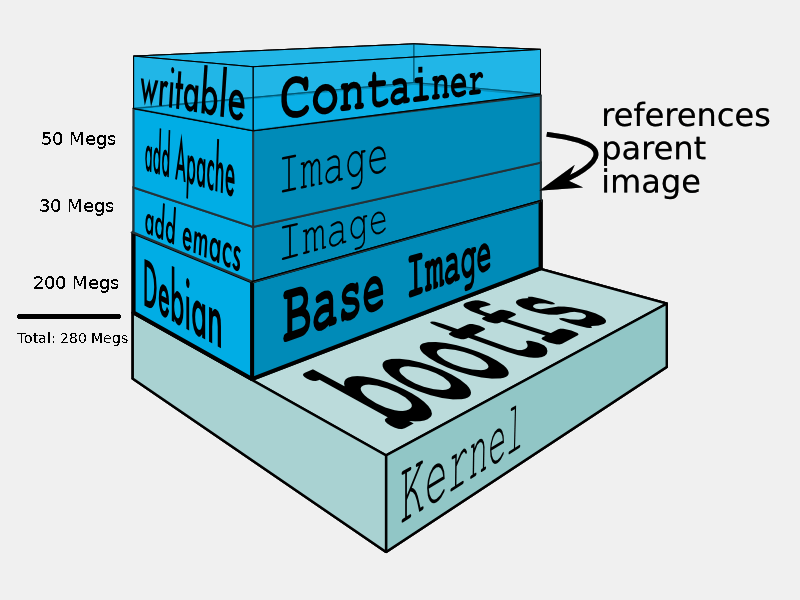

# Description

Comme toujours avant de voir le côté technique prenons le temps de combien où nous désirons aller. Depuis quelques temps nous avons vue l'utilisation de docker, que se soit des formations dockers pure où lors de la présentation de logiciel. Soyons honnête depuis que docker est disponible ceci à bien changé nos vie , d'administrateur , de développeur, d'utilisateur qui veut tester une application , ... 

Tranquillement nous avons mis en place des outils de autour pour s'amuser , heu non pas uniquement, mais pour mieux gérer nos conteneurs . Tranquillement nous arrivons au point d'avoir un lieu centraliser nous permettant de stocker nos images. 

Rapidement on va juste clarifier le vocabulaire, car bien souvent nous utilisons le terme docker comme un abus de langage . Il y a 2 type de conteneur :

* **Image** (docker image) : Ceci est le produit de la définition du fichier __Dockerfile__ qui permet d'indiquer comment construire l'image.
* **Conteneur** (docker conteneur): Ceci est le "docker" , bien souvent les personnes nomment le conteneur en exécution "docker", ceci est bien entendu un abus de langage, mais je suis le premier à le faire :P. Un conteneur est donc une image qui fut initialisé donc en exécution ou en arrêt. 

Si nous reprenons la représentation graphique des couches (__layers__) nous voyons clairement la distinction :


Donc désolé pour cette clarification, mais vous savez comment ça se passe on veut parfois allé un peu vite et nous oublions de revenir à la base.

## Pourquoi un Docker Registry

Si vous êtes un développeur vous avez probablement un dépôt d'artefacts que vous utilisez déjà , que nous parlions de [Nexus de sonartype](https://www.sonatype.com/nexus-repository-sonatype) ou [Artefactory](https://www.artefactorylab.com/) , l'idée et l'objectif du docker registry est le même . 
Bon j'entends les administrateurs ou les nouveaux ce dire __Woww__ c'est quoi qui veut dire , clarifier c'est quoi un dépôt d'artefacts et par le fait même le docker registry.

### C'est quoi un Docker registry

Lors du développement logiciel, l'équipe va utiliser plusieurs modules ou librairie qui va composer l'application. L'objectif d'un dépôt d'artefacts est que si la librairie X version 1.2.1 fut déjà compilée, et qu'un développeur à besoin de compiler un bout de code qui à cette librairies comme dépendance au lieu de la recompiler il va la récupérer depuis le dépôt d'artefacts.
Bien entendu ceci s'applique pour l'ensemble des librairies nous pouvons donc passé le temps de compilation à quelques minutes au lieu de recompilé l'ensemble de l'application. 

Le dépôt d'artefact nous permettra aussi de conserver une historique des produits fini, tous comme le contrôleur de révision ( GIT, SVN, ...) nous permet de conserver l'historique des fichiers sources. 
Selon votre niveau de maturité, il y aura en plus des testes de validation ( Unit test, Moc , ... ) réalisé sur les librairies avant d'être transmise au dépôt d'artefacts augmentant le niveau de fiabilité du contenu. 

**Ok, Ok** ,  nous arrivons au docker registry , ça sera pas long :P. Je veux simplement vous démontrer qu'il n'y a rien de nouveau , le concept est déjà en place depuis bien longtemps. De plus nous voyons que le docker registry est dans un tout cohérent , dans la phase de développement. 

Le docker registry est comme une bibliothèque qui contient l'ensemble des **docker images** que vous avez déjà compilé et poussez vers le registry. Si vous désirez avoir un exemple de registry : [hub.docker.com](https://hub.docker.com/) , vous l'utilisez déjà en plus :D . Ce registry publique vous permet de faire des recherches, d'extraire une images pour une version spécifique (__tag__) , vous pouvez même pousser / stocker des images "gratuitement". 

### Pourquoi utiliser un docker registry 

La question est toujours est-ce que l'effort de mettre en place ce système aura un retour sur l'effort .

####  UN Docker host

Si vous n'utilisez qu'une machine avec docker sur laquelle vous réalisez vos générations d'images et que l'exécution des conteneurs est réalisé sur la même machine , vous prenez pas la tête, vous n'en n'avez pas réellement besoin. En effet , vous avez un docker registry localement intégrer pour preuve que vous tapez la commande :

```bash
$ docker images 
```

Le système vous liste les images disponible localement , avec les tag , lors de la compilation d'un fichier Dockerfile l'image ce retrouve et vous avez aussi un copie des conteneurs que vous avez télécharger avec la commande : __docker pull__.


####  DEUX Docker host et plus

Si nous prenons le cas avec plusieurs docker host , si vous désirez avoir le même image docker sur 2 machines vous avez 2 possibilité :

1. Recompiler l'image sur la deuxième machine à partir du Dockerfile et autre dépendance ...
2. Utiliser la commande __docker save__ et __docker load__ pour exporté dans un tar votre conteneur , faire le transfert sur l'autre machine et le recharger.

L'option 1 est la plus souvent utilisé , car on se dit que j'ai ma définition dans mon dépôt que je suis en mesure de refaire exactement la même image, car je vais me placer sur le commit id approprié du moment. Ceci est FAUX !! Vous avez probablement des  installations de logiciel présent dans le Dockerfile, que vous utilisez **pip** , **apt-get** , **npm** , ... Comme vous ne spécifiez pas plus que moi la version exacte du logiciel vous risquez d'avoir un delta. Est-ce grave ? Certainement PAS jusqu'à ce qu'il y ai un problème est le doute arrive , autre point le principe docker qui nous permet de déployer une version de l'application avec l'ensemble des requis et de garantir que ceci est la même partout est un peu cassé. ( désolé pour la phrase a reécrire )

L'option 2 vous permettra de conserver l'intégrité des applications, en effet l'instruction __docker save__ exportera l'image exact en __tar__. Vous n'aurez qu'à la transférer vers l'autre serveur et faire un __docker load__ ainsi vous aurez exactement la même image du conteneur. Maintenant le problème avec cette méthode , si vous n'avez que 2 docker hosts c'est pas trop mal , malheureusement si votre image fait 300 Megs, il y aura 300 Megs de transféré sur le réseau. Le système de __docker save__ et __docker load__ n'utilise pas la fonctionnalité des couches (__layers__) , explication dans quelques minutes.


####  Avec un docker registry 

Nous avons déjà présenté c'est quoi un docker registry , je ne reviendrai donc pas sur la définition , prenons ne temps de voir le coté pratique d'avoir ce système . L'ensemble de vos machines auront accès à la bibliothèque d'image que vous avez créé dans le passé, bien entendu l'ensemble des versions (__tag__). 

Lors de la récupération ou l'envoie d'une image avec le docker registry vous profiterez du gain des couches (__layers__) en d'autre mots si nous reprenons l'exemple de l'image suivante, qui est une image de 280 Megs au total  : 



Prenons l'hypothèse que nous n'avons modifier QUE la couche Apache , changement de configuration ou nouvelle version d'Apache . Lors de la récupération de cette nouvelle image au lieu de faire le transfert des 280 Megs le système ne fera la récupération que de 50 Megs. Nous avons une optimisation significatif du temps de transfert , donc le conteneur sera disponible beaucoup plus rapidement ! 
Ceci est donc bien différent que lors de l'utilisation des instructions __docker save__ et __docker load__. 

Grâce à l'utilisation d'un docker registry vous serez aussi en mesure de simplement faire l'instruction : __docker-compose up__ peu importe où est votre conteneur de référence que ce soit sur hub.docker.com ou sur votre registry personnel. Vous n'aurez plus à vous soucier de connaître l'origine. De plus si vous utilisez le __tag__ latest pour identifier la version courante vous aurez la dernière version depuis le registry vous n'aurez plus à regardé les ID des couches (__layers__) pour savoir si cette version latest est vraiment la dernière sur ce système . :D 


### Pourquoi ne pas utiliser hub.docker.com

# Référence :

* Description :
    * https://blog.codeship.com/overview-of-docker-registries/

* Autre :
    * https://github.com/SUSE/Portus/tree/master/examples
    * http://port.us.org/docs/setups/2_containerized.html

