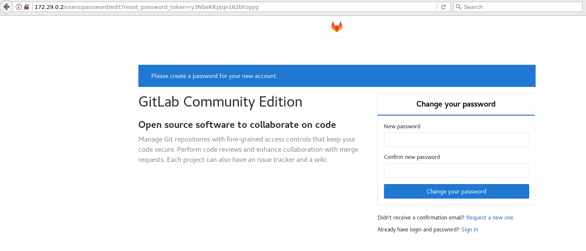
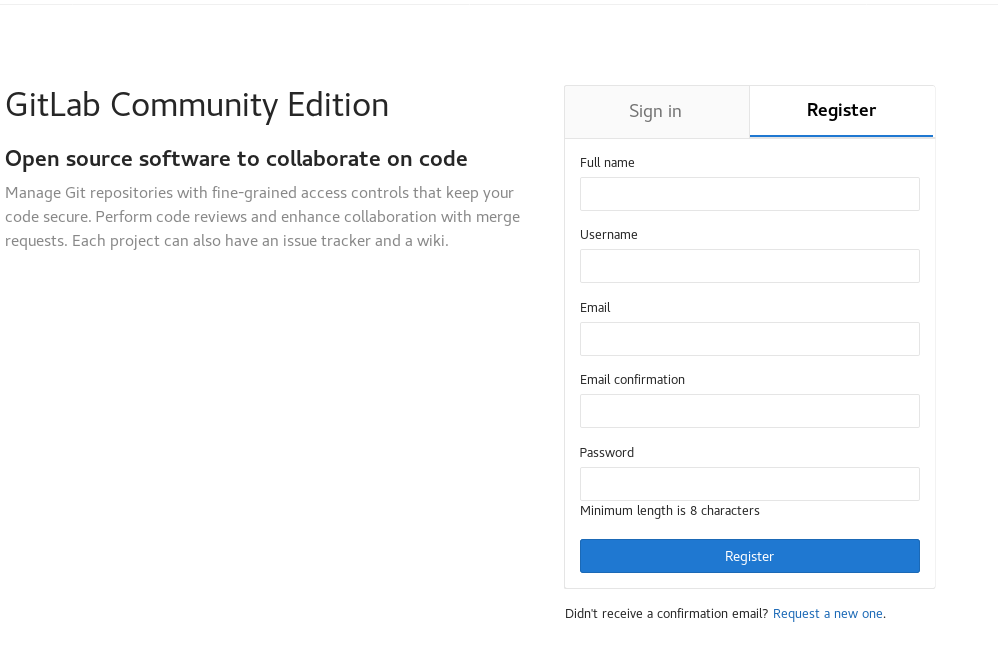
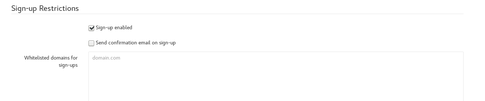
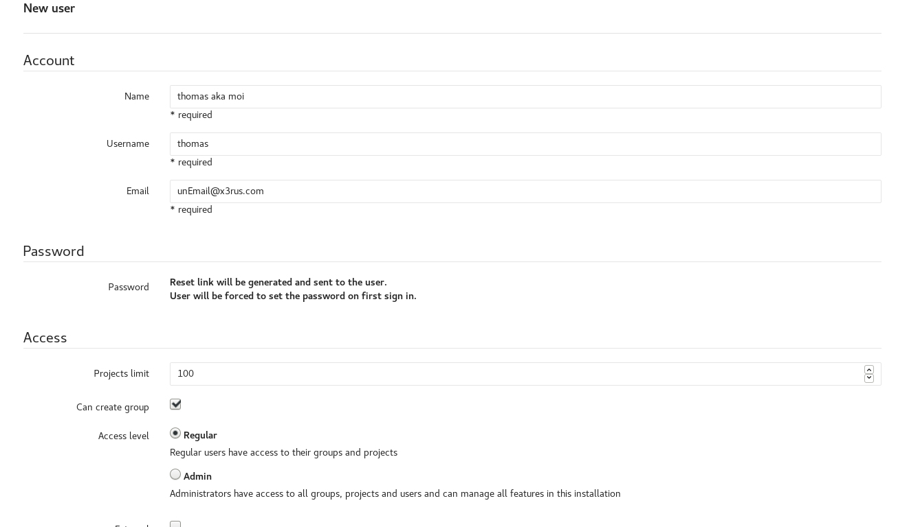
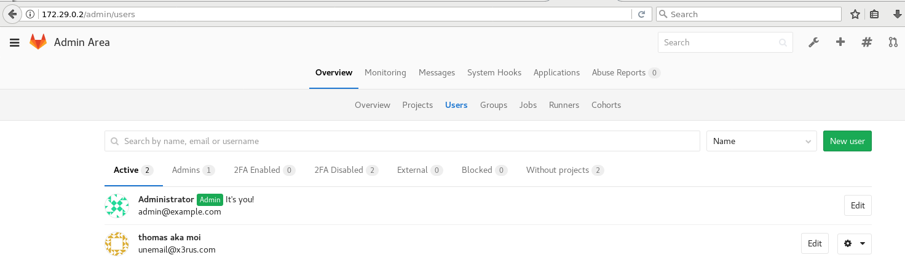
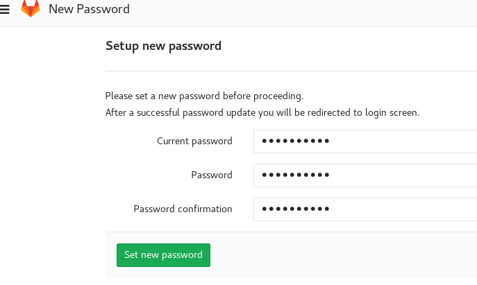
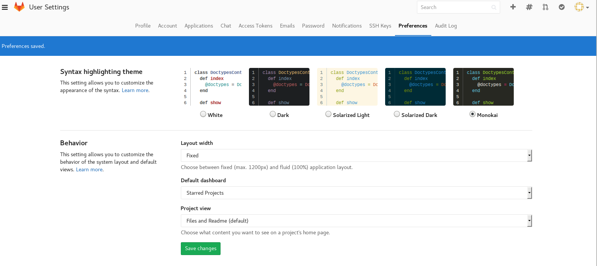

# Description

**GitLab Community Edition** est un logiciel libre, sous [licence MIT](https://fr.wikipedia.org/wiki/Licence_MIT). Il s'agit d'une [forge](https://fr.wikipedia.org/wiki/Forge_(informatique)) fonctionnant sur GNU/Linux (Debian, Redhat…).

À l'origine, le produit était nommé **GitLab**. En juillet 2013, le produit est scindé en deux : __GitLab Community Edition__ et __GitLab Enterprise Edition__. Si __GitLab CE__ reste un logiciel libre, __GitLab EE__ passe sous licence propriétaire en février 2014 et contient des fonctionnalités non présentes dans la version CE.

**GitLab CE** est produit par __GitLab B.V.__ puis __GitLab Inc.__ avec un modèle de développement open core.

Site web : [https://about.gitlab.com/](https://about.gitlab.com/)
Site de documentation : [https://docs.gitlab.com/ce/](https://docs.gitlab.com/ce/)

Bon comme toujours on va se concentrer sur la version **LIBRE** , je vous laisserai explorer les fonctionnalités en plus disponible dans la version __commercial__

Vous n'êtes pas obligé d'installer un serveur GitLab si vous désirez l'utiliser vous pouvez aussi vous enregistrer sur le site de gitlab vous créer un compte et l'utiliser comme __GitHub__!

## Fonctionnalité 

Voici la liste des fonctionnalités disponible avec **GitLab**  : [https://about.gitlab.com/features/](https://about.gitlab.com/features/)

Comme nous pouvons voir la solution est **COMPLÈTE**

## Pourquoi GitLab et non PAS GitHub 

__GitHub__ est très bien nous n'enlèverons jamais la puissance du système cependant voici quelques avantage de __GitLab__ :

* GitLab peut être déployé sur VOS serveurs librement
* GitLab permet d'avoir des dépôts privés, GitHub vous permet uniquement d'avoir des dépôts publique gratuitement.


# Installation 

Comme nous aimons dockers l'installation sera réalisé avec docker, honnêtement comme c'est un logiciel __ruby__ c'est assez ennuyant à mettre en place , puis le conteneur fonctionne TELLEMENT bien :D .

Donc nous allons utiliser le fichier de [docker-compose.yml](./docker/docker-compose-v1.yml) :

```
version: '2'
services:
    gitlab:
        image: 'gitlab/gitlab-ce:latest'
    #    restart: always
        container_name : 'x3-gitlab-f'
        hostname: git.training.x3rus.com
        environment:
            TZ: America/Montreal
            GITLAB_OMNIBUS_CONFIG: |
                gitlab_rails['time_zone'] = 'America/Montreal'
                gitlab_rails['gitlab_email_from'] = 'noreply@x3rus.com'
                gitlab_rails['manage_backup_path'] = true
                gitlab_rails['backup_path'] = "/var/opt/gitlab/backups"
                gitlab_rails['backup_archive_permissions'] = 0640 
                gitlab_rails['backup_keep_time'] = 604800
                gitlab_rails['smtp_enable'] = true
        volumes:
            - '/srv/docker/x3-gitlab-f/gitlab/etc:/etc/gitlab'
            - '/srv/docker/x3-gitlab-f/gitlab/logs:/var/log/gitlab'
            - '/srv/docker/x3-gitlab-f/gitlab/data/:/var/opt/gitlab'

```

Vous avez une documentation complète disponible à ici [https://docs.gitlab.com/omnibus/docker/README.html](https://docs.gitlab.com/omnibus/docker/README.html).

L'ensemble de la configuration de gitlab sera initialisé grâce au paramètre définie dans la variable **GITLAB\_OMNIBUS\_CONFIG** :
* Le fuseaux horaire 
* L'adresse de courriel de provenance
* la gestion des sauvegarde
* Permission et rétention des sauvegardes

Comme vous pouvez aussi le constater j'ai quelques répertoire que j'ai exporter du conteneur __gitlab__ , en fait le répertoire **/etc/gitlab** ne serait pas obligatoire , cependant ceci était plus facile pour l'environnement de production pour inclure mon certificat SSL et clé . J'ai aussi voulu conserver mes logs en dehors du conteneur et bien entendu mes données pour les moments de mise à jour du conteneur.

* Donc Démarrage en arrière plan et visualisation des logs

```bash
$ docker-compose up -d && docker-compose logs -f gitlab
Creating network "docker_default" with the default driver
Creating x3-gitlab-f                                                               
Attaching to x3-gitlab-f                                                           
x3-gitlab-f | Thank you for using GitLab Docker Image!
x3-gitlab-f | Current version: gitlab-ce=9.2.5-ce.0                                         
x3-gitlab-f |                              
[ ... ]
x3-gitlab-f | Configuring GitLab...
x3-gitlab-f | 
x3-gitlab-f | 
x3-gitlab-f |   * Moving existing certificates found in /opt/gitlab/embedded/ssl/certs
x3-gitlab-f | 
x3-gitlab-f |   * Symlinking existing certificates found in /etc/gitlab/trusted-certs

[ ... ça prend un peu de temps ... ]
x3-gitlab-f | gitlab Reconfigured!                                                                                                                        
x3-gitlab-f | The latest version 9.6.1 is already running, nothing to do Checking for an omnibus managed postgresql: OK                                    
Checking if we already upgraded: OK                                                                                             
x3-gitlab-f | ==> /var/log/gitlab/redis-exporter/current <==
[ ... ]
```

* Nous allons sur à l'URL de conteneur en __http__ nous devrons définir le mot de passe de l'administrateur (**root**)



* Par la suite s'authentifier avec le compte **root**, nous avons donc un environnement fonctionnel.

# Configuration 

Configuration de l'environnement **gitlab** , je n'ai pas la prétention d'être un expert, mon objectif est de partager avec vous ma connaissance et ainsi vous faire gagner du temps . Idéalement vous pointer quelques fonctionnalités, que vous n'utilisez pas encore et qui sont vraiment agréable.

L'objectif est principalement une couverture utilisateur avec un peu d'administration.

## Accès au service par les utilisateurs

Premièrement nous allons créer un utilisateur afin de travailler avec ce dernier , comme toujours je n'utilise JAMAIS le compte **root**  sauf quand ceci est requis. Ceci est bien entendu pour des question de sécurité .

Vous l'avez peut-être remarqué par defaut les utilisateurs peuvent se créer eux même des comptes 



Personnellement, j'ai désactivé cette option, car j'aime avoir le contrôle de mes utilisateurs :P , oui je partage mes scripts , etc mais je veux conserver le contrôle :D.

### Désactivation de l'enregistrement autonome des utilisateurs 

* Établir une connexion comme **root** , cliquez sur la clé anglaise puis sélectionnez **setting** 


* Descendez et décocher l'option **sign-up enable**



### Création d'un utilisateur

* Toujours comme administrateur **root**  et dans la section __admin__ , vous avez le nombre d'utilisateur actuel et un bouton **new user** disponible

* Voici le résultat quand on définie un utilisateur :



Comme vous pouvez le constater , vous ne définissez pas le mot de passe de l'utilisateur ce dernier recevra par courriel un lien qu'il pourra suivre afin définir lui même sont mot de passe.

Dans notre configuration actuelle le système ne sera pas en mesure de transmettre le courriel car le serveur de relais n'est pas définie et ma machine n'est pas autorisée à transmettre un courriel directement sur Internet. Ceci va nous offrir l'occasion de voir comment réinitialiser un mot de passe :D


### Réinitialisation d'un mot de passe utilisateur

Toujours comme administrateur , nous éditons l'utilisateur et nous pourrons changer le mot de passe.



Et voilà :D

Quand l'utilisateur établira une connexion il devra réinitialisé sont mot de passe 



# Utilisation de gitlab (Utilisateur)

Nous reviendrons éventuellement sur la configuration du service gitlab , mais avant de voir les possibilités voyons l'utilisation simple par la suite nous allons nous créer des "besoins" :P.

## Définition des préférence 

Lors de la première authentification vous aurez le choix de définir vos préférences... Je sais c'est un détail , mais quand c beau comme on l'aime c'est MIEUX :P , on a plus envie de l'utiliser .



