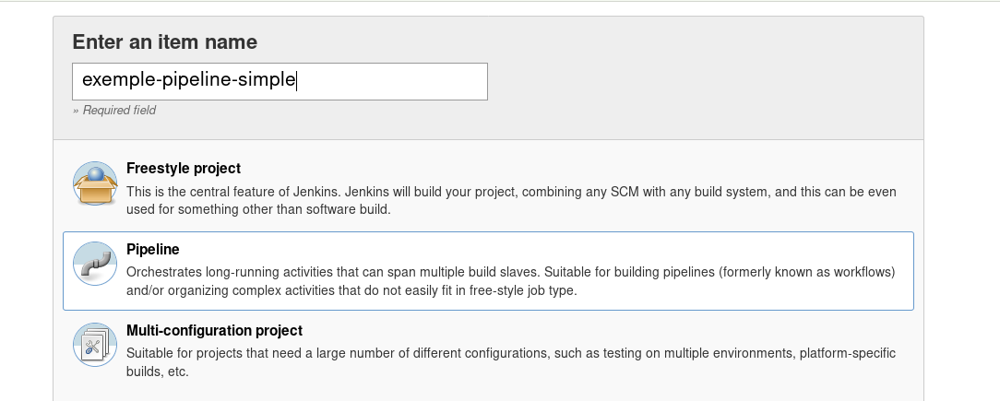
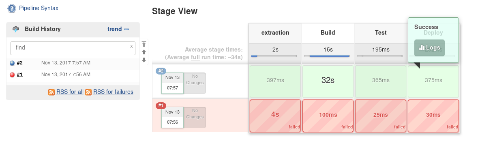
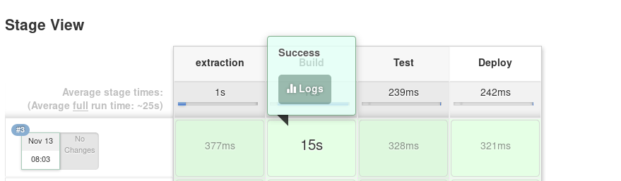
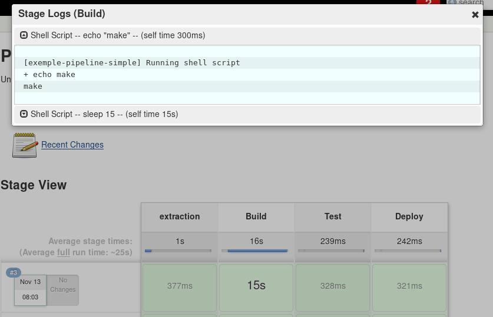

# Jenkins PipeLine et Docker

Lors de la présentation de Jenkins nous avons fait une démonstration de l'outil je dirait de manière classique , nous avons mis en place Jenkins et définie des slaves que nous avons configurer. Dans les slaves nous avions permis l'utilisation de Docker grâce au commande **docker \*** , cependant nos conteneurs avec la fonctionnalité docker avait un problème. Nous avions notre conteneur en exécution continuel , alors que l'avantage du système de conteneur est d'avoir une démarrage des services au besoin. Nous allons donc voir comment modifier notre configuration afin de permettre que ceci soit plus dynamique selon le besoin . En d'autre mot suivre les meilleurs pratique actuellement. 

Avant de voir ce coté du démarrage dynamique des conteneurs , j'aimerai que l'on voit le concept de Pipeline qui est aussi la nouvelle mode de configuration de Jenkins ... allé n'attendons plus c'est PARTIE !!!!

Référence de documentation : 

* https://jenkins.io/doc/book/pipeline/
* a revalider dans le temps
    * https://dzone.com/articles/jenkins-pipeline-plugin-tutorial

## Avant de débuter

Avant de débuter la configuration nous allons faire 2 choses .

1. Préparer notre environnement de travail 
2. Établir le cas d'utilisation 

Je fais la distinction entre les 2 , ceci vous permettra de vous organiser tout seul si finalement le cas que je propose ne vous intéresse pas :P .

### Préparation de l'environnement (Minimal)

Oui malheureusement pour pouvoir faire tous ça faut d'abord ce préparer , comme toujours nous allons utiliser Docker pour l'exercice , je vas passer très très rapidement sur ce point. Je vous invite à consulter la [première session sur Jenkins](../jenkins/01-presentation.md) pour avoir l'ensemble des instructions. 

En fait j'aurais réutilisé le setup de la dernière fois mais j'ai détruit l'ensemble des volumes créer donc ... pas le choix de reprendre. Nous allons mettre 3 conteneurs :

* Jenkins :D
* Un slave Jenkins avec le support de dockers actif en permanence , nous utiliserons les instructions docker run , docker-compose , ... Pour initialisé les conteneur. Nous verrons par la suite l'autre méthode pour avoir quelque chose de plus dynamique
* un serveur gitlab , vous pouvez utilisez le votre libre à vous, voir github , mon objectif est d'avoir un écosystème complet fonctionnel avec peu de dépendance externe.

Le fichier docker-compose est disponible : [dockers/docker-compose.yml](./dockers/docker-compose-v1.yml)

Avant de démarrer le conteneur je vais créer le répertoire :

```bash
$ sudo mkdir -p /srv/docker/x3-jenkinsWithPipe-f/jenkins-data
$ sudo chown 1000:1000 /srv/docker/x3-jenkinsWithPipe-f/jenkins-data
```

Démarrons le conteneur jenkins nous devrons refaire la configuration initialisé en mettant en place les plugins de base , ... Tous ça fut couvert dans le première session , je vais aussi faire la configuration du gitlab couvert lors de la [présentation de gitlab](../gitlab/01-presentation.md)

Étapes réalisées :

1. Setup initial jenkins avec plugins recommandés
2. Setup initial Gitlab root (mot de passe par défaut) 
3. Création d'un utilisateur dans gitlab avec possibilité de créer des projets...
4. Configuration du slave, comme ceci est peut-être moins évident un peu d'information
    * Vous avez la clé privé du slave disponible dans le fichier [data/jenkins-nodes_rsa](./data/jenkins-nodes_rsa)
    * J'ai aussi réalisé une copie d'écran [01-jenkins-setup-slave-dck01.png](./imgs/01-jenkins-setup-slave-dck01.png)


### Cas d'utilisation

Je vais reprendre le cas utilisé lors de la présentation de Jenkins , en d'autre mot le cas de :

1. la compilation d'un conteneur **docker** 
2. La validation si un conteneur doit être compiler 
3. La compilation de ce dernier
4. La validation du conteneur 
5. Pousser le conteneur dans le __docker registry__ \[Ajout comparativement à la session passé\]
6. Possibilité de démarrer le conteneur sur un __docker host__ \[Ajout comparativement à la session passé\]

Pour rappel mon dépôt git contenant la définition de mes conteneurs n'est pas idéal , j'ai un dépôt pour l'ensemble des mes dockers , il serait plus adéquat d'avoir un projet par conteneur. Pour le moment je garde cette organisation et tricote autour. 

Comme toujours nous avancerons par phase :

1. Extraction du dépôt , compilation du conteneur identifié en paramètre (nom du répertoire) , processus de validation de ce dernier.
2. Reprise des opérations de la **phase 1**  plus , validation du requis de compilation , pousser l'imagine du conteneur dans le __docker registry__ 
3. Démarrage du service sur le docker host.

### Suite de la préparation avec le cas d'utilisation

Bon bien entendu nous allons avoir besoin dans un premier temps de la configuration de notre Gitlab afin d'être en mesure d'extraire le code source. 
Bien entendu vous pouvez toujours utiliser Github pour l'exercice , comme toujours l'objectif est d'être autonome et maître de notre environnement Github est un service gratuit mais pas libre. Vous ne pouvez pas l'avoir en service hébergé à l'interne et il y a des coûts pour fermer l'accès au code. 

J'ai donc ( Pour les informations sur la configuration gitlab , j'ai une formation sur le sujet : [Gitlab Formation](../gitlab/01-presentation.md):

1. Créé MON utilisateur 
2. Créer un groupe Devops 
3. Création du projet dockers contenant 3 répertoires avec des conteneurs

Une copie d'écran disponible ici : [02-setup-gitlab-depot-conteneur.png](./imgs/02-setup-gitlab-depot-conteneur.png) 

Le dépôt est aussi disponible sur Github : [training-jenkins-dockers-pipeline](https://github.com/x3rus/training-jenkins-dockers-pipeline)

En plus de mes accès je vais aussi définir un utilisateur "robot" qui pourra extraire et écrire dans le dépôt. Son nom sera "BobLeRobot" 
Encore une fois l'ensemble des ces opérations furent couvert dans la formation initial de Jenkins lors de l'intégration avec GitLab


## Les Pipelines avec Jenkins

Nous avons vue lors des sessions passées l'utilisation de Jenkins avec le système de conteneurs , ceci fonctionnait très bien cependant comme nous avons pu le voir la segmentation des actions n'est pas obligatoirement claire en lisant le logs de résultat. Si nous avions une équipe de développement , de QA ou des personnes en charge de l'infrastructure quand il y a une erreur une personne doit être en mesure d'analyser le log pour le transmettre à la bonne équipe. Vous me répondrez probablement, mais ce n'est pas la tâches du DevOps de faire ça , heu ... oui et non . Nous pourrions le dire ainsi c'est le DevOps à le faire puis de transmettre l'information. Mais un bon DevOps c'est quoi , c'est une personne super paresseuse , excusez on dit habituellement une personne qui optimise sont temps :P.

Pour optimiser notre temps l'idée est de réussir à aviser les bonnes personnes pour la bonne action ! Notre problème aujourd'hui est que nous avons une tâches ("build") qui réalise l'ensemble de l'opération nous pouvons transmettre un courriel à la fin mais à qui ? QA , Dev, Infra , Ops , ... 

Aujourd'hui ça va on fait le build et la validation , mais que ce passerez t'il si nous avions :

* la compilation de l'application
* La création du conteneur
* La réalisation de la validation
* Le déploiement sur un environnement de test d'intégration
* La deuxième passe de test

Comment si ceci est dans 1 build informer les bonnes personnes. Jenkins offre traditionnellement le mécanisme qui nous permet d'appeler d'autre tâches à la fin d'un tâches et de définir des conditions . Cependant si vous l'avez déjà utilisé dans le passez vous savez comme moi que ce n'est pas simple de visualiser le statu de l'ensemble des tâches de d'identifier l'imbrication des ces dernières pour le commun des mortelles.

Le concept de pipe fut mis en place afin de facilité le mécanisme. Nous allons donc convertir notre mécanisme avec les pipes.


### Présentation du concept de Pipeline

TODO : à compléter

* https://jenkins.io/doc/book/pipeline/
* https://jenkins.io/doc/book/pipeline/syntax
* https://jenkins.io/doc/pipeline/steps/

### Un exemple simple avant la démonstration complexe

Voici un petit exemple de mise en place d'un pipeline , l'objectif est simplement de démontré l'utilisation avec les steps sans aucune complexité , dans un second temps nous mettrons l'ensemble du système de **SCM**.

* Création de la tâches



* Voici la configuration mise en place pour le **pipeline** :

```
pipeline {
    
    agent { node { label 'docker' } }
    
    stages {
        stage('extraction') { 
            steps { 
                sh 'echo " Ze extraction" ' 
            }
        }
        stage('Build') { 
            steps { 
                sh 'echo "make" '
                sh 'sleep 30' 
            }
        }
        stage('Test'){
            steps {
                sh 'echo "make check"'
            }
        }
        stage('Deploy') {
            steps {
                sh 'echo "make publish"'
            }
        }
    }
}
```

Explication rapide :

1. **[agent](https://jenkins.io/doc/book/pipeline/syntax/#agent)** : Je sélectionne un node avec l'étiquette __docker__
2. **[stages](https://jenkins.io/doc/book/pipeline/syntax/#stages)** : Je définie que nous allons avoir plusieurs étapes 
3. **[stage](https://jenkins.io/doc/book/pipeline/syntax/#stage)** : Définition des différentes groupe de tache "stage", comme nous voyons dans le stage Build il y a 2 étapes.
4. **[steps](https://jenkins.io/doc/book/pipeline/syntax/#steps)** : Permet de définir les étapes qui seront réalisé lors de ce stage.
5. **[sh](https://jenkins.io/doc/pipeline/steps/workflow-durable-task-step/#sh-shell-script)** : Permet d'exécuter un script lors de l'étape mais il existe énormément de méthode disponible : [listes de step disponible](https://jenkins.io/doc/pipeline/steps/) 

Voici le résultat , comme vous pouvez le voir j'ai fait une erreur lors de la première exécution :D : 

 

Ce qui est intéressant est que vous êtes en mesure de visualiser les logs d'une seule étapes , simplifiant l'analyse de la situation :



Ainsi que voir le détail :


