# Jenkins

## Présentation de Jenkins


En 2008 Jenkins devient LA solution pour l'intégration continue en remplacement de [CruiseControl](https://fr.wikipedia.org/wiki/CruiseControl). 

Le puis fort de Jenkins en plus de ça grande communauté est qu'il existe un nombre impressionnant de __plugins__ permettant d'étendre les fonctionnalités simple de l'outil.

Il est possible de lié Jenkins  avec __Subversion__ , __Git__ , et d'autre contrôleur de révision, il est possible de l'utiliser comme planificateur de tâche comme **cron** afin de réalisé des opérations périodique. Vous pouvez aussi lancer des exécutions à la demande ou utiliser des __webhook__ pour déclencher une opération par programmation. Nous allons couvrir quelque possibilité cependant telle que mentionné avec le nombre de plugins disponible les champs de possibilités sont nombreuses.

[Site web officiel de Jenkins](https://jenkins.io/). 

Que pouvons nous exécuter avec Jenkins ? 

* Des projets basés sur Apache Ant 
* Apache Maven 
* Des scripts arbitraires en shell Unix ou batch Windows. ( En d'autre mot N'IMPORTE QUOI :D ) 

L'application est développé en Java et sous [Licence MIT](https://fr.wikipedia.org/wiki/Licence_MIT)

## Architecture de Jenkins 

Avant de débuter avec l'installation voyons l'idée général du rôle de Jenkins et ça conception . 

Chaque tâche est une job, lors de l'exécution de la job nous exécutons un **build** , même si le résultat n'est QUE l'envoie d'un courriel ou le traitement de donnée, mais qu'aucune compilation n'est réalisé :D.

Jenkins fonctionne en mode master / slave :

* **Master** : reçoit les évènements que nous parlions d'évènement généré par le serveur Subversion, git, exécution d'un build manuellement par un utilisateur. Selon les critères saisie le système choisi un **slave** pour réaliser les opérations, nous verrons que nous utilisons les labels pour assigner des jobs au slave. Le serveur **master** contient l'ensemble des définitions **centralisé** contenant la description des opérations à faire ! Si tous les slaves sont déjà en utilisation le serveur va mettre en place un file d'attente.
* **Slave** : Le serveur slave est donc un agent du master, il réalisera l'opération demandé par le serveur Jenkins , bien entendu si le serveur Jenkins essaye d'exécuter une commande sur la machine elle doit être installé. Il est important donc d'avoir un __template__ , modèle pour que l'ensemble des serveurs slave est la même configuration. Comme Jenkins est développé en Java il est possible d'avoir des agents sur plusieurs type de système d'exploitation 

Voici une représentation graphique du fonctionnalité simple de Jenkins :

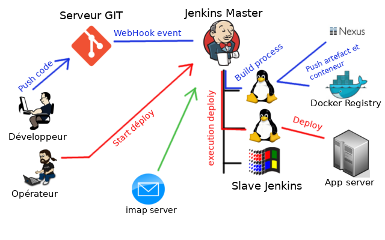

Dans la pratique le serveur Jenkins peut être aussi être utilisé comme slave, cependant ceci est limitatif autant en terme de puissance que des possibilités d'avoir plusieurs architecture et / ou des lieux de traitement à plusieurs endroits.

Telle que mentionné plus tôt le nombre de plugins sont impressionnant : [https://plugins.jenkins.io/](https://plugins.jenkins.io/)

## Installation de Jenkins 

Bon nous orientons surtout la formation sur la pratique donc débutons avec l'installation , honnêtement je suis super paresseux et depuis l'arrivée **docker** ça n'a pas arrangé les choses. En d'autre mot je suis un bon DevOps / sysadmin :D , la paresse est un art mais demande beaucoup de temps pour la mettre en place :D. Nous réaliserons donc l'installation avec un conteneur !!

### Installation avec Docker

Bon voilà le problème en ce moment avec **docker** et les images officiel parfois elle ne sont plus disponible :-/ , originalement il y avait [https://hub.docker.com/_/jenkins/](https://hub.docker.com/_/jenkins/) , mais si vous regardez la page il y a le message :

> DEPRECATED
> 
> This image has been deprecated in favor of the jenkins/jenkins:lts image provided and maintained by Jenkins Community as part of project's release process
> The images found here will receive no further updates after LTS 2.60.x. Please adjust your usage accordingly.

Donc nous devons nous tourner vers l'image : [https://hub.docker.com/r/jenkins/jenkins/](https://hub.docker.com/r/jenkins/jenkins/) , ceci est l'image suggérer par la [documentation officiel de jenkins](https://jenkins.io/doc/book/getting-started/installing/#docker) . Il est évident que ceci n'aide pas l'utilisateur de docker mais que voulez vous ... :-/

Pour les besoins de la démonstration je vais principalement utiliser le service de Jenkins en __standalone__ sans slave , je couvrirai plus la partie de l'ajout d'agent par la suite . 

Bien entendu nous utiliserons un fichier de **docker-compose.yml** pour partir du bon pied :D.

Donc définition du [docker-compose-v1.yml](./dockers/docker-compose-v1.yml):

```
version: '2'
services:
    jenkins:
        image: jenkins/jenkins
        container_name : 'x3-jenkins-f'
        hostname: jenkins.train.x3rus.com
        environment:
            - TZ=America/Montreal
        volumes:
            - "/srv/docker/x3-jenkins-f/jenkins-data:/var/jenkins_home"
        # ports:
            #- 8080:8080   # Web interface
            #- 50000:50000 # Build Executors
```

Bon rapidement même si maintenant on gère , mais pour les nouveaux on veut que tous le monde embarque :

* L'image : Le conteneur de référence original , ici celui fournit par la documentation de Jenkins , donc récupération depuis hub.docker.com
* container_name : Le nom lors de l'exécution sur le docker host
* hostname : Car on aime avoir un beau hostname ... :P
* environnement : Je définie que le conteneur à le fuseaux horaire de Montréal 
* Volumes : Comme nous désirons conserver les données de traitement du Jenkins en cas de crash du conteneur ou simplement une mise à jour il est important de le sortir du conteneur !!
* Ports : Ici je ne met aucune redirection de port pour l'adresse IP du docker host , car je n'utiliserai que l'IP du conteneur dans son réseau interne au système . Bien entendu si vous activé le conteneur Jenkins pour être interrogé depuis une autre machine vous devrez mettre en place cette redirection . 

C'est partie pour le démarrage du conteneur .... Avec un problème de permission : D.

```bash
$ docker-compose up
Starting x3-jenkins-f ... 
Starting x3-jenkins-f ... done
Attaching to x3-jenkins-f
x3-jenkins-f | touch: cannot touch '/var/jenkins_home/copy_reference_file.log': Permission denied
x3-jenkins-f | Can not write to /var/jenkins_home/copy_reference_file.log. Wrong volume permissions?
x3-jenkins-f exited with code 1

$ ls -ld /srv/docker/x3-jenkins-f/jenkins-data/
drwxr-xr-x 2 root root 4096 Aug 10 17:28 /srv/docker/x3-jenkins-f/jenkins-data/
```

Effectivement par défaut la création du répertoire est réalisé par l'utilisateur **root** alors que l'usager qui démarre le service à le UID 1000 ainsi que son groupe . Correction et on redémarre .

```bash
$ sudo chown  1000:1000 /srv/docker/x3-jenkins-f/jenkins-data/
$ docker-compose up                                                 
Starting x3-jenkins-f ...                                                      
Starting x3-jenkins-f ... done                                                 
Attaching to x3-jenkins-f                                                      
x3-jenkins-f | Running from: /usr/share/jenkins/jenkins.war                
x3-jenkins-f | webroot: EnvVars.masterEnvVars.get("JENKINS_HOME")              
x3-jenkins-f | Aug 10, 2017 5:35:30 PM Main deleteWinstoneTempContents                                                                                        
x3-jenkins-f | WARNING: Failed to delete the temporary Winstone file /tmp/winstone/jenkins.war 
x3-jenkins-f | Aug 10, 2017 5:35:30 PM org.eclipse.jetty.util.log.Log initialized 
x3-jenkins-f | INFO: Logging initialized @624ms to org.eclipse.jetty.util.log.JavaUtilLog
x3-jenkins-f | Aug 10, 2017 5:35:30 PM winstone.Logger logInternal          
[ .... ]
x3-jenkins-f | Jenkins initial setup is required. An admin user has been created and a password generated.
x3-jenkins-f | Please use the following password to proceed to installation:   
x3-jenkins-f |                         
x3-jenkins-f | 041688506d8b4f1484ff13ff9c0367ac                                
x3-jenkins-f |                         
x3-jenkins-f | This may also be found at: /var/jenkins_home/secrets/initialAdminPassword 
[ ... ]
x3-jenkins-f | Aug 10, 2017 5:35:42 PM hudson.model.AsyncPeriodicWork$1 run    
x3-jenkins-f | INFO: Finished Download metadata. 6,278 ms                      
x3-jenkins-f | --> setting agent port for jnlp                                 
x3-jenkins-f | --> setting agent port for jnlp... done 
```

Visualisation du conteneur :

```bash
$ docker ps
CONTAINER ID    IMAGE               COMMAND                  CREATED             STATUS          PORTS                 NAMES
459a6bc1985f    jenkins/jenkins     "/bin/tini -- /usr..."   9 minutes ago       Up 2 minutes    8080/tcp, 50000/tcp   x3-jenkins-f

$ docker inspect x3-jenkins-f | grep IPAddr
        "SecondaryIPAddresses": null,
            "IPAddress": "",
            "IPAddress": "172.31.0.2",

```

Quand nous allons sur le service : http://172.31.0.2:8080 , nous aurons ceci .

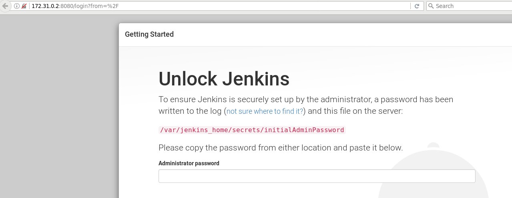 

Nous devrons dons saisir la clé qui fut affiché lors du démarrage , dans notre cas : 041688506d8b4f1484ff13ff9c0367ac 

Nous installerons les plugins suggérer quand on débutte ces toujours une bonne idée :P 

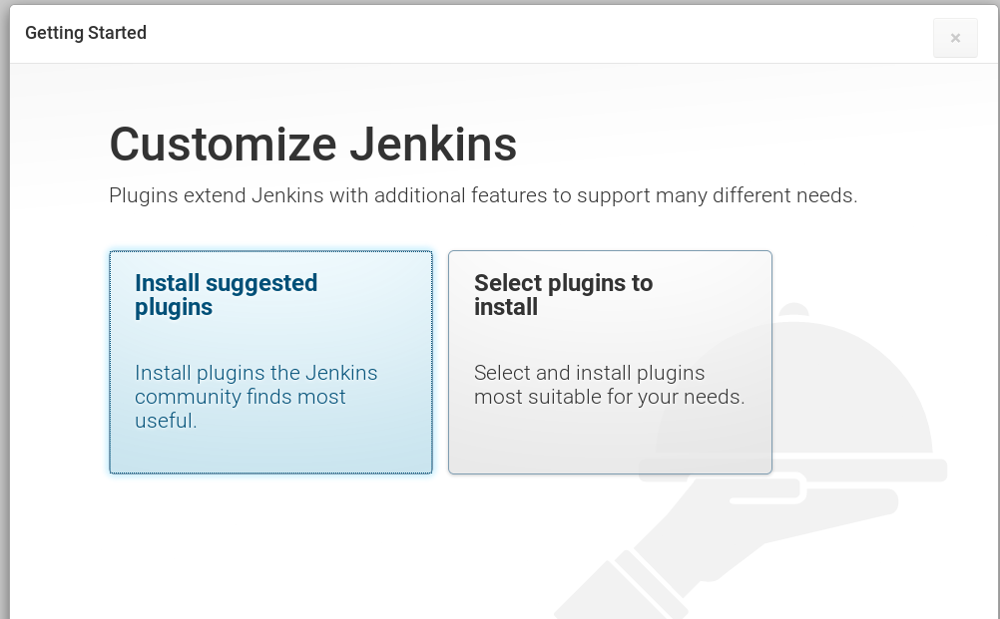

* Création du compte admin 

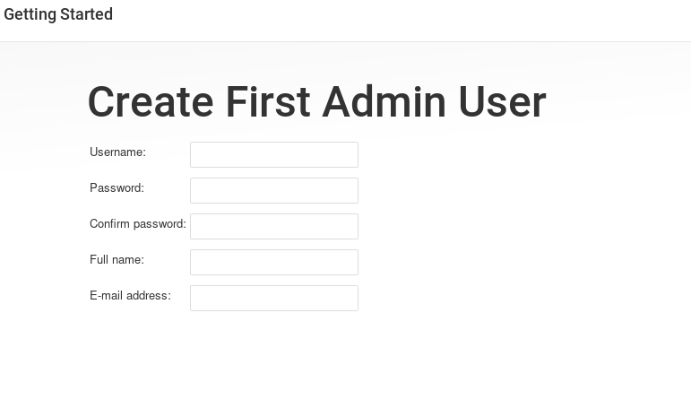

* Prêt à jouer :D 

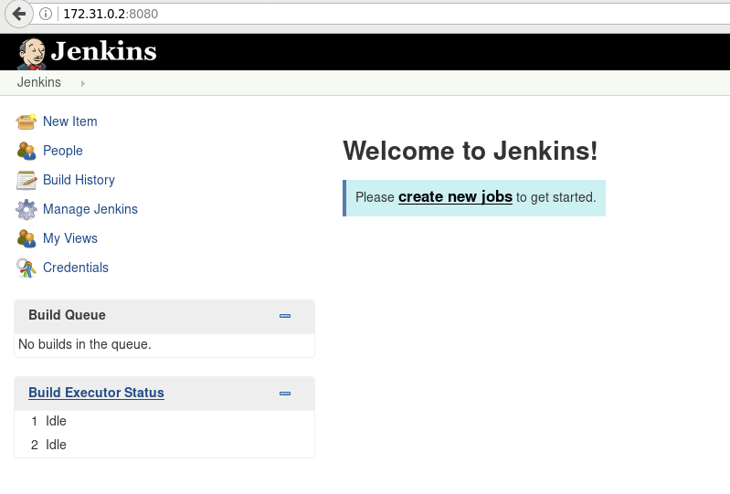

Cette installation est simpliste mais fonctionnel , avant de voir comment nous allons pouvoir améliorer notre déploiement pour que ce soit plus complet lors du démarrage prenons le temps de comprendre ce que nous allons vouloir d'inclus dans le déploiement. Nous couvrirons donc cette partie dans la section [Amélioration de l'installation](#Amélioration de l'installation).


## Tour d'horizon de Jenkins 


Si nous reprenons la page d'accueil du logiciel :

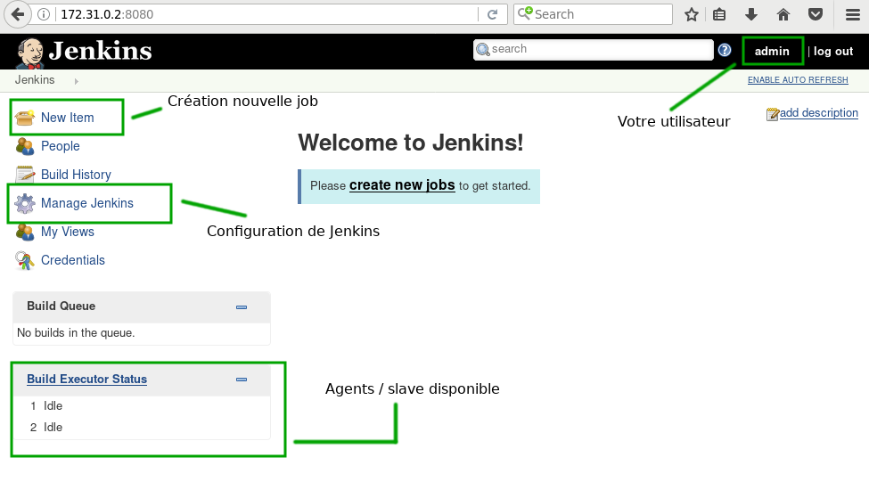

* **New Item** : Parfois on appel ça job , parfois item , j'ai voulu le mettre sous le projecteur
* **Manage Jenkins** : Même raison , quand on vient de déployer une application et que l'on veut voir les options de configuration disponible , le voir tous de suite c'est cool :D.
* **Agent / slave** :  Telle que mentionné pour le moment nous utiliserons le serveur Jenkins comme **orchestrateur** et serveur d'exécution , mais lorsque nous allons avoir d'autre slave nous aurons une plus grande liste !

Nous allons faire une petite job très simple pour voir le comportement et les options , avant de voir les paramètres disponible , je crois qu'une présentation de ce que peux faire Jenkins est idéal . Plusieurs d'entre vous connaisse déjà le produit ce sera une révision et pour les autres ça permettra de mettre tous le monde à peu près sur le même pied.

### Création d'un Tâche simple

* Cliquez sur **new item** .

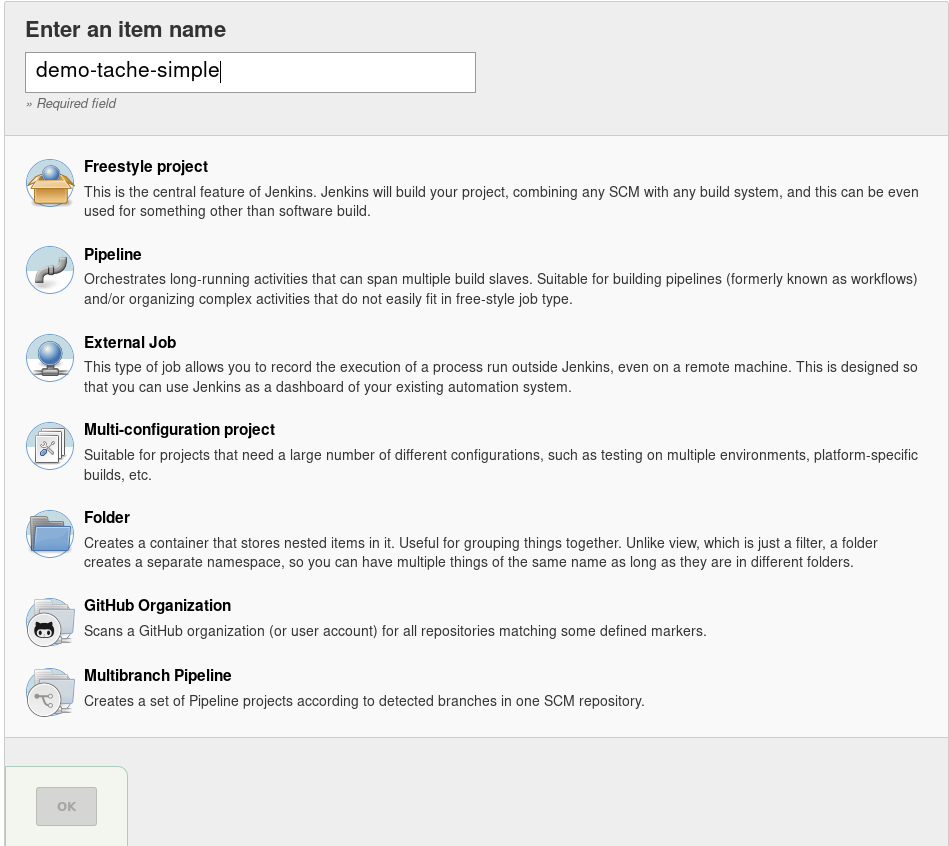

Vous devez choisir le type de projet que vous désirez , si vous avez déjà un serveur Jenkins dans votre organisation et que la liste et plus ou moins longue sachez que la mise en place de plugins change le comportement de Jenkins donc ne vous étonnez pas. Le premier exemple qui me vient à l'esprit est que vous aurez peut-être l'option de faire la création d'un projet **Maven** qui n'est pas lister ici. 

* Vous devez attribuer un nom à la job , ici : **demo-tache-simple**

Dans notre cas nous allons faire quelques chose des très simples , nous allons sélectionner **Freestyle project**, ceci nous laissera les mains libre pour faire **n'importe quoi** quelque chose de bien ou de mal :P. 

Une fois cliquez sur **OK** vous aurez l'ensemble des possibilités de configuration , si vous regardez la configuration est structuré par section :

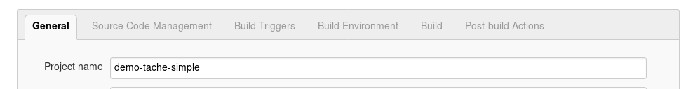

**RAPPEL** : il est probable que vous ayez plus ou moins de champs du à la mise en place de plugins ! (C'est le dernier avertissement :P)

Nous avons donc plusieurs section :

* **General** : Regroupant les informations global de la tâches , description et autre
* **Source code Management** : Il est possible , mais non obligatoire que votre job récupère depuis un dépôt Subversion, git , etc des scripts ou des données.
* **Build Triggers** : Ceci permet d'indiquer qu'est-ce qui déclenchera l'exécution de la tâche , nous y reviendrons 
* **Build Environments** : Spécification de l'environnement de build , nous y retrouverons des variables et autre permettant de définir le contexte du build.* **Build** : La tâche proprement dite , donc les commandes et instruction de la job
* **Post-build Action** : Définition de la tâche quand la job est terminé , nous verrons que nous allons pouvoir par exemple indiquer au système que si le build à bien fonctionné de poussé le résultat dans une voûte ou un docker registry ... 

Ce sont les grosses étapes d'une tâche Jenkins , regardons les en détail en réalisant un job. Je vous préviens ne je vais pas couvrir chaque petit option mais celle que je juge importante . De plus je pense que ce sera plus pertinent de réaliser une job et de la modifier en cours de route plutôt que de descendre la page et expliquer le fonctionnement. 

#### Au plus simple 

Nous allons laisser l'ensemble des options par défaut et modifier les paramètres et option au fur et à mesure de la découverte. 

Donc allons directement à l'étape de build , vous pouvez cliquer sur l'onglet en haut **build**.
Nous allons ajouter une étape , je vais sélectionner **Execute shell**, pour garder ça simple mais honnêtement c'est principalement ce que j'utilise.

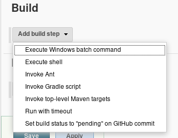

Et je vais mettre une petite job simple qui affiche l'heure et le type de CPU de la machine de build, si vous vous dites c'est null oui je sais mais je manque d'imagination . :P

Donc voici la commande :

```bash
$ cat /proc/cpuinfo  | grep 'model name'  | uniq
```

Et le résultat dans Jenkins :


On peut pas dire que c'est bien différent d'un script bash classique , nous avons l'interpréteur de commande au début et la / les commandes. Nous sauvegardons puis on se réjouit du résultat !

Il suffit de cliquer sur **Build NOW** .

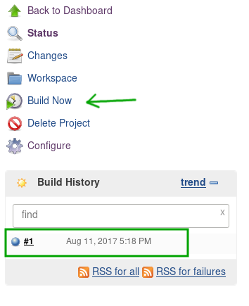

Nous cliquez sur le bouton et maintenant il y a dans la boite **build history** , le build __#1__, il faut sélectionner le build et cliquer sur console pour voir le résultat :

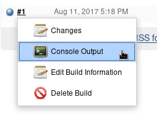

Et voilà le résultat 

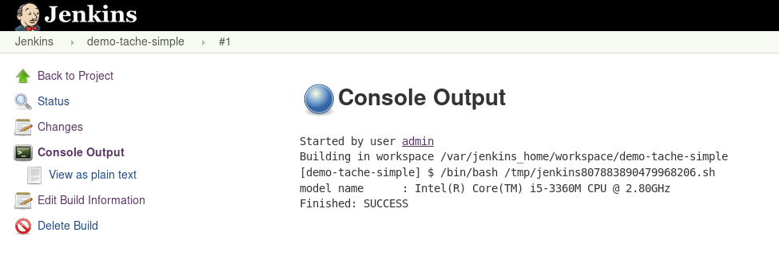 

Nous voyons donc le résultat , il pourrait être plus beau mais bon ... c'est exactement comme dans la console :D. Pas de panique la complexité arrive cependant le point important de cette partie est que n'importe quelle script devrais fonctionner si l'ensemble des commandes sont présente sur la machine où le build sera réalisé. 

En d'autre mot , si vous utilisez python3 et que ce dernier n'est pas présent sur la machine de build ça ne passera pas ... Je sais c'est étrange :P.


#### Du simple un peu dynamique

Bon c'est cool, mais bon vos scripts ne sont pas si statique , il y a toujours des paramètres à fournir puis personne ne veut écrire les valeurs en dure dans le script qui est fournit . Introduisons le concept de variables ... Nous retourne dans la section configuration ...

Dans la section **General** vous avez l'option **This project is parameterized** , vous allons donc pouvoir fournir des paramètres.

Nous allons pouvoir ajouter plusieurs type de paramètres :

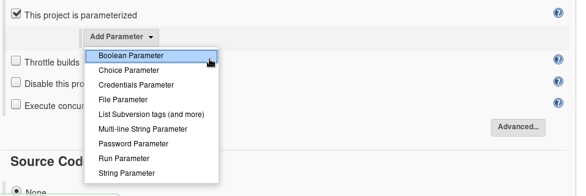

Dans mon cas je ne vais définir 2 type :

* **string** :  Nous allons écrire le résultat de l'opération dans un fichier qui sera passé en paramètre
* **boolean** : Juste pour en mettre un deuxième :P , qui indiquera si oui ou non on crée un fichier ou juste l'afficher à l'écran :D

Voici le résultat de la définition :

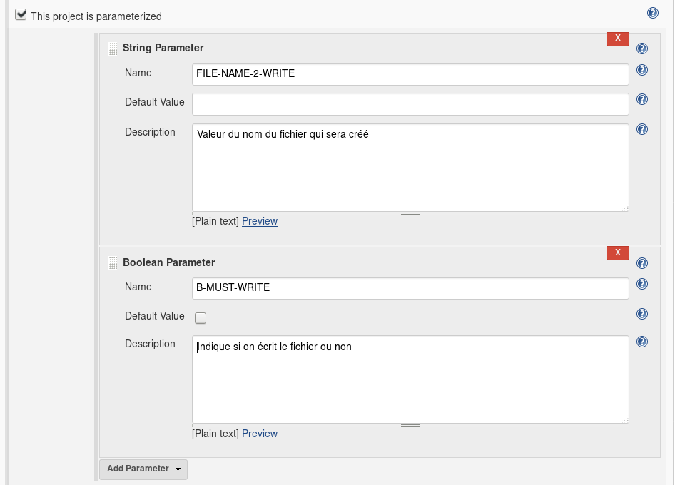

Et nous allons modifier le code pour les utiliser 


Voici le code :

```bash
 #!/bin/bash
 #
 # Description : un exemple de script
 #########################################

echo " debut script : "

echo "Valeur de B_MUST_WRITE : $B_MUST_WRITE "
echo "Valeur de FILE_NAME_2_WRITE : $FILE_NAME_2_WRITE "

if [ "$B_MUST_WRITE" == "false" ] ; then

    cat /proc/cpuinfo  | grep 'model name'  | uniq
else
    cat /proc/cpuinfo  | grep 'model name'  | uniq > $FILE_NAME_2_WRITE 
fi
``` 

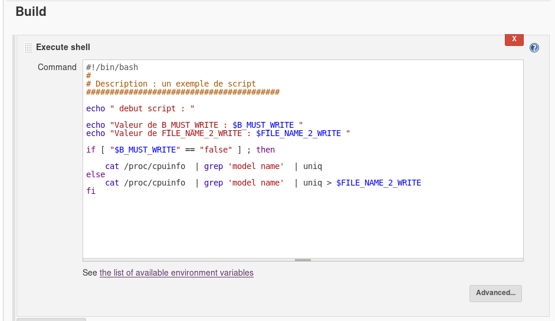

Le résultat lors de l'exécution :

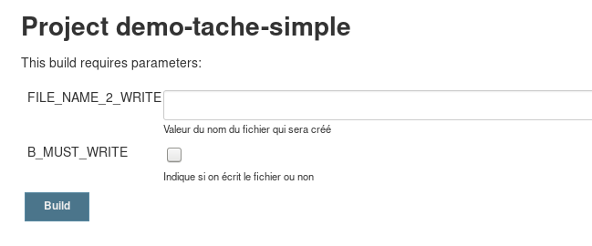

Comme vous pouvez le voir l'ensemble des arguments / paramètres fournit sont des variables d'environnement au script ce qui permet de faire la manipulation simplement. Jenkins offre plusieurs variables d'environnement , si vous regardez en bas de la boite pour saisir votre code vous avez le lien : __See the list of available environment variables__ en cliquant dessus vous aurez la liste . Nous y reviendrons avec un cas concret ...

#### Gestion du paramètre et visualisation de l'erreur

Pour terminer ce cas simple nous allons ajouter une validation pour le nom du fichier , je ne veux pas que les utilisateurs puisse définir un full __PATH__ avec des __/__ , sinon il risquerait de pouvoir définir un chemin d'un fichier système. Bon honnêtement j'exagère sur le niveau de risque, car le service Jenkins n'est pas exécuté comme **root**, mais bon pas toujours facile de trouver des exemples :P , a vous d'extrapoler pour votre usage.

Voici le résultat du nouveau code :

```bash
 #!/bin/bash
 #
 # Description : un exemple de script
 #########################################

echo " debut script : "

echo "Valeur de B_MUST_WRITE : $B_MUST_WRITE "
echo "Valeur de FILE_NAME_2_WRITE : $FILE_NAME_2_WRITE "

if [ "$B_MUST_WRITE" == "false" ] ; then

	cat /proc/cpuinfo  | grep 'model name'  | uniq
else
	
   	if echo $FILE_NAME_2_WRITE | grep -q '/' ; then
    	echo "Le nom du fichier ne peut pas conteneur de / "
        echo "c'est pour ne pas que vous ecriviez partout :P !!! "
    	exit 1
    else 
		cat /proc/cpuinfo  | grep 'model name'  | uniq > $FILE_NAME_2_WRITE 
    fi
fi
```

Rien de très compliqué si vous réalisez déjà un peu de __scripting__ , Si nous utilisons la job pour afficher à l'écran donc sans coché l'option d'écrire dans un fichier :

* Cas 1 : affichage à l'écran , pas de paramètre :
    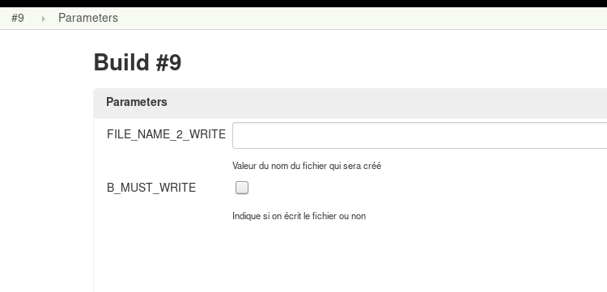
    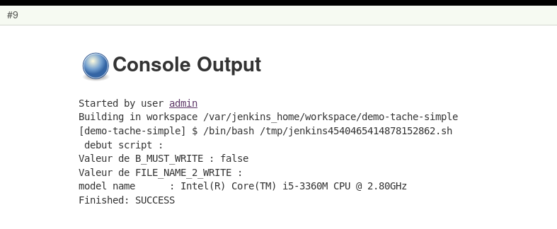
* Cas 2 : Écriture dans un fichier , pas d'erreur :
    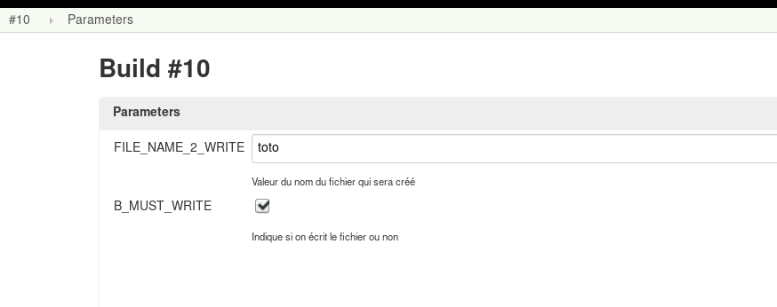
    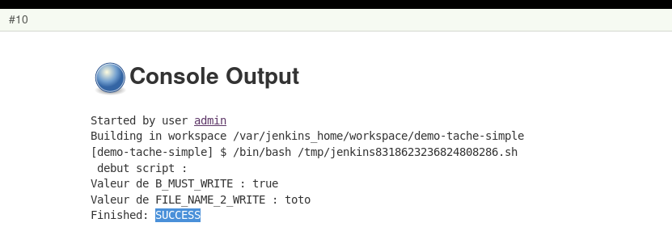
* Cas 3 : Écriture dans un fichier , mais mauvais non de fichier :
    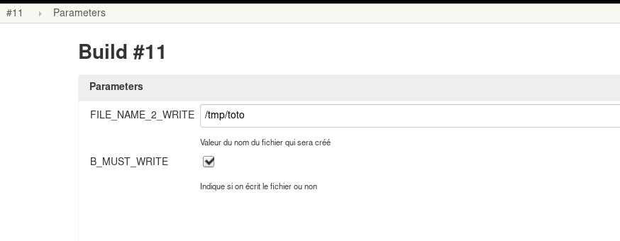
    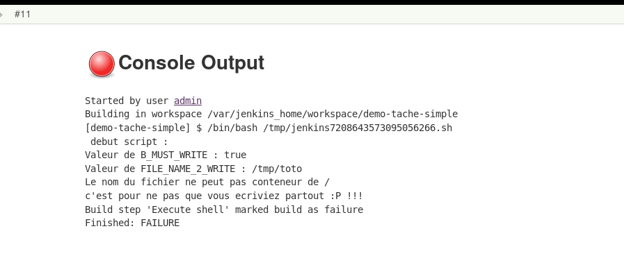

De plus lors de l'affichage général de la tâche vous aurez le statu de l'ensemble des jobs.

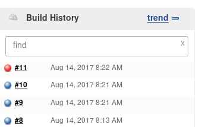 

Vous savez comme moi que peu importe la qualité de votre script , même s'il est le plus merveilleux du monde et qu'il fait tous SUPER bien , quand vous dites à certaine personne d'ouvrir une console et de démarrer le script sur la ligne de commande ça bloque !!! 
L'inquiétude , la peur , le stress de pas saisir la bonne chose , l'angoisse de ne pas savoir si ça a bien fonctionner , etc je présume que la liste peu être longue. 

Avec Jenkins ceci vous offre la possibilité de réaliser une "interface" simple pour l'utilisateur pour démarrer l'exécution de la tâche !

Comme vous pouvez le voir Jenkins utilise le code de retour du script pour savoir si l'exécution c'est passé adéquatement :

* 0 == Pas de problème 
* n == n'importe quelle autre valeur problème !!

Pour la visualisation du problème vous pouvez en plus configurer la tâche pour qu'elle transmettre un courriel au personne afin de les aviser du problème.
Ceci est SUPER pour les tâches automatisé que l'on regarde jamais :P .

Si nous retournons à la job vous pouvez définir un **Post-build Actions** :

1. **Add post-build action**
2. Sélectionnez **E-mail Notification**

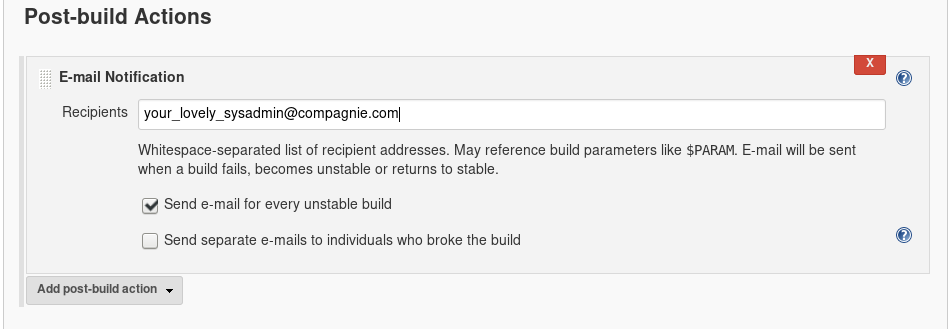

#### L'espace de travail ou workspace 

Dans un des exemples j'ai réalisé l'écriture dans un fichier , dans la configuration du paramètre j'ai bloquer la possibilité de définir un chemin contenant un **/** donc le répertoire sera dans le répertoire courent. Bien entendu la question est il est où ? 

L'ensemble des tâches sous Jenkins sont exécuté dans un espace de travail , en anglais __workspace__ . Vous pouvez le consulter et le télécharger depuis l'interface de Jenkins.


Comme vous pouvez le voir vous pouvez aussi supprimer le contenu de l'espace du travail en un clique. Ceci est parfois requis , car par défaut il n'y a pas de suppression de l'espace de travail , ce dernier est conserver et les données s'ajoute, lors d'un processus de compilation ceci peut faire gagner du temps mais aussi causer des problèmes. 

Comme vous pouvez le voir sur la copie d'écran j'avais fait une erreur avec un nom de fichier contenant de **-** , le fichier __-NAME-2-WRITE__. 

Mais il est où ? :P 

Ce répertoire de travail peut être configurable que ce soit sur le serveur __master__ ou __slave__ , regardons par défaut sur le conteneur .

```bash
$ # répertoire contenant l'ensemble de la configuration de Jenkins
$ docker exec  x3-jenkins-f ls /var/jenkins_home
config.xml
copy_reference_file.log
hudson.model.UpdateCenter.xml
hudson.plugins.emailext.ExtendedEmailPublisher.xml
hudson.plugins.git.GitTool.xml
identity.key.enc
init.groovy.d
jenkins.CLI.xml
jenkins.install.InstallUtil.lastExecVersion
jenkins.install.UpgradeWizard.state
jobs
logs
nodeMonitors.xml
nodes
plugins
queue.xml.bak
secret.key
secret.key.not-so-secret
secrets
updates
userContent
users
war
workflow-libs
workspace

$ # répertoire de l'espace de travail
$ docker exec  x3-jenkins-f ls -l /var/jenkins_home/workspace         
total 4                                
drwxr-xr-x 2 jenkins jenkins 4096 Aug 11 17:40 demo-tache-simple 

$ # et voilà 
$ docker exec  x3-jenkins-f ls -l /var/jenkins_home/workspace/demo-tache-simple                                                                      
total 8                                
-rw-r--r-- 1 jenkins jenkins 54 Aug 11 17:39 -NAME-2-WRITE                     
-rw-r--r-- 1 jenkins jenkins 54 Aug 14 08:21 toto   
```

Comme nous avons exporté le répertoire __/var/jenkins\_home__ du conteneur normalement ce répertoire est aussi disponible directement sur votre file système sans passer par le conteneur ! Et j'espère que vous l'avez fait sinon à la prochaine mise à jour vous perdrez vos configurations :D.

### Quelque paramètre intéressant 

Maintenant que nous avons une petite compréhension simpliste de ce que fait une job, prenons le temps de regarder les autres options disponible de la tache.

* **Section général**
    * **Discard old builds** :
        Comme vous avez pu le voir le système conserve les informations sur les builds antérieur , le problème est que ça prendra de la place puis surtout il est possible que vous n'en avez rien à faire de se qui fut réalisé il y a + de 7 jours. De même après 10 build peut importent le contenu des vieux , il est donc possible de définir une rotation / suppression. **ATTENTION** ceci est traité lors de l'exécution d'une build , en d'autre mot si vous avez 20 build en historie et que vous activé cette configuration il ne va pas faire le traitement de nettoyage il faudra attendre la prochaine exécution.
        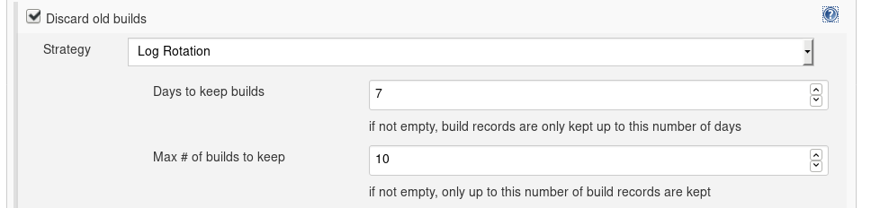

* **Source Code Management**
    * C'est le prochain sujet, donc pas ça arrive .

* **Build Triggers**
    * **Trigger builds remotely (e.g., from scripts)** : 
        Nous prendrons un peu de temps pour voir cette possibilité plus tard avec un exemple concret , cependant il est possible d'appeler la page Jenkins avec un TOKEN secret pour faire l'appel de la tâche très intéressant lors de la mis en place d'intégration tous en conservant une visibilité
    * **Build periodically** : 
        Permet de définir sous la forme de la syntaxe de **cron** une période d'exécution, une chose que je trouve intéressant avec cette méthode est que nous avons la possibilité d'avoir la tâche planifier et nous permettons à l'utilisateur de l'exécuter manuel quand il veut. De plus comme il voit si c'est en cours il ne pourra pas l'exécuter de manière simultané :D.

* **Build Environment**
    * **Delete workspace before build starts**:
        Il est possible d'indiquer au processus de build de supprimer l'espace de travail avant de débutter le processus, il est même possible en cliquant sur advance de définir un pattern . Donc vous ne supprimer pas tous, mais uniquement un type de fichier, il est aussi possible d'utiliser une variables d'environnement pour l'avoir configurable.
        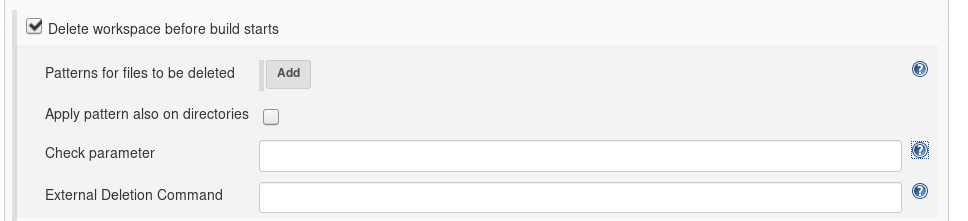
    * **Abort the build if it's stuck**:
        Définition de ce qui doit ce produire si la tâche ne progresse plus et oui parfois notre code contient des erreurs que faire alors ? Attendre indéfiniment ou l'arrêter ?!?! Tous comme pour l'avantage de la configuration du cron dans Jenkins ceci à l'avantage de ne pas être requis dans votre script . Vous laissez cette tâche ingrate à Jenkins :D.
        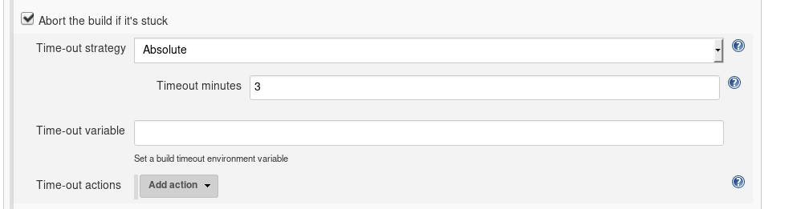
    * **Add timestamps to the Console Output**:
        Très bien ça surtout pour les tâches longue , car elle permet de voir l'évolution du script dans le temps directement dans le log de la console.

## Tour d'horizon de la configuration de Jenkins 

On peut pas dire que l'on maitrise Jenkins a ce stade cependant, nous avons une légère petite meilleur compréhension de ce que l'on peut faire , j'étais dans un problème d'œuf ou la poule. Montrer la configuration sans savoir les conséquences ou mettre en place une tâche sans la configuration, comme vous pouvez le constater j'ai fait un choix :D. 

Revenons donc sur les configurations possible, encore une fois, j'ai une configuration minimal, très peu de plugins . Il est donc possible d'augmenter le nombre de fonctionnalité, nous en verrons quelques une par la suite.

Pour accéder à la configuration dans le menu de gauche choisir **Manage Jenkins**, je ne couvrirai pas l'ensemble des options nous les explorerons au fur et à mesure.

### Configure System : Configuration général de Jenkins

Nous avons dans cette section les configurations général de Jenkins ( PATH, env globale , ... )

* **Répertoire de Jenkins** : 
    Vous pouvez re définir les répertoires pour Jenkins , le lieu où seront stocké les **workspace** , j'en fait mention surtout si vous avez acheter des disque spéciaux pour avoir une plus grande performance d'accès disque. Il est possible que vous vouliez les utilisés pour les lieux de travail.

    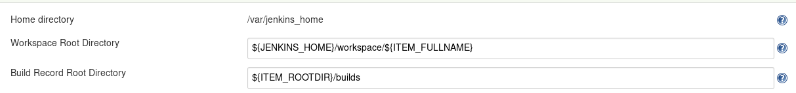

* **System Message** :
    Ceci vous permet d'afficher un message sur page principale de Jenkins , a ce stade nous ne pouvons que mettre du texte simple, mais nous verrons dans la prochaine section comment activer le mode html pour avoir plus d'option pour améliorer la visualisation.

* **# of executors** :
    Le nombre d'exécutant possible actuellement nous sommes à 2 exécuteurs pour le serveur master Jenkins , donc nous ne pouvons pas avoir plus de 2 job en exécution en même temps. Ceci peut être ennuyant si vous avez des jobs de compilation qui prenne du temps, s'il n'y a plus d'exécuteur disponible Jenkins va les mettre en queue. Nous verrons avec la mise en place des agents ( __slave__ ) que chacun ont leur nombre d'exécuteurs. 

* **Quiet period** :
    Quand Jenkins reçoit un évènement externe telle que c'est le cas avec un commit par exemple, Jenkins utilisera ce paramètre pour donner une période de grâce avant de débuter le build. L'objectif de cette méthode est de permettre au développeur de réalisé plusieurs commit avant que le système ne réalise le checkout et procède à la compilation.

* **Restrict project naming** : 
    Super important, d'un point de vue organisationnel, si vous avez Jenkins dans votre sous-sol se n'est probablement pas pertinent. Mais dans votre organisation si plusieurs personnes, ici je veux dire 3 personnes , car a 3 ça devient déjà le bordel :D . Si vous désirez standardiser le nom des job , je vous suggère fortement d'utiliser ce mécanisme , nous verrons probablement plus tard qu'il est possible d'organiser les vues selon les noms. Ce sera définitivement plus simple si nous avons forcé la standardisation des noms .

* **Environment variables** :
    Définition des variables d'environnement qui pourront être transmise à l'ensemble des jobs peut importe sur quelle machine ils seront traités. Nous pourrions par exemple penser que nous installions nos scripts sur les machines dans le répertoire /usr/local/Irules/ nous voudrions probablement avoir ce répertoire dans le PATH des jobs. Plutôt que de le redéfinir pour chaque job , le mettre global, ce qui ne veut pas dire que ce ne peut pas être surdéfinir au niveau de la job.

* **Usage Statistics** :
    Ici Jenkins sollicite votre aide pour recevoir l'utilisation et statistique **anonyme** de votre instance.
    Bon moi ça j'aime PAS, mais ça dépends de l'environnement ... Par exemple mon conteneur pour préparer la formation pas de problème mais pour l'environnement de production ou interne, je partage très peu mes données.
 
* **E-mail Notification**
    Configuration de votre serveur de courriel , pour la transmission des problèmes de build.

Bon comme vous pouvez le constater , j'ai pas tous couvert car il y a des choses évidentes ou il y a des sections que je vais couvrir lors de l'intégration future par exemple la configuration de git. 
            
### Configure Global Security : Configuration globale de sécurité pour Jenkins

Comme son nom l'indique nous avons l'ensemble des configurations pour la gestion de la sécurité , je ne vais presque RIEN couvrir de cette section pour le moment nous prendrons le temps de le faire convenablement dans une section dédier à la sécurité de Jenkins. Je vais simplement mettre en lumière quelques paramètres .

* **Access Control** :
    Nous avons la possibilité de configurer Jenkins pour qu'il utilise Ldap pour l'ensemble de l'authentification, nous avons aussi la possibilité de définir une matrice de permission basé sur le groupe et / ou l'utilisateur afin d'assigner des droits. 
    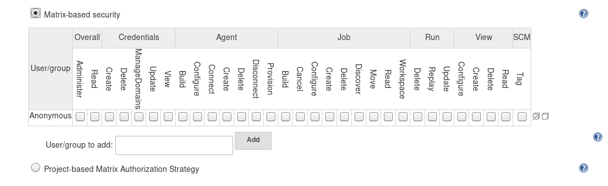
    
* **Markup Formatter** : 
    Lors de la présentation de l'option __system message__ j'avais fait mention que nous pourrions définir le conteneur en HTML avec un modification de configuration . La voici la configuration, nous devons définir à **safe HTML** par la suite vous pourrez utiliser du html pour avoir un meilleur rendu et surtout une meilleur visibilité.

## Gestion des plugins 

Nous allons voir rapidement l'utilisation des plugins dans Jenkins, bien entendu je ne peut pas couvrir l'ensemble des plugins vous verrez au fur et à mesure de votre utilisation ceux dont vous avez besoin. Bien entendu comme toujours, tous les plugins ne sont pas pertinent , non pas tous la même qualité , ... C'est à vous de le mettre dans un environnement de teste et de voir s'il répond à vos attentes.

Pour les besoin de la démonstration nous allons mettre en place le plugin **job Configuration History** qui permet de conserver une historique des modifications des changements d'une job.
Avant d'arriver à cette étape allons voir ce que nous avons installé lors de la mise en place des plugins suggérer lors de l'installation.

Pour visualisé les plugins allez dans **Manage Jenkins** -> **Manage Plugins** .

### État des plugins 

La première vue que vous aurez est la liste des plugins qui doivent être mise à jour :

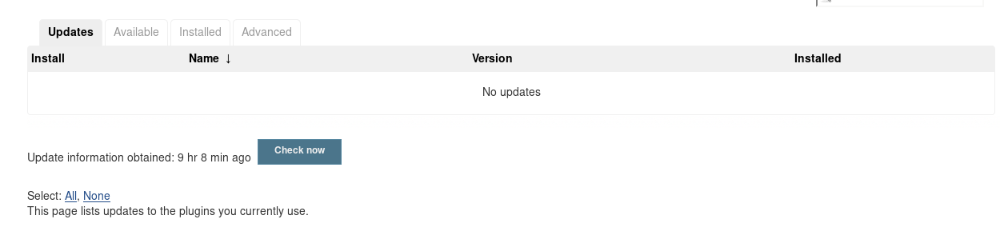

Comme vous pouvez le voir sur la copie d'écran, la dernière validation des mise à jour date de plusieurs heures , ceci est réalisé périodiquement ( je sais plus la fréquence :P , mais comme je suis sur mon portable c'est encore moins fréquent :P ) . 

Avant d'en mettre des nouveaux visualisons ceux déjà installé 

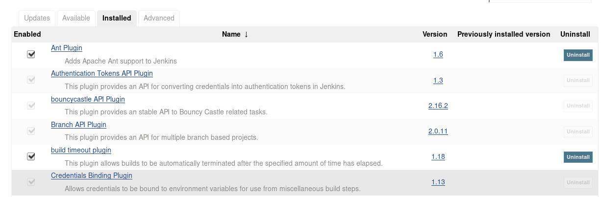

Comme vous pouvez le constater , la liste est significativement longue, plusieurs plugins sont maintenant intégré à Jenkins donc ne peuvent pas être désinstallés. De plus ce n'est pas visible dans la copie d'écran mais la colonne **Previously installed version** parfois il y a le bouton qui permet de revenir à la version précédente du plugin. Dans le passé il est déjà arrivé que nous réalisions une mise à jour des plugins et le comportement de la nouvelle version n'est pas identique à l'ancienne. Selon la situation en attendant de trouver le correctif approprié, remettre la version précédent permet de réduire la pression ! Surtout quand vous avez quelques équipe qui sont bloqué suite à l'opération .

### Installation d'un plugins 

Réalisations de l'installation du plugins **job Configuration History** , nous allons dans l'onglet **available**, trouver votre plugin et cocher le.


Par la suite 2 choix :

* Installation sans redémarrage
* Téléchargement et installation lors du redémarrage 

J'ai choisi de télécharger et d'installer au redémarrage voici le résultat :

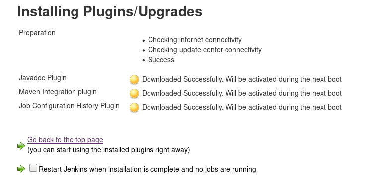

Comme vous pouvez le constater Jenkins à installé en plus : 

* Javadoc Plugin
* Maven Integration Plugin

Donc Jenkins gère la dépendance de plugins :D , c'est merveilleux !

En cochant la ligne : **Restart Jenkins when installation is complete and no jobs are running** , jenkins va redémarrer mais il va surtout s'assurer que aucun build ne va cassé car rien ne sera en exécution . 

Voilà je vais revenir sur le plugins dans quelques instant, mais c'est aussi simple que ça !

### Mise à jour d'un plugins 

Bon je ne pensais pas le couvrir mas j'ai eu une occasion donc je l'ai saisie , en validation la liste des plugins disponible pour une mise à jour je suis tombé la dessus :

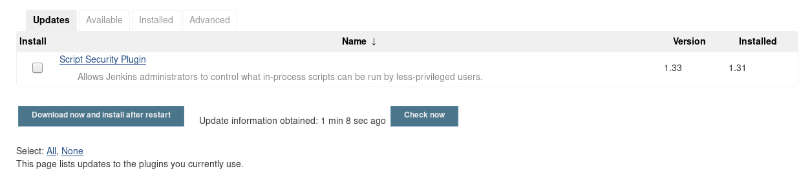

Avant de faire la mise à jour voici ce que j'avais dans l'onglet **installed** :

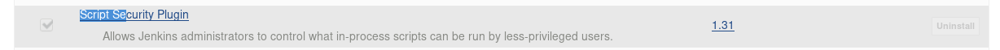

J'ai donc fait la mise à jour qui est très, très similaire à l'installation d'un nouveau plugins 

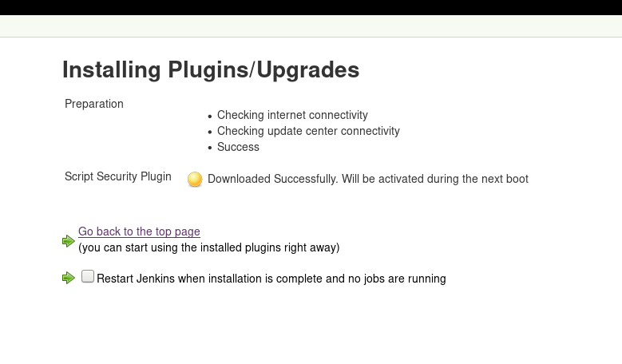

Par la suite quand je retourne dans la liste de ceux installé nous allons donc avoir la possibilité de réalisé une marche arrière avec la version précédente, même si le plugin ne peut pas être désinstaller.

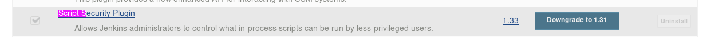


## Démonstration de Job Configuration History 

Bon si on l'a installé c'est pour l'utiliser :P , donc démonstration rapide , l'objectif du plugin est de permettre une conservation de l'historique des changement de configuration d'une tâche . 

Je vais donc retourner dans ma job **demo-tache-simple** pour réaliser 2 modifications.

1. J'ai modifier le contenu de la job , j'ai changer le message écrit dans le script pour indiquer que l'on ne peut pas mettre de / dans le nom du fichier.
2. Modification du nombre de jours retenu

Suite à l'installation du plugin j'ai maintenant dans la liste de gauche de la job, le lien : **Job Config History**, en cliquant dessus je peux voir :

* Qui à fait le changement 
* Quand il fut réalisé ainsi que la différence .

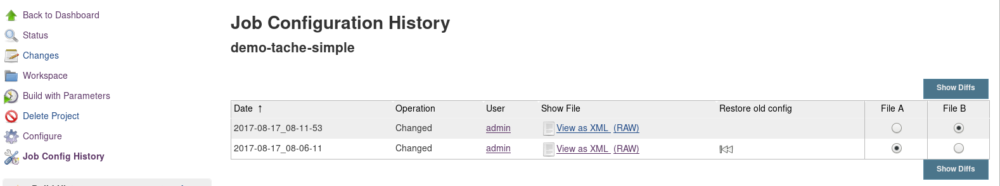

Voici le résultat en affichant la différence :

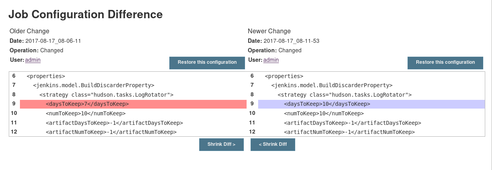

Mais ce qui est le plus beau, car je ne passe pas mon temps à regarder si une tâche a changé, c'est que lors du build suivant , il me mettra une petite clé à coté du build m'indiquant que la configuration n'est pas la même pour ce build.

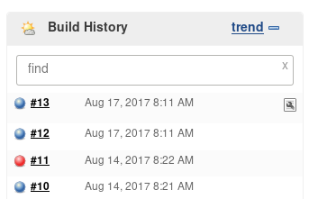


## Sécurisation de Jenkins

Bon nous ne seront pas en mesure de couvrir l'ensemble , car ce doit être pensé régulièrement , par exemple peut importe le niveau de sécurité mis en place si le compte administrateur a le mot de passe **123soleil**, ce sera compliqué !!

Les environnements Jenkins sont souvent mis en place dans le réseau local et non exposé sur Internet. Résultat il y a une fausse impression de sécurité, car uniquement les personnes à l'interne peuvent y accéder. Il faut le mettre en perspective par contre , que contient votre Jenkins ?

* La compilation du code créer par votre entreprise , en d'autre mot votre savoir faire , votre produit.
* Le déploiement de vos site web qui eux sont exposé sur Internet , l'image de votre entreprise.
* La collecte et peut-être la réalisation de rapport vous permettant de savoir ce qui se passe sur vos environnements , donc vos yeux.

J'en convient que actuellement vous n'avez probablement pas tous ça  cependant lors de l'augmentation de l'utilisation du service c'est fort probable que cette évolution arrive. Si dès le début les utilisateurs doivent se conformer au exigence de sécurité , avec l'ensemble des bien fait du nouveau service ça passera bien . Si vous ajoutez des restrictions par la suite, vous devrez faire fasse à la résistance au changement.

Ce que je veux surtout mettre en lumière est que votre Jenkins risque d'avoir une importance dans votre organisation suite à son adoption et qu'il en découlera des accès.

Référence : https://wiki.jenkins.io/display/JENKINS/Securing+Jenkins

### Restriction d'accès par utilisateur

Premièrement nous allons nous assurer qu'il faut être authentifier pour accéder au service .

Nous verrons que nous pourrions offrir une visualisation en lecture seul lors des accès anonyme, mais je ne suis pas pour cette pratique. Car vous aurez des appel de support , la personne oublie de s'authentifier puis elle vous appel pour dire que telle option n'est plus disponible ... Après un moment de silence de votre part , peut-être un crie de rage réalisé dans un coussin ( car c'est le 3 ieme appel que vous recevez ) vous lui indiquez gentiment qu'elle ( la personne ) n'est pas __logué__ ! Par la suite vous débranchez votre téléphone pour ménager votre cœur ;-)

Nous ne couvrirons pas la configuration avec le service Ldap ou autre système externe pour le moment je vais me concentré avec la gestion de compte locaux , mais le concept est équivalent avec Ldap. 

Premièrement activation du mode de sécurité dans Jenkins : **Manage Jenkins** --> **Configure Global Security**

Cochez l'option **Enable security** , vous avez l'option de désactivé la fonctionnalité __remember me__ afin de désactivé l'authentification avec le cookie.

Si nous analysons l'état actuelle nous avons une sources d'utilisateur localement définie dans Jenkins ( pas de LDAP ou Active Directory ) et quand la personne est authentifier elle peut tous faire l'équivalent d'administrateur.

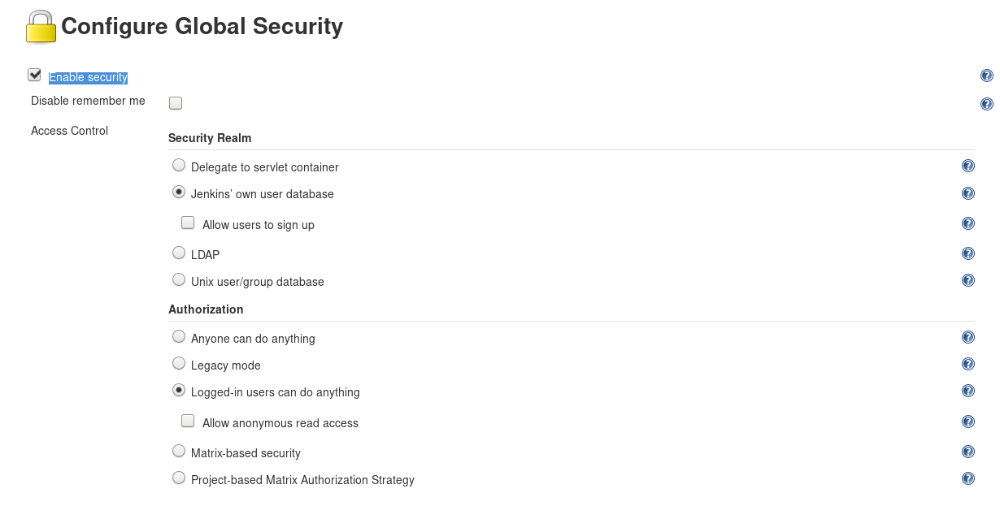

Nous allons modifier un peu ça afin d'avoir des permissions définie par utilisateur.

#### Création d'utilisateur 

Si nous allons dans la section **Manage Jenkins** --> **Manage Users** , nous pourrons faire la gestion de nos utilisateurs :

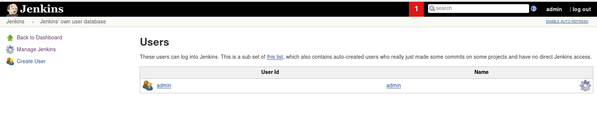

Bon rien d'exceptionnel dans le processus de création d'un utilisateur, une petite copie d'écran donne l'ensemble de l'information ...

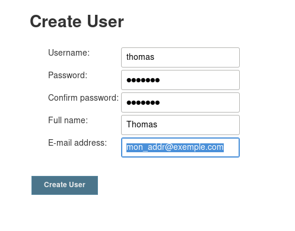 

#### Création d'un groupe 

Il n'y a pas de fonctionnalité intégré dans Jenkins pour faire la gestion de groupe , vous ne pouvez QUE faire la création d'utilisateur. Nous verrons lors de la mise en place des permissions qu'il est possible de les assigner à un groupe. Cependant conformément au [post de  Kohsuke Kawaguchi Jul 08, 2009; 8:33pm](http://jenkins-ci.361315.n4.nabble.com/Users-Groups-td383878.html) , les groupes ne peuvent être utilisé que lors de l'utilisation de LDAP ou Active Directory. Je confirme que ça fonctionne très bien avec Ldap :D.

Vous avez cependant un plugin [Role Strategy Plugin](https://wiki.jenkins.io/display/JENKINS/Role+Strategy+Plugin) qui vous permet de mettre en place l'équivalent de groupe , nommé rôle pour faire cette opération. Il n'est pas prévu de le couvrir dans la formation.

#### Assignation des permissions au utilisateur 

Maintenant que nous avons 3 utilisateur :

* admin : que j'utilise depuis le début.
* thomas : que je viens de créer.
* anonymous : pour les utilisateurs non authentifié.

Nous allons voir comment faire l'assignation de permission, Jenkins utilise le système de Matrice de permission, nous retournons dans la section **Manage Jenkins** --> **Global security** 

Dans la section autorisation nous allons sélectionner l'option **Matrix-based security** :

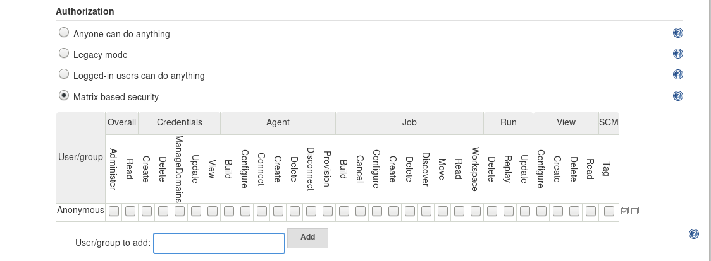

Nous allons ajouter nos utilisateurs et définir nos permissions :

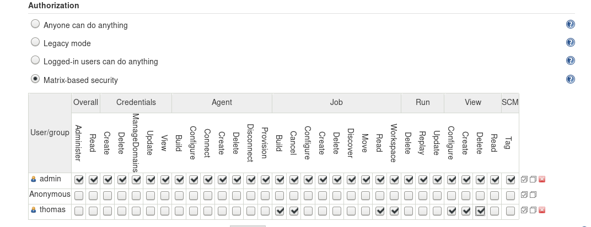

Si j'essaye d'établir une connexion avec l'utilisateur **thomas** voici le résultat :

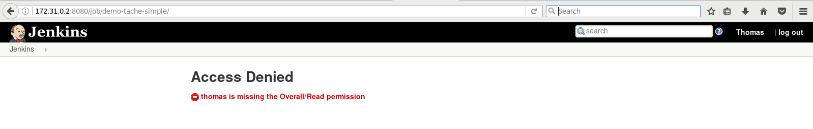 

Ce n'est comme on dit pas l'idéal ... J'ai donc rajouté les permissions pour **Overall : read** , voici à présent le résultat :

* Page d'accueil :
    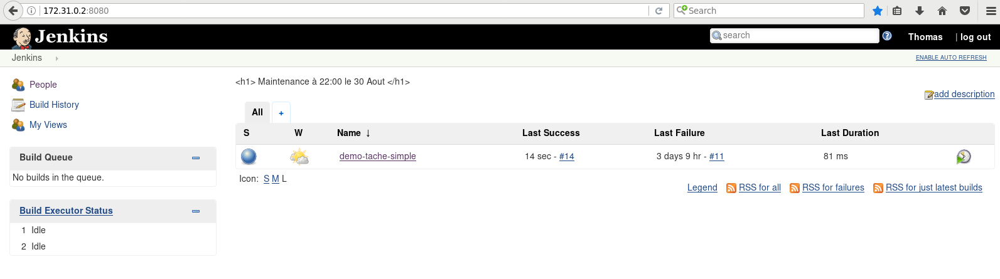

* Page de la tâche :
    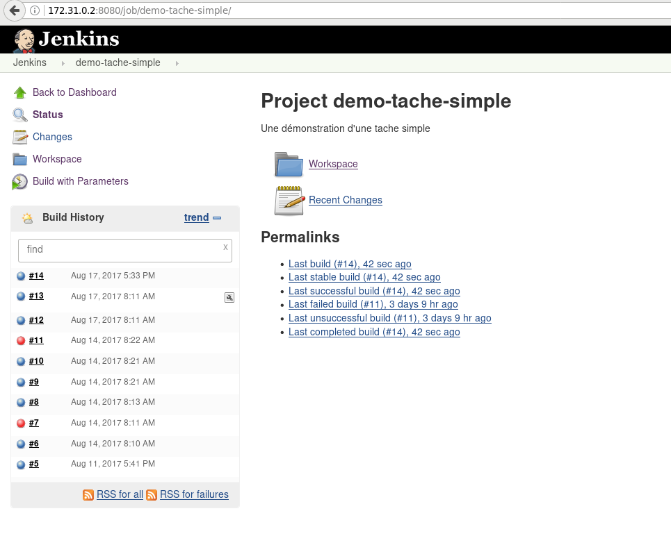

Bien entendu l'assignation pour chaque utilisateur n'est définitivement pas l'idéal la gestion par groupe est mieux , mais on prend ce que l'on a :D.


#### [Optionnel] Erreur lors de l'assignation des permissions , comment s'en sortir !!

Lors de l'assignation des permissions la première fois lors de l'écriture de la formation j'ai fait une erreur:

1. j'avais une matrice vide
    
2. j'ai saisi le nom admin et tapez la touche **Enter**
3. Malheureusement le focus étant sur **save** je me suis retrouver avec ceci
    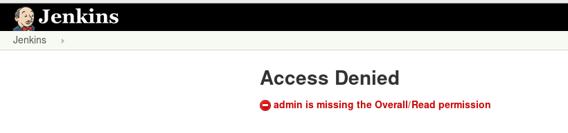

Malheureusement je n'ai pas d'autre compte pour établir une connexion et corriger mon erreur ... :-/ . Selon le niveau d'utilisation je peux pas dire je réinstalle , alors comment faire. 

Je profite de l'occasion pour montrer le fichier de configuration de Jenkins , le nom du fichier est **config.xml** il est dans le home directory du service. Dans notre cas /var/jenkins_home et sur le docker host dans un répertoire associé. 

Voici le contenu du fichier avec mon erreur [config.xml](./config-empty-matrix.xml) 

En L'ouvrant j'ai regardé rapidement et j'ai identifier la ligne : 

```
<authorizationStrategy class="hudson.security.GlobalMatrixAuthorizationStrategy"/>
```

J'ai simplement supprimer la ligne et redémarrer le service , dans mon cas le conteneur ... Et MAGIE tous est revenu :P . En conclusion faire un backup du fichier :P et maintenant vous serez toujours en mesure de retomber sur vos pattes s'il y a un problème avec l'interface . Bien entendu SI vous avez accès à a machine :D .

Si vous êtes curieux voici le fichier de configuration avec l'ensemble des configurations de la matrice : [config.xml](config-matrix-perms.xml). 

### Sécurisation des informations transmise 

Nous avons mis en place la limitation par utilisateur , cependant comme vous pouvez le voir si vous utilisez firefox , lors de la saisi du nom d'utilisateur et mot de passe ce dernier passe en claire sur le réseau. De nos jour la mise en place du chiffrement en httpS est peu couteux, les processeurs que nous avons sont performant ! Il n'y a donc pas de raison de ne pas sécuriser cette communication  ! Nous allons donc mettre en place un serveur Apache devant pour utiliser TLS.

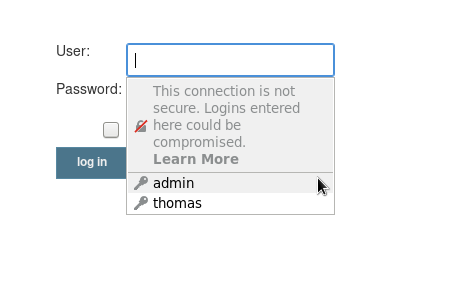

Cette opération n'est pas complexe , si je ne le couvre pas dans la vidéo , désolé :P , il est possible que je coupe cette opération afin de gagner du temps ... 
Nous allons utiliser un conteneur pour faire l'exercice , ceci nous offre encore une opportunité pour habituer avec le processus d'intégration multi conteneur.

Voici la documentation sur le site de Jenkins pour la mise en place d'un proxy devant Jenkins : [https://wiki.jenkins.io/display/JENKINS/Apache+frontend+for+security](https://wiki.jenkins.io/display/JENKINS/Apache+frontend+for+security)

#### Création du conteneur apache

Donc création du conteneur apache pour faire l'exercice, voici le fichier [**Dockerfile**](./dockers/apache-front/Dockerfile) décrivant la configuration :

```
FROM httpd:2.4
MAINTAINER Thomas Boutry "thomas.boutry@x3rus.com"

 # Enable Proxy , SSL and rewrite modules  configuration
RUN sed -i 's/#LoadModule proxy_module modules\/mod_proxy.so/LoadModule proxy_module modules\/mod_proxy.so/g; \
         s/#LoadModule proxy_connect_module modules\/mod_proxy_connect.so/LoadModule proxy_connect_module modules\/mod_proxy_connect.so/g; \
         s/#LoadModule proxy_http_module modules\/mod_proxy_http.so/LoadModule proxy_http_module modules\/mod_proxy_http.so/g; \
         s/#LoadModule rewrite_module modules\/mod_rewrite.so/LoadModule rewrite_module modules\/mod_rewrite.so/g; \
         s/#LoadModule socache_shmcb_module modules\/mod_socache_shmcb.so/LoadModule socache_shmcb_module modules\/mod_socache_shmcb.so/g; \
         s/#LoadModule ssl_module modules\/mod_ssl.so/LoadModule ssl_module modules\/mod_ssl.so/g;'  /usr/local/apache2/conf/httpd.conf


 # Copie jenkins configuration file and include it in the httpd.conf
COPY conf/jenkins.conf /usr/local/apache2/conf/jenkins.conf
RUN echo "Include conf/jenkins.conf" >> /usr/local/apache2/conf/httpd.conf

RUN mkdir /usr/local/apache2/ssl/
COPY conf/ssl/* /usr/local/apache2/ssl/

 # Validation de la configuration
RUN /usr/local/apache2/bin/apachectl configtest
```

Donc rapidement :

* Activation des différent module en réalisant un petit __sed__ dans le fichier de configuration __httpd.conf__
* Copie du fichier de [configuration de jenkins](dockers/apache-front/conf/jenkins.conf) et inclusion du fichier dans le fichier __httpd.conf__
* Copie des fichiers de certificat et clef privé qui fut réalisé avec la commande ( bien entendu un self signe ) :
    ```bash
    $ openssl req -x509 -newkey rsa:4096 -keyout key.pem -out cert.pem -nodes -days 365
    ```
* Validation de la configuration juste pour être certain.

Je reviens dans quelques instant sur la configuration apache , je veux juste le faire en dehors de la section **docker** pour les personnes qui n'utiliserons pas docker pour que ce soit plus simple à trouver :D.

Voici le fichier [docker-compose.yml](./dockers/docker-compose-https.yml)

```
version: '2'
services:
    jenkins:
        image: jenkins/jenkins
        container_name : 'x3-jenkins-f'
        hostname: jenkins.train.x3rus.com
        environment:
            - TZ=America/Montreal
        volumes:
            - "/srv/docker/x3-jenkins-f/jenkins-data:/var/jenkins_home"
        # ports:
            #- 8080:8080   # Web interface
            #- 50000:50000 # Build Executors
    apache-front:
        image: x3-jenkins-front
        build: ./apache-front/.
        container_name : 'x3-jenkins-apache-f'
        hostname : jenkins-front.train.x3rus.com
        environment:
            - TZ=America/Montreal
            - JENKINS_FQDN=jenkins.local.x3rus.com
            - JENKINS_ALIAS=jenkins2.local.x3rus.com
            - ADM_EMAIL=admin@example.com
        links:
            - jenkins:jenkins
```

Donc nous avons le service apache-front de présent , rapidement encore :

* image : Je définie ma propre image , car j'ai réalisé des modifications dans le conteneur httpd:2.4 original
* build : Je définie ou est la définition du build , ceci me servira si je n'utilise pas de docker registrie
* environnement : Toujours dans l'optique d'avoir un conteneur générique j'ai définie plusieurs configuration à l'aide de variable d'environnement nous allons le voir dans la prochaine section.
* links : Je crée le lien entre le conteneur apache et jenkins.

Bien entendu l'ensemble de l'effort est vraiment dans la configuration apache donc regardons cette section.


#### Configuration apache 

Le fonctionnement est simple, l'ensemble des communications passe par le service apache et se dernier fonctionne en mode proxy donc il réalise les requêtes au serveur Jenkins . Le serveur Jenkins répond au service apache qui retourne l'information au client ... Les communications entre le client et apache sont chiffré et entre apache et Jenkins sont en claire.

Voici le fichier [jenkins.conf](dockers/apache-front/conf/jenkins.conf)

```
<VirtualHost *:80>
    ServerName ${JENKINS_FQDN}
    ServerAdmin ${ADM_EMAIL}

    <IfDefine JENKINS_ALIAS_FQDN>
        ServerAlias ${JENKINS_ALIAS_FQDN}
    </IfDefine>

    DocumentRoot /usr/local/apache2/htdocs

    # Redirection en httpS
    redirect / https://${JENKINS_FQDN}

</VirtualHost>

Listen 443
SSLCipherSuite HIGH:MEDIUM:!MD5:!RC4
SSLProxyCipherSuite HIGH:MEDIUM:!MD5:!RC4
SSLHonorCipherOrder on 
SSLProtocol all -SSLv3
SSLProxyProtocol all -SSLv3
SSLPassPhraseDialog  builtin
SSLSessionCache        "shmcb:/usr/local/apache2/logs/ssl_scache(512000)"
SSLSessionCacheTimeout  300

<VirtualHost *:443>

    SSLEngine on

    # SSL certificat cree hors conteneur
    SSLCertificateFile "/usr/local/apache2/ssl/jenkins.crt"
    SSLCertificateKeyFile "/usr/local/apache2/ssl/jenkins.key"

    ServerAdmin  ${ADM_EMAIL}
    ProxyRequests     Off
    ProxyPreserveHost On
    AllowEncodedSlashes NoDecode

    <Proxy http://jenkins:8080/*>
        Order deny,allow
        Allow from all
    </Proxy>
    ProxyPass         /  http://jenkins:8080/ nocanon
    ProxyPassReverse  /  http://jenkins:8080/
    ProxyPassReverse  /  http://${JENKINS_FQDN}/

    RequestHeader set X-Forwarded-Proto "https"
    RequestHeader set X-Forwarded-Port "443"
</VirtualHost>
```

Comme vous pouvez le constater j'utilise les variables d'environnement :

* JENKINS\_FQDN  : Ceci contient le hostname complet qui est afficher au client pour la communication à Jenkins par apache , ceci me permet lors de l'utilisation d'un conteneur d'avoir une marge de manœuvre d'avoir le même conteneur peu importe le nom DNS utilisé. Bien entendu je suis dépendant de la définition contenu dans le certificat, ce qui est plus ou moins un problème lors de l'utilisation d'un wildcard ssl.
* JENKINS\_ALIAS\_FQDN : Paramètre optionnel pour avoir un autre nom , vous constatez l'utilisation du **IfDefine**
* ADM\_EMAIL : Email de l'administrateur en paramètre aussi :D.


### Sauvegarde de sécurité

Pour parler de sauvegarde parlons de la structure des fichiers de Jenkins, la documentation sur le wiki de Jenkins est vraiment bien : [Page Administration](https://wiki.jenkins.io/display/JENKINS/Administering+Jenkins) . Voici le contenue de la page :

```
JENKINS_HOME
 +- config.xml     (jenkins root configuration)
 +- *.xml          (other site-wide configuration files)
 +- userContent    (files in this directory will be served under your http://server/userContent/)
 +- fingerprints   (stores fingerprint records)
 +- plugins        (stores plugins)
 +- workspace (working directory for the version control system)
     +- [JOBNAME] (sub directory for each job)
 +- jobs
     +- [JOBNAME]      (sub directory for each job)
         +- config.xml     (job configuration file)
         +- latest         (symbolic link to the last successful build)
         +- builds
             +- [BUILD_ID]     (for each build)
                 +- build.xml      (build result summary)
                 +- log            (log file)
                 +- changelog.xml  (change log)
```

Comme vous pouvez le constater TOUS est dans le répertoire **JENKINS\_HOME** , vous serez donc en mesure en réalisant une archive (tar.gz) d'avoir l'ensemble des données. C'est merveilleux :D
