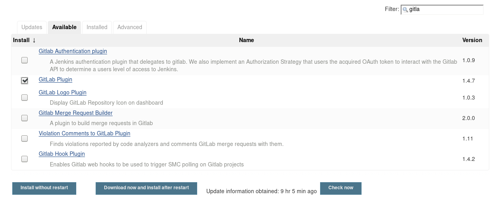
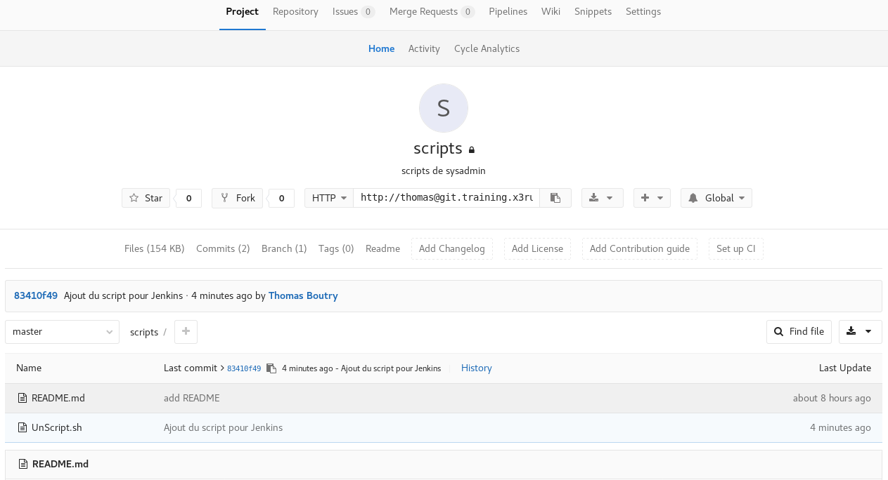
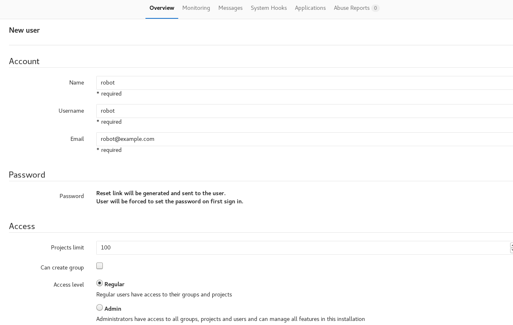
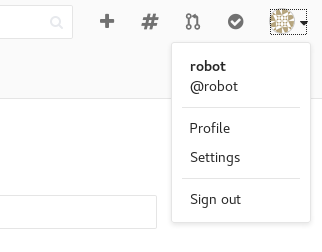
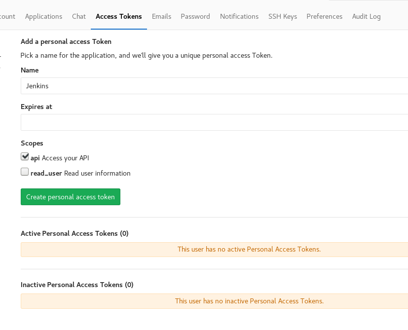
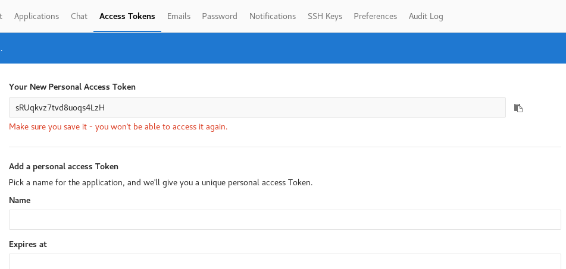
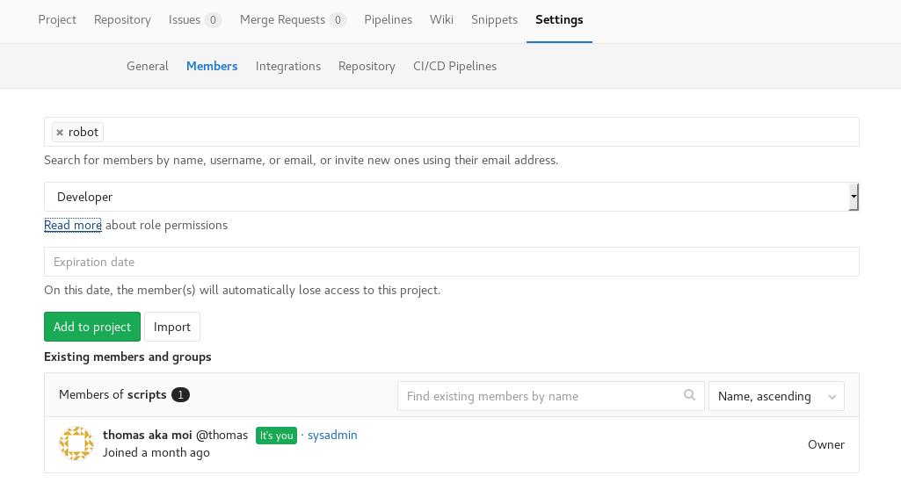

## Intégration avec un contrôleur de révision (GitLab)

La création des tâches dans Jenkins est vraiment bien , comme nous avons pu le constater il est possible d'écrire n'importe quelle script bash ou autre langage. C'est vraiment simple , cependant si vous utilisez uniquement le texte box dans Jenkins vous allez trouver ça long, pourquoi ? Car bien qu'il y est plein de plugin pour Jenkins il n'y a pas d'option de changer le texte box par un éditeur **VIM** . Oui je sais c'est malheureux :P !!!

Sans blague, voici quelque raison rapidement identifier qui devrez vous décourager vous encourager a utiliser un contrôleur de révision 

* Conservation de l'historique des modifications (Qui , Quand, Quoi )
* Utilisation des scripts en dehors de Jenkins 
* Segmentation de la tâches en plusieurs script , simplifiant la lecture
* Réutilisation de code dans plusieurs tâches
* Plus simple de réaliser des teste en dehors de Jenkins

Nous avons vu l'utilisation de [GitLab lors de la formation](../gitlab/01-presentation.md) sur le sujet, j'utiliserai donc ce système. Le concept est significativement équivalent si vous utilisez **subversion** ou un autre, bien entendu nous avons le concept de branche en plus. 

Comme nous avons déjà fait la présentation de gitlab ( Installation et Configuration de base ), je ne couvrirai pas cette partie vous référez à [la formation](../gitlab/01-presentation.md) . Nous allons tous de suite passé à l'intégration avec Jenkins , au niveau de Docker puis au niveau applicatif. 

### Intégration de gitlab et Jenkins au niveau Docker

Pour réalisé l'intégration simplement modifier le fichier __docker-compose.yml__ , voici le contenu :

```
version: '2'
services:
    jenkins:
        image: jenkins/jenkins
        container_name : 'x3-jenkins-f'
        hostname: jenkins.train.x3rus.com
        environment:
            - TZ=America/Montreal
        volumes:
            - "/srv/docker/x3-jenkins-f/jenkins-data:/var/jenkins_home"
        links:
            - gitlab:gitlabsrv 
    apache-front:
        image: x3-jenkins-front
        build: ./apache-front/.
        container_name : 'x3-jenkins-apache-f'
        hostname : jenkins-front.train.x3rus.com
        environment:
            - TZ=America/Montreal
            - JENKINS_FQDN=jenkins.local.x3rus.com
            - JENKINS_ALIAS=jenkins2.local.x3rus.com
            - ADM_EMAIL=admin@example.com
        links:
            - jenkins:jenkins
    gitlab:
        image: 'gitlab/gitlab-ce:latest'
        container_name : 'x3-gitlab-f'
        hostname: git.training.x3rus.com
        environment:
            TZ: America/Montreal
            GITLAB_OMNIBUS_CONFIG: |
                gitlab_rails['time_zone'] = 'America/Montreal'
                gitlab_rails['gitlab_email_from'] = 'noreply@x3rus.com'
                gitlab_rails['manage_backup_path'] = true
                gitlab_rails['backup_path'] = "/var/opt/gitlab/backups"
                gitlab_rails['backup_archive_permissions'] = 0640 
                gitlab_rails['backup_keep_time'] = 604800
                gitlab_rails['smtp_enable'] = true
        volumes:
            - '/srv/docker/x3-gitlab-f/gitlab/etc:/etc/gitlab'
            - '/srv/docker/x3-gitlab-f/gitlab/logs:/var/log/gitlab'
            - '/srv/docker/x3-gitlab-f/gitlab/data/:/var/opt/gitlab'
```

Voici lien vers le fichier brute : [docker-compose.yml](./docker-compose-gitlab.yml)

Nous avons donc le service gitlab d'ajouter et le liens définie dans le service Jenkins pour qu'il établisse la connexion avec gitlab :

``` 
        links:
            - gitlab:gitlabsrv 
``` 

Démarrage et visualisation de l'exécution :

```bash
$ docker-compose up -d
Recreating x3-gitlab-f2 ... 
Recreating x3-gitlab-f2 ... done
Recreating x3-jenkins-f ... 
Recreating x3-jenkins-f ... done
Recreating x3-jenkins-apache-f ... 
Recreating x3-jenkins-apache-f ... done

$ docker ps                   
CONTAINER ID        IMAGE                     COMMAND                  STATUS                            PORTS                     NAMES  
e42f13fffe37   x3-jenkins-front          "httpd-foreground"       Up 5 seconds                      80/tcp                    x3-jenkins-apache-f                           
0c32b728b551   jenkins/jenkins           "/bin/tini -- /usr..."   Up 7 seconds                      8080/tcp, 50000/tcp       x3-jenkins-f                                  
b99c5fdcfde1   gitlab/gitlab-ce:latest   "/assets/wrapper"        Up 8 seconds (health: starting)   22/tcp, 80/tcp, 443/tcp   x3-gitlab-f  
```

Pour les besoin de la formation je vais réutiliser le conteneur gitlab utilisé lors de la présentation de ce service . Nous avons donc 3 conteneur :

* x3-gitlab-f ( 172.31.0.2 )  : Pour gitlab
* x3-jenkins-f ( 172.31.0.3 ) : Jenkins backend
* x3-jenkins-apache ( 172.31.0.4 ) : Jenkins apache frontend 

### Intégration Gitlab et Jenkins au niveau Applicatif

Nous avons 2 applications qui fonctionnent indépendamment , nous allons mettre en place la connexion entre les 2 services , dans cette section Jenkins réalisera une extraction ( __clone__ ) du projet dans l'espace de travail.

Vous devrez vous assurer que le plugin **git** et **gitlab** sont  bien présent sur votre installation Jenkins.

Prenons le temps de la valider ensemble : 

**Manage Jenkins** --> **plugins** --> **Available**

 

#### Configuration du service GitLab pour l'échange d'information avec Jenkins

Dans Gitlab, nous avons le projet : **sysadmin/scripts** ( groupe sysadmin , projet scripts ) , créé avec mon utilisateur __thomas__.



Nous allons créer un utilisateur **robot** qui sera utilisé pour extraire et manipuler les informations, pour cette opération vous aurez besoin d'avoir le compte administrateur (__root__) .



Selon la situation, vous devriez réinitialiser le mot de passe manuellement , revoir le présentation de gitlab ...

J'ai donc l'utilisateur : **robot** avec un mot de passe. 

J'établis une connexion avec l'utilisateur **robot** afin de réaliser une petite configuration , je vais activer l'accès à Gitlab à l'aide d'une clé d'API, ceci m'offrira l'ensemble des possibilités de communications entre Jenkins et Gitlab.

En haut à droite , cliquez sur __setting__ :



Dans le menu choisir **Access token** 

Nous allons assigner un nom convenable pour ce token et comme vous pouvez le voir il est aussi possible de définir une date d'expiration :



Voici le résultat :



Donc nous avons maintenant le numéro : **sRUqkvz7tvd8uoqs4LzH** , il est important de le conserver en lieu sur :D.

Je vais maintenant retourner avec mon utilisateur **thomas** propriétaire du projet __sysadmin/scripts__ afin de fournir l'accès au projet à l'utilisateur **robot** peut importe la méthode de communication : User / pass ou access Token.

**Projet script** --> **settings** --> **members** 

Nous allons ajouter l'utilisateur **robot** , pour [les permissions voir la documentation](https://docs.gitlab.com/ce/user/permissions.html):



Il est toujours possible de faire un teste passant avec l'utilisateur pour confirmer que l'accès user / pass fonctionne bien :

```bash
$ git clone  http://robot@git.training.x3rus.com/sysadmin/scripts.git 
Cloning into 'scripts'...
Password for 'http://robot@git.training.x3rus.com': 
remote: Counting objects: 6, done.
remote: Compressing objects: 100% (4/4), done.
remote: Total 6 (delta 0), reused 0 (delta 0)
Unpacking objects: 100% (6/6), done.

$ cd scripts/ 
$ ls                          
README.md  UnScript.sh
```

#### Configuration du service Jenkins pour communiquer avec gitlab
