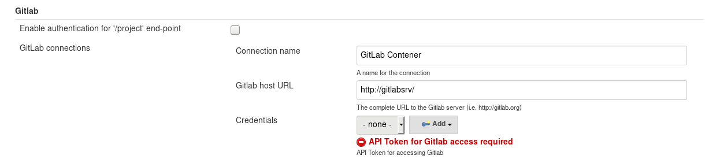
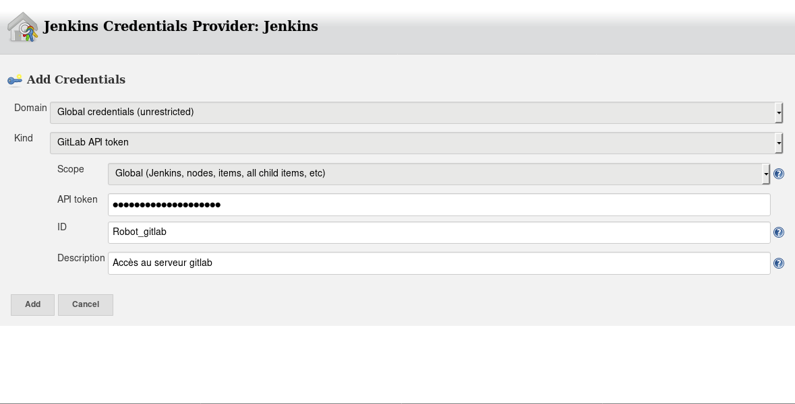
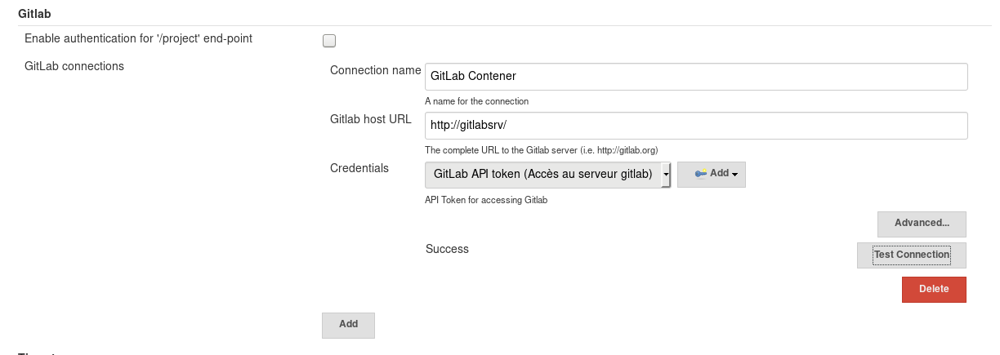
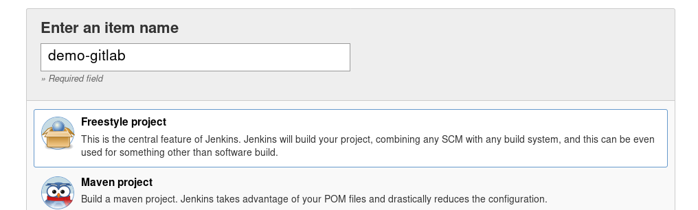
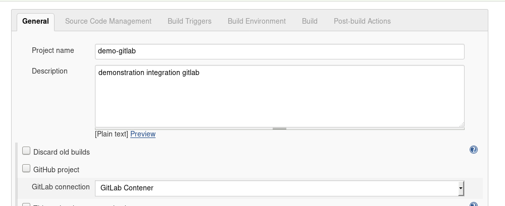
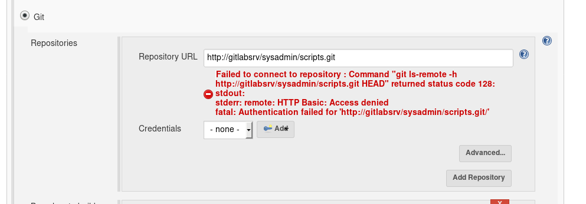
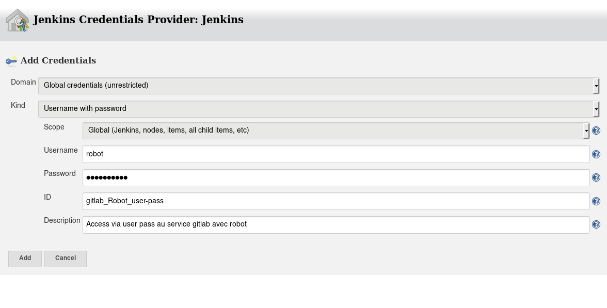
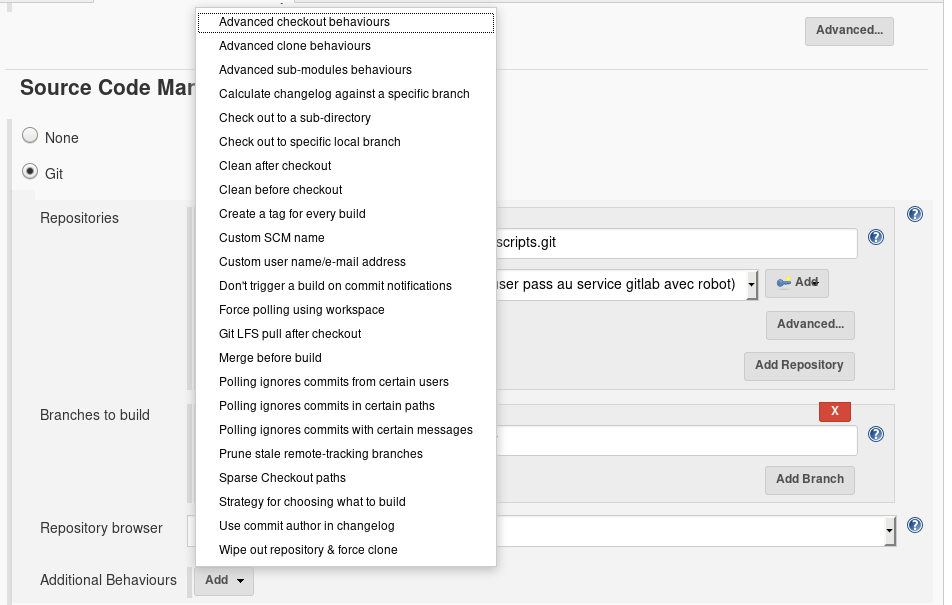
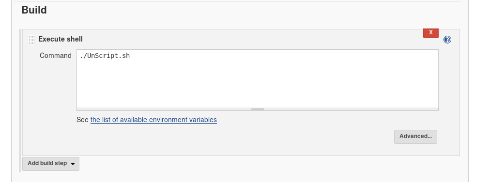
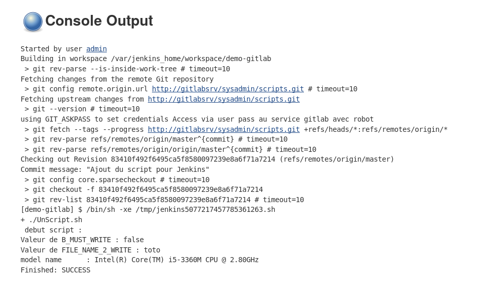

## Intégration avec un contrôleur de révision (GitLab)

La création des tâches dans Jenkins est vraiment bien , comme nous avons pu le constater il est possible d'écrire n'importe quelle script bash ou autre langage. C'est vraiment simple , cependant si vous utilisez uniquement le texte box dans Jenkins vous allez trouver ça long, pourquoi ? Car bien qu'il y est plein de plugin pour Jenkins il n'y a pas d'option de changer le texte box par un éditeur **VIM** . Oui je sais c'est malheureux :P !!!

Sans blague, voici quelque raison rapidement identifier qui devrez vous décourager vous encourager a utiliser un contrôleur de révision 

* Conservation de l'historique des modifications (Qui , Quand, Quoi )
* Utilisation des scripts en dehors de Jenkins 
* Segmentation de la tâches en plusieurs script , simplifiant la lecture
* Réutilisation de code dans plusieurs tâches
* Plus simple de réaliser des teste en dehors de Jenkins

Nous avons vu l'utilisation de [GitLab lors de la formation](../gitlab/01-presentation.md) sur le sujet, j'utiliserai donc ce système. Le concept est significativement équivalent si vous utilisez **subversion** ou un autre, bien entendu nous avons le concept de branche en plus. 

Comme nous avons déjà fait la présentation de gitlab ( Installation et Configuration de base ), je ne couvrirai pas cette partie vous référez à [la formation](../gitlab/01-presentation.md) . Nous allons tous de suite passé à l'intégration avec Jenkins , au niveau de Docker puis au niveau applicatif. 

### Intégration de gitlab et Jenkins au niveau Docker

Pour réalisé l'intégration simplement modifier le fichier __docker-compose.yml__ , voici le contenu :

```
version: '2'
services:
    jenkins:
        image: jenkins/jenkins
        container_name : 'x3-jenkins-f'
        hostname: jenkins.train.x3rus.com
        environment:
            - TZ=America/Montreal
        volumes:
            - "/srv/docker/x3-jenkins-f/jenkins-data:/var/jenkins_home"
        links:
            - gitlab:gitlabsrv 
    apache-front:
        image: x3-jenkins-front
        build: ./apache-front/.
        container_name : 'x3-jenkins-apache-f'
        hostname : jenkins-front.train.x3rus.com
        environment:
            - TZ=America/Montreal
            - JENKINS_FQDN=jenkins.local.x3rus.com
            - JENKINS_ALIAS=jenkins2.local.x3rus.com
            - ADM_EMAIL=admin@example.com
        links:
            - jenkins:jenkins
    gitlab:
        image: 'gitlab/gitlab-ce:latest'
        container_name : 'x3-gitlab-f'
        hostname: git.training.x3rus.com
        environment:
            TZ: America/Montreal
            GITLAB_OMNIBUS_CONFIG: |
                gitlab_rails['time_zone'] = 'America/Montreal'
                gitlab_rails['gitlab_email_from'] = 'noreply@x3rus.com'
                gitlab_rails['manage_backup_path'] = true
                gitlab_rails['backup_path'] = "/var/opt/gitlab/backups"
                gitlab_rails['backup_archive_permissions'] = 0640 
                gitlab_rails['backup_keep_time'] = 604800
                gitlab_rails['smtp_enable'] = true
        volumes:
            - '/srv/docker/x3-gitlab-f/gitlab/etc:/etc/gitlab'
            - '/srv/docker/x3-gitlab-f/gitlab/logs:/var/log/gitlab'
            - '/srv/docker/x3-gitlab-f/gitlab/data/:/var/opt/gitlab'
```

Voici lien vers le fichier brute : [docker-compose.yml](./docker-compose-gitlab.yml)

Nous avons donc le service gitlab d'ajouter et le liens définie dans le service Jenkins pour qu'il établisse la connexion avec gitlab :

``` 
        links:
            - gitlab:gitlabsrv 
``` 

Démarrage et visualisation de l'exécution :

```bash
$ docker-compose up -d
Recreating x3-gitlab-f2 ... 
Recreating x3-gitlab-f2 ... done
Recreating x3-jenkins-f ... 
Recreating x3-jenkins-f ... done
Recreating x3-jenkins-apache-f ... 
Recreating x3-jenkins-apache-f ... done

$ docker ps                   
CONTAINER ID        IMAGE                     COMMAND                  STATUS                            PORTS                     NAMES  
e42f13fffe37   x3-jenkins-front          "httpd-foreground"       Up 5 seconds                      80/tcp                    x3-jenkins-apache-f                           
0c32b728b551   jenkins/jenkins           "/bin/tini -- /usr..."   Up 7 seconds                      8080/tcp, 50000/tcp       x3-jenkins-f                                  
b99c5fdcfde1   gitlab/gitlab-ce:latest   "/assets/wrapper"        Up 8 seconds (health: starting)   22/tcp, 80/tcp, 443/tcp   x3-gitlab-f  
```

Pour les besoin de la formation je vais réutiliser le conteneur gitlab utilisé lors de la présentation de ce service . Nous avons donc 3 conteneur :

* x3-gitlab-f ( 172.31.0.2 )  : Pour gitlab
* x3-jenkins-f ( 172.31.0.3 ) : Jenkins backend
* x3-jenkins-apache ( 172.31.0.4 ) : Jenkins apache frontend 

### Intégration Gitlab et Jenkins au niveau Applicatif

Nous avons 2 applications qui fonctionnent indépendamment , nous allons mettre en place la connexion entre les 2 services , dans cette section Jenkins réalisera une extraction ( __clone__ ) du projet dans l'espace de travail.

Vous devrez vous assurer que le plugin **git** et **gitlab** sont  bien présent sur votre installation Jenkins.

Prenons le temps de la valider ensemble : 

**Manage Jenkins** --> **plugins** --> **Available**

 

#### Configuration du service Gitlab pour l'échange d'information avec Jenkins

Dans Gitlab, nous avons le projet : **sysadmin/scripts** ( groupe sysadmin , projet scripts ) , créé avec mon utilisateur __thomas__.


Nous allons créer un utilisateur **robot** qui sera utilisé pour extraire et manipuler les informations, pour cette opération vous aurez besoin d'avoir le compte administrateur (__root__) .


Selon la situation, vous devriez réinitialiser le mot de passe manuellement , revoir le présentation de gitlab ...

J'ai donc l'utilisateur : **robot** avec un mot de passe. 

J'établis une connexion avec l'utilisateur **robot** afin de réaliser une petite configuration , je vais activer l'accès à Gitlab à l'aide d'une clé d'API, ceci m'offrira l'ensemble des possibilités de communications entre Jenkins et Gitlab.

En haut à droite , cliquez sur __setting__ :


Dans le menu choisir **Access token** 

Nous allons assigner un nom convenable pour ce token et comme vous pouvez le voir il est aussi possible de définir une date d'expiration :


Voici le résultat :


Donc nous avons maintenant le numéro : **sRUqkvz7tvd8uoqs4LzH** , il est important de le conserver en lieu sur :D.

Je vais maintenant retourner avec mon utilisateur **thomas** propriétaire du projet __sysadmin/scripts__ afin de fournir l'accès au projet à l'utilisateur **robot** peut importe la méthode de communication : User / pass ou access Token.

**Projet script** --> **settings** --> **members** 

Nous allons ajouter l'utilisateur **robot** , pour [les permissions voir la documentation](https://docs.gitlab.com/ce/user/permissions.html):


Il est toujours possible de faire un teste passant avec l'utilisateur pour confirmer que l'accès user / pass fonctionne bien :

```bash
$ git clone  http://robot@git.training.x3rus.com/sysadmin/scripts.git 
Cloning into 'scripts'...
Password for 'http://robot@git.training.x3rus.com': 
remote: Counting objects: 6, done.
remote: Compressing objects: 100% (4/4), done.
remote: Total 6 (delta 0), reused 0 (delta 0)
Unpacking objects: 100% (6/6), done.

$ cd scripts/ 
$ ls                          
README.md  UnScript.sh
```

#### Configuration du service Jenkins pour communiquer avec gitlab

Nous avons donc notre utilisateur **robot** configurer dans __gitlab__ avec 2 mode d'accès nom utilisateur / mot de passe et avec un jeton d'accès (__access token__).

Nous allons configurer l'authentification de gitlab dans Jenkins  : **manage Jenkins** --> **global configue** --> **gitlab** 

Pour rappel dans la définition du conteneur Jenkins, nous avons définie que le conteneur gitlab est disponible sous le nom gitlabsrv :

```
        links:                                                                 
            - gitlab:gitlabsrv 
```

Nous allons donc créer une nouvelle job en utilisant cette accès pour la récupération des données. Je vais encore utiliser le mode libre __Free style__:




Nous ajoutons donc une authentification par __Gitlab Token__  , voici le résultat :



Ceci nous donnera au final ceci avec le petit bouton __Test connexion__ pour valider que tous est ok :



Comme vous pouvez le voir il est possible de définir plusieurs connexion gitlab, donc n'hésitez pas à segmenter vos droit d'accès au système .


#### Création d'une tache

Nous allons ajouter dans les informations d'authentification l'information requis pour la communication ... en cliquant sur **Add**.



Comme vous pouvez le voir directement maintenant j'ai la connexion avec gitlab de présent :



Nous allons maintenant définir où récupérer les fichiers pour la tâches, bien entendu ceci sera dans la section __Source Code Management__ , sélectionnez **git**.

Après avoir saisi l'URL du projet __git__ nous verrons ceci :



Ceci est plutôt bon signe, car ceci confirme que l'accès n'est pas libre au projet :D. Nous allons donc ajouter les critères d'authentification . Vous allez voir que je n'ai pas utilisé le **jeton** en fait j'ai pas le choix quand j'ai essayé ça ne fonctionne pas ... il semble y avoir une limitation à ce niveau. Voici donc le résultat :

 

Nous nous arrêterons là pour le moment, mais j'aimerai vous mettre en lumière la possibilité d'ajouter des fonctionnalités :



Je vais maintenant ajouter la description du **build** donc la tâche qui sera réalisé :



J'ai aussi ajouter les informations pour les paramètres au script ( __FILE\_NAME\_2\_WRITE__ et __B\_MUST\_WRITE__ ) 

Maintenant l'exécution :



Nous voyons clairement l'extraction du dépôt __git__ et l'exécution du script !!

Nous avons donc l'intégration **simple** de gitlab avec Jenkins pour l'exécution de code depuis un dépôt git !! 
Nous allons continuer avec la configuration de Jenkins et la mise en place de slave , cependant nous reviendrons plus en détail sur la mise en place d'une solution plus complexe pour la réalisation de la compilation du code , création de conteneur et autre ... 

## Configuration d'agent ( slave ) pour Jenkins

Telle que mentionné le **master** Jenkins est une orchestrateur, nous pouvons compiler localement sur la machine cependant ceci n'est pas l'idéal surtout si vous désirez distribuer la charge et avoir plusieurs agent pour réaliser type d'opération.

Nous allons voir comment faire la configuration , bien entendu votre agent doit être idéalement une machine puissante afin de pouvoir réaliser des compilations qui demandent des ressources. Comme Jenkins est un exécuteur, il est aussi possible de se connecter à n'importe quelle machine ce peut être un petit système mais vous désirez réaliser un backup de la BD __sql__ sur demande. Il existe plusieurs plugins disponible pour établir une connexion, dans l'exemple ici nous utiliserons la connexion **SSH** pour l'exercice. Je vais utiliser un conteneur pour que ce soit plus simple pour moi, et aussi pour que vous puissiez reproduire dans votre environnement de laboratoire la configuration.

Donc pour que ceci fonction nous aurons besoin :

1. Un utilisateur configurer sur la machine **slave** avec lequel Jenkins pourra initier la communication via ssh.
2. La mise en place d'une clé ssh pour facilité l'authentification .
3. L'ensemble des applications installé sur le slave pour réaliser les opérations définie dans la tâches.

### Création d'une pair de clé ssh 

Pour les personnes qui ont pas suivie les formations précédente ou pas mis en pratique ou tous simplement oublié puis soyons honnête c'est pénible chercher :P. Un petit rappel pour la génération d'un clé ssh :D. ( Oui vous pouvez dire merci :P ) .

```bash
[~/tmp/jenkins/data] {20990} 
$ ssh-keygen -b 2048 
 Generating public/private rsa key pair.
 Enter file in which to save the key (/home/xerus/.ssh/id_rsa): ./jenkins-nodes_rsa
 Enter passphrase (empty for no passphrase): 
 Enter same passphrase again: 
 Your identification has been saved in ./jenkins-nodes_rsa.
 Your public key has been saved in ./jenkins-nodes_rsa.pub.
 The key fingerprint is:
 SHA256:nShQ8M9u1ANN7GhW8S8taOal/DRqR4sYAkmYcNczbwQ xerus@goishi
 The key s randomart image is:
 +---[RSA 2048]----+
 |...oooE. .o.     |
 | .o..o+ .oo.     |
 |   ....=.+. .    |
 |    o. o*=.o o   |
 |     ..+S O + o  |
 |      .+.= +.o   |
 |       .oo+oo.   |
 |       .. o+o.   |
 |         ....    |
 +----[SHA256]-----+
[~/tmp/formations/jenkins/data] {20991} 
$ ls
jenkins-nodes_rsa  jenkins-nodes_rsa.pub
```

Nous avons donc :

* **jenkins-nodes_rsa** : la clé privé qui ne sortira JAMAIS du serveur Jenkins, comme je n'ai pas mis de passphrase l'ensemble de la sécurité repose sur ce fichier. !!
* **jenkins-nodes_rsa.pub** : la clé publique qui sera distribué sur l'ensemble des agents

Prendre note qu'il est maintenant possible de configurer une passephrase dans Jenkins pour que ce soit utilisable avec la clé, comme j'utilise cette même clé pour des opérations en dehors de Jenkins j'ai tendance a ne pas en mettre. À tord ou à raison , ceci est une gestion de risque en relation avec la sécurité , libre à vous :D.

### Création du conteneur ( Optionnel ) 

Nous allons faire la création du conteneur , pour le moment je ne met que **ssh serveur** ainsi que Java , car l'agent Jenkins est développer en java !!

Voici le résultat du [Dockerfile](./dockers/jenkins-slave/Dockerfile-v1) :

```
 #
 # Description : Jenkins Slave pour formation
 #
 # Author : Thomas.boutry@x3rus.com
 # Licence : GPLv3 ou plus
 #
 # Reference : https://docs.docker.com/engine/examples/running_ssh_service/#build-an-eg_sshd-image
 ###########################################################

FROM ubuntu:16.04
MAINTAINER Thomas Boutry "thomas.boutry@x3rus.com"

 # Installation des applications, besoin de ssh et de java pour le service Jenkins
RUN apt-get update && \
    apt-get install -y openssh-server sudo openjdk-8-jre && \
    mkdir /var/run/sshd

 # SSH login fix. Otherwise user is kicked off after login
RUN sed 's@session\s*required\s*pam_loginuid.so@session optional pam_loginuid.so@g' -i /etc/pam.d/sshd

ENV NOTVISIBLE "in users profile"
RUN echo "export VISIBLE=now" >> /etc/profile


 # Create default user "BOB" with password toto
RUN useradd -s /bin/bash -m  jenkinbot && \
    echo "jenkinbot:toto" | chpasswd && \
    usermod -G sudo jenkinbot

 # Creation du répertoire ssh pour l'utilisateur
RUN mkdir /home/jenkinbot/.ssh/ && \
    chmod 700 /home/jenkinbot/.ssh/

 # Copie la clef publique pour jenkins 
COPY conf/authorized_keys /home/jenkinbot/.ssh/authorized_keys

 # Fix perms
RUN chmod 700 /home/jenkinbot/.ssh/authorized_keys

 # Port et service
EXPOSE 22
CMD ["/usr/sbin/sshd", "-D"]
```

Nous allons ajuster aussi le [docker-compose.yml](./dockers/docker-compose-slave.yml)

```
[ ... OUTPUT COUPÉ ... ]
    jenkins:
        image: jenkins/jenkins
        container_name : 'x3-jenkins-f'
        hostname: jenkins.train.x3rus.com
        environment:
            - TZ=America/Montreal
        volumes:
            - "/srv/docker/x3-jenkins-f/jenkins-data:/var/jenkins_home"
        # ports:
            #- 8080:8080   # Web interface
            #- 50000:50000 # Build Executors
        links:
            - gitlab:gitlabsrv 
            - jenkins-slave:jenkins-s1 
[ ... OUTPUT COUPÉ ... ]
    jenkins-slave: 
        image: x3-jenkins-slave        
        build: ./jenkins-slave/.       
        container_name : 'x3-jenkins-slave-f'                                  
        hostname : jenkins-slave.train.x3rus.com                               
        environment:
            - TZ=America/Montreal  
[ ... OUTPUT COUPÉ ... ]
```

```bash
 $ docker-compose build jenkins-slave
 [ ... OUTPUT COUPÉ ... ]
 Step 12/12 : CMD /usr/sbin/sshd -D     
  ---> Running in 06a94c85a558          
   ---> d9f59db68318                     
   Removing intermediate container 06a94c85a558                                   
   Successfully built d9f59db68318        
   Successfully tagged x3-jenkins-slave:latest  
```
