## Cas d'utilisation , conteneur docker

Nous avons vue la mise en place de Jenkins, la mise en place d'un serveur apache pour la sécurisation , l'intégration "SIMPLE" avec **gitlab** ainsi que la mise en place d'un slave. Bien entendu je pourrai continuer avec des exemples simple, mais j'ai envie d'aller plus loin en présentant des cas d'utilisations que vous pourriez mettre en place. 
Ceci risque de demander plus d'effort de compréhension selon votre niveau, mais on ira pas sur la lune !!! Accrochez vous , posez des questions sur internet ou autour de vous , essayez de l'expliquer à quelqu'un d'autre :P ( parfois ça l'aide) 

Voici la description du "**besoin**" : J'ai plusieurs conteneur que j'ai créé malheureusement faire des changement sur ces derniers est toujours délicat, car j'ai généralement du temps lors de leurs création, mais pour la mise à jour / modification la phase de teste est délicat. Résultat j'ose pas toujours y toucher , car ça marche puis la mise à jour c'est pas indispensable. En d'autre mot je m'expose à des risques de sécurité et je m'auto limite pour la suite. 
La solution mettre en place une système de validation lors de la création pour que le système réalise au moins l'ensemble des testes passant ... Ceci augmentera mon niveau de confiance pour une mise en production. Il faut comprendre, j'ai pas  des environnements de Dev / QA / Pre-prod / prod ... je suis tout seule :P .


Étape haut niveau pour la réalisation :

1. Lors de l'édition du dépôt Git contenant la définition de mes conteneurs qu'une tâches Jenkins ce déclenche
2. Jenkins extrait le dépôt et réalise une validation "syntaxique" et build le nouveau conteneur ( stop s'il y a un problème )
3. Si le nouveau conteneur à pu être créé avec succès réalisation de teste d'intégration / unit test
4. Si les testes sont un succès envoie du conteneur dans le registry privé docker ( Nous ne l'avons pas encore .... On le couvrira rendu là ou pas comme d'habitude :P )


### Requis pour la réalisation et contrainte 


Donc pour la réalisation de cette opération nous aurons besoin :

* Un slave qui a docker 
* Serveur gitlab 
    * avec des branches .
    * La configuration d'un webhook pour déclencher un build automatiquement.
    * Jenkins devra mettre à jour le dépôt suite au build.
    * Gestion des tags pour fixé une version.

Bien entendu l'ensemble avec des conteneurs.

Bon, nous parlons souvent de résistance au changement, nous prônons l'évolution, le changement des méthodes de travailles , etc . Dans la réalité j'ai été réfractaire dans le changement dans cette situation . Je l'assume pleinement, mais le bon côté nous/vous  pourrons/pourrez capitalisé sur ce travail. 
Je n'ai pas voulu changer l'organisation des mes conteneurs , aujourd'hui comme présenté j'ai un dépôt nommé **dockers** qui contient l'ensemble de la définition de mes conteneurs ( Jenkins, gitlab, webdav, .... ). J'ai donc UN sous-répertoire par conteneur.

```
dockers 
    |> x3-webdav
        |> Dockerfile
    |> x3-jenkins
        |> Dockerfile
    |> x3-gitlab
        |> Dockerfile
    |> ...
```

Il aurait été BEAUCOUP , mais BEAUCOUP plus facile de créer un projets par conteneur dans gitlab pour faire l'opération qui suit, je soulèverai les points quand on va le voir mais j'ai du faire un script pour la gestion. 


### Mise en place du slave avec la capacité de Docker

Plusieurs méthodes sont possible il existe un plugin dans Jenkins pour gérer les serveurs dockers , la communication ce fait via l'API de dockers qui peut être en TLS bien entendu. Je n'ai pas utiliser cette méthode, car dans la réalité je n'ai qu'un serveur docker de "production". Donc je n'ai pas voulu ouvrir le port de l'API de docker pour simplement faire un build et run ... Est-ce que j'aurais dû ?!?! Je pense qu'il y a des arguments pour , mais mon argument dans la situation est plus de gardé ça simple, voir simpliste :D .


Nous allons donc ajouter un autre conteneur slave pour la partie docker , bien entendu si vous avez une machine dédié pour faire l'opération pas besoin de vous prendre la tête simplement définir l'accès ssh de la machine . Vous assurer que la machine à bien docker et que l'ensemble fonctionne avec l'utilisateur associé à Jenkins .

Donc nous allons faire la modification suivante dans le [docker-compose.yml](./dockers/docker-compose-slabe-dck.yml)

```
[ ... OUTPUT COUPÉ ...]
    jenkins:
        image: jenkins/jenkins
        container_name : 'x3-jenkins-f'
        hostname: jenkins.train.x3rus.com
        environment:
            - TZ=America/Montreal
        volumes:
            - "/srv/docker/x3-jenkins-f/jenkins-data:/var/jenkins_home"
        links:
            - gitlab:gitlabsrv
            - jenkins-slave:jenkins-s1
            - jenkins-slave-dck:jenkins-s2
[ ... OUTPUT COUPÉ ...]
    jenkins-slave: 
        image: x3-jenkins-slave
        build: ./jenkins-slave/.
        container_name : 'x3-jenkins-slave-f'
        hostname : jenkins-slave.train.x3rus.com
        environment:
            - TZ=America/Montreal
        links:
            - gitlab:gitlabsrv 
    jenkins-slave-dck: 
        image: x3-jenkins-slave
        build: ./jenkins-slave/.
        container_name : 'x3-jenkins-slave-dck-f'
        hostname : jenkins-slave-dck.train.x3rus.com
        environment:
            - TZ=America/Montreal
        links:
            - gitlab:gitlabsrv 
        volumes:
            - /var/run/docker.sock:/var/run/docker.sock
            - /usr/bin/docker:/usr/bin/docker
[ ... OUTPUT COUPÉ ...]
```

Si nous regardons les 2 définitions des slaves elles sont presque pareille, sauf que le slave pour docker a la définition pour des volumes 

* **/var/run/docker.sock** : Socket pour les communications avec l'applicatif docker 
* **/usr/bin/docker** : Applicatif docker , binaire pour faire des opérations ...

De plus nous ajoutons le lien entre Jenkins et le nouveau slave.

C'est vraiment magnifique d'avoir rien d'autre a mettre en place pour qu'un conteneur soit en mesure d'utiliser docker DANS un conteneur :D , oui oui magie !!! Là on peut dire que c'est bien fait !! 

Pour les petits malin il y a un problème dans la configuration :P , ça marcherai PRESQUE , si vous avez envie d'analyser le problème je vous dis arrêter tout de suite et chercher le problème ... :D Nous pourrions voir ça comme un exercice . Nous allons mettre en place une tâche qui va utiliser ce conteneur et voir la problématique !!!


```bash
$ docker-compose up -d 
Starting x3-gitlab-f ... 
Starting x3-gitlab-f ... done
Starting x3-jenkins-slave-f ... 
Starting x3-jenkins-slave-f
Starting x3-jenkins-slave-f ... done
Creating x3-jenkins-slave-dck-f ... done
Recreating x3-jenkins-f2 ... 
Recreating x3-jenkins-f2 ... done
Recreating x3-jenkins-apache-f2 ... 
Recreating x3-jenkins-apache-f2 ... done
```

Donc même chemin que pour un slave "normale" **manage jenkins** --> **Manage Nodes** --> **add node** .
Comme nous avons déjà un node très similaire je vais réaliser une copie de la configuration puis la modifier ... 

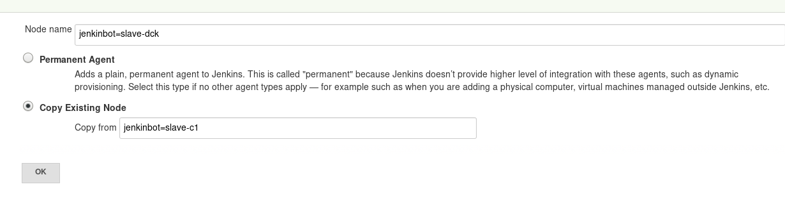

J'ai donc modifier :

* La description 
* les étiquettes ( Label )
* le nom du host pour la connexion :D

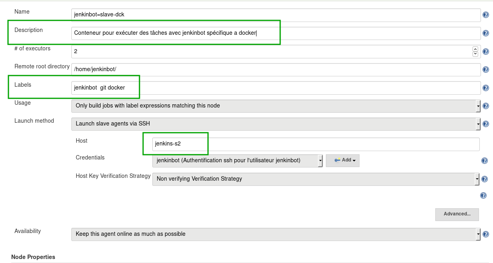


Et voilà succès :D

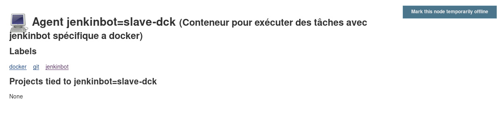


Réalisons une tâche pour valider que ça fonctionne , mais ça marchera pas :P !! 

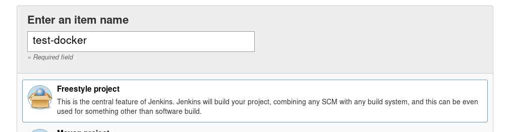

Section général , l'important dans cette section est vraiment l'utilisation du **label** docker:

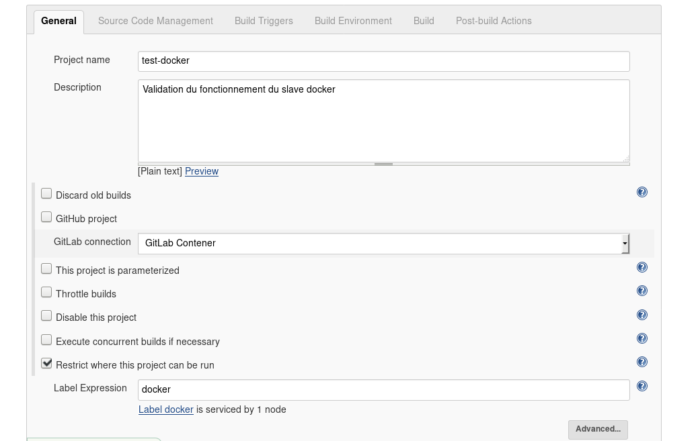

Juste un petit docker __ps__ pour valider que la communication fonctionne !

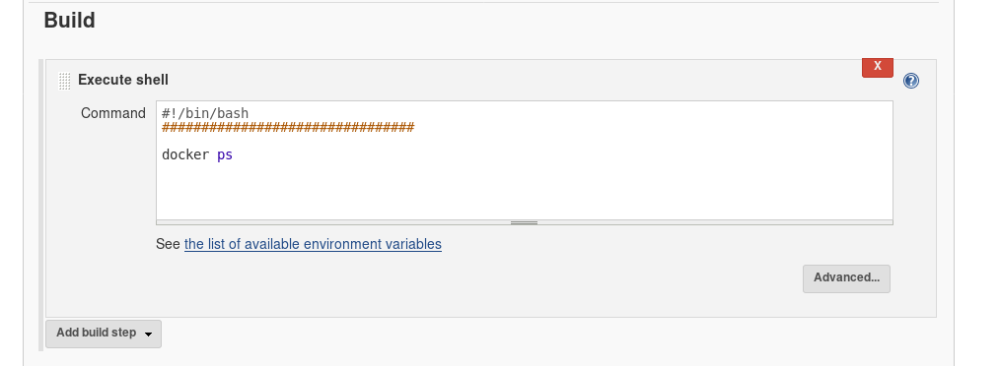

Je lance le build , bon c'est vraiment drôle, car ce n'était pas l'erreur que je pensait avoir :P , on arrête pas le plaisir :D

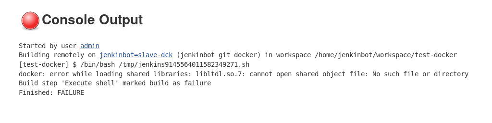

#### Analyse erreur du slave

Bon rendu là je vais faire une section pour le correctif, car il y a au moins 2 problème , pour faire l'analyse du problème je vais me connecter dans le conteneur pour faire l'analyse .

L'erreur indique un problème avec les librairies partagé définie dans le binaire docker, je vais donc analyser s'il y a d'autre librairie manquante :

```bash
$ docker exec -it x3-jenkins-slave-dck-f bash
root@jenkins-slave-dck:/# apt-cache search ^C
root@jenkins-slave-dck:/# ldd /usr/bin/docker 
        linux-vdso.so.1 =>  (0x00007fff21ff8000)
        libpthread.so.0 => /lib/x86_64-linux-gnu/libpthread.so.0 (0x00007f40456c0000)
        libltdl.so.7 => not found
        libc.so.6 => /lib/x86_64-linux-gnu/libc.so.6 (0x00007f40452f7000)
        /lib64/ld-linux-x86-64.so.2 (0x00007f40458dd000)
```

C'est bon signe il n'y en a pas d'autre , installation de la librairie

```bash
root@jenkins-slave-dck:/# apt-cache search ltdl
libltdl-dev - System independent dlopen wrapper for GNU libtool
libltdl7 - System independent dlopen wrapper for GNU libtool
root@jenkins-slave-dck:/# apt-get install libltdl7
```

Comme je suis connecter validons que ça fonctionne : 

```bash
root@jenkins-slave-dck:/# docker  ps   
CONTAINER ID        IMAGE                     COMMAND                  STATUS                    PORTS                     NAMES
aae1b1a50383        x3-jenkins-front          "httpd-foreground"       Up 19 minutes             80/tcp                    x3-jenkins-apache-f
b8b77e2e8ea5        jenkins/jenkins           "/bin/tini -- /usr..."   Up 19 minutes             8080/tcp, 50000/tcp       x3-jenkins-f
ce21f1aa8efc        x3-jenkins-slave          "/usr/sbin/sshd -D"      Up 19 minutes             22/tcp                    x3-jenkins-slave-dck-f
a609350d6cd3        x3-jenkins-slave          "/usr/sbin/sshd -D"      Up 19 minutes             22/tcp                    x3-jenkins-slave-f
b99c5fdcfde1        gitlab/gitlab-ce:latest   "/assets/wrapper"        Up 19 minutes (healthy)   22/tcp, 80/tcp, 443/tcp   x3-gitlab-f
```

Bon faudra modifier la définition du conteneur, mais ça fonctionne avant de changer le Dockerfile , validons que la tâche fonctionne :D 
C'est bien maintenant j'ai l'erreur attendu :D :

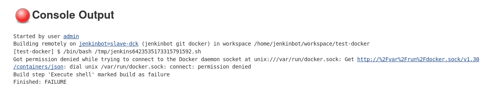

Pourquoi, il y a ce problème de permissions ?? En fait le problème dans la définition de notre conteneur , l'exécution des commandes est réalisé avec l'utilisateur jenkinbot . Cependant l'utilisateur n'est pas membre du groupe docker donc le binaire __docker__ n'est pas en mesure d'établir une connexion au docker .

```bash
$ ls -l /var/run/docker.sock
srw-rw---- 1 root docker 0 Sep  1 17:05 /var/run/docker.sock

$ ls -ln /var/run/docker.sock 
srw-rw---- 1 0 994 0 Sep  1 17:05 /var/run/docker.sock 
```

Nous allons donc modifier la définition du conteneur pour ajouter **jenkinbot** au groupe dockers.

Résultat [Dockerfile](./dockers/jenkins-slave/Dockerfile-v2):

```
 # package 

 # Create default user "jenkinbot" with password toto
 # Ajout du groupe docker pour communiquer avec le docker host
 RUN useradd -s /bin/bash -m  jenkinbot && \
     echo "jenkinbot:toto" | chpasswd && \
     groupadd -g 994 docker && \
     usermod -G sudo,docker jenkinbot
```

On reconstruit l'image et on redémarrage le tous :D.

```bash
$ docker-compose build jenkins-slave-dck
[... OUTPUT COUPÉ ...]
Step 11/12 : EXPOSE 22                 
 ---> Running in af3c4aae8318          
 ---> 2a3a863af8ac                     
Removing intermediate container af3c4aae8318                                   
Step 12/12 : CMD /usr/sbin/sshd -D     
  ---> Running in 9bbd1e434c1e          
  ---> 718bdc09cca0                     
Removing intermediate container 9bbd1e434c1e                                   
Successfully built 718bdc09cca0        
Successfully tagged x3-jenkins-slave:latest 

$ docker-compose rm jenkins-slave-dck
Going to remove x3-jenkins-slave-dck-f
Are you sure? [yN] y
Removing x3-jenkins-slave-dck-f ... done

```

Validation de la configuration :

```
$ docker exec x3-jenkins-slave-f id jenkinbot
uid=1000(jenkinbot) gid=1000(jenkinbot) groups=1000(jenkinbot),27(sudo),994(docker)
```

Résultat à l'exécution de notre tâche :

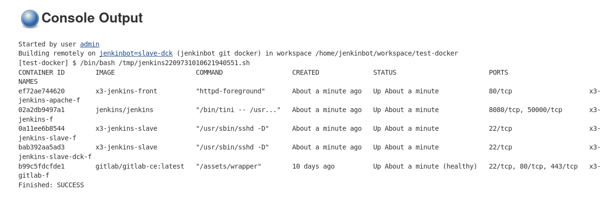

### Création de la tâche intégration Gitlab , compilation de l'image Docker

Je sais maintenant on maîtrise l'intégration __gitlab__, mais on va juste faire une révision .
Voici ce que nous allons faire dans cette section :

1. Création de la tâche qui nous servira par la suite 
2. Récupération du dépôt avec la définition du conteneur
3. Compilation d'une image docker avec la définition extraite du dépôt 

Nous allons encore utiliser la tâche de type **FreeStyle** nous aurons les coudés franches .

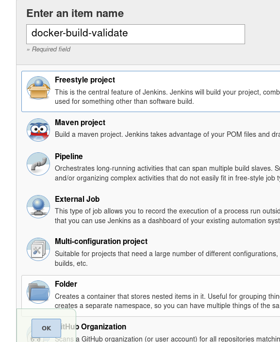 

Lors de la présentation j'avais déjà un dépôt **git** pour des conteneurs :

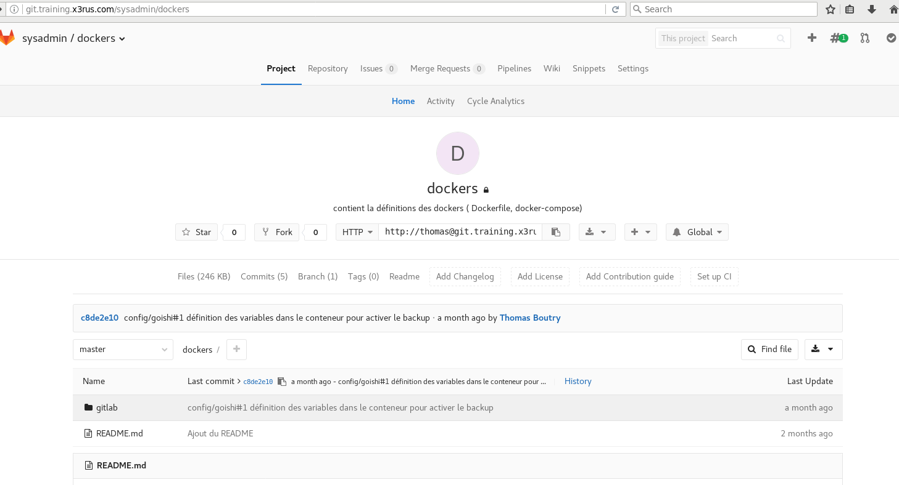

Je vais donc ajouter l'utilisateur **robot** pour qu'il soit en mesure de communiquer avec ce dépôt .

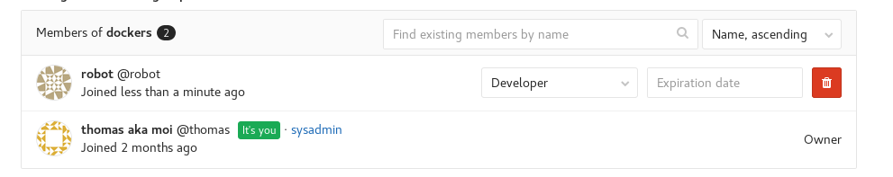

Je vais ajouter une définition docker dans le dépôt pour avoir du matériel à compiler ( générer l'image )

```bash
$ git clone http://thomas@git.training.x3rus.com/sysadmin/dockers.git 
Cloning into 'dockers'...
Password for 'http://thomas@git.training.x3rus.com': 
remote: Counting objects: 18, done.
remote: Compressing objects: 100% (13/13), done.
remote: Total 18 (delta 2), reused 0 (delta 0)
Unpacking objects: 100% (18/18), done.

$ mkdir x3-webdav && cd x3-webdav
$ ls
docker-compose.yml  Dockerfile  README.md  scripts

$ cd .. && git add x3-webdav
$ git commit -a -m "Ajout du conteneur webdav"
$ git push origin master
```

[Fichier tar.gz](./data/x3-webdav-basic.tar.gz) contenant le contenue du docker.

Donc nous avons une définition d'image disponible , et l'utilisateur **robot** peut y accéder ! 

Ajoutons ceci dans la définition de notre tâche :

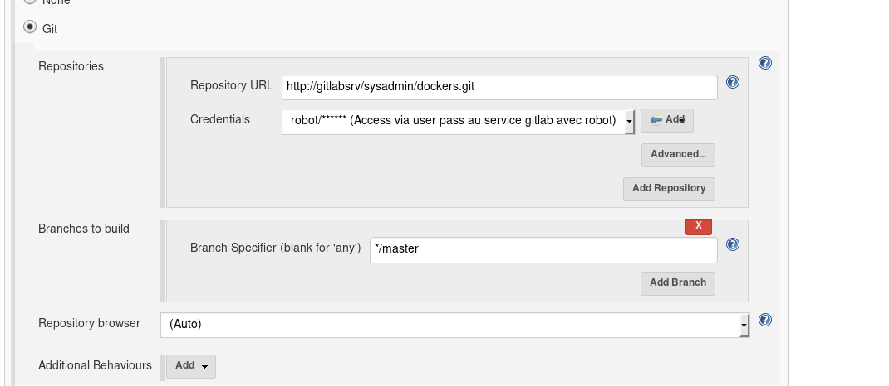

N'oubliez pas la restriction d'exécution :

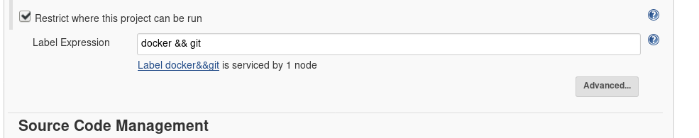

On met une définition juste pour être certain que ça passe quelque chose de simple :

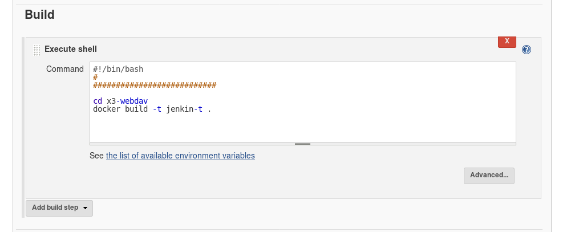

On exécute et on admire :D 

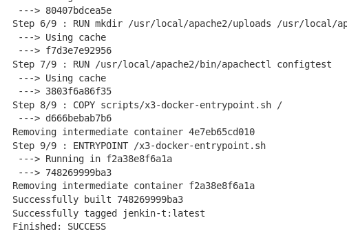

Donc nous sommes en mesure d'en Jenkins de réaliser la compilation d'une image docker sans problème . 
Nous voulions être aussi en mesure de réaliser un validation de notre image lors de la compilation , en d'autre mot un test unitaire.


### Création d'un système de validation du conteneur

Lors de la présentation DevOps j'avais insisté sur l'aspect de validation , de mise en place de teste unitaire préalable au déploiement. J'avais mentionné que ceci est principalement du côté du développement. Pour ce qui est des testes unitaire effectivement c'est plus pour l'équipe de développement par contre le côté test d'intégration nous incombe . Prenons l'exemple d'un conteneur pour le service **webdav**, quelle type de validation puis je réaliser ?

Pour rappel un service **webdav** est : 

> WebDAV (Web-based Distributed Authoring and Versioning) est un protocole (plus précisément, une extension du protocole HTTP) défini par le groupe de travail IETF du même nom. Décrit dans la RFC 49181, WebDAV permet de simplifier la gestion de fichiers avec des serveurs distants. Il permet de récupérer, déposer, synchroniser et publier des fichiers (et dossiers) rapidement et facilement. L'objectif principal de WebDAV est de rendre possible l'écriture à travers le web et pas seulement la lecture de données. WebDAV permet à plusieurs utilisateurs d'éditer le contenu d'un dossier web simultanément. Il saura gérer les droits d'accès aux fichiers (ou dossiers), en verrouillant momentanément les fichiers et dossiers édités.

Référence : [wikipedia webdav](https://fr.wikipedia.org/wiki/WebDAV)

Voici ce que nous allons valider, j'ai mis en place une liste de validation sur mon conteneur qui sont regroupés par type , je vais lister à haut niveau les validation. Bien entendu ceci évoluera dans le temps avec l'ajout de fonctionnalités

* TestWebDavContainer : Test sur le conteneur webdav avec une utilisateur valide ...
    * setUp : Initialisation pour le début du test , définition URL , utilisateur , mot de passe, ...
    * 01_CreateDirectory : Création d'un répertoire 
    * 02_UploadFile : Upload d'un fichier dans le répertoire
    * 03_ListDirectoy : Liste les fichiers contenu dans le répertoire 
    * 04_DownloadFile : Téléchargement du fichier et validation du hash afin de valider que le fichier est le même que lors de l'envoie
    * 05_BadLoginGetFile : Récupération d'un fichier qui n'existe pas 
* TestWebDavContainerBadLogin : Test sur le conteneur webdav avec une erreur d'authentification , l'ensemble des testes si dessus ne doivent PAS fonctionner.
    * setUp : Initialisation pour le début du test , définition URL , utilisateur , ...
    * 01_CanNotCreateDirectory : Création d'un répertoire alors que l'authentification est mauvaise
    * 02_CanNotListFile : Récupération de la liste des fichiers 
* TestWebDavContainerAnonymous : Test du le conteneur webdav en mode anonyme, l'ensemble des testes ne doivent pas fonctionner.
    * setUp : Initialisation pour le début du test , définition URL .
    * 01_CanNotCreateDirectory : Création d'un répertoire en mode anonyme 
    * 02_CanNotListFile : Liste des fichiers disponible.


Comme vous pouvez le voir il y a 3 bloques selon la situation , chaque bloque comprend une initialisation de l'environnement et des testes . 
Le script python est [data/webdav-validation.py](./data/webdav-validation.py) 

Lors de la présentation de la formation sur YouTube je prendrais un peu de temps pour décortiquer le scripts !

Ce script peut être utilisé de n'importe quelle manière , si vous regardez le script comprend la variable avec l'URL :

```python
 #############
 # Variables #
URL = "http://webdav"

```

Mais comme on aime les conteneurs, franchement à outrance pourquoi ne pas mettre ce script dans un conteneur :D , résultat un aura un conteneur qui valide un conteneur :P . Bon si vous me dites ou mais qui valide le conteneur qui valide le conteneur ... je rigole et ne répond pas :P .

#### Conteneur de validation pour webdav (x3-webdav-cli)

Pour les personnes qui disent que j'utilise trop docker je vais dire oui peut-être, mais ceci permet d'avoir plusieurs cas d'utilisation !! Ça augmente l'intérêt de plus ceci offre une grande opportunité de packaging de l'application. Bon fini l'introduction, on se lance dans le Dockerfile. 

Voici le Dockerfile brute [Dockerfile](./dockers/x3-webdav/validations/integration-testing/webdav-cli/Dockerfile) 

```
 # Description : Test client webdav 
 #
 # Author : Thomas Boutry <thomas.boutry@x3rus.com>
 # Licence : GPLv3+

FROM python:3.5
MAINTAINER Thomas Boutry "thomas.boutry@x3rus.com"

ENV DEBIAN_FRONTEND noninteractive

RUN mkdir /x3-apps/
COPY apps/requirements.txt /x3-apps/
RUN pip install --no-cache-dir -r /x3-apps/requirements.txt

COPY apps/* /x3-apps/

CMD ["python3", "/x3-apps/webdav-validation.py", "-v" ]
```

Donc rien de bien sorcier , ceci est un conteneur python classique pour une application :

* Image : J'utilise l'image officiel de référence python 3.5
* Application : Installation de l'application dans le répertoire **/x3-apps**  et j'utilise la définition des dépendances avec le fichier __requirements__ qui sera utilisé par l'application **pip**.
* Commande : Je démarre le script ( application ) en mode verbose 

Bien entendu afin d'orchestrer l'ensemble on va utiliser un petit [docker-compose.yml](./validations/integration-testing/docker-compose.yml) !

```
version: '2'
services:
    x3-webdav:
        image: my_private_registry/user/x3-webdav:build
        build: ../../
        container_name : 'x3-webdav-build'
        hostname: webdav.x3rus.com
        environment:
            - TERM=xterm
            - TZ=America/Montreal
            - USERS_PASS=thomas=toto
 
    x3-webdav-cli:
        image: my_private_registry/user/x3-webdav-int-validation:build
        build: webdav-cli/.
        container_name : 'x3-webdav-int-validation-b'
        hostname: webdav-cli.x3rus.com
        environment:
            - TERM=xterm
            - TZ=America/Montreal
        links:
            - x3-webdav:webdav
```

Donc nous avons 2 conteneurs le conteneur **x3-webdav** et le conteneur **x3-webdav-cli** .

* **x3-webdav** : Ce conteneur sera compilé afin de générer l'image , comme vous pouvez le voir le **PATH** du build est relatif définie dans 2 répertoire supérieur. Le nom de l'image dans la situation est **x3-webdav:build** , j'ai opté pour un nom différent afin de générer l'image sous un tag différent que le classique **latest** . Ce que je voulais m'assurer est que cette image ne sera jamais utilisé pour une utilisation en "production" . L'utilisation du tag **latest** est parfois utilisé car c'est celui par défaut. 

* **x3-webdav-cli** : Il y a le lien entre le conteneur de validation et le conteneur à valider :P ( __x3-webdav__ ) 

Voyons un peu le comportement quand on veut faire un teste , c'est partie :

```bash
$ cd dockers/x3-webdav/validations/integration-testing
$ docker-compose build                                                
Building x3-webdav                     
Step 1/9 : FROM httpd:2.4              
 ---> 50f10ef90911   
[ ... OUTPUT COUPE ... ]
 ---> f35226f62936                     
Removing intermediate container 1b36ecccf08d                                   
Successfully built f35226f62936        
Successfully tagged my_private_registry/user/x3-webdav-int-validation:build 

$ # démarrage du conteneur avec le service webdav

$ docker-compose up -d x3-webdav 
Creating x3-webdav-build ...           
Creating x3-webdav-build ... done   

$ docker ps                   
CONTAINER ID        IMAGE                                      COMMAND                  STATUS              PORTS               NAMES     
a76031aed37e        my_private_registry/user/x3-webdav:build   "/x3-docker-entryp..."   Up 1 second         80/tcp              x3-webdav-build           

$ # Je lance la validation du conteneur 

$ docker-compose run x3-webdav-cli                                    
Starting x3-webdav-build ... done      
test_01_CreateDirectory (__main__.TestWebDavContainer) ... ok                  
test_02_UploadFile (__main__.TestWebDavContainer) ... <!DOCTYPE HTML PUBLIC "-//IETF//DTD HTML 2.0//EN">                                                      
<html><head>                           
<title>201 Created</title>             
</head><body>                          
<h1>Created</h1>                       
<p>Resource /uploads/intergrationTesting/tux.png has been created.</p>
</body></html>
ok                                     
test_03_ListDirectoy (__main__.TestWebDavContainer) ... ok                     
test_04_DownloadFile (__main__.TestWebDavContainer) ... ok                     
test_05_BadLoginGetFile (__main__.TestWebDavContainer) ... ok                  
test_01_CanNotCreateDirectory (__main__.TestWebDavContainerAnonymous) ... ok   
test_02_CanNotListFile (__main__.TestWebDavContainerAnonymous) ... ok          
test_01_CanNotCreateDirectory (__main__.TestWebDavContainerBadLogin) ... ok    
test_02_CanNotListFile (__main__.TestWebDavContainerBadLogin) ... ok           

----------------------------------------------------------------------         
Ran 9 tests in 0.188s                  

OK                         

$ docker ps                   
CONTAINER ID        IMAGE                                      COMMAND                  STATUS              PORTS               NAMES
a76031aed37e        my_private_registry/user/x3-webdav:build   "/x3-docker-entryp..."   Up About a minute   80/tcp              x3-webdav-build

```

Comme vous pouvez le constater , j'ai utiliser l'instruction **docker-compose run** pour faire une exécution juste une fois du conteneur, pour la validation du système. 
Nous voyons dans la description ci-dessus que tous à bien fonctionné !

Donc nous avons notre conteneur de validation et nous avons confirmer que l'ensemble fonctionne à merveille !! Cependant pour le moment nous sommes dans une mécanique manuelle de validation. Nous allons maintenant voir comment j'ai réalisé l'intégration avec Jenkins. 

### Explication de la mécanique , la logique , le flux , workflow 

Bon je savais pas quoi mettre comme titre j'ai tous mis :P . Cette section est plus important que la réalisation proprement dite , car c'est ici la compréhension , la mécanique pur dans le script n'est vraiment que les instructions de la logique définie préalablement !!

**Rappel de l'objectif** : Je veux que le conteneur **x3-webdav** soit valider lorsqu'il y a des modifications dans ça définition que ce soit le contenu du __Dockerfile__ , le script de démarrage , fichier de configuration , ... De plus je désire que le conteneur final soit transmis à mon docker __registry__ privé. La définition du conteneur **x3-webdav** est dans un projet **git** contenant plusieurs définition de conteneur (x3-gitlab, x3-jenkins, ... ).

En utilisant __git__ nous avons la puissance de la décentralisation des __commits__ les informations des modifications arrivent dans la branche par __batch__ que ce soit par un push classique ou un __merge request__. Résultat il est possible que lors de la réception des données plusieurs répertoire de définition de conteneur soit inclut .

Le concept au niveau est : 

1. Lors de la réalisation __push__ ou __merge__ requête au serveur git le système va démarrer automatiquement la tâche Jenkins 
2. La tâches Jenkins aura plusieurs paramètres telle que : 
    * la liste des répertoires à traiter (exemple : faire le traitement pour x3-webdav uniquement , aucune opération s'il y a eu une modification pour x3-jenkins.
    * Ne réalise pas le traitement si le commit fut réalisé par une **robot** ( exemple : robot )
    * Exclusion des commit réalisé antérieur à une date donnée.
2. La tâches Jenkins va extraire le script pour la tâches depuis __gitlab__
3. Le système va donc parcourir les logs des commit afin d'identifier si la compilation est requise. Selon les critères :
    * Nom de l'utilisateur n'est pas exclut.
    * Le répertoire est bien inclus ou exclut de la liste à prendre en considération.
    * Le numéro de commit dans le répertoire ne fut pas déjà traité lors d'un build précédent.
    * Le message du commit n'est pas identifier à être exclut !
4. Lors de la compilation de l'image de validation, nous n'utiliserons pas le tag par défaut (__latest__) mais **build** l'objectif est que si nous sommes en train de valider un conteneur qui est en exécution sur la machine , il n'y aura pas "conflit" ou d'écrasement de l'image actuellement en utilisation.
5. Si la compilation fonctionne, il y a une phase de test avec le __unittest__  précédemment présenté.
6. Si le unit test fut un success une nouvelle compilation est réaliser pour générer le build avec le tag **latest** , car il y a eu validation du fonctionnement.
7. Le script va mettre en place un fichier de configuration avec le dernier numéro de commit réalisé avec succès, indiquant le dernière commit qui fut compilé avec succès , ce fichier sera commité et poussé au serveur git. L'objectif est de m'assurer qu'il n'y aura pas plusieurs compilation pour les même tâches.
8. Pousse l'image dans le docker registry

Voici une représentation graphique du résultat :


Bon là , je vois les yeux puis certain ce disent , woww il s'est vraiment fait chier pour mettre en place toute cette mécanique !! La réalisation de l'ensemble du processus fut long , et vous savez quoi je ne suis pas content de la solution que je vais vous présenter :P . Je travaille sur une autre version amélioré ou du moins différente :D, mais c'est une autre histoire. 

Il faut le voir comme un processus d'apprentissage , de plus si je met une mécanique qui augmentera mon niveau de confiance lors de changement des mes conteneur . Après j'ai pris combien de temps ?? Nous allons dire 2 semaines , 5 jours semaine 2 heures par jours , ça ne fait que (2 x 5)x 2 = 20 heures . C'est juste 2 séries de qualité discutables sur Netflix :P , que celui qui n'a jamais écouté une série au complet même si c'était moyen juste parce que on l'avait commencé :D . Sauf que dans la situation présente j'en ressort avec plus de connaissance et une mécanique en place qui me servira dans le temps :D.
C'est pas pire que faire des formations sur Youtube gratuitement pour aider les gens à progresser :P .

### Mise en place de la solution !!

J'aimerai signaler que la solution présenter n'est pas optimal , l'idéal serait de mettre en place une solution avec un repository d'artefact telle que **nexus** et d'utiliser **maven** pour l'orchestration du processus de build et la gestion des dépendances. Bon ceci étant dis ça reste quelque chose de très intéressant et ça nous permettra de voir l'amélioration de la solution. 

Avant de mettre en place l'activation automatique lors des commit dans gitlab, je vais mettre en place la solution avec des exécutions manuel du build.

#### Stockage du script qui réalisera la validation ( si le build doit avoir lieu ) 

L'ensemble de la logique fut réalisé dans un script python pour faire la validation si le build doit avoir lieu ou non. Bien entendu ce script doit être conserver pour être appeler le moment venu. Dans la situation présente je voulais avoir une petite gestion de la version du script que je manipulerai , donc je voulais avoir un répository, mais pas l'ensemble de la mécanique avec **nexus** . J'ai donc analyser mes options :

* Faire un git clone du projet 
* Utiliser le système des branches dans git
* Inclure dans mon dépôt de docker le script de __Jenkins__
* Utiliser le système d'artefact dans Gitlab 

J'ai opté pour la dernière option !

Je vais donc inclure dans le dépôt projet mon script de Jenkins . 

```bash
$ git remote -v
origin  http://thomas@git.training.x3rus.com/sysadmin/scripts.git (fetch)
origin  http://thomas@git.training.x3rus.com/sysadmin/scripts.git (push)

$ ls jenkins/
documentation  gitBuildValidation.py  jenkins-build-EXAMPLE.cfg  __pycache__  README.md

$ git add jenkins

$ git commit -m "Ajout des scripts pour Jenkins "
[master 348be69] Ajout des scripts pour Jenkins
 7 files changed, 587 insertions(+)
 create mode 100644 jenkins/README.md
 create mode 100644 jenkins/__pycache__/gitBuildValidation.cpython-36.pyc
 create mode 100644 jenkins/documentation/gitBuildValidation/WorkFlow.png
 create mode 100644 jenkins/documentation/gitBuildValidation/WorkFlow.xml
 create mode 100644 jenkins/documentation/gitBuildValidation/tasks/test-build-error.md
 create mode 100644 jenkins/gitBuildValidation.py
 create mode 100644 jenkins/jenkins-build-EXAMPLE.cfg

$  git push origin                                                                                                                                   
Password for 'http://thomas@git.training.x3rus.com':                           
Counting objects: 14, done.            
Delta compression using up to 4 threads.                                       
Compressing objects: 100% (12/12), done.                                       
Writing objects: 100% (14/14), 186.27 KiB | 10.96 MiB/s, done.                 
Total 14 (delta 0), reused 0 (delta 0) 
To http://git.training.x3rus.com/sysadmin/scripts.git                          
   83410f4..348be69  master -> master  

```

Si nous retournons dans __Gitlab__ et que nous allons dans le projet --> Repository --> Branches, nous avons la possibilité d'avoir un lien pour télécharger notre application / branche. 

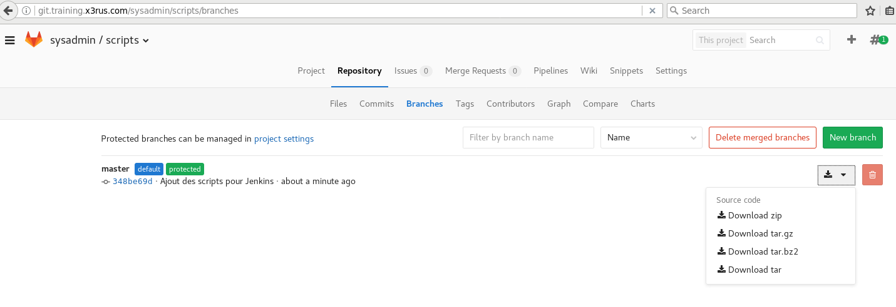

Je vais utiliser cette URL pour faire l'extraction de mon outils , ceci est le **wget** du début :

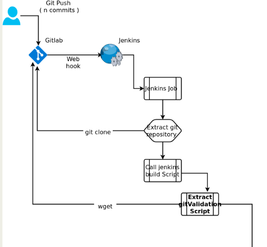

Donc nous démarrons la création de la tâche Jenkins pour mettre en place la solution dans l'outil, nous les 2 points requis :

* Les testes d'intégration.
* Le scripts de validation si le build doit avoir lieu.

#### Configuration de la tâche Jenkins

Donc nous allons faire la création d'un tâche **FreeStyle** nommé build-dockers , telle que mentionné nous allons y allé par étape :

1. Extraction du dépôt
2. Récupération du script de validation depuis l'artefact de git 
3. Exécution du script de validation pour savoir si nous devons traiter le commit
4. Compilation et test intégration du conteneur

Pour le moment ce sera tout, dans un deuxième temps nous ajouterons :

1. Le build automatique lors des commit .
2. La gestion multi-branche du dépôt.
3. Le commit post-build , si ce dernier a bien fonctionné afin définir le dernier build avec succès

Voici la définition de la tâche :

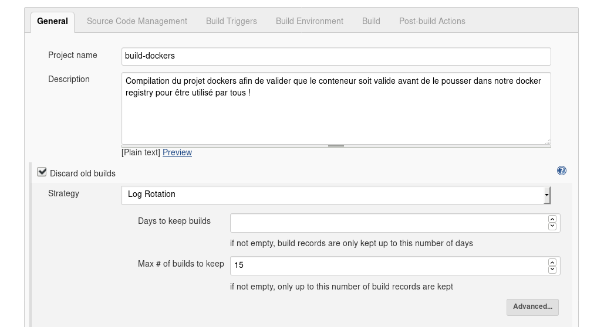
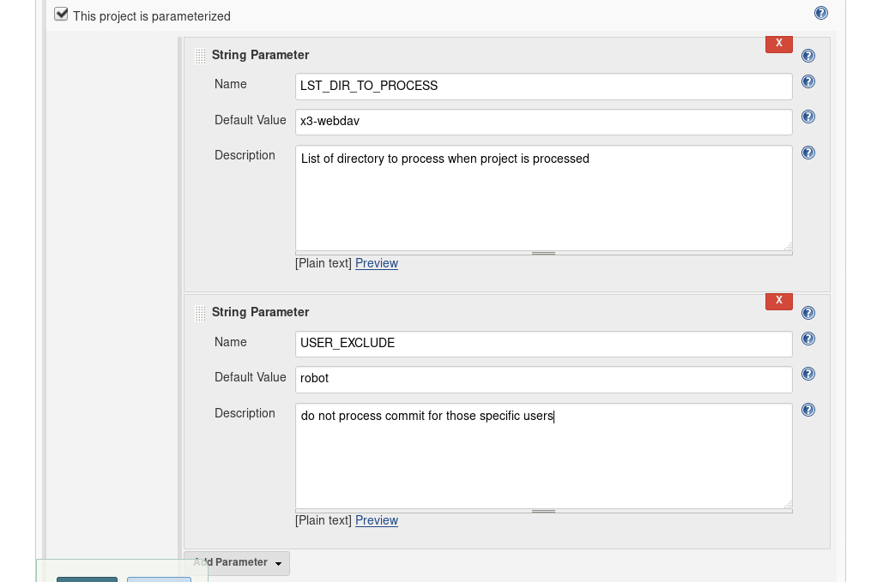
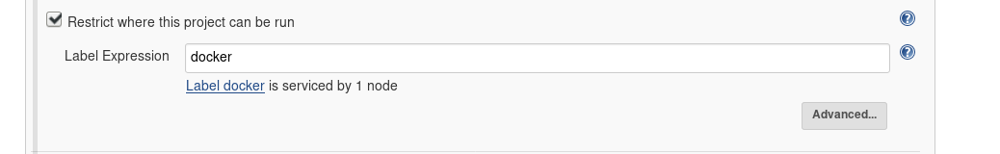
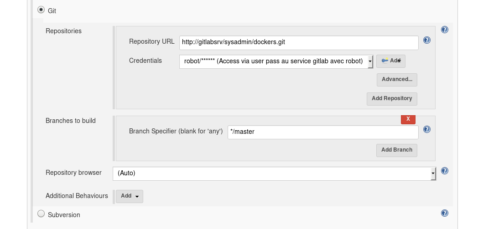
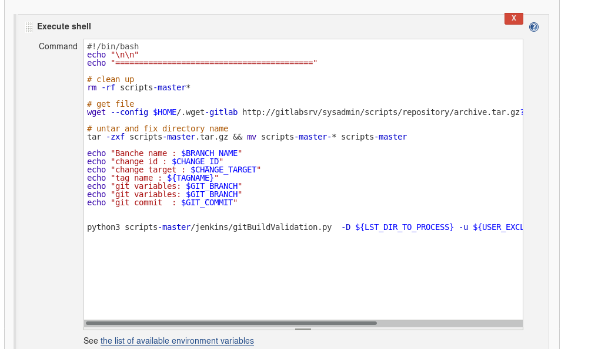

Voici le texte du contenu du champs Build. 

```bash
 #!/bin/bash
echo "\n\n"
echo "=========================================="

 # clean up
rm -rf scripts-master*
  
 # get file
wget --config $HOME/.wget-gitlab http://gitlabsrv/sysadmin/scripts/repository/archive.tar.gz?ref=master -O scripts-master.tar.gz
    
 # untar and fix directory name
tar -zxf scripts-master.tar.gz && mv scripts-master-* scripts-master

echo "Banche name : $BRANCH_NAME"
echo "change id : $CHANGE_ID"
echo "change target : $CHANGE_TARGET"
echo "tag name : ${TAGNAME}"
echo "git variables: $GIT_BRANCH"
echo "git variables: $GIT_BRANCH"
echo "git commit  : $GIT_COMMIT"

python3 scripts-master/jenkins/gitBuildValidation.py  -D ${LST_DIR_TO_PROCESS} -u ${USER_EXCLUDE}
```

Je vais me concentrer sur cette section, car pour le reste nous l'avons déjà "couvert" dans les autres session sur Jenkins .
Donc je supprimer l'ancienne définition du script , j'extrais le tar.gz du script Jenkins , j'affiche quelque information de débuggage qui ne seront pas pertinent lors de la mise en production ... mais bon c'est l'étape 1 de la mise en place. Finalement j'appelle le script avec **gitBuildValidation**.

Je pense qu'un petit teste passant serait bien , en se rappelant ce qui n'est PAS inclut .

Voici le résultat de la console : 

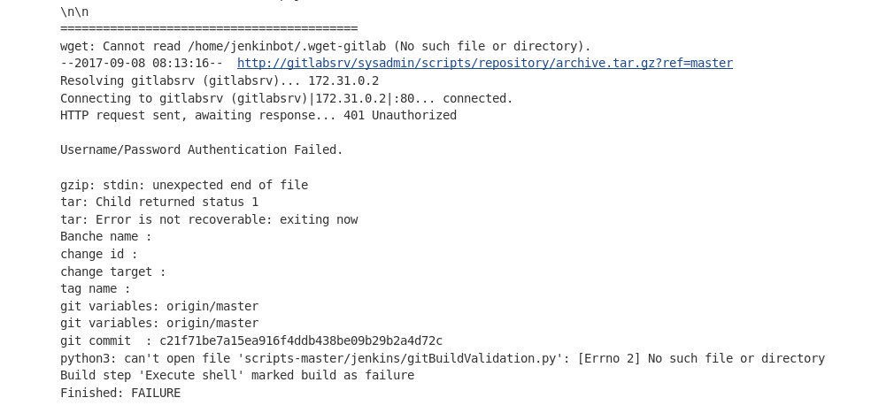

Effectivement j'ai définie un fichier de configuration pour le __wget__ malheureusement ce dernier n'est pas définie :-/ , ceci me permet d'avoir une authentification avec gitlab pour récupérer mon artefact. 

Nous allons donc corriger le conteneur **slave** afin d'avoir notre définition convenable :

Édition du fichier __Dockerfile__ :

```bash
$ cat jenkins/dockers/jenkins-slave/conf/wget-gitlab
header = PRIVATE-TOKEN: sRUqkvz7tvd8uoqs4LzH
```

Modification de la définition du Dockerfile :

```bash

  # Copie la clef publique pour jenkins 
COPY conf/authorized_keys /home/jenkinbot/.ssh/authorized_keys                 
COPY conf/wget-gitlab /home/jenkinbot/.wget-gitlab
```

On reprend le tous :

```bash
$ docker-compose stop jenkins-slave-dck                               
Stopping x3-jenkins-slave-dck-f ... done      

$ docker-compose build jenkins-slave-dck

$ docker-compose up -d jenkins-slave-dck 
x3-gitlab-f is up-to-date
Recreating x3-jenkins-slave-dck-f ... 
Recreating x3-jenkins-slave-dck-f ... done

```

Si votre Jenkins n'a pas automatiquement constater que le slave est de retour juste le redémarrer :D . 
On relance l'exécution :

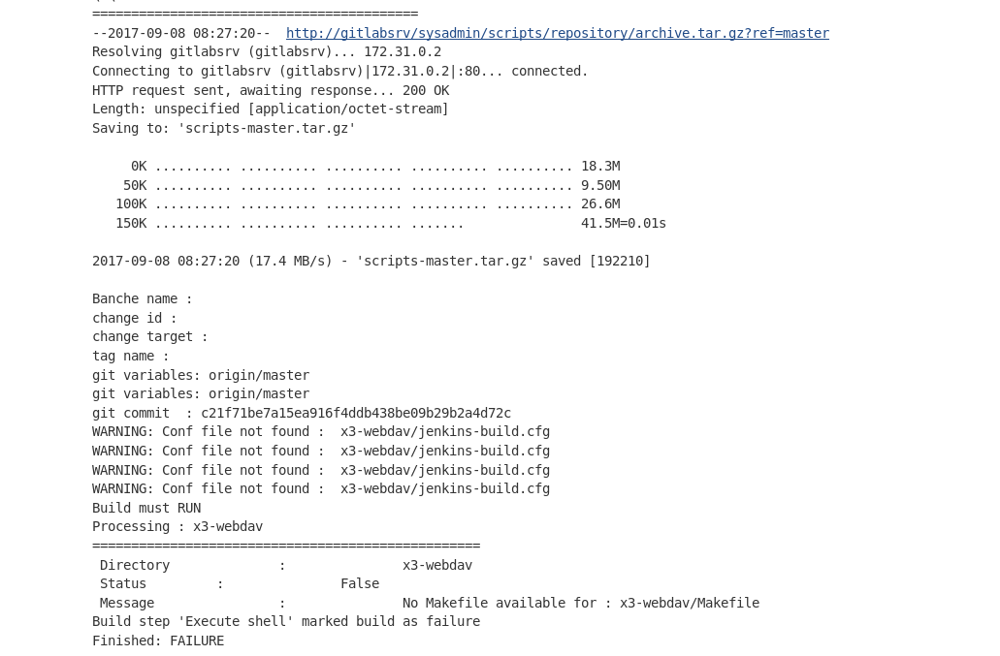

Donc nous avons une erreur , il n'y a pas de __Makefile__ , voyons maintenant ce point.

#### L'instruction du processus de build et validation

Bon comme chaque répertoire contenu dans le projet __dockers__ est particulier je peux difficilement avoir une recette de build. De plus comme toujours peut importe le projet il faut être en mesure de gérer les exceptions . J'aurais pu choisir de faire l'opération avec Maven , comme je suis plus vieux et que je voulais avoir une stratégie en place rapidement je suis allé avec un bon vieux Make qui fonctionne à merveille . La rédaction est aussi plus simple. 

Voyons le contenu du Makefile que je vais mettre en place :

```
 #
 #
 # Author : Thomas Boutry <thomas.boutry@x3rus.com>
 # Licence : GPLv3+
 # Description : Compilation / creation du conteneur x3-webdav
 # #############################################################

 ########
 # VARS #

DIR-VALIDATION = validations/integration-testing
DCK-COMPOSE-OPT = "--force-rm"

 ###########
 # TARGETS #

all: unittest build push

help:
        @echo Targets:
        @echo -e " all\t\tBuild, unittest and push ."
        @echo -e " unittest\tBuild contener with temporary name and perform integration script."
        @echo -e " build\tDo unittest and build real conteneur."
        @echo -e " push\t\tpush to the docker private docker registrie or public."

unittest: build-and-test cleanup-test

build-and-test:
        cd $(DIR-VALIDATION) && docker-compose build $(DCK-COMPOSE-OPT) && docker-compose up -d x3-webdav 
        cd $(DIR-VALIDATION) && docker-compose run x3-webdav-cli

cleanup-test:
        cd $(DIR-VALIDATION) && docker-compose stop x3-webdav && docker-compose rm --force

```

Donc pour les plus jeune ou les personnes qui n'ont pas eu la CHANCE de travailler avec un Makefile c'est bien simple rapidement :

* **target : ** : nous définissons des cibles (__target__) pour la réalisation de tache , exemple si je réalise la commande **make help** il réalisera la liste des echo définie dans les lignes dessous.  Il est possible de définir des dépendances , dans le cas de **unittest** il faut préalablement réalisé la cible **build-and-test** puis **cleanup-test** .

Voilà on va pas dire que c'est compliqué comme maven ;-).

Regardons les cibles présent :

* **all** : ceci est la cible par défaut quand on utilise la commande **make** sans argument
* **help** : affiche l'aide pour le Makefile 
* **unittest**: contient la cible : **build-and-test** et **cleanup-test**
* **build-and-test** : change de répertoire pour allé dans le lieu de la définition des testes , utilise la commande __docker-compose__ en forçant la recompilation de l'ensemble des conteneur et démarre le conteneur x3-webdav. Par la suite il démarre le conteneur de validation qui exécutera les testes unitaire ( x3-webdav-cli ).
* **cleanup-test** : réalise avec la commande docker-compose le nettoyage de l'environnement.

Ajout dans git du Makefile et j'ai constater que je n'avais pas ajouter la validation dans le dépôt :

```bash
$ git commit -m "Ajout du makefile et l ensemble de la mécanique de validation "                                                                     
[master 206f611] Ajout du makefile et l ensemble de la mécanique de validation
 8 files changed, 347 insertions(+)
 create mode 100644 x3-webdav/Makefile
 create mode 100644 x3-webdav/validations/READMEm.d
 create mode 100644 x3-webdav/validations/integration-testing/docker-compose.yml
 create mode 100644 x3-webdav/validations/integration-testing/webdav-cli/Dockerfile
 create mode 100644 x3-webdav/validations/integration-testing/webdav-cli/apps/requirements.txt
 create mode 100644 x3-webdav/validations/integration-testing/webdav-cli/apps/tux_avatars1.jpg
 create mode 100644 x3-webdav/validations/integration-testing/webdav-cli/apps/webdav-validation-ORI.py
 create mode 100644 x3-webdav/validations/integration-testing/webdav-cli/apps/webdav-validation.py 
```


Nous allons réaliser un autre test , soit dit en passant il y aura un autre problème :P et oui telle que mentionné lors de toutes mes formations j'aime laisser des erreurs . L'objectif est de voir la gestion du changement lors de la mise en place du système , car soyons honnête quand VOUS le ferez et quand JE le fait ça marche JAMAIS du premier coup , c'est la l'intérêt !

Voici le résultat : 

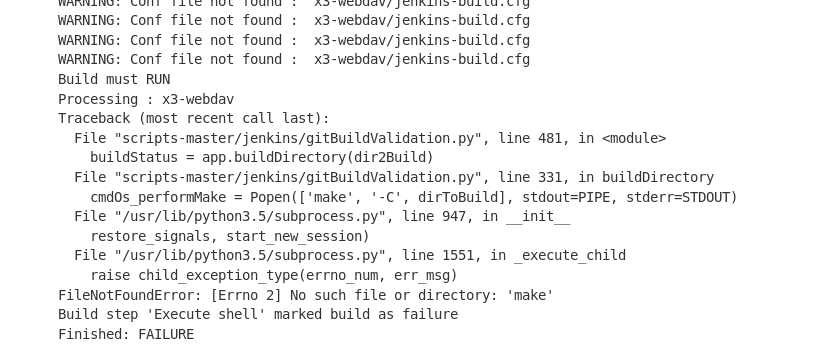

Donc il manque la commande make , en fait il manque plein d'application on va gagner du temps je vais modifier le Dockerfile pour ajuster l'ensemble .

Voici ce qui fut ajouté dans le Dockerfile :

```
 # ajout des package oublié :P         
RUN apt-get install -y libltdl7 git make  python3 python3-pip && \
    pip3 install docker-compose
```

On stop, détruit , rebuild le conteneur et le redémarre 

```bash
$ docker-compose stop jenkins-slave-dck && docker-compose rm jenkins-slave-dck && docker-compose build jenkins-slave-dck && docker-compose up -d jenkins-slave-dck 
```

Je voulais vous montrer que ça vous arrivera tous le temps , une nouvelle réalité , un nouveau requis pour votre slave. Dans notre cas nous utilisons docker ceci est très bien . Si vous êtes amené à devoir utiliser des machines physique que vous ne pouvez pas utiliser docker , utiliser un système de gestion de configuration telle que puppet. 

Exécutons de nouveau la tâche !

Voici un exemple du résultat :

```
Banche name : 
change id : 
change target : 
tag name : 
git variables: origin/master
git variables: origin/master
git commit  : 614016e1b023c790781fd755aed7b4890ad3f02d

WARNING: Conf file not found :  x3-webdav/jenkins-build.cfg
b'614016e1b023c790781fd755aed7b4890ad3f02d' : ['x3-webdav']
WARNING: Conf file not found :  x3-webdav/jenkins-build.cfg
WARNING: Conf file not found :  x3-webdav/jenkins-build.cfg
WARNING: Conf file not found :  x3-webdav/jenkins-build.cfg
WARNING: Conf file not found :  x3-webdav/jenkins-build.cfg
WARNING: Conf file not found :  x3-webdav/jenkins-build.cfg
WARNING: Conf file not found :  x3-webdav/jenkins-build.cfg
WARNING: Conf file not found :  x3-webdav/jenkins-build.cfg
WARNING: Conf file not found :  x3-webdav/jenkins-build.cfg
b'206f61194d43d5c93e974c15c56ea21ad97bd9c7' : ['x3-webdav', 'x3-webdav', 'x3-webdav', 'x3-webdav', 'x3-webdav', 'x3-webdav', 'x3-webdav', 'x3-webdav']
WARNING: Conf file not found :  x3-webdav/jenkins-build.cfg
WARNING: Conf file not found :  x3-webdav/jenkins-build.cfg
WARNING: Conf file not found :  x3-webdav/jenkins-build.cfg
WARNING: Conf file not found :  x3-webdav/jenkins-build.cfg
b'c21f71be7a15ea916f4ddb438be09b29b2a4d72c' : ['x3-webdav', 'x3-webdav', 'x3-webdav', 'x3-webdav']
Build must RUN
Processing : x3-webdav
 WARNING: Unable to commit config file for Directory : x3-webdav
==================================================
 Directory		:		x3-webdav
 Status		:		True
 Message		:		SUCCESS: build x3-webdavBuild time used : 0:00:15.714915
		##################################################
		b"make: Entering directory '/home/jenkinbot/workspace/build-dockers/x3-webdav'\n"
		b'cd validations/integration-testing && docker-compose build "--force-rm" && docker-compose up -d x3-webdav \n'
		b'Building x3-webdav\n'
		b'Step 1/9 : FROM httpd:2.4\n'
		b' ---> 50f10ef90911\n'
		b'Step 2/9 : MAINTAINER Thomas Boutry "thomas.boutry@x3rus.com"\n'
		b' ---> Using cache\n'
		b' ---> 2898140bee32\n'
		b"Step 3/9 : RUN sed -i 's/#LoadModule dav_module modules\\/mod_dav.so/LoadModule dav_module modules\\/mod_dav.so/g;          s/#LoadModule dav_fs_module modules\\/mod_dav_fs.so/LoadModule dav_fs_module modules\\/mod_dav_fs.so/g;          s/#LoadModule dav_lock_module modules\\/mod_dav_lock.so/LoadModule dav_lock_module modules\\/mod_dav_lock.so/g;          s/#LoadModule auth_digest_module modules\\/mod_auth_digest.so/LoadModule auth_digest_module modules\\/mod_auth_digest.so/g;          s/#Include conf\\/extra\\/httpd-dav.conf/Include conf\\/extra\\/httpd-dav.conf/g' /usr/local/apache2/conf/httpd.conf\n"
		b' ---> Using cache\n'
		b' ---> 5f563e36c63c\n'
		b"Step 4/9 : RUN sed -i 's/Require user admin/Require valid-user/g' /usr/local/apache2/conf/extra/httpd-dav.conf &&      sed -i 's/AuthType Digest/AuthType Basic/g' /usr/local/apache2/conf/extra/httpd-dav.conf &&     sed -i 's/Require method GET POST OPTIONS//g' /usr/local/apache2/conf/extra/httpd-dav.conf &&     sed -i 's/AuthDigestProvider file/Options Indexes/g' /usr/local/apache2/conf/extra/httpd-dav.conf\n"
		b' ---> Using cache\n'
		b' ---> 497c179df221\n'
		b'Step 5/9 : RUN cat /usr/local/apache2/conf/extra/httpd-dav.conf\n'
		b' ---> Using cache\n'
		b' ---> 80407bdcea5e\n'
		b'Step 6/9 : RUN mkdir /usr/local/apache2/uploads /usr/local/apache2/var     && chown daemon /usr/local/apache2/uploads /usr/local/apache2/var\n'
		b' ---> Using cache\n'
		b' ---> f7d3e7e92956\n'
		b'Step 7/9 : RUN /usr/local/apache2/bin/apachectl configtest\n'
		b' ---> Using cache\n'
		b' ---> 3803f6a86f35\n'
		b'Step 8/9 : COPY scripts/x3-docker-entrypoint.sh /\n'
		b' ---> Using cache\n'
		b' ---> 2036d73dd161\n'
		b'Step 9/9 : ENTRYPOINT /x3-docker-entrypoint.sh\n'
		b' ---> Using cache\n'
		b' ---> 8be11f9ecb08\n'
		b'Successfully built 8be11f9ecb08\n'
		b'Successfully tagged my_private_registry/user/x3-webdav:build\n'
		b'Building x3-webdav-cli\n'
		b'Step 1/8 : FROM python:3.5\n'
		b' ---> 538287ecca03\n'
		b'Step 2/8 : MAINTAINER Thomas Boutry "thomas.boutry@x3rus.com"\n'
		b' ---> Using cache\n'
		b' ---> c9a242023da0\n'
		b'Step 3/8 : ENV DEBIAN_FRONTEND noninteractive\n'
		b' ---> Using cache\n'
		b' ---> b2c4ea908669\n'
		b'Step 4/8 : RUN mkdir /x3-apps/\n'
		b' ---> Using cache\n'
		b' ---> ed457a0c010c\n'
		b'Step 5/8 : COPY apps/requirements.txt /x3-apps/\n'
		b' ---> Using cache\n'
		b' ---> 3f40c3fdcd3b\n'
		b'Step 6/8 : RUN pip install --no-cache-dir -r /x3-apps/requirements.txt\n'
		b' ---> Using cache\n'
		b' ---> 7c06bd6b3e43\n'
		b'Step 7/8 : COPY apps/* /x3-apps/\n'
		b' ---> Using cache\n'
		b' ---> b003626174ed\n'
		b'Step 8/8 : CMD python3 /x3-apps/webdav-validation.py -v\n'
		b' ---> Using cache\n'
		b' ---> 8f089227f49f\n'
		b'Successfully built 8f089227f49f\n'
		b'Successfully tagged my_private_registry/user/x3-webdav-int-validation:build\n'
		b'Creating x3-webdav-build ... \r\n'
		b'Creating x3-webdav-build\n'
		b'\x1b[1A\x1b[2K\rCreating x3-webdav-build ... \x1b[32mdone\x1b[0m\r\x1b[1Bcd validations/integration-testing && docker-compose run x3-webdav-cli\n'
		b'Starting x3-webdav-build ... \r\n'
		b'\x1b[1A\x1b[2K\rStarting x3-webdav-build ... \x1b[32mdone\x1b[0m\r\x1b[1Btest_01_CreateDirectory (__main__.TestWebDavContainer) ... ok\n'
		b'test_02_UploadFile (__main__.TestWebDavContainer) ... ok\n'
		b'test_03_ListDirectoy (__main__.TestWebDavContainer) ... ok\n'
		b'test_04_DownloadFile (__main__.TestWebDavContainer) ... ok\n'
		b'test_05_BadLoginGetFile (__main__.TestWebDavContainer) ... ok\n'
		b'test_01_CanNotCreateDirectory (__main__.TestWebDavContainerAnonymous) ... ok\n'
		b'test_02_CanNotListFile (__main__.TestWebDavContainerAnonymous) ... ok\n'
		b'test_01_CanNotCreateDirectory (__main__.TestWebDavContainerBadLogin) ... ok\n'
		b'test_02_CanNotListFile (__main__.TestWebDavContainerBadLogin) ... ok\n'
		b'\n'
		b'----------------------------------------------------------------------\n'
		b'Ran 9 tests in 0.162s\n'
		b'\n'
		b'OK\n'
		b'<!DOCTYPE HTML PUBLIC "-//IETF//DTD HTML 2.0//EN">\n'
		b'<html><head>\n'
		b'<title>201 Created</title>\n'
		b'</head><body>\n'
		b'<h1>Created</h1>\n'
		b'<p>Resource /uploads/intergrationTesting/tux.png has been created.</p>\n'
		b'</body></html>\n'
		b'cd validations/integration-testing && docker-compose stop x3-webdav && docker-compose rm --force\n'
		b'Stopping x3-webdav-build ... \r\n'
		b'\x1b[1A\x1b[2K\rStopping x3-webdav-build ... \x1b[32mdone\x1b[0m\r\x1b[1BRemoving integrationtesting_x3-webdav-cli_run_1 ... \r\n'
		b'Removing x3-webdav-build                        ... \r\n'
		b'\x1b[2A\x1b[2K\rRemoving integrationtesting_x3-webdav-cli_run_1 ... \x1b[32mdone\x1b[0m\r\x1b[2B\x1b[1A\x1b[2K\rRemoving x3-webdav-build                        ... \x1b[32mdone\x1b[0m\r\x1b[1BGoing to remove integrationtesting_x3-webdav-cli_run_1, x3-webdav-build\n'
		b"make: Leaving directory '/home/jenkinbot/workspace/build-dockers/x3-webdav'\n"
		##################################################
==================================================
Finished: SUCCESS
```

Maintenant que nous avons un système fonctionnel nous allons ajouter l'intégration avec gitlab. 

#### Intégration avec gitlab pour la compilation lors de commit

Nous sommes rendu au stade que la compilation de l'image du conteneur ainsi que la validation du conteneur fonctionne bien. Un des objectifs reste d'avoir cette compilation automatique lors de commit dans le projet .

Nous allons donc faire en sorte que lors d'un commit dans __gitlab__ le système appel automatiquement Jenkins. Nous allons donc aller dans gitlab pour activer cette configuration. 

Pour débuter nous allons activer la possibilité de démarrer une tâche depuis gitlab via une URL , nous éditons la tâche et nous allons dans la section  **Build Triggers** .

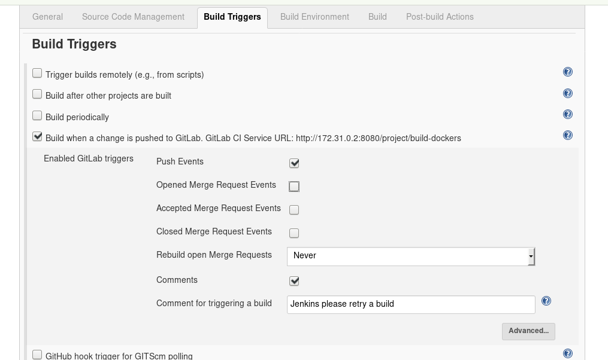

Vous voyez l'URL dans ma copie d'écran : __http://172.31.0.2:8080/project/build-dockers__ cette dernière est erroné en fait Jenkins utilise l'URL définie dans **Manage Jenkins** --> **Configure System** --> **Jenkins URL**. Avec l'utilisation de docker et l'adressage d'IP dynamique c'est le problème ...

Lors de l'écriture nous ajusterons pour que la communication soit adéquate , vous avez plusieurs option pour activé le build selon l'évènement. Nous sauvegardons et nous allons maintenant passer à l'étape de gitlab.

Nous allons dans le projet **sysadmin/dockers** dans la section **Settings** -> **Integrations** . Voici la configuration :

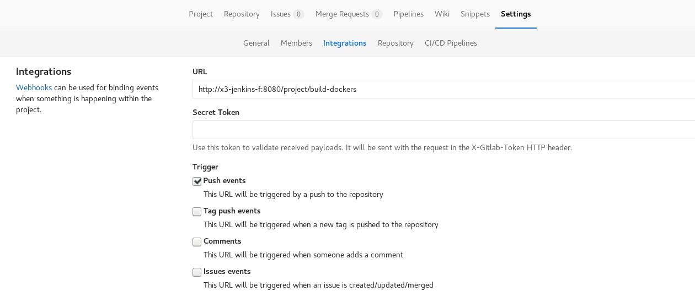

Et le résultat : 

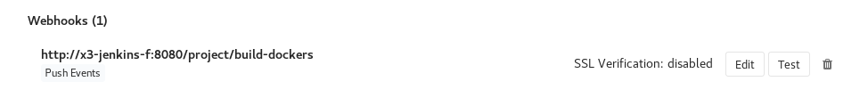

Comme vous pouvez le voir il y a le petit bouton **test** , si vous l'utilisez normalement vous devriez avoir un build qui démarre sur Jenkins. 

Et voici ce que l'on voit dans la liste des tâches réalisé :

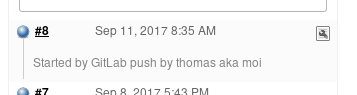

Donc le TEST est un **succès**, validons à présent le comportement lors d'un __push__ dans le projet. 

```bash
xerus@goishi [~/git/training/sysadmin/dockers/x3-webdav] {22026} 
٩(◠◡◠)۶ $ git remote -v
origin  http://thomas@git.training.x3rus.com/sysadmin/dockers.git (fetch)
origin  http://thomas@git.training.x3rus.com/sysadmin/dockers.git (push)

```

Je vais réalisé une modification afin de générer une erreur pour voir le comportement . 
Je vais ajouter un fichier qui n'existe pas dans le Dockerfile afin d'avoir une erreur :

```
 # erreur pour la visualisation du comportement dans jenkins
COPY ERREURFILE /tmp/
```

Je commit et pousse la modification sur le serveur :

```bash
$ git commit -a -m "Ajout erreur dans le Dockerfile "
[master 88be4fc] Ajout erreur dans le Dockerfile
 1 file changed, 3 insertions(+)
$ git push origin
Password for 'http://thomas@git.training.x3rus.com': 

```

Automatiquement la tâche Jenkins est appeler :

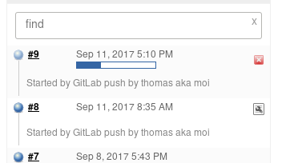

Et effectivement il y a une erreur sur le build :

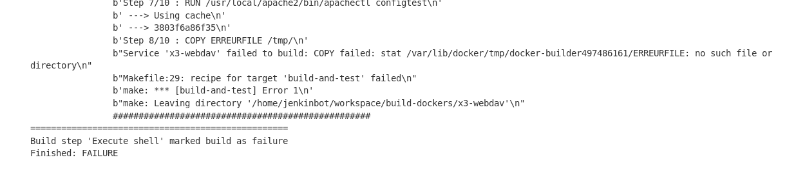

Nous allons refaire une modification pour remettre l'ensemble convenablement !! 

```bash
$ git commit -a -m "Supprimer l erreur dans le Dockerfile "
[master bb78f89] Supprimer l erreur dans le Dockerfile
 1 file changed, 3 deletions(-)
$ git push origin
 Password for 'http://thomas@git.training.x3rus.com': 
Counting objects: 4, done.
Delta compression using up to 4 threads.
Compressing objects: 100% (4/4), done.
Writing objects: 100% (4/4), 383 bytes | 383.00 KiB/s, done.
Total 4 (delta 3), reused 0 (delta 0)
To http://git.training.x3rus.com/sysadmin/dockers.git
  88be4fc..bb78f89  master -> master
```

Toujours le démarrage automatique et maintenant retour au bon fonctionnement :

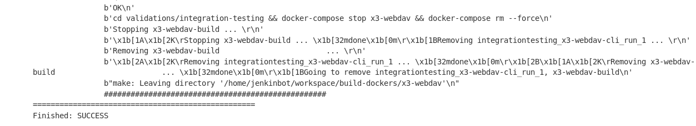

Nous avons donc une solution qui fonctionne en fait presque ... 

#### Gestion multi branche

Un des gros avantage de **GIT** est la possibilité d'avoir une gestion multi branche de nos projets , regardons le cas présent ce qui se passe si je crée un branche et que je réalise un commit.

```bash
xerus@goishi [~/git/training/sysadmin/dockers/x3-webdav] {22039} 
$ git branch
* master

$ git checkout -b ze-new-branche 
Switched to a new branch 'ze-new-branche'
$ git branch
master
* ze-new-branche

```

Dans cette nouvelle branche je vais définir une erreur dans le Dockerfile afin de voir le comportement , je remet sensiblement la même ligne que lors de la démonstration du "bon" fonctionnement de notre tâche automatique.

```
 # Nouvelle erreur 
 COPY ERREURFILE /tmp
```

```bash
$ git commit -a -m "erreur dans la branche ze-new-branche"
[ze-new-branche 2c0ec8e] erreur dans la branche ze-new-branche
  1 file changed, 3 insertions(+)

$  git push origin ze-new-branche                                                                                                                    
Password for 'http://thomas@git.training.x3rus.com':                           
Counting objects: 4, done.             
Delta compression using up to 4 threads.                                       
Compressing objects: 100% (4/4), done. 
Writing objects: 100% (4/4), 423 bytes | 423.00 KiB/s, done.                   
Total 4 (delta 3), reused 0 (delta 0)  
remote:                                
remote: To create a merge request for ze-new-branche, visit:
remote:   http://git.training.x3rus.com/sysadmin/dockers/merge_requests/new?merge_request%5Bsource_branch%5D=ze-new-branche
remote:                                
To http://git.training.x3rus.com/sysadmin/dockers.git                          
 * [new branch]      ze-new-branche -> ze-new-branche     
```

Jenkins a bien démarré la tâche , cependant il n'y a PAS d'erreur : 

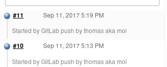

Mais pourquoi ? Si la tâche fut bien démarrer l'erreur ne fut pas attrapé ? Est-ce une erreur dans le script ? 

Non en fait le problème est que la tâche fut configurer pour extraire la branche **Master** peut importe la provenance du commit :P.

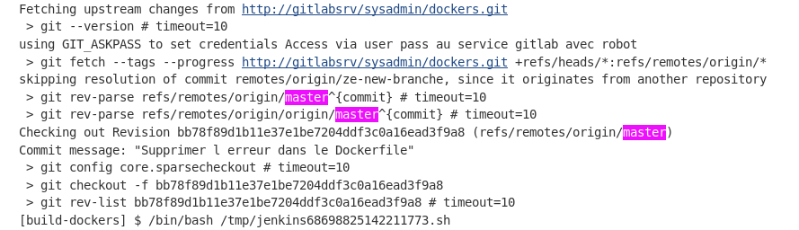

Nous pouvons le voir clairement dans la configuration de la tâche :

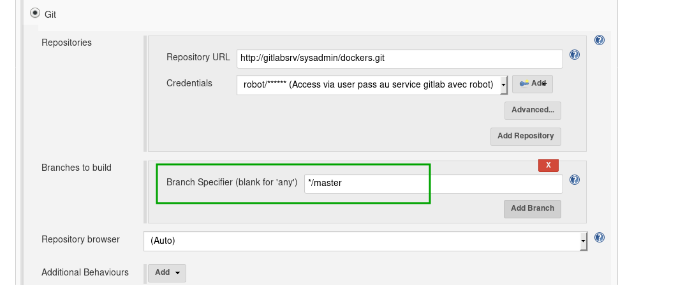

Ajustons la configuration pour prendre l'ensemble des branches . 

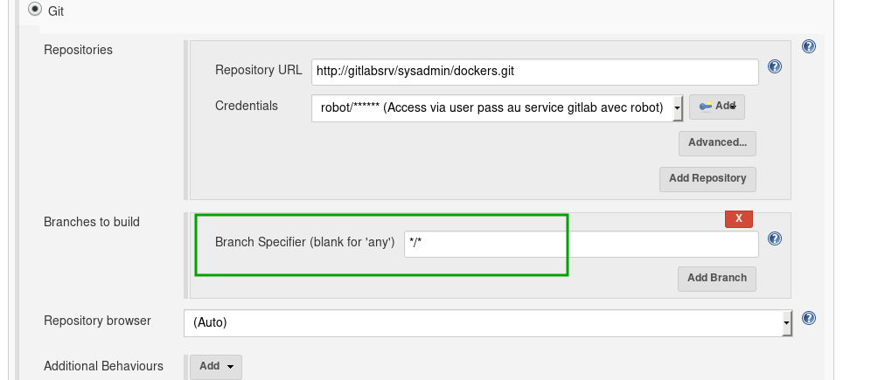

Nous réalisons un autre commit dans la branche pour faire le comportement ! 

```bash
$ git commit -a -m "erreur dans la branche ze-new-branche, avec un commit "                                                                          
[ze-new-branche 95e2bfc] erreur dans la branche ze-new-branche, avec un commit 
 1 file changed, 1 insertion(+), 1 deletion(-)                                 
$  git push origin ze-new-branche
Password for 'http://thomas@git.training.x3rus.com': 
Counting objects: 4, done.
Delta compression using up to 4 threads.
Compressing objects: 100% (4/4), done.
Writing objects: 100% (4/4), 390 bytes | 390.00 KiB/s, done.
Total 4 (delta 3), reused 0 (delta 0)
remote: 
remote: To create a merge request for ze-new-branche, visit:
remote:   http://git.training.x3rus.com/sysadmin/dockers/merge_requests/new?merge_request%5Bsource_branch%5D=ze-new-branche
remote: 
To http://git.training.x3rus.com/sysadmin/dockers.git
   2c0ec8e..95e2bfc  ze-new-branche -> ze-new-branche

```

Suite à l'opération nous avons maintenant une erreur dans Jenkins , suite au build automatique :

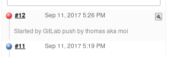

Voici donc le résultat à la console : 

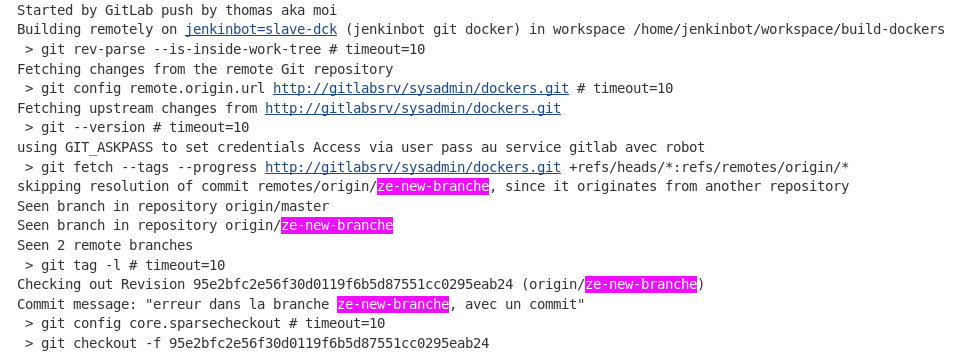

Nous voyons bien l'extraction de la branche ze-new-branche et l'erreur concorde :

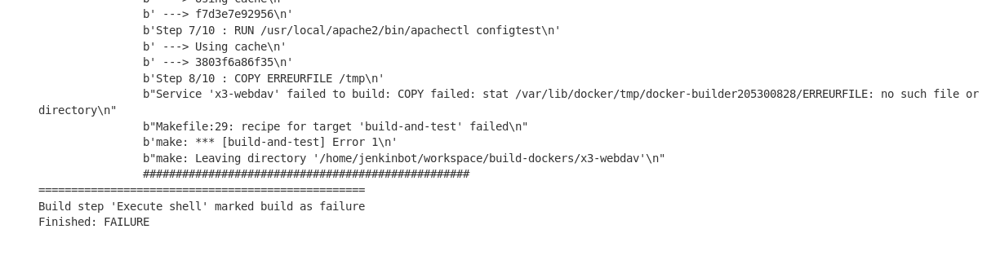 

Nous pouvons dire que c'est un succès ENCORE .

#### Optimisation et commit post-build 

Un point qui m'ennuie dans la solution présente est qu'il est probable que la compilation d'un même répertoire soit réalisé plusieurs fois inutilement , surtout si la compilation est initialisé manuellement. Est-ce importe ? Assurément pas, cependant j'avais envie de mettre en place un fichier de configuration dans le répertoire afin d'identifier le dernier build réalisé avec succès. C'est principalement un cas d'utilisation pour être en mesure plus tard de faire autre chose avec plus de valeur.

Bien entendu si je veux être en mesure d'ajouter ce fichier, ceci veut dire que ma tâche Jenkins doit être en mesure de poussé un commit dans __gitlab__ :P , de plus elle doit le faire uniquement en cas de succès :P .

Réalisons cette configuration afin de voir le comportement , **robot** à déjà les permissions de développeur sur le projet, il pourra donc réalisé le commit / __push__. 

Le script contient déjà la création du fichier de configuration , si nous regardons dans le répertoire de travail de la tâche nous trouverons ça définition : 

```bash
$ docker exec x3-jenkins-slave-dck-f ls /home/jenkinbot/workspace/build-dockers/x3-webdav/jenkins-build.cfg
/home/jenkinbot/workspace/build-dockers/x3-webdav/jenkins-build.cfg

$ docker exec x3-jenkins-slave-dck-f cat /home/jenkinbot/workspace/build-dockers/x3-webdav/jenkins-build.cfg
[DEFAULT]
commitdatebuildwithsuccess = 1505165825
```

Cependant ce fichier est inexistant dans le dépôt git :

```bash
$ ls                          
docker-compose.yml  Dockerfile  Makefile  README.md  scripts  validations
```

Veuillez prendre note que script python réalise déjà le commit du fichier :

```python
390         # Commit config file TODO : Ajouter un critère de commit pour que ce soit pas obligatoire
391         cmdOs_addConfFile = Popen(['git', 'add', configFullPath], stdout=PIPE, stderr=STDOUT)
392 
[ ... OUTPUT COUPÉ ... ]

201         Msg2Commit = commitMsg + " ; " + jenkinsInfo
202         # Commit config file TODO : Ajouter un critère de commit pour que ce soit pas obligatoire
203         cmdOs_commitConfFile = Popen(['git', 'commit', '-m', Msg2Commit], stdout=PIPE, stderr=STDOUT)
204 
```

Donc le script ajoute le fichier et le commit !! Par contre ce dernier n'est pas transmis au serveur __gitlab__. Nous allons donc modifier la configuration Jenkins pour inclure un __push__ commit si la compilation fut un succès ! 

Nous allons ajouter un **post build Action**, pour réaliser l'opération, de type **git publisher** .
Nous réaliserons l'opération QUE si le build fut un succès . Comme nous avons une gestion multi-branche du projet je vais pousser dans la branche identifier avec une variable ... 

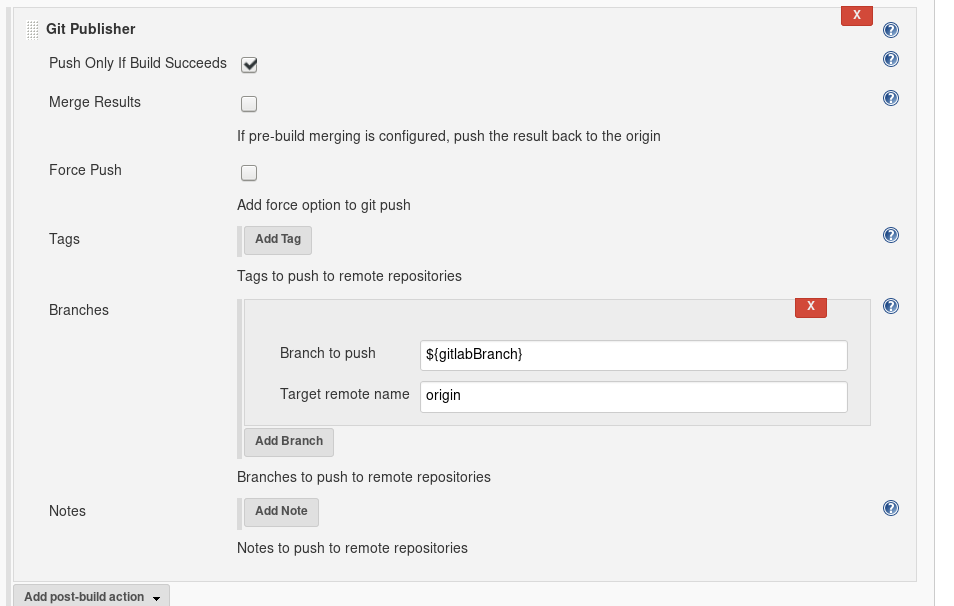

Nous allons maintenant valider l'opération en réalisant une modification :

```bash
$ git branch
  master
* ze-new-branche

$ git commit -a -m "Ajout modification du Dockerfile pour declancher un build "
[ze-new-branche 364e324] Ajout modification du Dockerfile pour declancher un build
 1 file changed, 1 insertion(+), 1 deletion(-)

$  git push origin ze-new-branche                                      
Password for 'http://thomas@git.training.x3rus.com':                           
Counting objects: 4, done.             
Delta compression using up to 4 threads.                                       
Compressing objects: 100% (4/4), done. 
Writing objects: 100% (4/4), 401 bytes | 401.00 KiB/s, done.                   
Total 4 (delta 3), reused 0 (delta 0)  
remote:                                
remote: To create a merge request for ze-new-branche, visit:
remote:   http://git.training.x3rus.com/sysadmin/dockers/merge_requests/new?merge_request%5Bsource_branch%5D=ze-new-branche
remote:                                
To http://git.training.x3rus.com/sysadmin/dockers.git                          
   3f39e94..364e324  ze-new-branche -> ze-new-branche   
``` 

Donc nous avons maintenant l'exécution du build avec le __push__ :

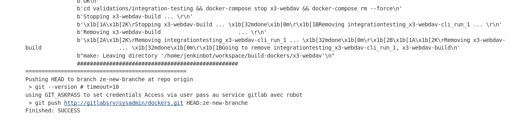

Bon j'y ai cru, mais il y a un problème :P , une belle occasion de visualiser l'analyse du problème, on va en profiter :D, je vais faire une sous-section pour bien diviser la configuration.

##### Analyse problème de commit post-build 

Si je regarde le résultat via l'interface de __gitlab__ je ne vois pas mon fichier **jenkins-build.cfg**. 

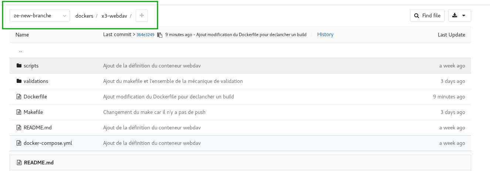

MAIS pourquoi , si je regarde le résultat à l'écran du build je vais avoir le message suivant : 

```
b'c21f71be7a15ea916f4ddb438be09b29b2a4d72c' : ['x3-webdav', 'x3-webdav', 'x3-webdav', 'x3-webdav']
Build must RUN
Processing : x3-webdav
WARNING: Unable to commit config file for Directory : x3-webdav
 ==================================================
 Directory		:		x3-webdav
 Status		:		True
 Message		:		SUCCESS: build x3-webdavBuild time used : 0:00:16.210810
		##################################################
```

Je vais établir une connexion afin de visualiser l'état du dépôt git sur le slave .

```bash
$ docker exec -it x3-jenkins-slave-dck-f bash
root@jenkins-slave-dck:/#

 # switch comme l'utilisateur jenkins
root@jenkins-slave-dck:/# su - jenkinbot

 # Je vais dans le répertoire , et je vois bien mon fichier
jenkinbot@jenkins-slave-dck:~/workspace/build-dockers/x3-webdav$ ls
Dockerfile  Makefile  README.md  docker-compose.yml  jenkins-build.cfg  scripts  validations

 # le fichier fut bien ajouter au dépôt git local 
jenkinbot@jenkins-slave-dck:~/workspace/build-dockers/x3-webdav$ git status    
HEAD detached at 364e324
Changes to be committed:
  (use "git reset HEAD <file>..." to unstage)

        new file:   jenkins-build.cfg
```

Donc tous semble bon mais le commit n'a définitivement pas fonctionné , nous allons donc essayer de le faire manuellement pour comprendre !

```bash
jenkinbot@jenkins-slave-dck:~/workspace/build-dockers/x3-webdav$ git commit -m "Test Ajout du fichier de configuration "

*** Please tell me who you are.

Run

  git config --global user.email "you@example.com"
  git config --global user.name "Your Name"

to set your account s default identity.
Omit --global to set the identity only in this repository.

fatal: empty ident name (for <jenkinbot@jenkins-slave-dck.train.x3rus.com>) not allowed

```

COOL , maintenant nous avons l'explication de la problématique, nous allons donc ajuste le conteneur pour qu'il ai un fichier de configuration pour git !! Résultat on va ENCORE le détruire :P , et le recréer , on maitrise maintenant :D.

```bash

$ cd dockers/jenkins-slave/conf
$ cat git-config
[user]
        email = robot@example.com
        name = Mon Robot

 # Ajout de la ligne suivante dans le Dockerfile

COPY conf/git-config /home/jenkinbot/.gitconfig
```

Bon on stop , rebuild , redémarrer :D.

```bash
$ docker-compose stop jenkins-slave-dck && docker-compose rm jenkins-slave-dck && docker-compose build jenkins-slave-dck && docker-compose up -d jenkins-slave-dck 
```

On redémarre le slave dans Jenkins s'il n'est pas repartie tout seul ... et on refait une modification dans le projet Docker pour visualiser que ça fonctionne bien !

```bash
$ git branch                  
  master                               
* ze-new-branche  
$ vim Dockerfile 

$ git commit -m "petite modification pour declancher le build "
[ze-new-branche 2265084] petite modification pour declancher le build
 1 file changed, 1 insertion(+), 1 deletion(-)

$ git push origin ze-new-branche
Password for 'http://thomas@git.training.x3rus.com': 
Counting objects: 4, done.
Delta compression using up to 4 threads.
Compressing objects: 100% (4/4), done.
Writing objects: 100% (4/4), 386 bytes | 386.00 KiB/s, done.
Total 4 (delta 3), reused 0 (delta 0)
remote: 
remote: To create a merge request for ze-new-branche, visit:
remote:   http://git.training.x3rus.com/sysadmin/dockers/merge_requests/new?merge_request%5Bsource_branch%5D=ze-new-branche
remote: 
To http://git.training.x3rus.com/sysadmin/dockers.git
   364e324..2265084  ze-new-branche -> ze-new-branche

```

Regardons les tâches qui furent généré par cette opération :


Nous voyons deux tâches, un déclenché par mon commit ( __push__ ) et une déclenché par le commit ( __push__ ) de l'utilisateur **Robot** nous avons donc eu un commit / push réalisé avec succès. 

Si vous vous rappelez j'ai exclut le traitement des commits réalisé par l'utilisateur **robot**, si je n'avais pas fait cette opération nous aurions eu un build en boucle. Chaque commit réalisé par **robot** aurait généré un autre commit , qui aurait généré un autre build !! 


### Conclusion 

Le système fonctionne bien et permet d'avoir une gestion des exceptions pour chaque répertoire, le gros défit lors de la mise en place des ce type de solution est que chaque "projet" conteneur à ça particularité . Résultat on essaye de mettre en place une solution pérenne qui s'applique à l'ensemble des cas d'utilisation . Nous sommes rapidement confronté au contrainte de telle ou telle situation, voici pourquoi ma solution offre la souplesse :

* Utilisation d'un Makefile par répertoire , qui définie le travail à réaliser , ceci permet d'avoir un cas de figure distinct pour chaque "projet". 
* Le script Jenkins ne réalise pas grand chose et essaye de laisser l'ensemble du traitement à Jenkins.
