# Let's encrypt

Site web officiel : https://letsencrypt.org/
Référence wikipedia FR : https://fr.wikipedia.org/wiki/Let%27s_Encrypt

## Introduction pour let's encrypt

Nous allons voir le système de let's encrypt , ce projet est actif depuis plusieurs années déjà 3 décembre 2015 dans ça version bêta. J'ai mis du temps avant de vraiment adopté le système, car j'avais quelque inquiétude sur la sécurité . Bon quand je dis quelque inquiétude, j'ai pas lu l'ensemble du code pour essayer de trouver une faille ... je voulais simplement m'assurer de comprendre le fonctionnement du système au niveau de la documentation. 

Bon je parle de mes inquiétudes, mais j'ai oublié de vous dire c'est quoi ... :P

Let's Encrypt (abrégé LE) est une autorité de certification lancée le 3 décembre 2015 (Bêta Version Publique). Cette autorité fournit des certificats gratuits **X.509** pour le protocole cryptographique **TLS** au moyen d'un processus automatisé destiné à se passer du processus complexe actuel impliquant la création manuelle, la validation, la signature, l'installation et le renouvellement des certificats pour la sécurisation des sites internet. En septembre 2016, plus de 10 millions de certificats ont été délivrés.

En février 2017, Let's encrypt était utilisé par 13,70% du total des domaines français enregistrés.

En d'autre mot , pour vos site web au lieu d'utiliser un certificat auto signé, vous pouvez utiliser Let's encrypt qui vous fournira un certificat VALIDE dans le navigateur pour votre nom de domaine. Il y a quelques limitations , Let's encrypt ne peut être utilisé QUE pour les sites web publique, car ce dernier valide l'adresse IP du domaine , nous verrons le détail dans l'explication du protocole sous peu.

* **Objectif du projet**

Il y a plusieurs objectif au projet :

1. Permettre de sécurisé simplement des sites web sans Frais additionnel. 
2. Permettre d'avoir un certificat **TLS** sans intervention humaine.

Le deuxième point est particulièrement intéressant dans notre contexte de conteneur Docker et de l'ensemble de l'automatisation du processus de déploiement de système. La mise en place d'un certificat était toujours un "casse tête" pour savoir comment nous allions gérer cette particularité par système surtout si nous avions pas de certificat **wildcard** 

Nous verrons dans l'explication du fonctionnement que pour réaliser le deuxième point nous aurons besoin d'un agent sur le serveur qui réalisera la demande de certificat (**CSR**) , ainsi que l'installation . Ceci est réalisé grâce au protocole [ACME protocole](https://ietf-wg-acme.github.io/acme/).

* **Compatibilité avec les fureteurs**

Bien entendu certain vous encore se dire c'est un truc de barbu encore de logiciel libre , ça ne fonctionne qu'avec les fureteurs libres ... Et bien non, voici la liste des systèmes compatibles : https://letsencrypt.org/docs/certificate-compatibility/

Bien entendu si vous utilisez encore Windows XP SP1 , avec le Internet Exploser qui vient avec , je pense que vous avez de toute manière un plus gros problème que juste la non reconnaissance du certificat Let's encrypt. :P.


## Comment ça fonctionne ?

Bien entendu je vais réalisé une vulgarisation du processus , si vous voulez la version original , voici le lien  [https://letsencrypt.org/how-it-works/](https://letsencrypt.org/how-it-works/). 

L'exemple fournit reprend celui du site web , donc nous allons voir la mise en place d'un service web pour l'adresse [http://example.com](http://example.com) , à ce stade nous allons nous concentrer sur le protocole et non la configuration de apache ou nginx . Nous reviendrons sur le setup pour nginx dans la seconde partie .

Je part du principe que vous êtes confortables avec le système de certificat , si ce n'est pas le cas , prenez quelque minutes pour consulter la vidéo sur le sujet sur ma chaîne youtube : [Comprendre httpS ( certificat et échange avec le serveur)](https://www.youtube.com/watch?v=DilZTPJFVH4&list=PLrspRZ5MjONw39vYQj-Ay6W_duE-8QuEq&index=2) et le texte [Mise en place d'un site httpS](../apache/serveur_web.mkd).


### Méthode classique 

Pour les personnes qui vont pas suivre les liens :P , il y a 2 partie :

* le certificat SSL : composé de 2 partie 
    * La clé publique du serveur 
    * La signature du centre de certification (verysign, godaddy, digicert, ... )
* La clé privé : qui est en combinaisons avec la clé publique, l'ensemble de la sécurité est basé sur cette clé.

Pour le reste vous consulterez réellement ma documentation ou vidéo.

Dans la méthode classique manuelle , le processus est simple :

1. Génération d'une pair de clés : 
    * Clé publique  : aussi appelé CSR (Certificate Signing Request), ce dernier contient les informations du serveur telle que le __Common Name__ L'URL associé au certificat.
    * Clé privé : ce fichier doit être sécurisé, car l'ensemble du processus de chiffrement est réalisé en se basant sur le fait que cette clé est PRIVÉ et que personne n'y a accès , sauf le service pour déchiffrer les communications.
2. L'humain transmet le CSR à l'autorité de certification , ce dernier signe la requête et transmet le certificat finale.
3. L'humain installe le certificat , la clé ainsi que la chaine de certificats du CA.

### Méthode Let's encrypt

Si nous regardons froidement l'ensemble du processus de génération et d'installation peut être automatisé , le problème réside dans la demande à l'autorité de certification. Let's encrypt se base sur le protocole [ACME](https://ietf-wg-acme.github.io/acme/draft-ietf-acme-acme.html) qui est encore en mode brouillon :P pour l'automatisation de la gestion des certificats. Libre a vous de lire le protocole, nous allons le voir à haut niveau pas besoin de vous taper la lecture.

Bien entendu, pour remplacer le processus de l'humain vous aurez besoin d'avoir un agent sur votre système qui réalisera les opérations. Si l'idée d'avoir un processus supplémentaire sur votre système vous décourage , prenez tous de même le temps de lire le texte ci-dessous. Particulièrement la section de l'implantation avec docker et nginx personnellement c'est ce qui m'a fait changer d'avis :P, vous reviendrez après sur la théorie :P.

Il y a 2 grande opération qui est réalisé par l'agent :

1. L'agent prouve au CA (Certificat Authority) de  Let's encrypt que le service web contrôle le domaine . **IMPORTANT** : vous ne pouvez utiliser Let's encrypt QUE et UNIQUEMENT pour des sites web publique, accessible depuis Internet !!
2. L'agent demande un certificat, renouvelle , révoque les certificats 


#### Validation du domaine 

Il existe 2 méthode pour prouver au Certificat d'autorité que nous sommes bien en charge du domaine , la première via le protocole HTTP(S) ou via DNS. Le problème avec le système de DNS est qu'il est probablement moins simple de l'automatiser. Bien entendu il est possible d'avoir du DNS dynamique pour faire l'opération cependant la méthode HTTP est plus fluide. Si vous contrôlez le site web , vous aurez tous en main pour mettre en place la configuration, alors qu'avec le DNS ça demandera une interaction avec l'autre équipe. 
Pour simplifier le document je vais me concentrer sur la validation HTTP , pour la partie DNS le beau RFC est la pour vous : [section 8.5. DNS Challenge](https://ietf-wg-acme.github.io/acme/draft-ietf-acme-acme.html#rfc.section.8.5)

#### Validation du domaine via Http et configuration serveur

Pour les amoureux des RFC, donc de la grosse théorie vous pouvez lire la section [8.3. HTTP Challenge](https://ietf-wg-acme.github.io/acme/draft-ietf-acme-acme.html#rfc.section.8.3). Pour les autres on va avoir une vue d'ensemble mais n'hésitez pas à consulter le RFC si vous avez l'impression que ça ne cole pas j'ai peut-être manqué quelque chose, j'ai pas la vérité infuse :D.

Donc passons à l'explication, la méthode est identique en HTTP ou HTTP**S**, dans le cadre de la configuration en __TLS__ vous devrez avoir une configuration "convenable" vous pouvez avoir un certificat auto-signé pour les besoins du processus initiale.

* Étape 1 


Lors du démarrage l'agent génère une pair de clé , qui n'est **PAS le certificat pour le site web**, ceci sera utilisé lors des échanges avec le service CA de Let's encrypt. Prendre note que la clé privé généré ne sort JAMAIS du serveur !! Vous devrez aussi spécifier le répertoire __DocumentRoot__ du site afin que l'agent dépose des fichiers qui seront utilisé lors de l'échange avec l'autorité de certification (Let's encrypt). 

L'agent va aussi créer un compte automatiquement avec le service Let's encrypt , l'assignation d'une adresse courriel sera assigné au compte , mais ceci n'est PAS obligatoire !

* Étape 2 

L'agent communique avec le CA (Let's encrypt) afin de définir une méthode à utiliser pour la validation du nom de domaine , telle que mentionné plus haut, HTTP(s) , DNS, ... Il n'est pas encore claire la séquence ou comment le choix est réalisé , assurément le choix revient à l'agent , mais je n'ai pas encore identifier la séquence de la sélection.
Telle que mentionné plus haut, nous nous concentrerons sur la partie HTTP/HTTP(S).

* Étape 3 

Suite à la sélection de la méthode de validation en HTTP/HTTP(S) par l'agent le CA demande à l'agent de placer un fichier sous le site web , quand nous disons dans le site web pas de panique il ne va rien écraser. Il le définie sous les répertoires : __https://example.com/acme/__ et __https://example.com/.well-known/acme-challenge/__ 

Voici une représentation graphique du processus :


Le fichier ci-dessus doit être définie à l'URL : __https://example.com/8303__ et doit contenir : __ed98__ , l'agent va aussi signer le fichier avec la clé privé. Comme nous signons avec la clé privé , toutes les personnes qui ont la clé publique pourrons valider la signature.

Je le répète si vous voulez le détail réelle consulter le RFC : [8.3. HTTP Challenge](https://ietf-wg-acme.github.io/acme/draft-ietf-acme-  4acme.html#rfc.section.8.3) !!

L'agent informe le CA que le fichier est maintenant présent pour la prochaine étape.

Le serveur CA de Let's encrypt communique à l'URL fournit et valide que le fichier est bien présent dans le répertoire que le contenu est valide ainsi que la signature du fichier correspond à la clé publique échangé préalablement.


* Étape 4 

L'agent est donc maintenant en mesure de communiquer avec le CA et validation du domaine est complété. Il est maintenant en mesure de faire des demandes de certificat , des révocations , des renouvellements , ...

L'agent va donc générer une nouvelle pair de clé , cette fois pour le site web , donc un [CSR (Certificate Signing Request)](http://tools.ietf.org/html/rfc2986) ceci est la clé publique avec les informations pour un certificat web ( URL , adresse courriel , Pays, Province , ... ). Bien entendu la clé privé associé sera aussi généré dans la foulé , cette clé privé ne sortira **jamais** du serveur. 

Pourquoi cette double création de pair de clé ? Car un agent peut géré plusieurs certificat TLS pour let's encrypt !

L'agent va transmettre la demande de certificat au serveur Let's encrypt , cette demande sera signé avec la clé privé utilisé pour la communication entre l'agent et le serveur . 


Le CA Let's encrypt valide , la signature de la demande ainsi que le nom de domaine utilisé dans la demande . Si l'ensemble est conforme il transmet le certificat valide à l'agent pour qu'il l'installe.


## Mise en place manuellement

Bon honnêtement , comme on utilise Docker je vais pas vraiment le couvrir , je vais vous laisser vous amuser sur le sujet puis on vous me donnerait des nouvelle :P. 

Je vous suggère de consulter l'application [certbot](https://certbot.eff.org/) la doc est super ... 

Bon mais comment ça s'intègre tous ça dans Apache par exemple , car on a fait pas mal d'apache on sait la configuration du SSL en gros. Si le fichier est gérer par un agent comment j'indique à Apache que le certificat est "dynamique" . 
L'application [certbot](https://certbot.eff.org/) réalisera la configuration , automatiquement d'apache pour le bon domaine, mais comme on aime savoir ce qu'il fait prenons 2 minutes pour voir le résultat. Car il y a pas / peu de documentation sur le sujet puis on aime savoir un peu :D.

Donc lors de l'utilisation de la commande certbot .

```bash
$ sudo certbot --apache -d example.com
```

Vous aurez un répertoire **/etc/letsencrypt/live** , dans la pratique l'application __certbot__ qui utilise __libaugeas__ pour ceux qui on utilisé un peu puppet ça permet de modifier le contenu d'un fichier sans altérer l'ensemble. Voici le résultat de la modification :

```
<VirtualHost *:443> 

     [Webserver setup. DocumentRoot, ServerName, etc. You should already have this information for your website for port 80 and regular web traffic.] 

     SSLEngine on 

     SSLCertificateFile /etc/letsencrypt/live/[yourdomain].com/fullchain.pem 

     SSLCertificateKeyFile /etc/letsencrypt/live/[yourdomain].com/privkey.pem

</VirtualHost>
```

En d'autre mot pour apache ce n'est qu'un fichier de certificat et de clé tout à fait normale :D. 

### Renouvellement de certificat 

Les certificats fournit par Let's encrypt ont une validité de **90 Jours** c'est pas long , mais c'est gratuit , il est donc **TRÈS** important de mettre en place un système de renouvellement automatique. Vous pouvez simplement mettre dans le crontab de l'utilisateur root :

```bash
$ sudo crontab -e

0 0 * * sun /usr/bin/certbot renew

```

Bon mais c'est mieux les dockers :P 


## Limitation , yep y en a toujours ... 

Nous avons un système libre d'accès , donc il fut mis en place un système de limitation afin d'assurer une utilisation raisonnable du système. 

Premièrement, il n'y a **PAS de limite pour le renouvellement des certificats**, de plus il est possible d'utiliser [L'environnement de staging](https://letsencrypt.org/docs/staging-environment/) pour l'ensemble du processus de validation de la solution .

Voici donc un résumé des limitations :

* **Certificats par domaine enregistré**: limite de  20 par semaine, prendre note que www.example.com , mail.example.com , imap.example.com , www.example.fr compte pour 2 domaines soit exemple.com et exemple.fr.
* **Certificats par nom par domaine** : limite de 100 par semaine par domaine enregistré par semaine, en d'autre mot si je reprend l'exemple ci-dessus www.example.com , mail.example.com et imap.example.com , il me reste 97 certificats utilisables pour le domaine example.com , dans le cadre de www.example.fr il m'en reste bien entendu 99 . En d'autre mot vous avez une limite de 2,000 certificats nommé par semaine ( 20 nom domaines * 100 nom de certificat (CN) )
* **Certificat dupliqué** : limite de 5 par semaine, un certificat est considéré comme dupliqué s'il contient le nom exacte qu'un autre.
* **Renouvellement de certificat** : Je le répète , il n'y a PAS de limitation sur le nombre de renouvellement de certificat !!
* **Erreur de validation entre l'agent et le CA** : limite de 5 erreurs par compte, par hostname , par heure
* **Création de compte** : limite de 10 compte par IP par 3 heures, limite de 500 compte par range d'adresse IP IPv6 /48 par 3 heures.

Voici le lien vers le site officiel :  https://letsencrypt.org/docs/rate-limits/

Ça fait le tour , je voulais surtout faire une vue globale , car après on démarre le processus d'intégration continue et s'il y a un problème, car vous avez atteint la limite ce n'est pas agréable et on comprend pas pourquoi ... Vous vous en rappellerez probablement pas mais vous aurez l'occasion de revenir ici :D .


## Mise en place avec Docker Automatique ( Wowww !! )


Si nous mettons docker de coté quelques minutes pour revenir à la base ou du moins à la raison pourquoi j'ai commencer à regarder le système Let's encrypt et surtout la mise en place d'une solution de proxy nginx ... 

Voici le cas typique d'une configuration, vous avez plusieurs site web que vous désirez isolé les un des autres pour plusieurs raison ( sécurité , facilité de déploiement avec docker , ... ) . Par contre chaque application utilise le port 80 et/ou le 443 , malheureusement sur le docker host vous n'avez que 1 port 80 /443 de disponible. Vous avez plusieurs options utilisé une adresse IP distinct pour chaque conteneur , peut-être possible avec du IPv6, mais en IPv4 se sera plus dur ... L'autre option est de mettre en place un reverse proxy pour faire le travail.

Voici une représentation graphique du résultat :

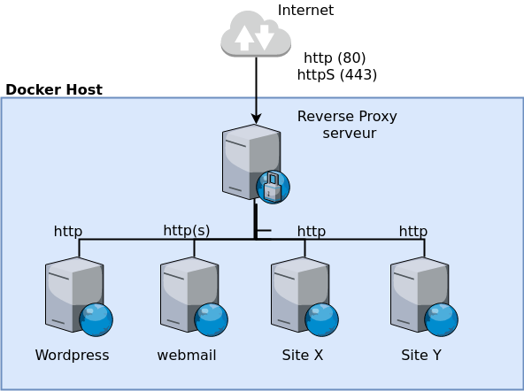

Vous verrez cette configuration très souvent , pour facilité la disponibilité des services sans que l'utilisateur soit obligé d'avoir définir dans l'URL le port à utiliser ( Exemple : :81 , :82, :83 , ... ) 

Bien entendu si vous avez un système de type Kubernet , Swarm voir Rancher vous aurez des systèmes de proxy intégrer pouvant vous facilité la vie , cependant si vous n'avez qu'un host , ou non mis en place Kubernet vous avez probablement mis en place cette configuration.

Bien entendu la problématique qui arrive comment gérer ce proxy , vous gérez probablement manuellement ce système et si vous êtes comme moi vous commencez à  trouver ça lourd. 
Lors de recherche et analyse je suis tombé la dessus , en fait j'ai d'abord trouvé le conteneur et après les explications :P .

* http://jasonwilder.com/blog/2014/03/25/automated-nginx-reverse-proxy-for-docker/


Nous allons donc voir comment mettre en place un reverse proxy avec Nginx qui se configurera dynamiquement et comme nous sommes partie sur le thème Let's encrypt comment ajouter l'intégration avec ce système.

### Gestion dynamique du proxy 

Reprenons les étapes que nous faisons lors de la configuration manuel , ce qui devra être "automatique" ; 

1. Démarrage d'un conteneur applicatif "web" 
2. Extraction des informations IP du conteneur car dynamique / Nom du site (FQDN) / le port si ce n'est pas le port 80 "standard" 
3. Ajout d'un fichier de configuration dans le reverse proxy avec les informations du point précédent
4. Recharge de la configuration du service nginx ou apache , ...
5. (Optionnel) Si vous avez un site web en SSL , mise en place du certificat / clé / chaine de certificat du CA en plus lors de l'étape 3.

Il n'y a pas énormément d'étape, mais comme toujours faut avoir la formule magique pour que ça fonctionne.
Pour l'étape 1 , pas le choix ceci reste présent , que cette opération soit déclenché par un script ou une opération manuel mais ça doit avoir lieu.

Passons donc à l'étape 2 qui est l'extraction des données de ce nouveau conteneur. Nous désirons que les étapes subséquentes au déclenchement du conteneur soit réalisé RAPIDEMENT . Pas une tâche planifier au heure ou autre.

La solution est d'utiliser [L'API docker - Inspect a container](https://docs.docker.com/engine/api/v1.31/#operation/ContainerInspect) qui permet d'extraire les informations d'un conteneur. C'est bien d'être en mesure d'extraire les informations, mais telle que mentionné si c'est fait pour mettre un script bas / python dans le __cron__ qui réalise un __docker inspect__ ça manquera de dynamisme et de réaction rapide. Donc en combinaison avec l'inspection des conteneur nous avons le système de [Moniteur d'évènement](https://docs.docker.com/engine/api/v1.31/#operation/SystemEvents) qui nous permet de savoir quand un conteneur démarre / s'arrête , ... 

Avec la combinaison de l'envoie de l'évènement quand un conteneur vois le jour et l'inspection de ce dernier nous sommes en mesure d'avoir un processus automatisé pour **l'étape 1**. 

Il existe un utilitaire [Docker-gen](https://github.com/jwilder/docker-gen) qui permet d'exposer les méta-data d'un conteneur dans un temple , résultat ceci nous permet d'utiliser un template définie et de réaliser de la substitution de valeur dans le fichier. De plus cette utilitaire peut déclencher un évènement suite à la génération du fichier. Bien entendu nous pensons ici à **l'étape 3 et 4**, génération du fichier de configuration et rechargement du système !!

Je ne vais pas couvrir [docker-gen](https://github.com/jwilder/docker-gen) en détail , c'est libre amusez vous à consulter le projet sur github.

### Docker-gen avec exemple de génération de configuration

Le système __docker-gen__ utilise la méthode de template du langage **go** , lors de la définition d'un conteneur nous allons passer la variable d'environnement **VIRTUAL_HOST** , cette dernière sera interprété par le script __docker-gen__ . 

Voici un exemple d'un fichier de template  :

```
{{ range $host, $containers := groupBy $ "Env.VIRTUAL_HOST" }}
upstream {{ $host }} {

{{ range $index, $value := $containers }}
    {{ with $address := index $value.Addresses 0 }}
    server {{ $address.IP }}:{{ $address.Port }};
    {{ end }}
{{ end }}

}

server {
    #ssl_certificate /etc/nginx/certs/demo.pem;
    #ssl_certificate_key /etc/nginx/certs/demo.key;

    gzip_types text/plain text/css application/json application/x-javascript
               text/xml application/xml application/xml+rss text/javascript;

    server_name {{ $host }};

    location / {
        proxy_pass http://{{ $host }};
        include /etc/nginx/proxy_params;
    }
}
{{ end }}
```

Si nous avons 3 conteneurs : 

* 2 pour le domaine : demo1.example.com
* 1 pour le domaine : demo2.example.com

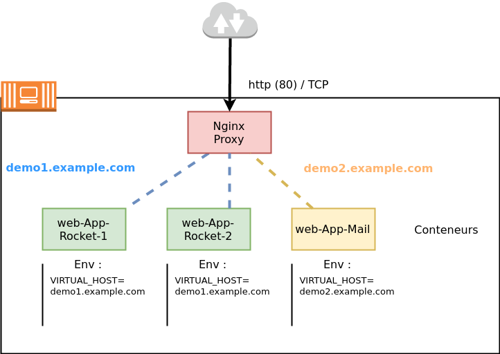


Nous pouvons avoir la génération suivante dans nginx avec le fichier de template définie ci-dessus  :

```
upstream demo1.localhost {
    server 172.17.0.4:5000;
    server 172.17.0.3:5000;
}

server {
    #ssl_certificate /etc/nginx/certs/demo.pem;
    #ssl_certificate_key /etc/nginx/certs/demo.key;

    gzip_types text/plain text/css application/json application/x-javascript
               text/xml application/xml application/xml+rss text/javascript;

    server_name demo1.localhost;

    location / {
        proxy_pass http://demo.localhost;
        include /etc/nginx/proxy_params;
    }
}

upstream demo2.localhost {
    server 172.17.0.5:5000;
}

server {
    #ssl_certificate /etc/nginx/certs/demo.pem;
    #ssl_certificate_key /etc/nginx/certs/demo.key;

    gzip_types text/plain text/css application/json application/x-javascript
               text/xml application/xml application/xml+rss text/javascript;

    server_name demo2.localhost;

    location / {
        proxy_pass http://demo2.localhost;
        include /etc/nginx/proxy_params;
    }
}
```


### Mise en place de LA solution Nginx et Let's encrypt

Voyons maintenant, concrètement, comment nous allons pouvoir l'utiliser nous utiliserons 2 conteneur :

* [jwilder/nginx-proxy](https://github.com/jwilder/nginx-proxy) : Le proxy nginx dynamique "simple" je dirais 
* [jrcs/letsencrypt-nginx-proxy-companion](https://github.com/JrCs/docker-letsencrypt-nginx-proxy-companion) : Un module complémentaire pour le conteneur précédent afin d'offrir le support Let's encrypt.


#### Configuration Nginx avec Let's encrypt

Nous allons initialiser le service nginx en premier , si vous avez déjà vos services actif ceci n'est pas un problème vous ne devrez que rajouter une variable d'environnement à votre conteneur. 

Nous allons définir un fichier [docker-compose](./dockers/docker-compose-nginx.yml) pour le service nginx :

```
version: '2'

services:
  nginx-proxy:
    image: jwilder/nginx-proxy
    container_name : 'nginx-proxy-p'
    restart: unless-stopped
    ports:
      - "80:80"
      - "443:443"
    volumes:
      - "/srv/docker/nginx-proxy-p/nginx/vhost.d:/etc/nginx/vhost.d"
      - "/srv/docker/nginx-proxy-p/nginx/html:/usr/share/nginx/html"
	  - "/srv/docker/nginx-proxy-p/nginx/htpasswd:/etc/nginx/htpasswd"
      - "/srv/docker/nginx-proxy-p/nginx/certs:/etc/nginx/certs"
      - "/var/run/docker.sock:/tmp/docker.sock:ro"
    networks:
      - proxy-tier

  letsencrypt-nginx-proxy-companion:
    image: jrcs/letsencrypt-nginx-proxy-companion
    container_name : 'nginx-letsencrypt-p'
    restart: unless-stopped
    volumes:
      - "/var/run/docker.sock:/var/run/docker.sock:ro"
    volumes_from:
      - "nginx-proxy"
    networks:
      - proxy-tier


networks:
  proxy-tier:
    external:
       name: br-proxy
```

Petite explication du __docker-compose__ il y a plusieurs point important :

* **Network** : Comme vous pouvez le voir j'ai créé un réseau dédier pour ce service , en gros je fait l'équivalent d'une __DMZ__ afin de segmenter le service de nginx avec le reste des conteneurs qui seront dans un autre réseau. Dans un monde idéal je limiterai aussi les communications grâce à __iptables__ entre les réseaux à ce stade ceci est surtout pour mettre une toute petite sécurité en plus :P. Nous allons voir comment réaliser la création du réseau dans quelques instant.
* **Ports** : Bien entendu si vous désirez que votre service nginx fournit des services pour N conteneurs il devra avoir une ouverture pour les communications provenant de l'externe. L'ouverture n'est QUE pour le service nginx et NON pour le compagnon qui réalise le traitement pour Let's encrypt
* **Volumes** :  Accessibilité des fichiers depuis le conteneur
    * __Nginx__ : comme vous pouvez le constater il y a un partage pour les répertoires  
        * __vhosts.d__ : Nous verrons que nous serons en mesure de surdéfinir des paramètres à la configuration nginx qui sera généré , vous allez voir c'est VRAIMENT bien fait ! Ce répertoire nous permettra donc d'avoir des données statique particulière pour le vhosts qui lui sera dynamiquement assigné. Bien entendu on espère ne pas l'utiliser mais comme vous le savez les exceptions font partie de la réalité.
        * __html__ : Ceci nous permettra de mettre aussi des pages statique pour un virtual hosts
        * __certs__ : Ce répertoire vous permettra de définir des certificats / clés classique provenant d'un CA telle que godaddy , verysign , ... De plus il contiendra les fichiers générés par le compagnon __letsencrypt-nginx-proxy-companion__, nous y reviendrons dans la section __volumes\_from__.
    * __Présent sur les deux__ (docker.sock): Comme vous pouvez le voir le __socket__  de docker est passé au 2 conteneurs , honnêtement j'ai eu quelque difficulté avec cette solution. C'est comme ça que j'ai lu le code source du conteneur pour comprendre son utilisation. Lors de la présentation de Jenkins nous avions vu que ceci offre beaucoup de contrôle sur les conteneurs. Heureusement il est possible de définir l'accès en Lecture Seule (RO == Read Only) pour limité les risques. Pourquoi fournir un accès à ce fichier, si vous remontez plus haut ceci est utilisé par docker-gen afin de communiquer avec L'API du docker hôte. Ce __socket__ permet de détecter les conteneurs qui démarrerons ou s'arrêteront. Nous y reviendrons ... Si on a le temps.
* **Volumes\_from** : Nous assignons l'ensemble des volumes au conteneur de Let's encrypt afin de lui permettre de mettre en place les fichiers de certificats.

##### Configuration du réseau pour Nginx

Telle que mentionné nous allons isoler les 2 conteneurs pour __nginx__ , nous allons donc faire la création d'un réseau, nous pourrions aussi le définir dans le __docker-compose__ comme ceci ... Mais on va profiter de l'occasion pour en voir plus :P , car on l'a pas encore fait la création d'un réseau externe au docker-compose :D .

Voici un exemple pour le docker-compose :

```
services:
  app:
    image: busybox
    command: ifconfig
    networks:
      app_net:
        ipv4_address: 172.16.238.10
        ipv6_address: 2001:3984:3989::10

networks:
  app_net:
    driver: bridge
    enable_ipv6: true
    ipam:
      driver: default
      config:
      -
        subnet: 172.16.238.0/24
      -
        subnet: 2001:3984:3989::/64
```

Visualisons les réseaux actuellement présent :

```bash
docker network ls            
NETWORK ID          NAME                                DRIVER              SCOPE
3c0fa372eba1        bd_default                          bridge              local
e9ce18f2309f        bridge                              bridge              local
7c5883a0db08        docker_default                      bridge              local
b4ea4a856f8d        dockerelk_elk                       bridge              local
e5bb35d71ea7        dockers_default                     bridge              local
221510ca7da7        gitlab_default                      bridge              local
cb068b1480af        host                                host                local
5a5c63e89444        integrationtesting_default          bridge              local
94689b0e93df        maildockerized_mailcow-network   bridge              local
41c396729575        none                                null                local
0d47cb65fc8e        x3gitlabjenkins_default             bridge              local
9f2bdd9fbdd2        x3mail_default                   bridge              local
83dd18835ced        x3webdav_default                    bridge              local

$ for dNetwork in $(docker network ls | cut -d " " -f 1 | grep -v NETWORK) ; do
> docker network inspect --format='{{json .IPAM.Config}}' $dNetwork            
> done                                 
[{"Subnet":"172.24.0.0/16","Gateway":"172.24.0.1"}]                            
[{"Subnet":"172.17.0.0/16","Gateway":"172.17.0.1"}]                            
[{"Subnet":"172.29.0.0/16","Gateway":"172.29.01"}]                                                                                                           [{"Subnet":"172.20.0.0/16","Gateway":"172.20.0.1"}]
[{"Subnet":"172.31.0.0/16","Gateway":"172.31.0.1"}]                            
[{"Subnet":"172.30.0.0/16","Gateway":"172.30.0.1"}]                            
[]                                                                             
[{"Subnet":"172.18.0.0/16","Gateway":"172.18.0.1"}]                            
[{"Subnet":"172.22.1.0/24","Gateway":"172.22.1.1"},{"Subnet":"fd4d:6169:6c63:6f77::/64","Gateway":"fd4d:6169:6c63:6f77::1"}]
[]                                                                             
[{"Subnet":"172.28.0.0/16","Gateway":"172.28.0.1"}]
[{"Subnet":"172.19.0.0/16","Gateway":"172.19.0.1"}]                            
[{"Subnet":"172.26.0.0/16","Gateway":"172.26.0.1"}]  
```

Ce que je n'aime pas avec docker-compose , mais en même temps c'est bien et qu'il créer un réseau distinct automatiquement pour chaque regroupement de conteneur ... c'est ennuyeux car il te pollue les plages de réseaux. Mais ce doit être l'administrateur réseau en moi qui n'aime pas, en plus il te fait des **/16** . Ha __well__ :P 

Bon comme vous pouvez le voir le segment 172.23.0.0/24 est disponible nous allons le prendre ( je ferais du ménage plus tard :P ).

Donc la création :

```bash
$ docker network create -d bridge  --subnet 172.23.0.0/27 --gateway=172.23.0.1 --ip-range=172.23.0.0/27 br-proxy                                     
c46c80d5d47cfc359a21775c59b02408f7804d7b09a13d54f1a6be6cd63d60ec

$ docker inspect br-proxy
[                                      
    {                                  
        "Name": "br-proxy",            
        "Id": "c46c80d5d47cfc359a21775c59b02408f7804d7b09a13d54f1a6be6cd63d60ec",                                                                             
        "Created": "2017-10-11T17:35:41.347637521-04:00",                      
        "Scope": "local",              
        "Driver": "bridge",            
        "EnableIPv6": false,           
        "IPAM": {                      
            "Driver": "default",       
            "Options": {},             
            "Config": [                
                {                      
                    "Subnet": "172.23.0.0/27",                                 
                    "IPRange": "172.23.0.0/27",                                
                    "Gateway": "172.23.0.1"                                    
                }                      
            ]                          
        },                             
        "Internal": false,             
        "Attachable": false,           
        "Ingress": false,              
        "ConfigFrom": {                
            "Network": ""              
        },                             
        "ConfigOnly": false,           
        "Containers": {},              
        "Options": {},                 
        "Labels": {}                   
    }                                  
]   
```

Nous avons donc le réseau vous pouvez toujours faire une validation en démarrant un conteneur :

```bash
$ docker run --rm -it --network=br-proxy   busybox 
Unable to find image 'busybox:latest' locally
latest: Pulling from library/busybox
03b1be98f3f9: Pull complete 
Digest: sha256:3e8fa85ddfef1af9ca85a5cfb714148956984e02f00bec3f7f49d3925a91e0e7
Status: Downloaded newer image for busybox:latest
/ $ ifconfig
eth0      Link encap:Ethernet  HWaddr 02:42:AC:17:00:02  
          inet addr:172.23.0.2  Bcast:0.0.0.0  Mask:255.255.255.224
          UP BROADCAST RUNNING MULTICAST  MTU:1500  Metric:1
          RX packets:9 errors:0 dropped:0 overruns:0 frame:0
          TX packets:0 errors:0 dropped:0 overruns:0 carrier:0
          collisions:0 txqueuelen:0 
          RX bytes:1006 (1006.0 B)  TX bytes:0 (0.0 B)

lo        Link encap:Local Loopback  
          inet addr:127.0.0.1  Mask:255.0.0.0
          UP LOOPBACK RUNNING  MTU:65536  Metric:1
          RX packets:0 errors:0 dropped:0 overruns:0 frame:0
          TX packets:0 errors:0 dropped:0 overruns:0 carrier:0
          collisions:0 txqueuelen:1000 
          RX bytes:0 (0.0 B)  TX bytes:0 (0.0 B)

/ $ ping google.com
PING google.com (172.217.13.206): 56 data bytes
64 bytes from 172.217.13.206: seq=0 ttl=53 time=41.253 ms
```

Nous sommes prêt à démarrer notre conteneur nginx :

```bash
$ docker-compose -f docker-compose-nginx.yml up 
Creating nginx-proxy-p ... 
Creating nginx-proxy-p ... done
Creating nginx-letsencrypt-p ... 
Creating nginx-letsencrypt-p ... done
Attaching to nginx-proxy-p, nginx-letsencrypt-p
nginx-proxy-p                        | WARNING: /etc/nginx/dhparam/dhparam.pem was not found. A pre-generated dhparam.pem will be used for now while a new one
nginx-proxy-p                        | is being generated in the background.  Once the new dhparam.pem is in place, nginx will be reloaded.
nginx-proxy-p                        | forego     | starting dockergen.1 on port 5000
nginx-proxy-p                        | forego     | starting nginx.1 on port 5100
nginx-letsencrypt-p                  | Creating Diffie-Hellman group (can take several minutes...)
nginx-letsencrypt-p                  | Generating DH parameters, 2048 bit long safe prime, generator 2
nginx-letsencrypt-p                  | This is going to take a long time
nginx-proxy-p                        | dockergen.1 | 2017/10/11 21:41:29 Generated '/etc/nginx/conf.d/default.conf' from 2 containers
nginx-proxy-p                        | dockergen.1 | 2017/10/11 21:41:29 Running 'nginx -s reload'
nginx-proxy-p                        | dockergen.1 | 2017/10/11 21:41:29 Watching docker events
nginx-proxy-p                        | dockergen.1 | 2017/10/11 21:41:30 Contents of /etc/nginx/conf.d/default.conf did not change. Skipping notification 'nginx -s reload'


$ docker ps                   
CONTAINER ID   IMAGE                                    COMMAND                  STATUS              PORTS                                      NAMES
fe356479ac43   jrcs/letsencrypt-nginx-proxy-companion   "/bin/bash /app/en..."   Up 29 seconds                                                  nginx-letsencrypt-p
055b01e6e7a3   jwilder/nginx-proxy                      "/app/docker-entry..."   Up 30 seconds       0.0.0.0:80->80/tcp, 0.0.0.0:443->443/tcp   nginx-proxy-p

$ docker inspect nginx-letsencrypt-p | grep IPA 
            "IPAddress": "",           
                    "IPAMConfig": null,                                        
                    "IPAddress": "172.23.0.3",                                 
$ docker inspect nginx-proxy-p | grep IPA                             
            "IPAddress": "",           
                    "IPAMConfig": null,                                        
                    "IPAddress": "172.23.0.2",    

```

Résultat au niveau des volumes :

```bash
$ ls /srv/docker/nginx-proxy-p/nginx/certs/ /srv/docker/nginx-proxy-p/nginx/vhost.d /srv/docker/nginx-proxy-p/nginx/html/
/srv/docker/nginx-proxy-p/nginx/certs/:
dhparam.pem

/srv/docker/nginx-proxy-p/nginx/html/:

/srv/docker/nginx-proxy-p/nginx/vhost.d:
```

#### Configuration d'un conteneur web

Nous allons faire la création de 3 conteneur pour reprendre l'exemple précédant soit :

* demo1-c1  : Premier conteneur pour le site demo1 
* demo1-c2  : Deuxième conteneur pour le site demo1
* demo2-c1  : Un seul conteneur pour le site demo2

Voici le [docker-compose](./dockers/docker-compose-web-sites.yml) , vous retrouverez sous le répertoire dockers/web-servers l'ensemble de la définition des conteneur. 

Je démarre l'ensemble :

```bash
$ docker-compose -f docker-compose-web-sites.yml  up                                                                                                 
Building demo1-c1 
Step 1/2 : FROM httpd:2.4              
 ---> 50f10ef90911 
Step 2/2 : COPY site/* /usr/local/apache2/htdocs/
 ---> 4faa6cf356e7 
Removing intermediate container f10a7ffa63b3
Successfully built 4faa6cf356e7 
Successfully tagged x3-demo1:latest
[... OUTPUT COUPÉ ...]

$ docker ps
CONTAINER ID        IMAGE               COMMAND              CREATED             STATUS              PORTS               NAMES
a5ea3baebead        x3-demo1            "httpd-foreground"   5 minutes ago       Up 5 minutes        80/tcp              dockers_demo1-c2_1
c934fd004ef5        x3-demo1            "httpd-foreground"   5 minutes ago       Up 5 minutes        80/tcp              dockers_demo1-c1_1
c806276bb70f        x3-demo2            "httpd-foreground"   5 minutes ago       Up 5 minutes        80/tcp              dockers_demo2-c1_1

$ docker inspect dockers_demo1-c1_1 | grep IPAddress | grep 172
                    "IPAddress": "172.31.0.3",
$ docker inspect dockers_demo2-c1_1 | grep IPAddress | grep 172                                                                                      
                    "IPAddress": "172.31.0.2", 
```

Validation de la disponibilité des sites :

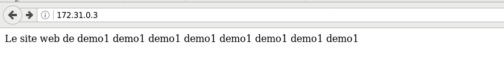

Nous avons donc des conteneurs qui furent initialisés "normalement" et accéssible sur leur réseau interne à docker.

J'arrête les conteneurs, car nous allons devoir modifier la configuration pour la prochaine étape 

```bash
$ docker-compose -f docker-compose-web-sites.yml stop
```

#### Intégration des conteneur avec le proxy nginx

Nous arrivons à l'étape de la magie :D, ou devrais je dire du fabuleux travaille des autres :P . 
Nous avons notre proxy nginx :

```bash
$ docker ps
CONTAINER ID        IMAGE                                    COMMAND                  STATUS              PORTS                                      NAMES
fe356479ac43        jrcs/letsencrypt-nginx-proxy-companion   "/bin/bash /app/en..."   Up 2 minutes                                                   nginx-letsencrypt-p
055b01e6e7a3        jwilder/nginx-proxy                      "/app/docker-entry..."   Up 2 minutes        0.0.0.0:80->80/tcp, 0.0.0.0:443->443/tcp   nginx-proxy-p

$ docker inspect nginx-letsencrypt-p | grep IPAddress | grep 172      
                    "IPAddress": "172.23.0.3",
```

Je vais maintenant modifier le docker-compose afin d'avoir la variable **VIRTUAL\_HOST** qui sera interprété par le proxy nginx. Je vais aussi les mettres sur le même réseau que le proxy pour le moment ... Nous ajouterons de la complexité par la suite afin d'avoir le proxy et les instances web sur 2 réseaux distinct.

```
version: '2'

services:
  demo1-c1:
    image: x3-demo1
    build: ./web-servers/demo1/
    environment:
        - VIRTUAL_HOST=demo1.x3rus.com
    networks:
      - proxy-tier
  demo1-c2:
    image: x3-demo1
    build: ./web-servers/demo1/
    environment:
        - VIRTUAL_HOST=demo1.x3rus.com
    networks:
      - proxy-tier
  demo2-c1:
    image: x3-demo2
    build: ./web-servers/demo2/
    environment:
        - VIRTUAL_HOST=demo2.x3rus.com
    networks:
      - proxy-tier

networks:
  proxy-tier:
    external:
       name: br-proxy

```


Nous allons donc démarrer le site web puis le conteneur nginx !

```bash
$ docker-compose -f docker-compose-web-sites.yml up 

$ docker ps
CONTAINER ID        IMAGE               COMMAND              CREATED             STATUS              PORTS               NAMES
3929a6db7f6b        x3-demo2            "httpd-foreground"   23 seconds ago      Up 20 seconds       80/tcp              dockers_demo2-c1_1
315ecb44cc32        x3-demo1            "httpd-foreground"   23 seconds ago      Up 21 seconds       80/tcp              dockers_demo1-c1_1
99acc13cc12a        x3-demo1            "httpd-foreground"   23 seconds ago      Up 21 seconds       80/tcp              dockers_demo1-c2_1

$ docker inspect dockers_demo2-c1_1 | grep IPAdd                      
            "IPAddress": "172.23.0.4", 

$ docker-compose -f docker-compose-nginx.yml up
[... OUTPUT COUPÉ ...]
Attaching to nginx-proxy-p, nginx-letsencrypt-p                                
nginx-proxy-p                        | Custom dhparam.pem file found, generation skipped  
nginx-proxy-p                        | forego     | starting dockergen.1 on port 5000 
nginx-proxy-p                        | forego     | starting nginx.1 on port 5100 
nginx-letsencrypt-p                  | Sleep for 3600s                         
nginx-proxy-p                        | dockergen.1 | 2017/10/18 11:50:11 Generated '/etc/nginx/conf.d/default.conf' from 5 containers 
nginx-proxy-p                        | dockergen.1 | 2017/10/18 11:50:11 Running 'nginx -s reload' 
nginx-proxy-p                        | dockergen.1 | 2017/10/18 11:50:11 Watching docker events   
[... OUTPUT COUPÉ ...]
```

Si nous ajustons notre fichier __/etc/host__ afin de définir les hostsname :

* demo1.x3rus.com 
* demo2.x3rus.com

```
127.0.0.1       demo1.x3rus.com        
127.0.0.1       demo2.x3rus.com  
```

Validons que ça fonctionne via nginx :

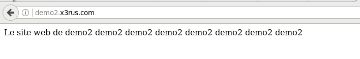

```
nginx-proxy-p                        | nginx.1    | demo2.x3rus.com 172.23.0.1 - - [18/Oct/2017:11:55:31 +0000] "GET /favicon.ico HTTP/1.1" 404 209 "-" "Mozilla/5.0 (X11; Linux x86_64; rv:55.0) Gecko/20100101 Firefox/55.0"               
nginx-proxy-p                        | nginx.1    | demo2.x3rus.com 172.23.0.1 - - [18/Oct/2017:11:55:31 +0000] "GET /favicon.ico HTTP/1.1" 404 209 "-" "Mozilla/5.0 (X11; Linux x86_64; rv:55.0) Gecko/20100101 Firefox/55.0"               
nginx-proxy-p                        | nginx.1    | demo2.x3rus.com 172.23.0.1 - - [18/Oct/2017:11:55:31 +0000] "GET /favicon.ico HTTP/1.1" 404 209 "-" "Mozilla/5.0 (X11; Linux x86_64; rv:55.0) Gecko/20100101 Firefox/55.0"               
nginx-proxy-p                        | nginx.1    | demo2.x3rus.com 172.23.0.1 - - [18/Oct/2017:11:55:31 +0000] "GET / HTTP/1.1" 200 72 "-" "Mozilla/5.0 (X11; Linux x86_64; rv:55.0) Gecko/20100101 Firefox/55.0"                           
nginx-proxy-p                        | nginx.1    | demo2.x3rus.com 172.23.0.1 - - [18/Oct/2017:11:55:35 +0000] "GET / HTTP/1.1" 200 72 "-" "Mozilla/5.0 (X11; Linux x86_64; rv:55.0) Gecko/20100101 Firefox/55.0"      

    # ET 
demo2-c1_1  | [Wed Oct 18 11:48:56.554371 2017] [mpm_event:notice] [pid 1:tid 139914081003392] AH00489: Apache/2.4.23 (Unix) configured -- resuming normal operations
demo2-c1_1  | [Wed Oct 18 11:48:56.554524 2017] [core:notice] [pid 1:tid 139914081003392] AH00094: Command line: 'httpd -D FOREGROUND'
demo2-c1_1  | 172.23.0.5 - - [18/Oct/2017:11:55:31 +0000] "GET /favicon.ico HTTP/1.1" 404 209 
demo2-c1_1  | 172.23.0.5 - - [18/Oct/2017:11:55:31 +0000] "GET /favicon.ico HTTP/1.1" 404 209 
demo2-c1_1  | 172.23.0.5 - - [18/Oct/2017:11:55:31 +0000] "GET /favicon.ico HTTP/1.1" 404 209 
demo2-c1_1  | 172.23.0.5 - - [18/Oct/2017:11:55:31 +0000] "GET / HTTP/1.1" 200 72 
demo2-c1_1  | 172.23.0.5 - - [18/Oct/2017:11:55:35 +0000] "GET / HTTP/1.1" 200 72 
```

Visualisation du fichier de configuration nginx qui fut généré : 

```bash
$ docker cp nginx-proxy-p:/etc/nginx/conf.d/default.conf .
```

Vous avez le fichier disponible [default.conf](./data/default-v1.conf) , voici une extraction de ce qui nous intéresse :

```

 # demo1.x3rus.com
upstream demo1.x3rus.com {
				## Can be connect with "br-proxy" network
			# dockers_demo1-c1_1
			server 172.23.0.3:80;
				## Can be connect with "br-proxy" network
			# dockers_demo1-c2_1
			server 172.23.0.2:80;
}
server {
	server_name demo1.x3rus.com;
	listen 80 ;
	access_log /var/log/nginx/access.log vhost;
	location / {
		proxy_pass http://demo1.x3rus.com;
	}
}
 # demo2.x3rus.com
upstream demo2.x3rus.com {
				## Can be connect with "br-proxy" network
			# dockers_demo2-c1_1
			server 172.23.0.4:80;
}
server {
	server_name demo2.x3rus.com;
	listen 80 ;
	access_log /var/log/nginx/access.log vhost;
	location / {
		proxy_pass http://demo2.x3rus.com;
	}
}
```

Nous voyons donc clairement la définition de __demo1__ avec 2 conteneurs ainsi que __demo2__ avec  1 conteneur. 


### Paramétrisation et gestion des spécificité des conteneurs 

Bien entendu ceci était une exemple simple pour ce faire la main , éviter d'avoir trop d'erreur dès le départ . Par contre la mise en place d'un simple redirecteur pour le site web rencontrera très rapidement des limitations afin de répondre au particularité de chaque site. Prenons quelque instant pour analyser le système de template disponible pour la génération de la configuration de nginx .

#### Template nginx 

Le fichier de génération fut "rapidement" présenter un peu plus tôt lors de l'explication de __docker-gen__ regardons celui disponible dans le conteneur :

```bash
$ docker cp  nginx-proxy-p:/app/nginx.tmpl .
```

Fichier complet disponible [nginx.tmpl](./data/nginx-ORI.tmpl) ou sur github pour la dernière version [github nginx.tmpl](https://github.com/jwilder/nginx-proxy/blob/master/nginx.tmpl).

Prenez le temps de consulter le fichier quelques minutes , rechercher la section généré par le fichier default.conf en association avec le template. Nous allons voir quelque cas d'utilisation, afin de ce faire la main , bien entendu je ne couvrirai pas tous mais ça devrait vous fournir la base pour allé de l'avant et expérimenter :D.

#### Mise en place d'une authentification htaccess par fichier

Prenons le site demo2 qui réalise une redirection vers le conteneur demo2 :P .

```
server {
	server_name demo2.x3rus.com;
	listen 80 ;
	access_log /var/log/nginx/access.log vhost;
	location / {
		proxy_pass http://demo2.x3rus.com;
	}
```

Si nous désirons qu'un nom d'utilisateur / mot de passe soit demandé lors de la connexion , un simple htaccess , rien de bien complexe. Nous allons voir le le fichier template qui a été utilisé pour la génération de la section si dessus . Bien entendu notre objectif est d'avoir dans la section **location /** les instructions pour l'authentification .

Regardons donc le fichier de template :

```
245 server {                           
246     server_name {{ $host }};       
247     listen 80 {{ $default_server }};                                       
248     {{ if $enable_ipv6 }}          
249     listen [::]:80 {{ $default_server }};                                  
250     {{ end }}                      
251     access_log /var/log/nginx/access.log vhost;                            
252 
253     {{ if (exists (printf "/etc/nginx/vhost.d/%s" $host)) }}               
254     include {{ printf "/etc/nginx/vhost.d/%s" $host }};                    
255     {{ else if (exists "/etc/nginx/vhost.d/default") }}                    
256     include /etc/nginx/vhost.d/default;                                    
257     {{ end }}                      
258 
259     location / {                   
260         {{ if eq $proto "uwsgi" }} 
261         include uwsgi_params;      
262         uwsgi_pass {{ trim $proto }}://{{ trim $upstream_name }};          
263         {{ else }}                 
264         proxy_pass {{ trim $proto }}://{{ trim $upstream_name }};          
265         {{ end }}                  
266         {{ if (exists (printf "/etc/nginx/htpasswd/%s" $host)) }}          
267         auth_basic  "Restricted {{ $host }}";                              
268         auth_basic_user_file    {{ (printf "/etc/nginx/htpasswd/%s" $host) }};
269         {{ end }}                  
270                 {{ if (exists (printf "/etc/nginx/vhost.d/%s_location" $host)) }}
271                 include {{ printf "/etc/nginx/vhost.d/%s_location" $host}};
272                 {{ else if (exists "/etc/nginx/vhost.d/default_location") }} 
273                 include /etc/nginx/vhost.d/default_location;               
274                 {{ end }}          
275     }       
276 }      
```

Ceci est le contenu du fichier de template pour la section de la redirection avec une page web non SSL , donc la situation dans laquelle nous sommes. 
Si nous regardons les ligne 266 à 269 nous retrouvons les instructions pour inclure l'authentification via __htaccess__  , le système regarde si nous avons un fichier htpasswd présent dans le répertoire **/etc/nginx/htpasswd/** contenant le nom du host si c'est le cas il rajoute les instructions .

Justement :D , nous avons fait la configuration de ce volume dans notre docker-compose , quelle belle surprise :P .

```
    volumes:
      - "/srv/docker/nginx-proxy-p/nginx/certs:/etc/nginx/certs"
      - "/srv/docker/nginx-proxy-p/nginx/html:/usr/share/nginx/html"
      - "/srv/docker/nginx-proxy-p/nginx/htpasswd:/etc/nginx/htpasswd"
      - "/srv/docker/nginx-proxy-p/nginx/vhost.d:/etc/nginx/vhost.d"
      - "/var/run/docker.sock:/tmp/docker.sock:ro"

```

Nous allons donc faire la création d'un fichier dans le répertoire htpasswd avec le nom de fichier **demo2.x3rus.com** , je vais créer le fichier avec l'utilisateur : thomas et le mot de passe toto .

Prendre note que le répertoire est propriétaire de root donc un petit sudo s'impose ou vous changez les permissions mais autant voir quelque chose de nouveau :D .

```bash
$ ls -ld /srv/docker/nginx-proxy-p/nginx/htpasswd
drwxr-xr-x 2 root root 4096 Oct 18 17:16 /srv/docker/nginx-proxy-p/nginx/htpasswd
```

```bash
$ sudo sh -c "echo -n 'thomas:' >> /srv/docker/nginx-proxy-p/nginx/htpasswd/demo2.x3rus.com"
$ sudo sh -c "openssl passwd -apr1 >> /srv/docker/nginx-proxy-p/nginx/htpasswd/demo2.x3rus.com "
Password: 
Verifying - Password: 

$ cat /srv/docker/nginx-proxy-p/nginx/htpasswd/demo2.x3rus.com
thomas:$apr1$/suRnLwl$m9nlIB5hwCqm5iEYu8udw.
``` 

J'ai arrêter les conteneurs web et les ai redémarrés 

```bash
Gracefully stopping... (press Ctrl+C again to force)                         
Stopping dockers_demo2-c1_1 ... done   
Stopping dockers_demo1-c1_1 ... done   
Stopping dockers_demo1-c2_1 ... done 

$ docker-compose -f docker-compose-web-sites.yml up
[ ... OUTPUT COUPÉ ... ]
```

Je retourne sur la page : (ATTENTION au cache) 

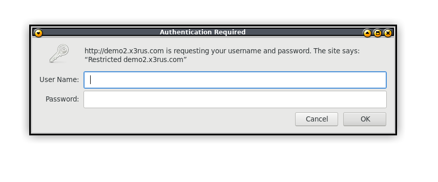 

Au delà de la magie reprenons le fichier de configuration :

```bash
$ docker cp nginx-proxy-p:/etc/nginx/conf.d/default.conf default-htpasswd-demo2.conf
```

[default-htpasswd-demo2.conf](./data/default-htpasswd-demo2.conf)

Nous avons bien le contenu désiré : 

```
server {
    server_name demo2.x3rus.com;
    listen 80 ;
    access_log /var/log/nginx/access.log vhost;
    location / {
        proxy_pass http://demo2.x3rus.com;
        auth_basic  "Restricted demo2.x3rus.com";
        auth_basic_user_file    /etc/nginx/htpasswd/demo2.x3rus.com;
    }
}

```

```bash
$ curl -X GET -u "thomas:toto" -I demo2.x3rus.com
HTTP/1.1 200 OK
Server: nginx/1.13.5
Date: Wed, 18 Oct 2017 21:50:26 GMT
Content-Type: text/html
Content-Length: 72
Connection: keep-alive
Last-Modified: Thu, 12 Oct 2017 11:41:11 GMT
ETag: "48-55b58044da3c0"
Accept-Ranges: bytes

```


#### Configuration spécial pour la racine du site

Parfait nous avons vue l'authentification, mais bon c'est un peu limite , il y a bien plus de configuration possible dans le nginx que simplement l'authentification. La personne qui a fait le conteneur y a déjà pensé et nous offre la possibilité d'inclure un fichier de configuration avec n'importe quelle contenue. Ceci donne beaucoup de possibilité telle que introduire des erreurs de configuration :P.

Si nous reprenons encore le template : 

```
245 server {                           
246     server_name {{ $host }};       
247     listen 80 {{ $default_server }};                                       
248     {{ if $enable_ipv6 }}          
249     listen [::]:80 {{ $default_server }};                                  
250     {{ end }}                      
251     access_log /var/log/nginx/access.log vhost;                            
252 
253     {{ if (exists (printf "/etc/nginx/vhost.d/%s" $host)) }}               
254     include {{ printf "/etc/nginx/vhost.d/%s" $host }};                    
255     {{ else if (exists "/etc/nginx/vhost.d/default") }}                    
256     include /etc/nginx/vhost.d/default;                                    
257     {{ end }}                      
258 
259     location / {                   
260         {{ if eq $proto "uwsgi" }} 
261         include uwsgi_params;      
262         uwsgi_pass {{ trim $proto }}://{{ trim $upstream_name }};          
263         {{ else }}                 
264         proxy_pass {{ trim $proto }}://{{ trim $upstream_name }};          
265         {{ end }}                  
266         {{ if (exists (printf "/etc/nginx/htpasswd/%s" $host)) }}          
267         auth_basic  "Restricted {{ $host }}";                              
268         auth_basic_user_file    {{ (printf "/etc/nginx/htpasswd/%s" $host) }};
269         {{ end }}                  
270                 {{ if (exists (printf "/etc/nginx/vhost.d/%s_location" $host)) }}
271                 include {{ printf "/etc/nginx/vhost.d/%s_location" $host}};
272                 {{ else if (exists "/etc/nginx/vhost.d/default_location") }} 
273                 include /etc/nginx/vhost.d/default_location;               
274                 {{ end }}          
275     }       
276 }      
```

Nous retrouvons exactement le même concept le répertoire __/etc/nginx/vhost.d/__ est consulté s'il trouve le nom du host avec le suffix \_location il ajoutera le contenu de la configuration . 

Un petit test pour valider l'ensemble :

```bash
$ pwd
/srv/docker/nginx-proxy-p/nginx/vhost.d
$ sudo vim demo2.x3rus.com_location 

$ cat demo2.x3rus.com_location
 # Définition d'un cache spécial d'une heure
expires 1h;
add_header Cache-Control "public";
```

On recharge que le site demo2 :


```bash
$ docker-compose -f docker-compose-web-sites.yml restart demo2-c1                                                                                    
Restarting dockers_demo2-c1_1 ... done 
```


On refait l'opération : 

```bash
$ curl -X GET -u "thomas:toto" -I demo2.x3rus.com
HTTP/1.1 200 OK
Server: nginx/1.13.5
Date: Wed, 18 Oct 2017 21:51:15 GMT
Content-Type: text/html
Content-Length: 72
Connection: keep-alive
Last-Modified: Thu, 12 Oct 2017 11:41:11 GMT
ETag: "48-55b58044da3c0"
Accept-Ranges: bytes
Expires: Wed, 18 Oct 2017 22:51:15 GMT
Cache-Control: max-age=3600
Cache-Control: public

``` 

C'est magnifique :D !! Bon ce n'est pas grand chose mais c'était pour montrer le concept :P.


#### Configuration du virtual host libre

Bon je ne réaliserai pas l'exemple pour chaque petite configuration , je vais principalement porter votre attention à une section du template. Si vous désirez définir des configurations qui ne sont PAS dans la section **Location /** , il existe aussi la possibilité d'inclure un fichier de configuration 

```
245 server { 
[ .... ]
253     {{ if (exists (printf "/etc/nginx/vhost.d/%s" $host)) }}
254     include {{ printf "/etc/nginx/vhost.d/%s" $host }};
255     {{ else if (exists "/etc/nginx/vhost.d/default") }}
256     include /etc/nginx/vhost.d/default;
257     {{ end }}
258
259     location / {  
[ .... ]
```

Comme vous pouvez le voir il est possible en utilisant le même principe de définir un fichier avec le nom du host dans le répertoire **/etc/nginx/vhost.d/** et ce répertoire fut définie dans le __docker-compose__ afin de l'avoir localement sur la machine.

### C'est beau mais ou est let's encrypt ?

Effectivement pour le moment je n'ai pas couvert la gestion automatique de certificat avec Let's encrypt pour le conteneur, la raison est simple. L'ensemble de la formation est réalisé en semi hors connexion, car je le fait dans le train . Par conséquent , comme une des conditions pour utilisé Let's encrypt est d'avoir le service publique sur internet c'est un peu plus compliqué. 

Mais voici donc cette section, pas moins importante , mais il fallait que je trouve le temps disponible pour l'écrire :D.

Prendre note que la solution présenté ne supporte pas le dns challenge : https://github.com/JrCs/docker-letsencrypt-nginx-proxy-companion/issues/236
TODO 

### Configuration avec de multiple réseaux 

Selon votre expérience si vous êtes plus développeur , administrateur système ou network dude , il est possible que l'architecture ne vous convient pas trop surtout pour la production. Pour le moment nous avons couvert 3 conteneur avec des services web simple apache , mais si nous nous projetons dans une utilisation de production avec un service soit développé à l'interne ou un tomcat / jboss ... nous aimerions mettre en place une solution [3 tièrs](https://fr.wikipedia.org/wiki/Architecture_trois_tiers) .

Voici un exemple d'une représentation de l'architecture 3 tières :

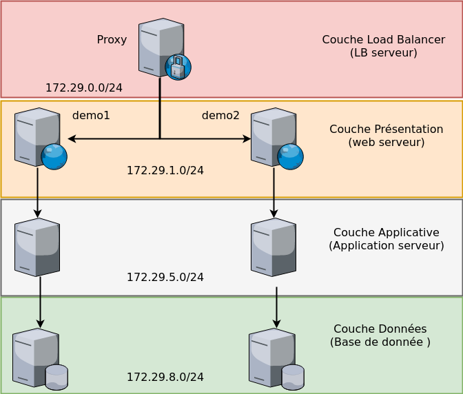

Bon dans notre exemple ce sera plus comme ceci , car nous n'aurons que 2 couches réseaux celle du proxy (__nginx__) et celle des sites web :

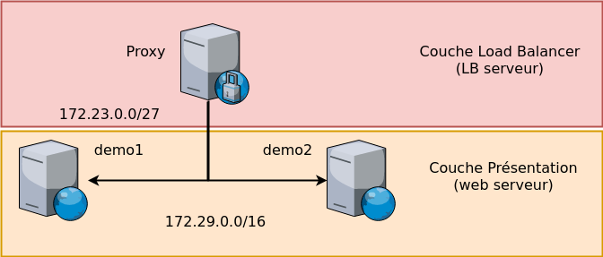

Nous allons avoir 2 problèmes si nous définissons essayons de définir des réseaux différent pour le proxy nginx et le service web :

* Le template [nginx.tmpl](./data/nginx-ORI.tmpl) , réalise une validation du réseaux .
* Les règles de __firewall__ par défaut de docker qui limite la communication entre les segments.

Nous allons voir comment se sortir de ces deux problèmes , bien entendu ça sort du cadre de nginx , mais c'est surtout une opportunité de mieux comprendre le système de docker et du service de template dynamique de nginx.

#### Utilisation de jwilder/nginx-proxy avec des conteneurs dans d'autres réseaux

Avant de modifier la définition des conteneurs web __demo1__ et __demo2__ , nous allons extraire la configuration généré par le conteneur nginx quand nous sommes sur le même réseau .

Voici le fichier [default.conf](./data/default.conf)

La partie qui nous intéresse particulièrement : 

```
[ ... ]
 # ligne : 53 à 61
 # demo1.x3rus.com
upstream demo1.x3rus.com {
				## Can be connect with "br-proxy" network
			# dockers_demo1-c1_1
			server 172.23.0.3:80;
				## Can be connect with "br-proxy" network
			# dockers_demo1-c2_1
			server 172.23.0.2:80;
}
[ ... ]

 # ligne : 70 à 75
 # demo2.x3rus.com
upstream demo2.x3rus.com {
				## Can be connect with "br-proxy" network
			# dockers_demo2-c1_1
			server 172.23.0.4:80;
}
[ ... ]
```

Pour rappel l'IP du proxy nginx est :  172.23.0.2.

Donc maintenant nous allons modifier le docker-compose des conteneurs web afin de supprimer la définition du proxy-tier. Vous avez le fichier ici : [docker-compose.yml](./dockers/docker-compose-web-sites-other-network.yml) .

Donc je vais arrêter le docker nginx et les web s'il tourne encore et redémarrer l'ensemble ... 

```bash
$ docker-compose -f docker-compose-web-sites-other-network.yml up -d 
Recreating dockers_demo1-c2_1 ... 
Recreating dockers_demo2-c1_1 ... 
Recreating dockers_demo1-c2_1
Recreating dockers_demo2-c1_1
Recreating dockers_demo1-c1_1 ... 
Recreating dockers_demo1-c1_1 ... done

$ docker inspect dockers_demo2-c1_1 | grep IPAd
                    "IPAddress": "172.31.0.3",

$ docker-compose -f docker-compose-nginx.yml up

$ docker inspect nginx-proxy-p | grep IPAd                             
                    "IPAddress": "172.23.0.2", 
```

Donc nous avons bien les conteneurs web sur 1 segment réseau et le conteneur nginx sur un autre . Regardons à présent le fichier défaut généré :

```bash
$ docker cp nginx-proxy-p:/etc/nginx/conf.d/default.conf default-not-same-network.conf
```

Le fichier est la : [default-not-same-network.conf](./data/default-not-same-network.conf)

Voici le vimdiff , l'original à gauche et le nouveau généré à droite :

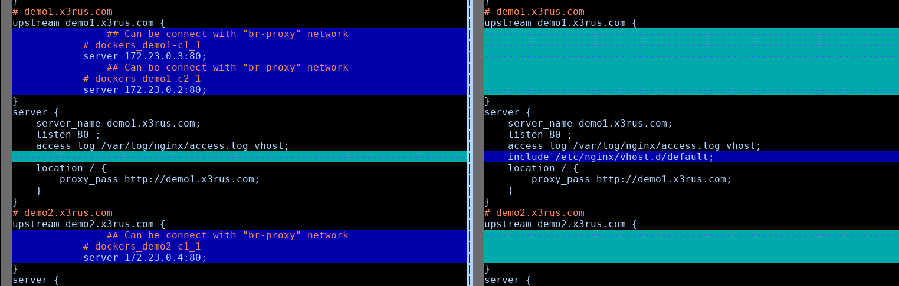

Comme vous pouvez le voir il n'y a pas les IP vers les conteneurs ... mais pourquoi !!! 
Ceci est du à la ligne : 

```
125             {{ if (and (ne $containerNetwork.Name "ingress") (or (eq $knownNetwork.Name $containerNetwork.Name) (eq $knownNetwork.Name "host"))) }}
```

Dans le fichier de template [nginx.tmpl](./data/nginx.tmpl) , qui réalise une validation du réseau afin de confirmer qu'il est soit sur le même network que le proxy ou qu'il est associer au réseau du docker host ! Ceci est pour votre bien !! Le système réalise une validation viable pour vous, pour votre bien être ... 
Yep mais non !! Nous allons changer ça , la solution pérenne est de faire une nouvelle image avec notre fichier template modifier donc un Dockerfile qui ressemble à ceci :

```
FROM jwilder/nginx-proxy

COPY conf/my-nginx.tmlp /app/nginx.tmlp
```

Faire l'image avec le nom que vous désirez et voilà :D .

Bon c'est bien ça mais si je veux faire des teste de configuration il doit bien y avoir un méthode un peu plus rapide et moins belle pour faire des testes le temps de trouver la recette pour mon template . Mais bien sûr mes amis :D ... 

Procédons , procédons !!! 

Nous allons d'abord extraire le fichier en cours d'utilisation depuis le conteneur , car j'ai peut-être une veille version sur mon dépot git .

```bash
$ docker cp nginx-proxy-p:/app/nginx.tmpl nginx-ORI.tmpl
$ cp nginx-ORI.tmpl nginx.tmpl
```

Nous allons supprimer la ligne du if et le __end__ associé !! ATTENTION ne pas les mettre en commentaire car le système va tous de même les traiter :P , j'ai eu la surprise la première fois :P . 

Voici le résultat :

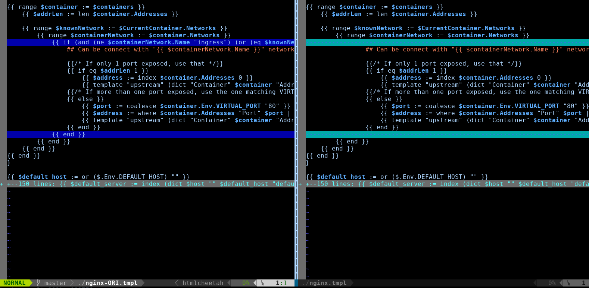

Nous repoussons ce fichier dans le conteneur pour faire la validation ! 

```bash
$ docker cp nginx.tmpl nginx-proxy-p:/app/nginx.tmpl
```

On redémarre les conteneurs web !! 

```bash
$ docker-compose -f docker-compose-web-sites-other-network.yml restart
Restarting dockers_demo1-c1_1 ... done
Restarting dockers_demo2-c1_1 ... done
Restarting dockers_demo1-c2_1 ... done

```

On reprend le fichier généré :

```
$ docker cp nginx-proxy-p:/etc/nginx/conf.d/default.conf default-GOOD-same-network.conf 
```

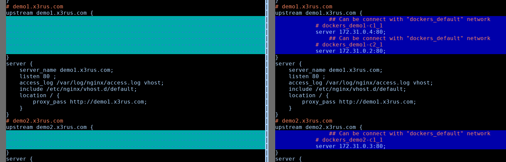

Nous voyons clairement maintenant les adresses IP des conteneurs sur le second réseau , maintenant réalisons une connexion sur la page web , pas de panique ça ne fonctionnera pas :) . Donc je vais sur l'URL : __demo2.x3rus.com__ 

J'ai la demande de mot de passe, car j'avais fermé mon browser , donc le service nginx répond bien . 


Malheureusement voici le résultat par la suite : 

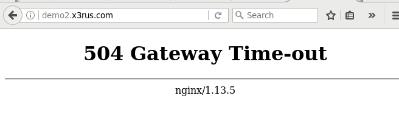

Si nous regardons les message des logs du conteneur nginx nous voyons clairement le message :

```
nginx-proxy-p                        | nginx.1    | 2017/10/20 11:39:43 [error] 49#49: *1 upstream timed out (110: Connection timed out) while connecting to upstream, client: 172.23.0.1, server: demo2.x3rus.com, request: "GET / HTTP/1.1", upstream: "http://172.31.0.3:80/", host: "demo2.x3rus.com"
nginx-proxy-p                        | nginx.1    | demo2.x3rus.com 172.23.0.1 - thomas [20/Oct/2017:11:39:43 +0000] "GET / HTTP/1.1" 504 183 "-" "Mozilla/5.0 (X11; Linux x86_64; rv:55.0) Gecko/20100101 Firefox/55.0"
```

Je vais donc passer à la prochaine section sur la problématique du réseau.


#### Problématique de réseautique / firewall

Donc l'état de la situation si vous avez pas suivie avant la configuration de nginx est bien généré, mais la communication entre le conteneur nginx ne passe pas vers les conteneur web . Nous allons faire l'analyse.

Pour faire l'analyse je vais établir une connexion sur le conteneur nginx et faire des testes de connexion avec notre ami __telnet__ pour comprendre l'état.

```bash
$ docker exec -it nginx-proxy-p bash
root@8b0a0f353b2b:/app$ 

root@8b0a0f353b2b:/app$ telnet
bash: telnet: command not found

root@8b0a0f353b2b:/app$ apt-get update && apt-get install telnet
```

J'installe __telnet__ de toute manière une fois la recette trouvé je vais devoir refaire le conteneur nginx pour avoir mon fichier de template.
Je vais reprendre le fichier généré pour avoir les adresses IP identifier et je vais faire un telnet sur le port :

```bash
root@8b0a0f353b2b:/app$ cat /etc/nginx/conf.d/default.conf | grep server
server_names_hash_bucket_size 128;     
server {                               
        server_name _; # This is just an invalid value which will never trigger on a real hostname.                                                           
                        server 172.31.0.2:80;                                  
                        server 172.31.0.4:80;                                  
server {                               
        server_name demo1.x3rus.com;   
                        server 172.31.0.3:80;                                  
server {                               
        server_name demo2.x3rus.com; 

root@8b0a0f353b2b:/app$ telnet 172.31.0.3 80                                   
Trying 172.31.0.3...
telnet: Unable to connect to remote host: Connection timed out 
```

COOL , même comportement ce n'est donc clairement pas un problème avec l'application nginx , ok je le savais déjà mais dans le processus analytique c'est toujours bien de confirmer les aprioris. 

Je vais maintenant me déplacer sur le docker host pour analyser la situation , fonctionnement rapide du réseau docker , GNU/Linux va faire la création d'interface virtuel , vous pouvez les visualiser :

```bash
$ ip addr show | egrep '^[1-9]*:|inet 172' 
4: br-e5bb35d71ea7: <BROADCAST,MULTICAST,UP,LOWER_UP> mtu 1500 qdisc noqueue state UP group default  
    inet 172.31.0.1/16 scope global br-e5bb35d71ea7                            
5: br-0d47cb65fc8e: <NO-CARRIER,BROADCAST,MULTICAST,UP> mtu 1500 qdisc noqueue state DOWN group default 
    inet 172.28.0.1/16 scope global br-0d47cb65fc8e                            
6: br-5a5c63e89444: <NO-CARRIER,BROADCAST,MULTICAST,UP> mtu 1500 qdisc noqueue state DOWN group default
    inet 172.18.0.1/16 scope global br-5a5c63e89444                            
7: br-7c5883a0db08: <NO-CARRIER,BROADCAST,MULTICAST,UP> mtu 1500 qdisc noqueue state DOWN group default
    inet 172.29.0.1/16 scope global br-7c5883a0db08                            
8: br-83dd18835ced: <NO-CARRIER,BROADCAST,MULTICAST,UP> mtu 1500 qdisc noqueue state DOWN group default
    inet 172.26.0.1/16 scope global br-83dd18835ced                            
9: br-94689b0e93df: <NO-CARRIER,BROADCAST,MULTICAST,UP> mtu 1500 qdisc noqueue state DOWN group default
    inet 172.22.1.1/24 scope global br-94689b0e93df                            
    inet 172.19.0.1/16 scope global br-9f2bdd9fbdd2                            
11: br-b4ea4a856f8d: <NO-CARRIER,BROADCAST,MULTICAST,UP> mtu 1500 qdisc noqueue state DOWN group default
    inet 172.20.0.1/16 scope global br-b4ea4a856f8d                            
12: br-c46c80d5d47c: <BROADCAST,MULTICAST,UP,LOWER_UP> mtu 1500 qdisc noqueue state UP group default
    inet 172.23.0.1/27 scope global br-c46c80d5d47c                            
13: br-221510ca7da7: <NO-CARRIER,BROADCAST,MULTICAST,UP> mtu 1500 qdisc noqueue state DOWN group default
    inet 172.30.0.1/16 scope global br-221510ca7da7                            
14: br-3c0fa372eba1: <NO-CARRIER,BROADCAST,MULTICAST,UP> mtu 1500 qdisc noqueue state DOWN group default
    inet 172.24.0.1/16 scope global br-3c0fa372eba1                            
15: docker0: <NO-CARRIER,BROADCAST,MULTICAST,UP> mtu 1500 qdisc noqueue state DOWN group default 
	inet 172.17.0.1/16 scope global docker0
```

Donc si nous réalisons l'association :

* proxy nginx ( 172.23.0.2 ) == br-c46c80d5d47c (172.23.0.1/27)
* demo\[1,2\] ( 172.31.0.\[2,3,4\]) == br-e5bb35d71ea7 (172.31.0.1/16)

Donc lors de la communication entre le proxy et les conteneurs web ceci doit passer de l'interface br-c46c80d5d47c à br-e5bb35d71ea7 et bien entendu revenir aussi :P . 

Le firewall en place sur les machines que j'utilise (__ArchLinux__ ou Ubuntu LTS 16.04) est  iptables , docker s'appuie dessus pour mettre en place les règles de firewall ainsi que les redirections de port , natting , etc. 

Je ne ferai pas une formation iptables mais on va regarder rapidement , car c'est justement à ce lieu que ça bloque . Les règles stipulant les permissions aux paquets s'ils ont droit de passer ou non d'une interface à l'autre sont définie dans la **chain FORWARD**  :

```bash
$ sudo iptables -L -n -v | grep ^Chain
Chain INPUT (policy ACCEPT 582 packets, 198K bytes)
Chain FORWARD (policy DROP 0 packets, 0 bytes)
Chain OUTPUT (policy ACCEPT 666 packets, 67616 bytes)
Chain DOCKER (12 references)
Chain DOCKER-ISOLATION (1 references)
Chain DOCKER-USER (1 references)
```

Nous allons visualiser les règles de cette chaine , ainsi que les chaines quelle inclut , vous avez le fichier brut disponible ici : [iptables-forward-raw](./data/iptables-forward-raw) . Bon pour les puristes , ou ceux qui cherche la bête noir , je passe sous silences la chaine de sortie __OUTPUT__, car il n'y a aucune règles limitatif : 

> Chain OUTPUT (policy **ACCEPT**

Donc la chaine Forward :P 

```bash
$ sudo iptables -L FORWARD -n -v 
```

Voici un tableau du résultat :

| pkts | bytes | target | prot | opt | in | out | source | destination | 
|:-----|-------|--------|------|-----|:---|----:|--------|------------:|
| 11066 | 11M | **DOCKER-USER** | all | -- | * | * | 0.0.0.0/0 | 0.0.0.0/0 | 
| 11066 | 11M | **DOCKER-ISOLATION** | all | -- | * | * | 0.0.0.0/0 | 0.0.0.0/0 | 
| 0 | 0 | ACCEPT | all | -- | * | docker0 | 0.0.0.0/0 | 0.0.0.0/0 | ctstate | RELATED,ESTABLISHED
| 0 | 0 | DOCKER | all | -- | * | docker0 | 0.0.0.0/0 | 0.0.0.0/0 | 
| 0 | 0 | ACCEPT | all | -- | docker0 | !docker0 | 0.0.0.0/0 | 0.0.0.0/0 | 
| 0 | 0 | ACCEPT | all | -- | docker0 | docker0 | 0.0.0.0/0 | 0.0.0.0/0 | 
| 0 | 0 | ACCEPT | all | -- | * | br-3c0fa372eba1 | 0.0.0.0/0 | 0.0.0.0/0 | ctstate | RELATED,ESTABLISHED
| 0 | 0 | DOCKER | all | -- | * | br-3c0fa372eba1 | 0.0.0.0/0 | 0.0.0.0/0 | 
| 0 | 0 | ACCEPT | all | -- | br-3c0fa372eba1 | !br-3c0fa372eba1 | 0.0.0.0/0 | 0.0.0.0/0 | 
| 0 | 0 | ACCEPT | all | -- | br-3c0fa372eba1 | br-3c0fa372eba1 | 0.0.0.0/0 | 0.0.0.0/0 | 
| 0 | 0 | ACCEPT | all | -- | * | br-221510ca7da7 | 0.0.0.0/0 | 0.0.0.0/0 | ctstate | RELATED,ESTABLISHED
| 0 | 0 | DOCKER | all | -- | * | br-221510ca7da7 | 0.0.0.0/0 | 0.0.0.0/0 | 
| 0 | 0 | ACCEPT | all | -- | br-221510ca7da7 | !br-221510ca7da7 | 0.0.0.0/0 | 0.0.0.0/0 | 
| 0 | 0 | ACCEPT | all | -- | br-221510ca7da7 | br-221510ca7da7 | 0.0.0.0/0 | 0.0.0.0/0 | 
| 7340 | 11M | ACCEPT | all | -- | * | br-c46c80d5d47c | 0.0.0.0/0 | 0.0.0.0/0 | ctstate | RELATED,ESTABLISHED
| 0 | 0 | DOCKER | all | -- | * | br-c46c80d5d47c | 0.0.0.0/0 | 0.0.0.0/0 | 
| 3713 | 198K | ACCEPT | all | -- | br-c46c80d5d47c | !br-c46c80d5d47c | 0.0.0.0/0 | 0.0.0.0/0 | 

Donc prenons le temps de visualiser le flux de la communication via ce diagramme : 

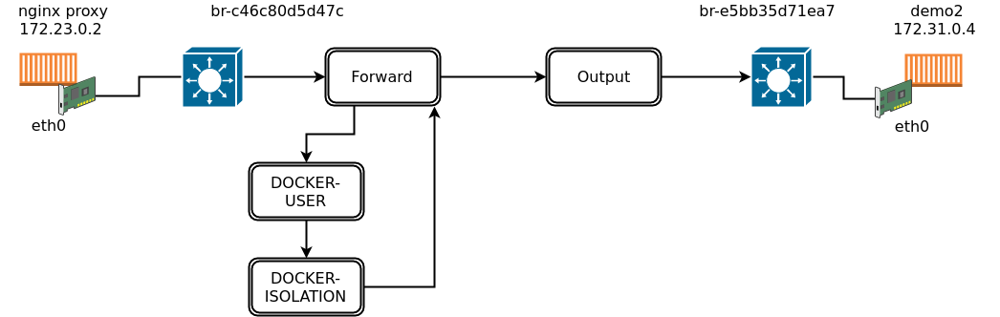 

C'est la version simplifier pour ceux qui en veulent plus je vous invite à consulter ce lien  : [iptables packet flow](https://commons.wikimedia.org/wiki/File:Netfilter-packet-flow.svg), c'est plus complet et plus mélangeant :P

Donc comme nous le voyons dans le schéma , la communication va passer par le Chaine FORWARD , le système de règle de firewall est simple s'il trouve une des **target** suivante il arrête et faire l'opération de la règle :

* **ACCEPT** : évidement accepte le paquets donc plus aucune règle n'est traité par la suite
* **DROP** : laisse tombé le paquet résultat la personne qui à fait la requête recevra un timeout
* **REJECT** : Refuse la connexion donc le demander recevra tous de suite un connexion refused.

S'il y a la **target** RETURN il arrête de traiter la chaine en cours et poursuit avec les autres règles . Si aucune règle concorde alors il applique la politique globale , qui est souvent DROP pour le input , ACCEPT pour l'output et forward.

Je suis actuellement dans une position privilégié , car je suis sur mon portable et les conteneurs actif ne sont QUE ceux utilisé par nginx et les conteneur web. Ceci va grandement facilité l'analyse, cependant ceci veux aussi dire que la mise en place d'un laboratoire peut être mis en place pour comprendre le comportement de vos conteneurs.

Nous allons visualiser le trafic , je vais établir la connexion au conteneur nginx :

```bash
$ docker exec -it nginx-proxy-p bash
root@8b0a0f353b2b:/app$ 
```

Je vais lister les règles iptables actuellement en place incluant les statistiques :

```bash
 # un répertoire temporaire pour stocker des fichiers
$ mkdir ./data/tmp

$ sudo iptables -L -n -v > ./data/tmp/iptables-v1
$ tail -7 iptables-v1 
    0     0 DROP       all  --  br-9f2bdd9fbdd2 br-b4ea4a856f8d  0.0.0.0/0            0.0.0.0/0           
    0     0 DROP       all  --  br-b4ea4a856f8d br-9f2bdd9fbdd2  0.0.0.0/0            0.0.0.0/0           
    0     0 RETURN     all  --  *      *       0.0.0.0/0            0.0.0.0/0           

Chain DOCKER-USER (1 references)
 pkts bytes target     prot opt in     out     source               destination         
    0     0 RETURN     all  --  *      *       0.0.0.0/0            0.0.0.0/0  
```

Maintenant je vais faire un telnet depuis la machine nginx vers la machine web.

```bash
root@8b0a0f353b2b:/app# telnet 172.31.0.2 80 
Trying 172.31.0.2...
```

Donc le problème est toujours présent , et ça va faire un timeout , je vais donc refaire dans une autre fenêtre le listing des règles avec les statistiques.

```bash
$ sudo iptables -L -n -v > ./data/tmp/iptables-v2
```

Nous allons maintenant pouvoir voir où les paquets passent et surtout où il sont bloqué :P , je réalise un petit vimdiff entre les 2 fichiers pour identifier le lieu. Le premier fichier à gauche et le nouveau à droite :

```bash
$ vimdiff iptables-v1 iptables-v2
```

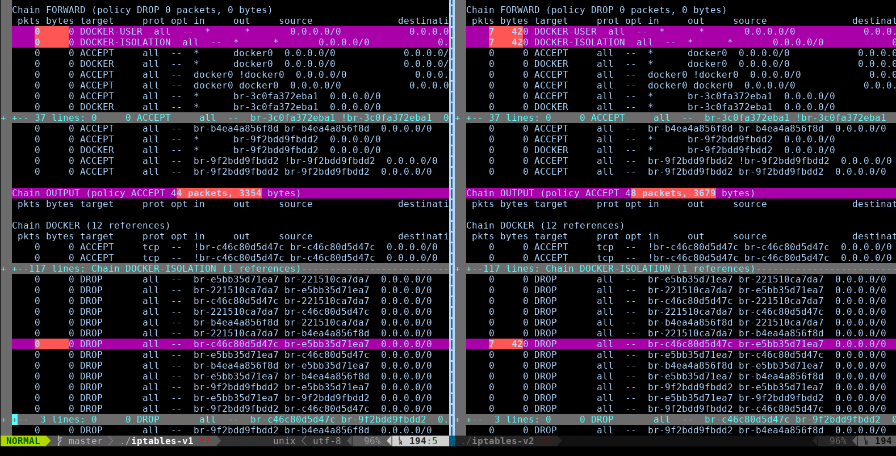

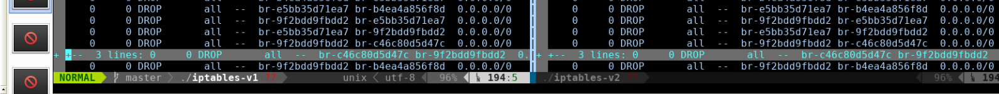

Donc analysons la situation en relation avec mon schéma du flux réseau précédemment présenté.

* **FORWARD** : Donc nous voyons des paquets qui ont transigé par la chaine **FORWARD**  , nous avons 7 paquets qui sont passé par les chaines **DOCKER-USER** et **DOCKER-ISOLATION**. Nous allons donc suivre le flux.
	* **DOCKER-USER** : Si nous regardons cette chaine , la seule règles qu'elle contient et la target **RETURN** , donc il n'y a pas de traitement réaliser à ce niveau , cette chaine à la possibilité d'avoir des règles personnalisé mais dans la situation présente il n'y a pas de règles. Donc elle retourne les paquets au autres règle pour traitement.  Passons à la prochaine règles ...
    * **DOCKER-ISOLATION** : Cette chaine contient plusieurs règles mais nous constatons qu'une ligne à des paquets de comptabilité, j'ai ajouter ci-dessous le nom humain des interfaces afin que ce soit plus claire . Donc la règle suivante est claire DROP (timeout) les paquets en provenance du réseaux br-proxy contenant le conteneur nginx vers le réseau des conteneurs web.

        ```
        7   420 DROP       all  --  br-c46c80d5d47c (== br-proxy) br-e5bb35d71ea7 ( == web-conteneur)
        ```

YEAHHH !! Nous avons identifier le problème :D , nous avons déjà fait un gros travail :D. Pour corriger le problème nous allons donc utiliser la chaine DOCKER-USER afin de définir nos règles personnalisés. 

Je le répète l'objectif n'est pas de faire une session iptables , mais offrir au personne avec une certain connaissance d'être plus confortable pour l'identification et la manipulation des règles dans le cadre de docker.

Je vais donc ajouter la règle suivante , 

```bash
$ sudo iptables -I DOCKER-USER -i br-c46c80d5d47c -o br-e5bb35d71ea7 -p tcp -m tcp --dport 80 -j ACCEPT
```

* __-I DOCKER-USER__ : Je fais une insertion au DÉBUT de la chaine avec ma règle , attention ne pas utiliser l'option -A qui réalise un append car votre règle ce retrouvera après l'instruction RETURN , donc ne sera JAMAIS traité.
* __-i br-c46c80d5d47c__ : Les paquets en provenance de l'interface br-proxy donc du réseaux de nginx, je définie le réseaux car il est possible que le service nginx change d'IP
* __-o br-e5bb35d71ea7__ : Les paquets en destination de l'interface des conteneurs web , encore une fois je définie l'interface et non les ip afin de me prévenir du changement d'adresse ip par le DHCP.
* __-p tcp -m tcp__ : Utilisation du protocole tcp
* __--dport 80__ : La destination étant le port 80 
* __-j ACCEPT__ : Indique que le paquet sera accepté donc iptables arrêtera de traiter ce paquet et le laissera passer.

Je vais re lister les règles de firewall :

```bash
$ sudo iptables -L -n -v > iptables-v3

 # voici le rsultat juste pour la section DOCKER-USER
$ sudo iptables -L DOCKER-USER -n -v
Chain DOCKER-USER (1 references)
 pkts bytes target     prot opt in     out     source               destination         
    0     0 ACCEPT     tcp  --  br-c46c80d5d47c br-e5bb35d71ea7  0.0.0.0/0            0.0.0.0/0            tcp dpt:80
    7   420 RETURN     all  --  *      *       0.0.0.0/0            0.0.0.0/0      
```

Donc nous faisons un test depuis nginx :

```bash
root@8b0a0f353b2b:/app# telnet 172.31.0.3 80
Trying 172.31.0.3...

```

Et non pas mieux :P , nous allons refaire l'analyse pour savoir où ça bloque !!! 

```bash
$ sudo iptables -L -n -v > iptables-v4
```

Et un petit vimdiff pour faire la comparaison :D

```bash
$ vimdiff iptables-v3 iptables-v4 
```

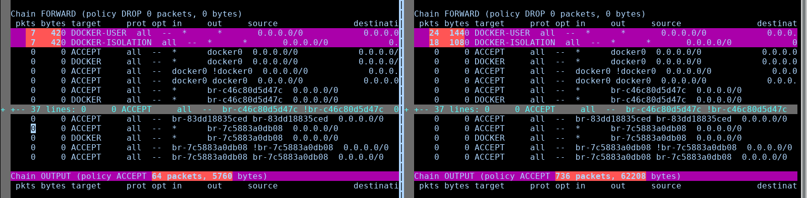

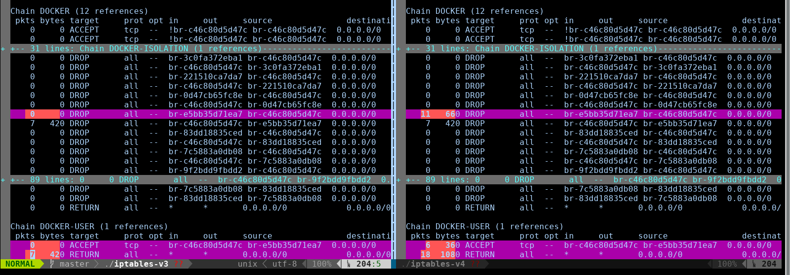

Donc nous reprenons :

* **FORWARD** : nous voyons des paquets qui transige par cette chaine , nous voyons que ceci est bien allé dans la chaine DOCKER-USER 
    * **DOCKER-USER** : Nous voyons bien que 6 paquets ont bien tapé notre règle , par contre si nous regardons il y a 18 paquets qui ont continuer leurs chemin après notre règle et qui sont retourné pour être traiter par d'autres règles.
    * **DOCKER-ISOLATION** : Nous voyons que la chaine **DOCKER-ISOLATION** référencé dans la chaine **FORWARD** à justement traité 18 paquets :) , la belle affaire alors regardons ce que contient cette chaine et surtout qui à changé. Voici les 18 paquets , pour rappel lors de notre premier TEST nous avions 7 paquets qui étaient passé déjà il nous en reste donc 11 !! Faut le garder en tête

    ```
    11   660 DROP       all  --  br-e5bb35d71ea7 br-c46c80d5d47c  0.0.0.0/0            0.0.0.0/0           
    7   420 DROP       all  --  br-c46c80d5d47c br-e5bb35d71ea7  0.0.0.0/0            0.0.0.0/0           
    ```

Donc nous retrouvons les 7 déjà identifiés, donc les 11 quelle est cette règle ... elle ressemble étrangement à la celle que nous savons déjà corriger . 
Donc la règle bloque les communications depuis br-e5bb35d71ea7 ( == web-conteneur) vers br-c46c80d5d47c (== br-proxy) . En d'autre mot la règle inverse !

Nous avons déjà autorisé l'accès dans un sens, pour le retour le problème avec le TCP/IP est que le port source est dynamique petit rappel du mode de communication en TCP/IP . 


Comme nous le voyons dans le schéma ci-dessus la communication initié par l'IP 192.168.43.245 va vers l'IP 192.99.12.211 sur le port 80 mais le retour de la communication se fait sur un des port dynamique vers l'IP 192.168.43.245 sur le port 34068. 

Bonne nouvelle iptables est une firewall STATE-FULL en d'autre mot il est en mesure de comprendre l'état d'une communication et d'ouvrir le flux si les paquets furent déjà ouvert dans un sens. Mais pour ça il faut tous de même lui signaler :P , il obéit bien mais faut lui dire :P. 

Pour ce faire nous allons définir la règles suivante : 

```bash
$ sudo iptables -I DOCKER-USER -i br-e5bb35d71ea7 -o br-c46c80d5d47c -m conntrack --ctstate RELATED,ESTABLISHED -j ACCEPT
```

* __-I DOCKER-USER__ : Insertion au début de la chaine DOCKER-USER afin qu'elle soit traiter avec le **return**
* __-i br-e5bb35d71ea7__ : Lors que les paquets provienne de l'interface br-e5bb35d71ea7 ( == web-conteneur) 
* __-o br-c46c80d5d47c__ : Lors que les paquets sorte vers l'interface  br-c46c80d5d47c (== br-proxy)
* __-m conntrack__ : Identifier avec le tag d'une connexion en court
* __--ctstate RELATED,ESTABLISHED__ : que le paquet est identifier comme en état de relation ou déjà connecté ( donc que le 3 hand shake est complété)
* __-j ACCEPT__ : Autorise le paquet à passer .

Bon , on l'essaye :D !!!

```bash
$ sudo iptables -L DOCKER-USER -n -v
Chain DOCKER-USER (1 references)
 pkts bytes target     prot opt in     out     source               destination         
     0     0 ACCEPT     all  --  br-e5bb35d71ea7 br-c46c80d5d47c  0.0.0.0/0            0.0.0.0/0            ctstate RELATED,ESTABLISHED
     6   360 ACCEPT     tcp  --  br-c46c80d5d47c br-e5bb35d71ea7  0.0.0.0/0            0.0.0.0/0            tcp dpt:80
    18  1080 RETURN     all  --  *      *       0.0.0.0/0            0.0.0.0/0   
```

Toujours depuis le conteneur nginx :

```bash
root@8b0a0f353b2b:/app# telnet 172.31.0.3 80                                   
Trying 172.31.0.3...                   
Connected to 172.31.0.3.               
Escape character is '^]'.              
GET /                                  
Le site web de demo2                   

demo2                                  
demo2                                  
demo2                                  
demo2                                  
demo2                                  
demo2                                  
demo2                                  
Connection closed by foreign host.    
```

Et si on visualise  les règles :

```bash
$ sudo iptables -L DOCKER-USER -n -v                                  
Chain DOCKER-USER (1 references)       
 pkts bytes target     prot opt in     out     source               destination                                                                               
    5   340 ACCEPT     all  --  br-e5bb35d71ea7 br-c46c80d5d47c  0.0.0.0/0            0.0.0.0/0            ctstate RELATED,ESTABLISHED 
   11   635 ACCEPT     tcp  --  br-c46c80d5d47c br-e5bb35d71ea7  0.0.0.0/0            0.0.0.0/0            tcp dpt:80
   18  1080 RETURN     all  --  *      *       0.0.0.0/0            0.0.0.0/0   
```

Et voilà :D 

#### Définir ces règles de manière permanente

Lors des testes vous constaterez que le nom des interfaces ne change pas peut importe le nombre de redémarrage. Malheureusement la chaine DOCKER-USER est réinitialisé à chaque démarrage de la machine . J'ai fait quelque recherche pour voir ce qui peut être fait pour que la configuration soit permanente malheureusement rien de bien claire. Certain modifie le script de démarrage pour réaliser une opération post démarrage de docker . 

Personnellement la méthode que j'utilse et la mise en place de puppet qui gère l'ensemble de mes règles de firewall et qui s'assure de conserver l'état des règles. Si je réalise une modification en 30 minutes la configuration sera remise en place comme définie dans les règles de puppet , donc ceci me permet de concerver l'ensemble de mes règles peut importe qui essaye de faire un changement. 

Pour la formation puppet ... ça vient si j'arrête de débuter des petites formations et finalement m'étendre ... :P


## problème email letencrypt invalide 

au startup de nginx :

```
nginx-letsencrypt-p                  | 2017/10/19 11:47:07 Contents of /app/letsencrypt_service_data did not change. Skipping notification '/app/update_certs'
nginx-letsencrypt-p                  | Q2017/10/19 11:47:08 Generated '/etc/nginx/conf.d/default.conf' from 4 containers 
nginx-letsencrypt-p                  | ;2017/10/19 11:47:08 [notice] 67#67: signal process started 
nginx-letsencrypt-p                  | Creating/renewal demo2.x3rus.com certificates... (demo2.x3rus.com)
nginx-letsencrypt-p                  | 2017-10-19 11:47:08,781:INFO:simp_le:1213: Generating new account key 
nginx-letsencrypt-p                  | ACME server returned an error: urn:acme:error:invalidEmail :: The provided email for a registration was invalid :: Error creating new registration :: not a valid e-mail address 
nginx-letsencrypt-p                  | 
nginx-letsencrypt-p                  |
nginx-letsencrypt-p                  | Debugging tips: -v improves output verbosity. Help is available under --help. 
nginx-letsencrypt-p                  | Sleep for 3600s   
```

* Bon email mais pas de DNS pas dispo de l'externe :

```
nginx-letsencrypt-p                  | 2017/10/19 11:50:56 Contents of /app/letsencrypt_service_data did not change. Skipping notification '/app/update_certs'
nginx-letsencrypt-p                  | 2017-10-19 11:51:00,379:ERROR:acme.challenges:311: Unable to reach http://demo2.x3rus.com/.well-known/acme-challenge/iqorLBiXpVuFZfUJ0d7oDhL1lAI47HPR1oEY5yG8Vm4: HTTPConnectionPool(host='demo2.x3rus.com', port=80): Max retries exceeded with url: /.well-known/acme-challenge/iqorLBiXpVuFZfUJ0d7oDhL1lAI47HPR1oEY5yG8Vm4 (Caused by NewConnectionError('<urllib3.connection.HTTPConnection object at 0x7f89a7eb00d0>: Failed to establish a new connection: [Errno -2] Name does not resolve',))
nginx-letsencrypt-p                  | 2017-10-19 11:51:00,379:WARNING:simp_le:1304: demo2.x3rus.com was not successfully self-verified. CA is likely to fail as well!
nginx-letsencrypt-p                  | 2017-10-19 11:51:01,147:INFO:simp_le:1314: Generating new certificate private key
nginx-letsencrypt-p                  | 2017-10-19 11:51:02,901:ERROR:simp_le:1272: CA marked some of the authorizations as invalid, which likely means it could not access http://example.com/.well-known/acme-challenge/X. Did you set correct path in -d example.com:path or --default_root? Is there a warning log entry about unsuccessful self-verification? Are all your domains accessible from the internet? Failing authorizations: https://acme-v01.api.letsencrypt.org/acme/authz/cjuUb0rasz8j_jvOMSwF89IDHwBq2p9MNpWnVyHEk88
nginx-letsencrypt-p                  | Challenge validation has failed, see error log.
nginx-letsencrypt-p                  | 
```
