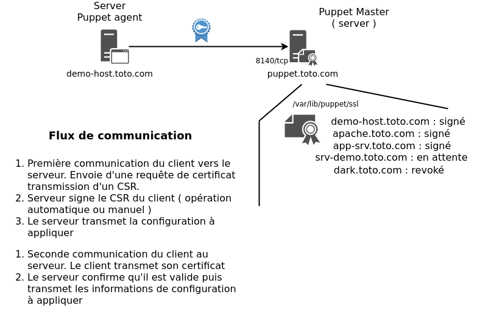

# Puppet ( Système de gestion de configuration ) 

**Puppet** est un système de gestion de configuration de système qui permet de gérer les systèmes d'exploitations :

* GNU/Linux 
* Mac OS X 
* Ms Windows

Il est existe version de puppet :

* **Version libre** qui permet de gérer les déploiements système et applicatif, et accepte les machines virtuelles type Amazon EC2.
* **Version commercial** permet en plus, de gérer les machines virtuelles VMware, d'avoir une interface graphique de gestion, d'automatiser et d'orchestrer les déploiements, d'avoir une plateforme de développement pour tous les environnements, de gérer individuellement les droits utilisateurs.

Puppet est principalement écrit en __Ruby__ un point fort pour certain , une contrainte pour d'autre :). Je vous laisserai faire votre choix, avec l'expérience.

## C'est quoi un système de gestion de configuration ?

Avant de parler de __puppet__ proprement dit , voyons c'est quoi un [système de gestion de configuration](https://fr.wikipedia.org/wiki/Gestion_de_configuration). L'objectif d'un gestionnaire de configuration est de permettre de gérer la configuration du système, j'espère que vous étiez assis en lisant cette phrase pleine de vérité :P. Au delà de cette tautologie , voyons des cas concrètes .

* **Permettre rapidement de mettre en place la configuration d'un système** ( système d'exploitation , logiciel , composante , ...) : Si vous avez quelques serveurs à mettre en place , combien de temps devez vous mettre sur le système pour qu'il soit opérationnel ? 4 heures , 2 heures ... ? Il est probable que le temps varie, selon le rôle du système. Avec un système de gestion de configuration, vous serez en mesure de définir des règles , des instructions qui décriront le processus de configuration qui sera réalisé sur le système. En d'autre mot l'idée est de délégué la tâches de l'ensemble du processus de configuration à une application.
* **Erreur de configuration** :  La plus grosse perte de temps,  lors de la mise en place d'un système est lorsqu'une erreur se glisse dans la configuration , que nous parlions d'une faute de frappe , d'une erreur d'inattention et on saute une section , ... Au mieux ça ne marche pas du tous alors on cherche , on cherche longtemps la virgule , le paramètre fautif. Autre situation, ça fonctionne mais pas dans une circonstance , donc ça fonctionne presque. Le signalement peut venir plusieurs semaine plus tard , donc pas planifié dans le projet , résultat difficile à gérer dans son temps . Le système de gestion de configuration applique bêtement , sans émotion , sans gueule de bois, même si l'OM à gagné la Ligue des Champions :P.
* **Uniformisation de la configuration** : Comme il n'y a pas d'opération manuelle réalisées la configuration est toujours intègre d'un système à l'autre , je ne dis pas toujours bonne :P , mais au moins si vous appliquez une configuration dans l'environnement de développement vous aurez la même configuration en production ! Vous serez donc en mesure d'identifier un problème de configuration dès l'environnement de développement. Bien entendu nous verrons comment paramétrer la configuration, car nous allouerons pas la même quantité de mémoire en développement qu'en production ...
* **Centralisation de la configuration** : Comme nous définirons la configuration à un endroit il est simple d'extraire la configuration du système rapidement sans établir de connexion sur le serveur et analyser la situation. 
* **Audit de conformité (exemple : PCI, ISO27001 , ... ) , conservation de la configuration** : En utilisant un système de gestion de configuration lors des audit de sécurité ou de conformité se sera beaucoup plus simple en démontrant l'utilisation du système plutôt que d'avoir 1 à 3 mois de préparation afin de valider et corriger manuellement chaque serveur avant l'audit. De plus selon le type de gestion de configuration, il est possible de conserver un état de la configuration , en d'autre mot s'il y a un changement réalisé sur le système par une opération manuel ce dernier sera réinitialisé afin d'être conforme à celle définie sur le système centrale. 
* **Changement et évolution de la configuration** : Vous avez peut-être déjà un système de création automatique de vos serveurs que nous parlions d'un Kickstart (RedHat) , Preseed (Debian) ou un système de template de création de VM , voir AIM pour amazon. Ceci fonctionne a merveille pour la création initiale de vos instances , cependant ceci est très limitatif pour l'évolution de vos configurations. Voici un exemple concret "problématique" , vous avez 40 serveurs qui furent créer avec le template / Kickstart ,... Vous constatez qu'il y a un problème avec la configuration SSH , vous désirez par exemple bloquer la fonctionnalité de __Port Forwarding__ , sans système de gestion vous devrez établir une connexion sur chaque système pour faire le changement en espérant que vous n'en n'oubliez pas UN !!
* **Conservation de l'évolution de la configuration** (en bonus ) : En utilisant un contrôleur de révision, en plus de l'ensemble des avantages mentionné plus haut, vous aurez aussi l'historique de l'évolution de vos configurations dans le temps , ainsi que l'intervenant ayant réalisé l'opération !

Mais comment faisions nous avant ? Les systèmes de gestion de configuration existe depuis LONGTEMPS que ce soit des solutions payante ou libre , un exemple est [CFEngine](https://en.wikipedia.org/wiki/CFEngine) ça version 1 est sortie en 1993 , mais honnêtement ce n'était pas très populaire. Résultat nous réalisions une panoplie de script (bash , ou autre) pour faire l'ensemble des opérations. Le gros inconvénient était que la gestion de ces scripts étaient très couteuse en temps et surtout nous n'avions pas une communauté afin d'améliorer la solution.

Les défis d'un gestion de configuration : 

1. **Gestion des particularités** : Le système de gestion de configuration permet d'unifier notre déploiement, si nous avions la même configuration partout ce serait très simple, la réalité est tout autre. Si nous prenons le cas d'une application , dans l'environnement de développement nous avons 4 Gigs de RAM alors que l'environnement de production en a 16 Gigs . Bien entendu si nous avons une application __java__ la configuration de la jvm ne sera pas identiques. Dans le même esprit, si nous prenons l'authentification au serveur via le service __ssh__, si nous définissons des limites d'accès par groupe nous n'aurons pas les mêmes permissions dans l'environnement de développement et l'environnement de validation (QA). Ceci est un défis autant technique que d'organisation de votre configuration centralisé.
2. **Sensibilisation des administrateurs et des power utilisateurs (sudo)** : Le système de gestion de configuration est très puissant, mais bien entendu il ajoute une couche de gestion additionnel. Si vous n'avez qu'une partie de votre équipe qui adhère à l'idée et que le reste continue à gérer manuellement les serveurs, il y aura un **clash**. Vous n'aurez pas de configuration intègre et la personne qui réalise la configuration manuellement verra, ça configuration écrasé. Il mentionnera que ça ne fonctionne pas à CAUSE du système automatisé ! Pour cette partie je vous conseille FORTEMENT d'identifier les fichiers gérer par le système de gestion centralisé (Nous y reviendrons). Le cas est identique pour les power utilisateurs , c'est utilisateur qui sont administrateurs sur le système s'il désactive votre système de configuration centralisé. Vous aurez un problème ,car vous partirez du principe que la configuration va s'appliquer mais non :P, puis le jeu du chat et de la souris va débuter si vous n'arrivez pas à avoir l'adhésion du Devs :D.
3. **Temps et Documentation** : Bien entendu nous avons tous réalisé des configurations manuellement sur le système ceci va "vite", car c'est un reflex . La monté en compétence prendra un peu de temps et donc ça prendra un plus de temps. Vous aurez un gain sur le long terme. La documentation de vos modules / playbook, classe, ... devra être aussi réalisé , sinon vous risquez d'avoir un duplicata des configurations ceci mélangera une personne qui cherche quelle configuration appliquer. Encore une fois la configuration prend du temps.
4. **Visibilité** : Dans le concept de DevOps, mais c'était déjà le cas dans le passé , assurez vous d'avoir une visibilité sur les clients géré par le système de gestion de configuration. Vous devez au moins avoir l'information suivante : Quand fut la dernière fois que le client fut synchronisé ? Est-ce qu'il y a eu des erreurs , si oui combien ?

### Mode de fonctionnement d'un système de gestion de configuration

Il y a plusieurs méthode de fonctionnement pour les système de gestion de configuration , nous allons nous concentrer sur le mode opératoire de puppet, cependant peut-être que pour votre utilisation ce système n'est pas l'idéal. En aillant la connaissance des différents option possible vous pourrez faire le bon choix :D.

* **Conservation d'état** ( __pull__ ) : Dans le cadre de la conservation de l'état le système client ou nœud exécute un agent sur le système est régulièrement va voir si la définition de ça configuration a changé. S'il y a eu modification de la définition de la configuration ce dernier applique le changement. Ceci permet aussi de réinitialisé une configuration qui fut changé manuellement sur le système , telle qu'un fichier de configuration (ex. sshd_config ) ou la configuration des règles de firewall. L'agent est exécuté de manière régulière , si nous prenons le cas de puppet par défaut ce dernier est exécuter au 30 minutes. Ce mode est idéal pour la conservation d'une configuration telle que l'infrastructure. Si nous reprenons, en exemple le travail réalisé pour la présentation de Jenkins. Le déploiement d'un nouveau slave sera grandement facilité avec ce mode opératoire , ce qui sera idéal est que même si on personne modifie, par exemple les configurations de l'environnement le gestionnaire réinitialisera la configuration afin de s'assurer que l'ensemble de nœud soit identique. Donc dans ce contexte c'est le client qui __pull / tire__ la configuration à une intervalle donnée.
* **Système de déploiement** ( __push__) :  L'autre mode de fonctionnement est de pousser la configuration sur les systèmes dans ce contexte c'est le serveur centrale va transmettre les nouvelles configurations sur le nœud. Il n'y a pas de méthode de synchronisation périodique de la configuration , ceci est appliqué sur demande, bien entendu rien ne vous empêche de le programmé périodiquement. Ce mode de fonctionnement est particulièrement intéressant pour faire du déploiement applicatif. Nous avons la version 1.2 du logiciel __patate__ qui doit être déployer, ceci est une opération définie dans le temps et qui n'est réalisé que lors de la mise en production peut importe l'environnement (dev, qa, ...) . Comme il n'y a pas une validation régulière de la configuration, si vous avez dû faire une modification d'urgence pour ajuster un paramètre en production ce dernier ne sera pas réécrit. En fait il le sera lors du prochain déploiement , donc il faut faire attention. __Ansible__ est un exemple de système utilisant ce mode de déploiement.

En conclusion, je pense qu'utiliser les 2 systèmes permet d'avoir une grande puissance !!

* **Gestion de l'infrastructure** : __conservation d'état__ nous utiliserons cette méthode pour s'assurer de la configuration du service SSH  , l'authentification centralisé , les applications de base , le système d'inventaire , ... Ceci permet que même si un développeur a plus de droit sur le serveur un minimum de configuration sera conservé.
* **Déploiement applicatif** : __Système de déploiement__ comme sont nom l'indique pour toutes opérations occasionnel comme l'installation d'une application , la mise en place d'une configuration ( __one shoot__ )

Dans un mode idéal, le système de déploiement utilisera la même base de référence de machines pour le système de déploiement afin de ne conserver qu'une source de définition de machine. 

## Architecture du système de gestion de configuration Puppet

Nous avons parlé des principes d'un système de gestion de configuration à haut niveau, il est temps de parler plus spécifiquement de puppet, le système que nous allons couvrir dans cette formation. Nous allons voir le principe de l'architecture de puppet , le mode de communication entre le serveur et les serveurs .

Telle que mentionné plus tôt **Puppet** est un système de gestion de configuration principalement orienté **Pull** (tirer) , donc principalement **conservation d'état**. Je vais couvrir plus loin la méthode pour l'utiliser en mode **déploiement** , c'est moins évidant vous le constaterez tout de suite que l'architecture fut orienté vers l'autre modèle.

Bon l'architecture , nous l'avons déjà mentionné c'est basé sur le modèle **Client / Serveur** , mais au delà de ce simple modèle , le serveur Puppet va limiter l'accès à la configuration en authentifiant le client qui désire avoir la configuration. En effet, les configurations poussé par le système peut être des choses aussi simple que la définition des DNS, mais nous pourrions aussi y définir la clé privé pour une application afin de lui permettre d'établir une connexion ssh, un fichier contenant un mot de passe , ... Il est probable que des informations sensible soit transmise. Bien entendu il est possible de réaliser une limitation par IP , mais l'IP spoofing existe et il est difficile de garantir l'ensemble des communications sur le réseau.
Il aurait était possible de définir un système d'authentification Utilisateur / mot de passe , cependant ceci ne __scale__ pas et surtout ne permet pas de valider une machine en particulier. 
De plus le serveur désire valider le client qui l'interroge, mais le client aussi désire valider qu'il parle bien avec le bon serveur pas un système qui désire lui transmettre une fausse configuration afin d'avoir accès au système. 

Vous voyez la sécurité doit être bidirectionnel , dans ce contexte quelle est la meilleur méthode pour valider les deux partie ?? 

La meilleur solution est la mise en place d'une infrastructure [PKI ou infrastructure à clés publiques](https://fr.wikipedia.org/wiki/Infrastructure_%C3%A0_cl%C3%A9s_publiques) en d'autre mot la mise ne place d'un Autorité de certificats. Lors de la mise en place de serveur puppet (master) se dernier inclut un **C.A** qui permettra de signé les requêtes d'un client et de révoquer son certificat s'il ne fait plus partie du parc. Ceci empêche toute possibilité d'utiliser un vieux certificat pour extraire une configuration. Il est aussi possible d'utiliser un C.A externe cependant je n'ai d'expérience sur cette configuration. 

Voici donc un exemple du flux de communication :

 

J'ai voulu représenter aussi les certificats qui sont expiré ou en attente de signature, afin de bien mettre en lumière le système d'autorité de certification. 

En conclusion , l'ensemble des communications entre l'agent (client) et le serveur sont chiffré et il y a une authentification mutuel grâce au système de certificat.

### Flux de donnée entre le client et le serveur 

Avant de débuter l'explication de la configuration proprement dit de puppet, j'aime compléter la théorie , car honnêtement elle est plus importante dans le contexte que la réalisation pure. Comprendre la théorie, nous permettra d'identifier plus rapidement nos problèmes de configuration à venir, car oui comme tout le monde, on y arrive pas du premier coup :P.

Voyons donc le mécanisme de communication du client avec le serveur , en d'autre mot le flux de donné. 

Voici une représentation graphique de la communication :

Partons du haut donc du **node** , en d'autre mot du client / agent. 

* **Établissement de la connexion** : Telle que mentionné dans la section précédente, le client utilisera le système de certificat pour valider le serveur avec qui il communique et le serveur fera de même afin de confirmer que le certificat du client est toujours valide. Je part du principe que le serveur contient une configuration disponible pour l'agent. En d'autre mot je ne couvre pas la gestion d'erreur ici, nous sommes dans __l'happy path__.
1. **Facts** : Le client va transmettre au serveur les informations relatif à son système , puppet nomme ce regroupement d'informations sous le terme **facts** , nous le couvrirons plus en détail par la suite. Si vous avez déjà un système sous puppet , vous pouvez utiliser la commande **facter** pour extraire les informations de votre nœud. Nous y retrouvons les informations telle que : le système d'exploitation , l'adresse ip , le hostname court et long, ... 
2. **Catalog** : Suite à la réception des **facts** par le serveur ce dernier sera en mesure de générer le **catalog**, ce dernier est en fait la définition de la configuration qui doit être réalisé sur le nœud. Le serveur a besoin des informations du nœud (__facts__) , car nous verrons que lors de la rédaction des configurations a appliquer nous allons définir des conditions selon les informations du nœud. Un exemple rapidement, il est possible de définir la mémoire d'une JVM java selon la mémoire disponible du serveur , donc si nous désirons que la JVM prenne la moitié de la mémoire du serveur , sur un système avec 16 Gigs la JVM aura 8 Gigs alors que si le système n'a que 8 Gigs la JVM aura 4 Gigs. Vous aurez aussi assurément des configurations particulière selon le système d'exploitation et/ ou la version de la release ( ex: Centos 6 et Centos 7 ).
    * **Application du Catalog** : Lors de la réception du catalog l'agent applique les nouvelles configurations et valide que l'ensemble de la définition est toujours présentes. Si le système puppet indique que l'application DNS __bind__ doit être installé , il le réinstallera si le package fut enlevé, de plus il validera le fichier de configuration __named.conf__ afin de confirmer que la définition sur le nœud et le serveur sont identique.
3. **Report client** : Le client informe le serveur du résultat de l'application de la configuration , s'il y a un problème , l'information sera contenu sur le serveur de plus le nœud conserve une copie de l'information.
4. **Report serveur** : Il est possible d'avoir plusieurs outils de visualisation des rapports d'exécution de puppet.

Ceci est donc le flux de donné haut niveau entre le client et le serveur.

Voici une autre représentation avec plus de détail sur le mode de communcation :

### La méthode sans serveur ( standalone ) 

Il est possible de fonctionner en mode autonome , donc sans le serveur mais d'appliquer localement sur le nœud un catalogue, définie en suivant la syntaxe puppet . Comme vous pourrez le lire sur la documentation officiel  [Puppet doc 5.2 architecture #differences-between-agentmaster-and-stand-alone](https://docs.puppet.com/puppet/5.2/architecture.html#differences-between-agentmaster-and-stand-alone) , il y a une grosse préférence pour le mode agent / serveur.

Au delà des points mentionné sur le site, il y a des avantages à utiliser le mode __standalone__ principalement pour réalisé une première phase de teste de configuration. Si vous avez déjà joué sur une infrastructure puppet conséquente, vous savez comme moi que réaliser une modification qui aura un impact sur un nombre important de serveurs est un peu stressant et étrangement la température de la pièce augmente ;-).

L'utilisation de ce mode vous permettra d'effectuer une validation de votre syntaxe et des résultats de vos définitions sans impacté l'ensemble du parc. Vous aurez donc la validation dans le langage Puppet. Bien entendu, ce ne sera jamais TOTALEMENT garantie, par contre ça peut grandement améliorer votre bien être lors des changements :P.

Ce mode est parfois utilisé pour faire un déploiement en mode **Système de déploiement** ( __push__) avec puppet, on pousse la définition sur le serveur localement et on exécute les instructions. 

Maintenant que nous avons compris en gros le concept d'un système de gestion de configuration réalisons un peu de pratique pour saisir le fonctionnement , rien de telle qu'un peu de pratique pour saisir l'ensemble avec des exemples.

