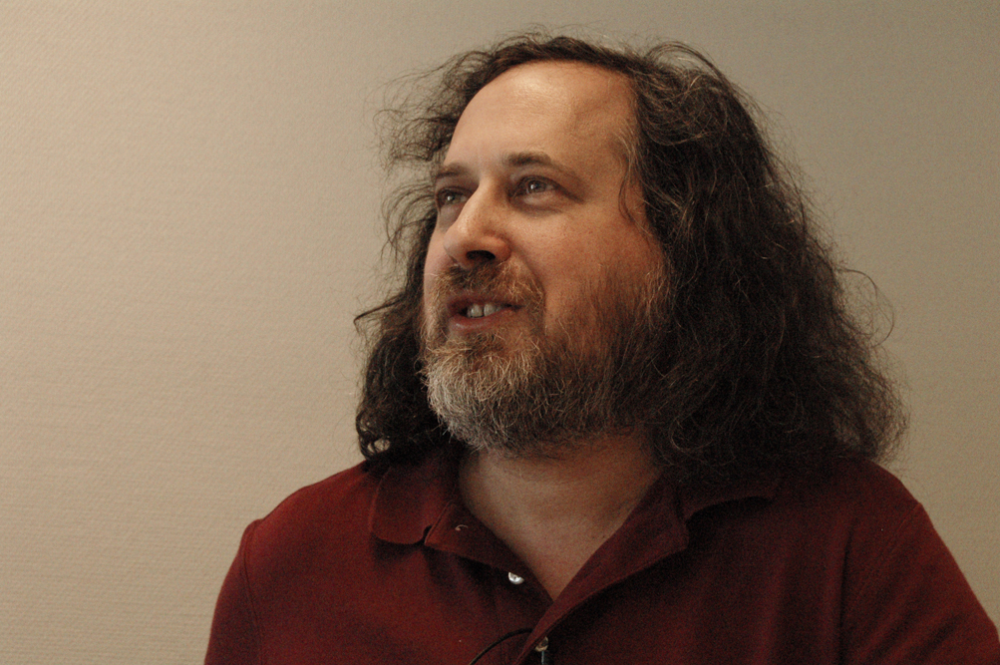
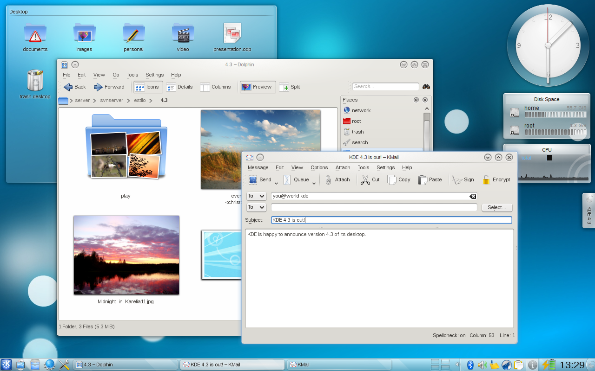
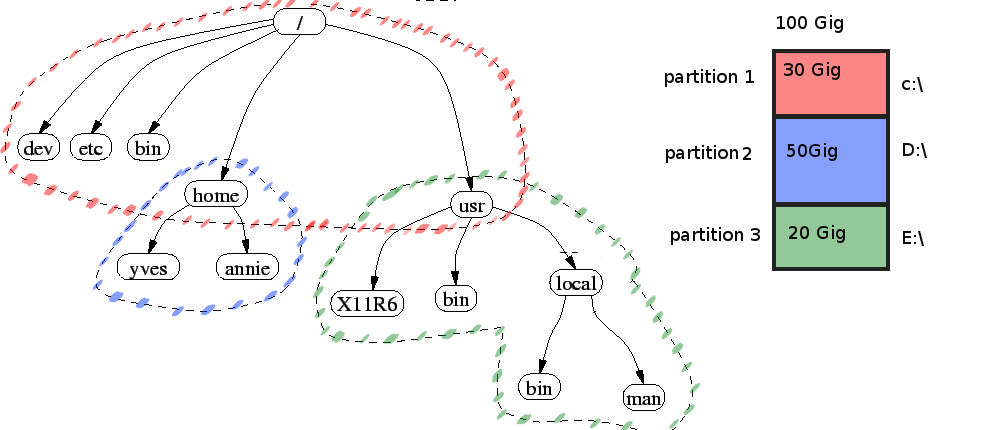
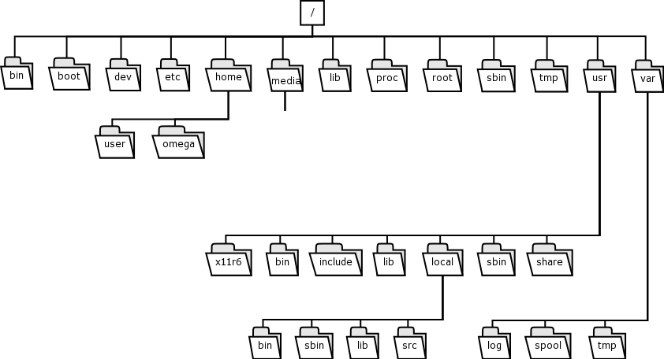

# Révision ou présentation rapide de GNU/Linux

L'objectif de cette présentation est de vous fournir une présentation de GNU/Linux les concepts essentiels. Bien entendu ceci n'enlève pas l'importance des formations GNU/Linux 101, 201 et 202 qui couvre plus en détail l'ensemble de le matière. Je comprend que vous n'avez pas le temps d'écoute presque 100 vidéos de 45 minutes chaque. Donc voici un résumé de l'ensemble j'espère que ce sera assez complet , sinon vous creuserez .

# Historique de GNU/Linux

## Richard stalllman

Le 27 septembre 1983, Richard Stallman dévoile dans la pure tradition hacker son projet de développer un système d’exploitation compatible UNIX appelé GNU2, en invitant la communauté hacker à le rejoindre et participer à son développement. Cette annonce succède à la « guerre » déclarée par Symbolics au laboratoire d’intelligence artificielle du MIT et à la disparition de la communauté hacker Lisp3. Il annonce que le système pourra être utilisé et partagé librement par tous comme ce fut le cas avec Emacs4. Concrètement il relate l’effort à accomplir, dont on distingue déjà en 1985 certaines pièces maîtresses : le compilateur GCC finalisé dès juin 19844, une version emacs compatible UNIX, etc. L’effort sera opiniâtrement poursuivi, et au début des années 90, le projet GNU possède une version utilisable de tous les éléments nécessaires à la construction d’un système d’exploitation (outre ceux cités précédemment : un shell, des bibliothèques, les composants de base, les outils de développement…) à l’exception du plus central : le noyau.

## Naissance du noyau Linux

En 1991, les compatibles PC dominent le marché des ordinateurs personnels et fonctionnent généralement avec les systèmes d'exploitation MS-DOS, WindoPhoto de Linus Torvaldsws ou OS/2. Les PC basés sur le microprocesseur Intel 80386, vendus depuis 1986, commencent à être abordables. Mais les systèmes grand public restent attachés à la compatibilité avec les anciens processeurs 16 bits d'Intel et exploitent mal les capacités 32 bits et l'unité de gestion mémoire du 80386.

C'est cette année que l’étudiant finlandais Linus Torvalds, indisposé par la faible disponibilité du serveur informatique UNIX de l’université d'Helsinki, entreprend le développement d’un noyau de système d'exploitation, qu’on appellera plus tard le « noyau Linux ». Linus désire alors surtout comprendre le fonctionnement de son ordinateur fondé sur un Intel 80386.

Linus Torvalds fait son apprentissage avec le système d’exploitation Minix. Comme le concepteur de Minix — Andrew Tanenbaum — refuse d’intégrer les contributions visant à améliorer Minix, Linus décide de programmer un remplaçant de Minix. Il commence par développer un simple émulateur de terminal, qu’il utilise pour se connecter via un modem au serveur informatique de son université. Après l’ajout de diverses fonctionnalités dont un système de fichiers compatible avec celui de Minix, Linus oriente son projet vers quelque chose de plus ambitieux : un noyau aux normes POSIX. À ce noyau, il adapte de nombreux composants disponibles du système d’exploitation GNU pour obtenir un système d’exploitation plus complet.

Le 26 août 1991, il annonce1 sur le forum Usenet news:comp.os.minix qu'il écrit un système d'exploitation, mais en tant que « hobby, qui ne sera pas grand et professionnel comme gnu ». Le 5 octobre 1991, il annonce la disponibilité d’une ébauche de la version 0.02 de son noyau, la version 0.01 ayant eu une diffusion plus que confidentielle2 Enfin en février 1992, la version 0.12 est diffusée sous la Licence publique générale GNU (GNU GPL) à la place de la licence ad hoc qui interdisait jusque-là la redistribution commerciale3.
Le Projet GNU

# Distribution GNU/Linux

Il existe une très grande variété de distributions, ayant chacune des objectifs et une philosophie particulière. Les éléments différenciant principalement les distributions sont : la convivialité (facilité de mise en œuvre), l'intégration (taille du parc de logiciels validés distribués), la notoriété (communauté informative pour résoudre les problèmes), l'environnement de bureau (GNOME, KDE, ...), le type de paquet utilisé pour distribuer un logiciel (principalement deb et RPM) et le mainteneur de la distribution (généralement une entreprise ou une communauté). Le point commun est le noyau (kernel) et un certain nombre de commandes.

Les distributions rassemblent les composants d'un système dans un ensemble cohérent et stable dont l'installation, l'utilisation et la maintenance sont facilitées. Elles comprennent donc le plus souvent un logiciel d'installation et des outils de configuration. Il existe de nombreuses distributions, chacune ayant ses particularités. Certaines sont dédiées à un usage spécifique (pare-feu, routeur, grappe de calcul, édition multimédia…), d'autres à un matériel spécifique.

Les distributions généralistes destinées au grand public pour un usage en poste de travail (bureautique) sont les plus connues (Debian, Gentoo, Mandriva Linux, Red Hat/Fedora, Slackware, SUSE Linux Enterprise/openSUSE, Ubuntu). Le mainteneur de la distribution peut être une entreprise (comme dans le cas de Mandriva, RedHat et Ubuntu, Canonical) ou une communauté (comme Debian, Gentoo ou Slackware).

Leurs orientations particulières permettent des choix selon les besoins et les préférences de l'utilisateur. Certaines sont plus orientées vers les utilisateurs débutants (Mandriva Linux, Ubuntu, etc.), car plus simples à mettre en œuvre. Debian, en revanche, reste prisée pour les serveurs ou plutôt considérée comme une méta-distribution, c'est-à-dire pour servir de base à une nouvelle distribution. Diverses distributions en dérivent, comme Ubuntu, Knoppix, MEPIS… L'installation de Debian est devenue plus facile depuis la version 3.1 (Sarge), néanmoins des compétences en shell et une culture des projets libres restent nécessaires pour obtenir le GNU/Linux de ses rêves ; en revanche la mise à jour et la maintenance du système sont très aisées grâce aux outils Debian. La distribution Gentoo, destinée à des utilisateurs plus connaisseurs, à la recherche de mises à jour fréquentes, a pour particularité d'être compilée depuis le code source sur le poste même de l'usager, en tenant compte des nombreux paramètres locaux. Ceci en fait le système d'exploitation le plus optimisé pour chaque configuration individuelle. Certaines distributions sont commerciales, comme celles de Red Hat, Mandriva (ex-MandrakeSoft) ou de Novell/SUSE, alors que d'autres sont l'ouvrage d'une fondation à but non lucratif comme Gentoo et Debian.

Vous pouvez voir la multiplication des distributions avec cette images : [http://upload.wikimedia.org/wikipedia/commons/1/1b/Linux_Distribution_Timeline.svg](http://upload.wikimedia.org/wikipedia/commons/1/1b/Linux_Distribution_Timeline.svg).

## Deux grand famille de distribution

Il existe 2 regroupement de distribution , ce qui les distingues est la mécanique pour faire l'installation des logiciels et par le fait même l'organisation des fichiers.

* Redhat (RPM) : Sous la distribution 'Redhat a like' (Comme Redhat en français) utilise le package logiciel de type RPM , nous retrouvons les distributions : CentOS , Redhat (évidement) , Fedora , Suse ( qui a dérivé beaucoup avec le temps ) 
* Debian (DEB) : le package logiciel utilisé est Deb, nous retrouvons les distributions Ubuntu  et l'ensemble de ses  dérivé , Mint , Lubuntu, Kubuntu, ...

Il y a des distributions pour chaque besoin :

* Serveur : RedHat / CentOS , Debian , Ubuntu.
* Desktop : Fedora , Ubuntu , Debian.
    * Desktop avec peu de puissance : XUbuntu 

L'objectif de la distribution est d'offrir une pré-configuration adéquat pour le besoin , mais si vous désirez avoir un Desktop avec RedHat il n'y a pas de problème vous aurez plus de logiciel à installé suite à l'installation initial.

# Caractéristique de GNU/Linux

## Description de GNU/Linux

**Linux** est le noyau du système d'exploitation qui fait l’interaction entre le matériel et le logiciel. La partie **GNU** est l'ensemble des logiciels qui permet à l'utilisateur d'utiliser le système. Le couple GNU/Linux forme le système d'exploitation. Autour d'eux se regroupe de nombreux programmes.

GNU/Linux est :

*   **multi-platformes**
*   **multi-utilisateurs**
*   **multi-tâches**
*   **multi-processeurs**

Le système d'exploitation est orienté réseau. L'origine de Unix et donc de GNU/Linux provient du monde des [MainFrames. ](http://fr.wikipedia.org/wiki/Mainframe "mainframe wikipedia")À cette époque, le système d'exploitation était sur un ordinateur central et les utilisateurs établissaient une connexion à ce dernier avec des terminaux. Cette logique fut conservée bien que l'ensemble des communications sont maintenant local sur une seule machine ; ceci offre une grande flexibilité.

Le système GNU/Linux a l'avantage d'être "**scalable**". En d'autres mots, il peut être exécuté aussi bien sur un système avec peu de ressources que sur une machine sur-puissante. Bien entendu, si nous exécutons GNU/Linux sur un Pentium 100Mhrz, il ne faut pas espérer jouer aux derniers jeux sortis. Cependant, il sera possible d'utiliser le système dans la limite de ses ressources.  Le Noyau Linux est très modulaire. Ceci offre la possibilité de réduire l'emprunte mémoire et des fonctionnalités qu'il utilise.

La **sécurité de GNU/Linux est réputé ;** ce n'est pas simplement parce que c'est GNU/Linux et que les programmeurs sont meilleurs que les autres ... L'architecture du système aide à la sécurité, cependant ce n'est pas la principale raison. Si nous regardons les bug et les failles de sécurités qui sont publiés, il y en a autant que sur les autres systèmes. La particularité est que le code source est disponible, par le fait même un grand nombre de personnes relisent le code et le décortiquent ; si un problème est trouvé, il est signalé. Ceci offre une masse énorme de personnes qui réalise du "code review" et même parfois propose le correctif.

GNU/Linux utilise la segmentation des processus par utilisateur. Ceci permet d'augmenter la sécurité du système ; chaque utilisateur ne pouvant accéder qu'aux données auquelles il a droit.

## Utilisateurs

Chaque utilisateur est identifié par un **nom d'utilisateur** (**login**) et un **mot de passe** (**password**).

Le **login** est associé à un numéro unique (le**UID** :**U**ser**ID**entifiant) et permet d'identifier chaque utilisateur. Il ne contient ni espaces, ni caractères spéciaux.

Le **mot de passe** doit être choisi judicieusement : il doit inclure des caractères en minuscule et majuscule, des chiffres et des caractères spéciaux.

Chaque utilisateur dispose d'un répertoire de travail (le Home Directory) dans lequel il a le droit de créer ses propres fichiers et répertoires. Ce répertoire de travail se situe généralement dans le répertoire **/home** et porte le nom dulogin. Exemple : le répertoire de travail de l'utilisateur alex est /home/alex.

Il existe un utilisateur particulier : le **root**. **Le root est l'administrateur du système**, il dispose de tous les droits et s'occupe de la gestion du système : ajout et suppression des utilisateurs, installation et configuration du système et des logiciels ...

Le root a tous les pouvoirs sur le système, il peut tout faire, y compris tout casser. De ce fait, il faut donc choisir un mot de passe très sécurisé, et toujours vérifier deux fois avant d'exécuter une opération avec l'utilisateur root.

Le root n'est pas un utilisateur à proprement parler, il s'agit d'une fonction. Ainsi, il ne faut jamais travailler en permanence avec le compte root, mais utiliser son compte habituel, et ne passer root(via les commandes **su** ou **sudo**) que si l'on a besoin de réaliser une opération d'administration.

Contrairement aux autres utilisateurs, le répertoire de travail du **root** se situe à la racine du système (**/root**). L'explication est simple : en cas de problème avec la partition **/home**, l'utilisateur root pourra quand même accéder à son répertoire de travail.

## Interfaces

### La ligne de commande  terminal linux

De par la filiation avec [UNIX](http://fr.wikipedia.org/wiki/UNIX "UNIX"), la [ligne de commande](http://fr.wikipedia.org/wiki/Interpr%C3%A9teur_de_commandes "Interpréteur de commandes") (ou [shell](http://fr.wikipedia.org/wiki/Shell_%28informatique%29 "Shell (informatique)") [Unix](http://fr.wikipedia.org/wiki/Unix "Unix")) est toujours disponible dans Linux, quelle que soit la distribution.

Certaines distributions, notamment celles spécialisées dans les serveurs ou certaines tâches d’administration, utilisent uniquement la ligne de commande, en particulier pour sa faible consommation de ressources, dû à l’absence d’[interface graphique](http://fr.wikipedia.org/wiki/Interface_graphique "Interface graphique"), mais surtout pour sa puissance d’action, liée à l’[interopérabilité](http://fr.wikipedia.org/wiki/Interop%C3%A9rabilit%C3%A9 "Interopérabilité") des commandes et la possibilité de générer des [scripts](http://fr.wikipedia.org/wiki/Langage_de_script "Langage de script").

Longtemps, de nombreuses opérations de configuration nécessitaient son utilisation, ce qui n’est plus vrai avec les distributions récentes dédiées à l’utilisation familiale. Néanmoins, les aides en ligne mentionnent souvent la démarche à suivre en ligne de commande, même lorsqu’une configuration graphique est possible : cette méthode est plus _universelle_ dans le monde Linux, et souvent plus facile à expliquer pour la personne qui aide, et son interlocuteur n’a qu’à [copier-coller](http://fr.wikipedia.org/wiki/Copier-coller "Copier-coller") l’indication.

### Gestionnaires X Window

L’emploi du terme générique _Linux_ est trompeur s’agissant de l’utilisation d’un ordinateur personnel. En effet, il existe plusieurs interfaces (ou [gestionnaire de fenêtres](http://fr.wikipedia.org/wiki/Gestionnaire_de_fen%C3%AAtres "Gestionnaire de fenêtres")) aux caractéristiques différentes, comme [KDE](http://fr.wikipedia.org/wiki/KDE "KDE"), [GNOME](http://fr.wikipedia.org/wiki/GNOME "GNOME") ou [Xfce](http://fr.wikipedia.org/wiki/Xfce "Xfce").

Cependant, comme toutes ces interfaces sont fondées sur [X Window](http://fr.wikipedia.org/wiki/X_Window_System "X Window System"), leurs applications peuvent cohabiter et elles offrent des points communs, dont l’affichage de fenêtres à distance (y compris via des protocoles compressés et chiffrés comme [ssh](http://fr.wikipedia.org/wiki/Secure_Shell "Secure Shell") et nox) et le [copier-coller](http://fr.wikipedia.org/wiki/Copier-coller "Copier-coller") simplifié : un texte sélectionné par la souris est automatiquement copié, un clic milieu (ou un clic molette, ou sur les deux boutons en même temps) suffit alors pour coller le texte à l’endroit désiré. Il n’y a donc jamais besoin du clavier pour effectuer un copier-coller sous X.

Deux environnements de bureau ont atteint récemment une maturité certaine ; citons l’année 2003 pour KDE[44](http://fr.wikipedia.org/wiki/Linux#cite_note-44), un peu plus tard pour GNOME. Très actifs, ces deux projets ont néanmoins l’intention de s’améliorer nettement pour leurs prochaines versions majeures ; les efforts dans ce sens sont concentrés au sein des projets Appeal pour KDE, et ToPaZ[45](http://fr.wikipedia.org/wiki/Linux#cite_note-45) pour GNOME.

Techniquement, ils reposent tous deux sur de nombreuses technologies communes, au premier rang desquelles le système de fenêtrage [X11](http://fr.wikipedia.org/wiki/X_Window_System "X Window System"). Pour éviter de dupliquer

certains efforts, une zone informelle de collaboration entre ces projets du nom de [Freedesktop.org](http://fr.wikipedia.org/wiki/Freedesktop.org "Freedesktop.org") a été mise en place.

On peut noter également la montée en puissance d’un troisième environnement de bureau appelé [Xfce](http://fr.wikipedia.org/wiki/Xfce "Xfce"), qui vise à fournir un environnement complet fondé sur [GTK+](http://fr.wikipedia.org/wiki/GTK%2B "GTK+") comme GNOME, tout en restant plus léger que ce dernier ou KDE.

## Structure du système de fichiers

Comparez le stockage des répertoires et fichiers de votre ordinateur à un arbre : en partant de la racine d’un arbre, en déplaçant votre doigt tout le long de l’arbre, en suivant le tronc puis les branches, vous pouvez toucher n’importe quelle feuille de cet arbre.

Dans les systèmes de type GNU/Linux, toute l’information stockée dans vos médias de stockage (disques durs, clé USB, cartes SD, CD-ROM, etc.) est nécessairement accessible en suivant un chemin depuis un emplacement logique appelée la _racine_ (notée par une barre oblique [1)](http://doc.ubuntu-fr.org/arborescence#fn__1)). La racine est une partition que vous définissez comme étant la base du stockage de vos fichiers. Puis, cette base se sépare logiquement en répertoires (comme des branches d’un arbre), eux-même séparés en sous-répertoires et sous-sous-répertoires, et ainsi de suite, dans lesquels sont enregistrés vos fichiers (les feuilles de l’arbre).

L'ensemble des partitions va se greffer dans arborescence (le terme consacré est « monter »). Contrairement à d'autres systèmes d'exploitation qui nomment chaque partition avec une lettre, sous Unix et GNU/Linux la structure du système de fichier est toujours le même. Un logiciel ou un fichier installé dans un répertoire, par exemple "/usr/bin/Votre_Logiciel", sera toujours accessible par le même chemin d'accès, qu'il soit installé sur la première partition ou la troisième. Ce pourrait même être sur un autre disque dur. Voici une représentation graphique de mon propos :

## Incorporation des médias mobile

Les supports amovibles se "montent" dans des répertoires sous /media .  Lorsqu'on insère un support, un répertoire au nom variable (souvent dérivé du nom du modèle) y est créé automatiquement et le contenu du support y est monté. Ce répertoire peut mettre quelques secondes à apparaitre, il faut afficher répétitivement le contenu du répertoire jusqu'à ce qu'il apparaisse.

Quand je parle de support amovible, ceci inclut les CD-ROM , clef USB , etc. Si nous reprenons la représentation graphique après l'insertion d'un CD , nous aurons le résultat suivante

Et maintenant avec le CD: 

Aujourd'hui le système "monte" automatiquement les périphériques lorsqu'ils sont détectés, peu importe le type, s'il est en mesure de l'interpréter, le système vous offrira l'accès. Linux est en mesure de lire un grand nombre de partitions, au moins en Lecture. Parfois l'écriture est jugé "expérimental", mais reste disponible. Ceci est le cas pour les partitions de type Mac.

Une fois que l'on a terminé, avant de retirer le support, il faut le démonter. **Attention, c'est indispensable.** Si vous oubliez de le faire, votre système de fichiers risque d'être endommagé, car le système d'exploitation est peut-être encore en train d'écrire dessus. Si le CD refuse de sortir lorsque vous appuyez sur le bouton, c'est que vous ne l'avez pas démonté.

Avec le gestionnaire de fichiers de la config conscrit, il faut aller dans le répertoire /media (aller à la racine dans l'arbre du panneau de gauche) choisir le bon répertoire, cliquer du droit dessus, et choisir « unmount » dans le menu.

Si le système d'exploitation refuse de démonter le support , il faut valider qu'aucun programme n'a de fichier d'ouvert sur le périphérique ou que votre shell n'est pas le répertoire de ce dernier. En effet le système refuse de démonté le support s'il est en cours d'accès.

Nous verrons plus tard ce qui se cache derrière cette automatisation. Nous réaliserons manuellement le montage et le démontage du périphérique.

### Description des répertoires

Une des premières difficultés pour les débutants Unix est de se repérer dans l'arborescence. Contrairement à un environnement Windows qui regroupe toutes les ressources nécessaires à un programme dans un même répertoire, les ressources dans un système unix (et dans une moindre mesure MacOS) sont réparties dans une hiérarchie générale. Ainsi, si le code exécutable d'un programme se trouve dans le répertoire `/bin`, ses libraries se trouveront dans le répertoire `/lib` et ses fichiers de configuration, dans le répertoire `/etc`.

La hiérarchie des systèmes unix est normalisée. La spécification est accessible sur [http://www.pathname.com/fhs/](http://www.pathname.com/fhs/)

|  PATH             | Description                                                                                                     |
|:----------------- | --------------------------------------------------------------------------------------------------------------- |
|   /    | la racine, elle contient les répertoires principaux |
|/bin    | contient des exécutables essentiels au système et employés par tous les utilisateurs (par exemple, les commandes [ls](http://www.commentcamarche.net/contents/lincomm.php3), [rm](http://www.commentcamarche.net/contents/lincomm.php3), [cp](http://www.commentcamarche.net/contents/lincomm.php3), [chmod](http://www.commentcamarche.net/contents/lincomm.php3), [mount](http://www.commentcamarche.net/contents/lincomm.php3), ...)  ce sont les **commandes de base** du système |
|/boot   | contient les fichiers permettant à Linux de démarrer, le noyau |
| /dev   | contient les points d'entrée des périphériques tous les périphériques sont pratiquement tous identifiés par un fichier ; la carte réseau n'est pas identifiée sous ce répertoire, elle est directement gérée par le noyau |
| /etc   | contient les commandes et les fichiers nécessaires à l'administrateur du système (fichiers **passwd, group, inittab, ld.so.conf, lilo.conf, ...**), les fichiers de configuration ainsi que les fichiers pour initialiser les services (**réseau, serveur web , ssh , ...**) |
| /home  | répertoire personnel des utilisateurs |
| /lib   | contient des bibliothèques partagées essentielles au système lors du démarrage ; l'équivalent des DLL. |
| /media | contient les points de montage des périphériques amovible (cd-rom, disquette, clef usb ...) |
| /opt   | contient des packages d'applications supplémentaires |
| /root  | répertoire de l'administrateur root | 
| /sbin  | contient les binaires système essentiels, principalement à l'usage de l'administrateur (root) (par exemple la commande **adduser**) |
| /tmp   | contient les fichiers temporaires |
| /usr   | Hiérarchie secondaire  _usr_ comme **u**nix **s**ystem **r**esources) |
|   /usr/bin | contient la majorité des fichiers binaires et commandes utilisateurs |
|   /usr/include |  contient les fichiers d'en-tête pour les programmes C et C++ |
|   /usr/lib | contient la plupart des bibliothèques partagées du système |
|   /usr/local | contient les données relatives aux programmes installés sur la machine locale par le root |
|   /usr/local/bin | binaires des programmes locaux |
|   /usr/local/include |fichiers d'en-tête C et C++ locaux |
|   /usr/local/lib |  Bibliothèques partagées locales |
|   /usr/local/sbin | binaires système locaux |
|   /usr/local/share | hiérarchie indépendante |
|   /usr/sbin       | contient les fichiers binaires non essentiels au système réservés à l'administrateur système |
|   /usr/share      |  réservé aux données non dépendantes de l'architecture |
| /usr/src | contient des fichiers de code source |
| /var | contient des données variables|

## Partition espace d'échange (Swap)

L'**espace d'échange**, généralement appelée par son terme anglais **swap space** ou simplement **swap**, est une zone d'un disque dur faisant partie de la __mémoire virtuelle__[1)](http://doc.ubuntu-fr.org/swap#fn__1) de votre ordinateur. Il est utilisé pour décharger la mémoire vive physique (RAM) de votre ordinateur lorsque celle-ci arrive à saturation. L'espace d'échange se trouve généralement sous une forme de partition de disque dur – on parle alors de __partition d'échange__. Il peut aussi se présenter sous forme de fichier – on parle alors de __fichier d'échange__.

Par défaut, Ubuntu calcule et s'attribue automatiquement un espace d'échange suffisant ou recommandé lors de son installation. Il n'est pas nécessaire d'effectuer des tâches supplémentaires pour assigner un espace d'échange minimum à Ubuntu. Cependant, évaluer ses besoins en espace d'échange peut mieux rationaliser vos ressources.

### Qu'est-ce qu'un espace d'échange ?

La mémoire vive physique (RAM) de l'ordinateur est utilisée pour stocker des données en cours de traitement. Si celle-ci se remplit presque entièrement mais que votre ordinateur a tout de même besoin de ressources pour procéder à des traitements, votre système d'exploitation peut déplacer temporairement des pages mémoire vers l'espace d'échange défini dans votre disque dur afin de libérer des ressources mémoire. L'espace d'échange agit ainsi en tant qu'extension de votre mémoire vive physique : elle récupère, au besoin, des blocs mémoire en excès de votre mémoire vive physique.

Notez cependant que l'espace d'échange se situe dans votre disque dur ; l'accès aux données contenues dans celui-ci est plus lent que celui aux données contenues directement dans la RAM. De plus, l'utilisation de l'espace d'échange ralentit significativement le système et entraîne une activité permanente du disque dur (bruits de "grattements"), provoquant une usure prématurée du matériel. De ce fait, l'espace d'échange ne doit pas être considéré comme un remplacement de votre mémoire vive physique, mais plutôt comme un mécanisme d'appoint.

La plupart des systèmes d'exploitation – sinon tous – gèrent un espace d'échange. Avec les systèmes d'exploitation de type GNU/Linux, dont fait partie Ubuntu, cette zone d'échange se présente généralement sous la forme d'une partition de disque dur dédiée à cet effet. À titre comparatif, Microsoft® Windows® utilise un ou des fichiers dans chacun de ses volumes afin de jouer ce rôle. Il est aussi possible, dans Ubuntu, de créer et utiliser des fichiers assurant un espace d'échange.

Linux peut utilisé une partition dit "Swap" qui peut être utilisé en plus de la RAM

### Pourquoi ai-je besoin d'un espace d'échange ?

*   **Utilisation de programmes exigeants en ressources :** Parfois, des programmes exigent beaucoup de ressources dans votre ordinateur (comme la suite bureautique [LibreOffice](http://doc.ubuntu-fr.org/libreoffice "libreoffice"), des jeux tels [AlienArena](http://doc.ubuntu-fr.org/alienarena "alienarena") ou des logiciels de montage vidéo tels [Cinelerra](http://doc.ubuntu-fr.org/cinelerra "cinelerra")), ce qui amène votre ordinateur à nécessiter davantage de ressources que disponibles. Souvent, une partie de la mémoire vive utilisée au chargement de ces programme n'est réellement exploitée que lors de leur initialisation et n'est plus utilisée par la suite. Le système peut libérer des ressources en déplaçant de telles pages mémoire vers un espace d'échange dans votre disque dur.
    
*   **Hibernation (mise en veille prolongée) :** La fonction d'hibernation conserve votre système en l'état actuel lors de la mise hors-tension de votre ordinateur, ce qui vous permet de reprendre plus rapidement votre travail là où vous l'avez laissé tout en ne consommant pas d'énergie de votre pile ou de votre alimentation secteur. Techniquement, il s'agit d'une copie de l'ensemble des informations contenues dans la mémoire vive de votre ordinateur vers l'espace d'échange de votre disque dur ; pour cette raison, une partition d'échange au moins aussi grande que la quantité de votre mémoire vive est requise pour profiter de cette fonctionnalité.[2)](http://doc.ubuntu-fr.org/swap#fn__2)
    
*   **Circonstances imprévues :** Des évènements imprévisibles peuvent survenir lors de l'utilisation de votre système (un programme ayant une fuite de mémoire, une action qui a besoin davantage de mémoire pour un court laps de temps ou une combinaison de ces évènements). Disposer d'un espace d'échange vous offre un sursis pour localiser le problème ou, à tout le moins, terminer votre travail en cours.
    
*   **Cache mémoire :** Puisque l'accès aux fichiers de votre disque dur est plus lent que ceux placés en mémoire vive, le noyau Linux place en cache dans la mémoire vive les fichiers ouverts. Ceci accélère grandement les traitements. Afin de conserver un maximum d'espace pour ce cache, une partie de la RAM réservée par les programmes mais non utilisée est déplacée dans l'espace d'échange.
    

## Virtualisation

 Linux ouvre également la possibilité d’obtenir une parfaite séparation entre plusieurs environnements virtuels tournant sur un seul ordinateur physique, en prenant en compte les modules de virtualisation présents dans les processeurs récents comme [AMD-V](http://fr.wikipedia.org/wiki/Advanced_Micro_Devices#Pacifica.2FAMD-V "Advanced Micro Devices") sur AMD et [Intel-VT](http://fr.wikipedia.org/wiki/Intel_VT "Intel VT") (ou IVT) sur Intel. Ces environnements de [virtualisation](http://fr.wikipedia.org/wiki/Virtualisation "Virtualisation") permettent d’exécuter des environnements différents ou plusieurs environnements similaires sur une même machine, tout en assurant une certaine sécurité dans la séparation des accès. Ce système est utilisé depuis longtemps par les mainframes d’IBM. IBM a d’ailleurs porté Linux sur celles-ci afin de permettre à ses clients de continuer à les utiliser avec un système plus moderne.

[KVM](http://fr.wikipedia.org/wiki/Kernel-based_Virtual_Machine "Kernel-based Virtual Machine") est, depuis la version 2.6.20 du noyau Linux, le système officiel de virtualisation de ce dernier. Couplé aux outils de [QEMU](http://fr.wikipedia.org/wiki/QEMU "QEMU"), il permet de créer des ordinateurs virtuels tournant directement sur un noyau Linux non modifié et est capable d’accueillir un grand nombre de systèmes d’exploitation, tels que [Windows](http://fr.wikipedia.org/wiki/Microsoft_Windows "Microsoft Windows"), [Solaris](http://fr.wikipedia.org/wiki/Solaris_%28syst%C3%A8me_d%27exploitation%29 "Solaris (système d'exploitation)"), [BSD](http://fr.wikipedia.org/wiki/Berkeley_Software_Distribution "Berkeley Software Distribution"), etc. KVM est au cœur de la stratégie de virtualisation de [Red Hat](http://fr.wikipedia.org/wiki/Red_Hat "Red Hat").

