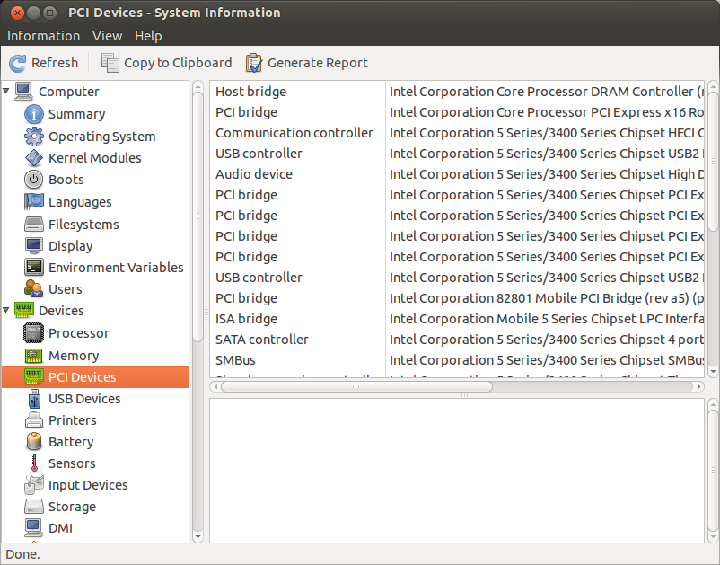

# Présentation des périphériques sous GNU/Linux

## Répertoire /dev  et les fichiers qui le compose

Telle que mentionné lors de la présentation du système de fichier le répertoire **/dev** contient la définition sous forme de fichier des périphériques disponible sur le système. Donc si on liste les fichiers contenu dans le répertoire nous constaterons qu'il y en a beaucoup, une petite explication s'impose afin de comprendre leurs signification.

Il existe 2 types de device :

* **blocks** : les périphériques par blocks transmettent ou reçoivent les informations sous forme de paquets (block) d'octets, d'une taille fixe : c'est par exemple le cas des supports de mémoire de masse (disquettes, disques durs...).
* **caractères** : Les périphériques de caractères ont comme caractéristique de transmettre et recevoir les informations octet par octet : c'est par exemple le cas des ports séries ou parallèles, des modems, etc.

Pour connaître le type du device utilisez la commande ls -l , le premier caractère nous donne cette information, **C** pour caractère et **B** pour block. Voici un exemple pour le périphérique de la console et du disque dur sata :

```bash
utilisateur@hostname:~$ ls -l /dev/sda /dev/sda1 /dev/console  
crw------- 1 root root 5, 1 Jan 27 12:16 /dev/console
brw-rw---- 1 root disk 8, 0 Jan 27 12:16 /dev/sda
brw-rw---- 1 root disk 8, 1 Jan 27 12:16 /dev/sda1
```

Voici un tableau explicatif des noms et leurs rôles:

| Fichier     | Majeur | Mineur | B/C |	Périphérique                        |
|:----------- |:------:|:------:|:---:|-------------------------------------|
|/dev/mem |	1 |	1 |	c |	accès direct à la mémoire centrale|
|/dev/fd0 |	2 |	0 |	b |	premier lecteur de disquettes|
|/dev/hda |	3 |	0 |	b |	disque maître sur le premier port IDE|
|/dev/hda2 |	3 |	2 |	b |	seconde partition primaire sur ce disque|
|/dev/hdb |	3 |	64 |	b |	disque esclave sur le premier port IDE|
|/dev/hdb5 |	3 |	69 |	b |	première partition logique sur ce disque|
|/dev/tty1 |	4 |	1 |	c |	première console virtuelle|
|/dev/lp0 |	6 |	2 |	c |	troisième port parallèle (imprimante)|
|/dev/sda |	8 |	0 |	b |	premier disque dur SCSI / SATA / USB drive , ...|
|/dev/sda3 |	8 |	3 |	b |	troisième partition sur ce disque|
|/dev/sdb |	8 |	16 |	b |	deuxième disque dur SCSI/ SATA / USB drive , ...|
|/dev/psaux |	10 |	1 |	c |	port PS/2 (souris)|
|/dev/bus/usb/001 |	11 |	0 |	c |	Premier Device USB|
|/dev/scd0 |	11 |	0 |	b |	premier CD-ROM SCSI|
|/dev/video0 |	81 |	0 |	c |	Acquisition vidéo|

Il existe aussi des pseudo-périphérique, qui existe que virtuellement mais qui offre de vraie fonctionnalité :

* **/dev/zero** : génére des zéros
* **/dev/random** : génère de l'aléatoire
* **/dev/null** : constitue un trou noir à octets, et notamment utilisé pour se débarrasser des fichiers et des affichages
* **/dev/loop0** : permet de créer de faux périphériques de type block (stockage) à partir de fichiers créés avec la commande dd

Le nom du fichier est indépendant du driver ou matériel utilisé se sont des noms générique, attention ceci n'est pas le cas pour tous les unix , FreeBSD par exemple nomme les périphériques selon le driver.

À présent que nous sommes en mesure d'identifier les périphériques grâce à leur nom, nous allons voir comment le système fait en sorte pour communiquer avec ces derniers. Si nous prenons le cas du premier disque dur SATA sur le système , **/dev/sda**, si je liste les partitions sur le disque j'utiliserai la commande **fdisk** , comme ceci :

```bash
utilisateur@hostname:~$ sudo fdisk -l /dev/sda 
Disk /dev/sda: 60.0 GB, 60011642880 bytes
255 heads, 63 sectors/track, 7296 cylinders, total 117210240 sectors
Units = sectors of 1 * 512 = 512 bytes
Sector size (logical/physical): 512 bytes / 512 bytes
I/O size (minimum/optimal): 512 bytes / 512 bytes
Disk identifier: 0xeede9d79
 
   Device Boot      Start         End      Blocks   Id  System
/dev/sda1   *        2048    58593279    29295616   83  Linux
/dev/sda2        58595326   117209087    29306881    5  Extended
/dev/sda5        58595328    64475135     2939904   82  Linux swap / Solaris
/dev/sda6        64477184   117209087    26365952   83  Linux
```

### Périphérique identifiant  Majeur / Minor

Le fichier **/dev/sda** est un fichier spécial il ne suffit pas de créer un fichier vide dans **/dev** avec le bon nom pour que ceci fonction , il faut que le fichier est les bonnes propriétés ! Il est important de définir le bon type **block** ou **caractere**, de plus il faut définir une valeur majeur (major) et mineur (__minor__). Ces 2 valeurs en combinaisons  avec le type permet d'identifier le périphérique avec lequel nous désirons interagir. L'ensemble des communications avec le matériel est réalisé par le Noyau (**kernel**) , ce dernier conserve un tableau qui lui permet de faire la correspondance avec périphérique.

Voici un exemple pour les disques dur __sata__ :

| Majeur | 	Mineur | Device     | 	Description 						|
|:------:|:-------:|:---------- |---------------------------------------|
|8 |	0 | 	  /dev/sda |  	 Premier disque dur dans son ensemble |
|8 | 	1 |	  /dev/sda1    | La preminère partition du Premier Disque dur |
|8 | 	2 |	  /dev/sda2    |	 La deuxième partition du Premier Disque dur|
|8 |	16| 	  /dev/sdb |	 Deuxième disque dur dans son ensemble|
|8 |	17| 	  /dev/sdb1| 	 Première partition Deuxième Disque dur|

Donc le Majeur 8 représente les __devices__ sur le BUS SCSI , SATA, ... le mineur représente le détail avec lequel  nous interagissons !

Quelle est le processus de création de ces fichiers ? Car si je branche une clef __USB__, le système va créer les fichiers  **/dev/sdb et /dev/sdb1 , /dev/sdb2** ,... . Le système incrémente automatiquement  de **/dev/sda** pour prendre le prochain disponible donc **/dev/sdb** .

Ceci est magnifique et encore une fois merci d'avoir modernisé le système, grâce à **udev** , par contre j'aimerai fournir l'information, sans le système automatique . Car sous le capot il y a un processus .

Le système udev utilise la commande **/bin/mknod** pour faire la création des fichiers contenu dans **/dev** , voici un exemple :

```bash
 # création du device /dev/bidon
 #  type   : block
 #  majeur :  42
 #  mineur :   0
$ mknod /dev/bidon b 42 0
```

```
 Documentation du kernel.
 42 block       Demo/sample use

                This number is intended for use in sample code, as
                well as a general "example" device number.  It
                should never be used for a device driver that is being
                distributed; either obtain an official number or use
                the local/experimental range.  The sudden addition or
                removal of a driver with this number should not cause
                ill effects to the system (bugs excepted.)
```

Ici nous réalisons la création dans /dev  cependant ceci pourrait être n'importe où. Ceci est  à titre INFORMATIF , car si sur un système moderne vous êtes obligé de réaliser cette opération ça veut dire qu'il y a VRAIMENT un problème quelque part. Je doute que cette opération corrige le problème , car l'automatisation du processus de création des devices fonctionne très bien et ceci à chaud . Cependant je trouve intéressant de mieux connaître le processus de création des fichiers.

## lister les périphériques

Il est bien de savoir où sera situé les fichiers pour communiquer avec les périphériques, mais si je ne vois pas le fichier de mon périphérique comment peut-on les lister ?! Nous allons donc voir, comment avoir la liste des périphériques du système , nous en profiterons pour voir l'association des "driver/pilote" qui gère le matériel.

### Lister les périphériques PCI

La commande **lspci** nous permet de lister les cartes __PCI__ ou les devices intégrés, il serait possible qu'une carte soit insérée dans le système mais que le système d'exploitation ne soit pas en mesure de communiquer avec , dans ce cas elle serait listée, mais il y aurai le mot **unknow** de présent. Voici un exemple de la commande **lspci** :

```bash
$ lspci 
00:00.0 Host bridge: Intel Corporation Mobile 945GM/PM/GMS, 943/940GML and 945GT Express Memory Controller Hub (rev 03)
00:02.0 VGA compatible controller: Intel Corporation Mobile 945GM/GMS, 943/940GML Express Integrated Graphics Controller (rev 03)
00:02.1 Display controller: Intel Corporation Mobile 945GM/GMS/GME, 943/940GML Express Integrated Graphics Controller (rev 03)
00:1b.0 Audio device: Intel Corporation NM10/ICH7 Family High Definition Audio Controller (rev 01)
00:1c.0 PCI bridge: Intel Corporation NM10/ICH7 Family PCI Express Port 1 (rev 01)
00:1c.1 PCI bridge: Intel Corporation NM10/ICH7 Family PCI Express Port 2 (rev 01)
00:1c.2 PCI bridge: Intel Corporation NM10/ICH7 Family PCI Express Port 3 (rev 01)
00:1d.0 USB controller: Intel Corporation NM10/ICH7 Family USB UHCI Controller #1 (rev 01)
00:1d.1 USB controller: Intel Corporation NM10/ICH7 Family USB UHCI Controller #2 (rev 01)
00:1d.2 USB controller: Intel Corporation NM10/ICH7 Family USB UHCI Controller #3 (rev 01)
00:1d.3 USB controller: Intel Corporation NM10/ICH7 Family USB UHCI Controller #4 (rev 01)
00:1d.7 USB controller: Intel Corporation NM10/ICH7 Family USB2 EHCI Controller (rev 01)
00:1e.0 PCI bridge: Intel Corporation 82801 Mobile PCI Bridge (rev e1)
00:1f.0 ISA bridge: Intel Corporation 82801GBM (ICH7-M) LPC Interface Bridge (rev 01)
00:1f.2 IDE interface: Intel Corporation 82801GBM/GHM (ICH7-M Family) SATA Controller [IDE mode] (rev 01)
00:1f.3 SMBus: Intel Corporation NM10/ICH7 Family SMBus Controller (rev 01)
03:01.0 CardBus bridge: O2 Micro, Inc. OZ601/6912/711E0 CardBus/SmartCardBus Controller (rev 40)
09:00.0 Ethernet controller: Broadcom Corporation NetXtreme BCM5752 Gigabit Ethernet PCI Express (rev 02)
0c:00.0 Network controller: Intel Corporation PRO/Wireless 3945ABG [Golan] Network Connection (rev 02)
```

Nous constatons que j'ai 2 cartes réseaux de présent (ligne 19 et 20) :

* Ethernet controller: Broadcom Corporation (carte réseau filaire)
* Network controller: Intel Corporation (carte réseau wireless)

J'ai aussi la carte graphique et audio (ligne 3 et 5 ) :

* VGA compatible controller: Intel Corporation Mobile 945GM/GMS
* Audio device: Intel Corporation NM10/ICH7

La commande **lspci** peut être exécute par le simple utilisateur , cependant si vous désirez avoir plus de détail avec l'option -v je vous conseil d'exécuter la commande sous l'utilisateur **root**. Je n'ai pas copier l'ensemble des lignes retournées car il y a beaucoup de lignes. Je me concentre sur les 4 périphériques mentionnée plus tôt  :

```bash
$ sudo lspci -v
00:00.0 Host bridge: Intel Corporation Mobile 945GM/PM/GMS, 943/940GML and 945GT Express Memory Controller Hub (rev 03)
        Subsystem: Dell Device 01c2
        Flags: bus master, fast devsel, latency 0
        Capabilities: [e0] Vendor Specific Information: Len=09 <?>
        Kernel driver in use: agpgart-intel
 
00:02.0 VGA compatible controller: Intel Corporation Mobile 945GM/GMS, 943/940GML Express Integrated Graphics Controller (rev 03) (prog-if 00 [VGA controller])
        Subsystem: Dell Device 01c2
        Flags: bus master, fast devsel, latency 0, IRQ 16
        Memory at eff00000 (32-bit, non-prefetchable) [size=512K]
        I/O ports at eff8 [size=8]
        Memory at d0000000 (32-bit, prefetchable) [size=256M]
        Memory at efec0000 (32-bit, non-prefetchable) [size=256K]
        Expansion ROM at <unassigned> [disabled]
        Capabilities: [90] MSI: Enable- Count=1/1 Maskable- 64bit-
        Capabilities: [d0] Power Management version 2
        Kernel driver in use: i915
 
00:02.1 Display controller: Intel Corporation Mobile 945GM/GMS/GME, 943/940GML Express Integrated Graphics Controller (rev 03)
        Subsystem: Dell Device 01c2
        Flags: bus master, fast devsel, latency 0
        Memory at eff80000 (32-bit, non-prefetchable) [size=512K]
        Capabilities: [d0] Power Management version 2
 
00:1b.0 Audio device: Intel Corporation NM10/ICH7 Family High Definition Audio Controller (rev 01)
        Subsystem: Dell Device 01c2
        Flags: bus master, fast devsel, latency 0, IRQ 43
        Memory at efebc000 (64-bit, non-prefetchable) [size=16K]
        Capabilities: [50] Power Management version 2
        Capabilities: [60] MSI: Enable+ Count=1/1 Maskable- 64bit+
        Capabilities: [70] Express Root Complex Integrated Endpoint, MSI 00
        Capabilities: [100] Virtual Channel
        Capabilities: [130] Root Complex Link
        Kernel driver in use: snd_hda_intel
 
[[ OUTPUT COUPÉ ]]
 
 
09:00.0 Ethernet controller: Broadcom Corporation NetXtreme BCM5752 Gigabit Ethernet PCI Express (rev 02)
        Subsystem: Dell Latitude D620
        Flags: bus master, fast devsel, latency 0, IRQ 45
        Memory at efcf0000 (64-bit, non-prefetchable) [size=64K]
        Expansion ROM at <ignored> [disabled]
        Capabilities: [48] Power Management version 2
        Capabilities: [50] Vital Product Data
        Capabilities: [58] MSI: Enable+ Count=1/8 Maskable- 64bit+
        Capabilities: [d0] Express Endpoint, MSI 00
        Capabilities: [100] Advanced Error Reporting
        Capabilities: [13c] Virtual Channel
        Kernel driver in use: tg3
 
0c:00.0 Network controller: Intel Corporation PRO/Wireless 3945ABG [Golan] Network Connection (rev 02)
        Subsystem: Intel Corporation Device 1020
        Flags: bus master, fast devsel, latency 0, IRQ 44
        Memory at efdff000 (32-bit, non-prefetchable) [size=4K]
        Capabilities: [c8] Power Management version 2
        Capabilities: [d0] MSI: Enable+ Count=1/1 Maskable- 64bit+
        Capabilities: [e0] Express Legacy Endpoint, MSI 00
        Capabilities: [100] Advanced Error Reporting
        Capabilities: [140] Device Serial Number 00-18-de-ff-ff-17-93-6f
        Kernel driver in use: iwl3945
```

J'aimerai particulièrement porter votre attention sur les lignes contenant l'information "**Kernel driver in use**" , ceci nous information quelle driver/pilote le système utilise pour communiquer avec le périphérique . Si nous reprenons nos 4 devises mentionnés plus tôt :

* Ethernet controller: Broadcom Corporation (carte réseau filaire)  : tg3
* Network controller: Intel Corporation (carte réseau wireless) :  iwl3945
* VGA compatible controller: Intel Corporation Mobile 945GM/GMS : i915
* Audio device: Intel Corporation NM10/ICH7 : snd_hda_intel

Nous reviendrons sur les drivers très bientot j'aimerai que nous continuons à lister les périphériques du système !

### Lister les périphériques USB

Avec la prolifération de périphérique __USB__, il est important d'être en mesure de les lister. Il est peut-être encore plus important d'être en mesure de le faire, car ses derniers peuvent être branché à Chaud ! Nous retrouvons la même syntaxe de commande , **lsusb** et avec l'option -v nous aurons plus d'information . Mais attention -v donne beaucoup plus d'information ! Le concept reste le même utilisez **sudo** avec **-v** afin d'avoir l'ensemble de l'information .

```bash
$ lsusb
Bus 001 Device 003: ID 0930:6545 Toshiba Corp. Kingston DataTraveler 102 Flash Drive / HEMA Flash Drive 2 GB / PNY Attache 4GB Stick
Bus 001 Device 001: ID 1d6b:0002 Linux Foundation 2.0 root hub
Bus 005 Device 001: ID 1d6b:0001 Linux Foundation 1.1 root hub
Bus 004 Device 002: ID 0461:4d22 Primax Electronics, Ltd 
Bus 004 Device 001: ID 1d6b:0001 Linux Foundation 1.1 root hub
Bus 003 Device 001: ID 1d6b:0001 Linux Foundation 1.1 root hub
Bus 002 Device 004: ID 0b97:7762 O2 Micro, Inc. Oz776 SmartCard Reader
Bus 002 Device 003: ID 0b97:7761 O2 Micro, Inc. Oz776 1.1 Hub
Bus 002 Device 002: ID 413c:a005 Dell Computer Corp. Internal 2.0 Hub
Bus 002 Device 001: ID 1d6b:0001 Linux Foundation 1.1 root hub
```

Si nous regardons dans l'exemple ci-dessus j'ai :

* Un clef USB de données branché : Bus 001 Device 003: ID 0930:6545 Toshiba Corp. Kingston DataTraveler 102 Flash Drive / HEMA Flash Drive 2 GB / PNY Attache 4GB Stick
* une sourie ( faut le savoir :P ) : Bus 004 Device 002: ID 0461:4d22 Primax Electronics, Ltd
* Un lecteur de carte interne : Bus 002 Device 004: ID 0b97:7762 O2 Micro, Inc. Oz776 SmartCard Reader

Comment ai-je fais pour savoir que Primax Electronics est une souris ? Avec l'information transmise par **lsusb** je ne pouvais pas le savoir mais avec l'option -v j'ai l'information. Il est possible de transmettre en paramètre un device spécifique a interrogé pour avoir l'ensemble de l'information!

```bash
$ sudo  lsusb -v -s 004:002
 
Bus 004 Device 002: ID 0461:4d22 Primax Electronics, Ltd 
Device Descriptor:
  bLength                18
  bDescriptorType         1
  bcdUSB               2.00
  bDeviceClass            0 (Defined at Interface level)
  bDeviceSubClass         0 
  bDeviceProtocol         0 
  bMaxPacketSize0         8
  idVendor           0x0461 Primax Electronics, Ltd
  idProduct          0x4d22 
  bcdDevice            2.00
  iManufacturer           0 
  iProduct                2 USB Optical Mouse
  iSerial                 0 
  bNumConfigurations      1
  Configuration Descriptor:
    bLength                 9
    bDescriptorType         2
    wTotalLength           34
    bNumInterfaces          1
    bConfigurationValue     1
    iConfiguration          0 
    bmAttributes         0xa0
      (Bus Powered)
      Remote Wakeup
    MaxPower              100mA
    Interface Descriptor:
      bLength                 9
      bDescriptorType         4
      bInterfaceNumber        0
      bAlternateSetting       0
      bNumEndpoints           1
      bInterfaceClass         3 Human Interface Device
      bInterfaceSubClass      1 Boot Interface Subclass
      bInterfaceProtocol      2 Mouse
      iInterface              0 
        HID Device Descriptor:
          bLength                 9
          bDescriptorType        33
          bcdHID               1.11
          bCountryCode            0 Not supported
          bNumDescriptors         1
          bDescriptorType        34 Report
          wDescriptorLength      52
         Report Descriptors: 
           ** UNAVAILABLE **
      Endpoint Descriptor:
        bLength                 7
        bDescriptorType         5
        bEndpointAddress     0x81  EP 1 IN
        bmAttributes            3
          Transfer Type            Interrupt
          Synch Type               None
          Usage Type               Data
        wMaxPacketSize     0x0004  1x 4 bytes
        bInterval              10
Device Status:     0x0000
  (Bus Powered)
```

Comme vous pouvez le constater à la ligne 14 nous voyons clairement que ceci est un périphérique de type **Optical Mouse**, de plus à la ligne 38  le type du périphérique est Humain Interface . Voici un exemple d'une commande pour extraire l'information de **lsub** avec plusieurs critère : 

```bash
$ sudo lsusb -v  | egrep 'bInterfaceClass|iProduct|idVendor|^Bus' | tr -s " " 
Bus 001 Device 003: ID 0930:6545 Toshiba Corp. Kingston DataTraveler 102 Flash Drive / HEMA Flash Drive 2 GB / PNY Attache 4GB Stick
 idVendor 0x0930 Toshiba Corp.
 iProduct 2 DataTraveler G3 
 bInterfaceClass 8 Mass Storage
Bus 001 Device 001: ID 1d6b:0002 Linux Foundation 2.0 root hub
 idVendor 0x1d6b Linux Foundation
 iProduct 2 EHCI Host Controller
 bInterfaceClass 9 Hub
Bus 005 Device 001: ID 1d6b:0001 Linux Foundation 1.1 root hub
 idVendor 0x1d6b Linux Foundation
 iProduct 2 UHCI Host Controller
 bInterfaceClass 9 Hub
Bus 004 Device 001: ID 1d6b:0001 Linux Foundation 1.1 root hub
 idVendor 0x1d6b Linux Foundation
 iProduct 2 UHCI Host Controller
 bInterfaceClass 9 Hub
Bus 003 Device 001: ID 1d6b:0001 Linux Foundation 1.1 root hub
 idVendor 0x1d6b Linux Foundation
 iProduct 2 UHCI Host Controller
 bInterfaceClass 9 Hub
Bus 002 Device 004: ID 0b97:7762 O2 Micro, Inc. Oz776 SmartCard Reader
 idVendor 0x0b97 O2 Micro, Inc.
 iProduct 2 O2Micro CCID SC Reader
 bInterfaceClass 11 Chip/SmartCard
Bus 002 Device 003: ID 0b97:7761 O2 Micro, Inc. Oz776 1.1 Hub
 idVendor 0x0b97 O2 Micro, Inc.
 iProduct 0 
 bInterfaceClass 9 Hub
Bus 002 Device 002: ID 413c:a005 Dell Computer Corp. Internal 2.0 Hub
 idVendor 0x413c Dell Computer Corp.
 iProduct 0 
 bInterfaceClass 9 Hub
Bus 002 Device 001: ID 1d6b:0001 Linux Foundation 1.1 root hub
 idVendor 0x1d6b Linux Foundation
 iProduct 2 UHCI Host Controller
 bInterfaceClass 9 Hub
```

Ici j'utilise **egrep** avec | pour qu'il retourne plusieurs lignes avec plusieurs critères , ceci me permet de ne conserver que l'essentiel.

Grâce à **lsusb** je peut donc voir "live" les équipements que vous branchez, de plus nous pouvons récolter une multitude d'information. Nous reviendrons sur cette commande quand nous traiterons  **udev** , les informations retourner par **lsusb** nous permettrons d'identifier un périphérique et de réaliser une action spécifique, à suivre .

### lister les informations matériels du système

Maintenant que nous avons vue comment collecter l'information sur les périphériques "amovible" et les cartes "d'extension" (PCI) , voyons les informations systèmes . Il est possible d'extraire l'information de la carte mère , du CPU , de la mémoire , etc . Nous allons voir l'application **dmidecode** qui nous permet de réaliser cette opération , c'est la même application qui est utiliser par OcsInventory/GLPI .

**dmidecode** retourne les informations __SMBios__ (System Management Bios) , voici a quoi ressemble le résultat , j'ai coupé le output pour ne conserver que les parties les pertinente , je vous invite à l'essayer sur votre système :

```bash
$ sudo dmidecode
[[ OUTPUT COUPÉ ]]
Handle 0x0000, DMI type 0, 24 bytes
BIOS Information
	Vendor: Dell Inc.
	Version: A09
	Release Date: 04/03/2008
	Address: 0xF0000
	Runtime Size: 64 kB
	ROM Size: 2048 kB
	Characteristics:
		ISA is supported
		PCI is supported
		PC Card (PCMCIA) is supported
		PNP is supported
		BIOS is upgradeable
		BIOS shadowing is allowed
		Boot from CD is supported
		Selectable boot is supported
		3.5''/720 kB floppy services are supported (int 13h)
		Print screen service is supported (int 5h)
		8042 keyboard services are supported (int 9h)
		Serial services are supported (int 14h)
		Printer services are supported (int 17h)
		CGA/mono video services are supported (int 10h)
		ACPI is supported
		USB legacy is supported
		AGP is supported
		Smart battery is supported
		BIOS boot specification is supported
		Function key-initiated network boot is supported
		Targeted content distribution is supported
	BIOS Revision: 0.9
	Firmware Revision: 0.9
 
Handle 0x0100, DMI type 1, 27 bytes
System Information
	Manufacturer: Dell Inc.
	Product Name: Latitude D630                   
	Version: Not Specified
	Serial Number: 3ZGBXF1
	UUID: 44454C4C-5A00-1047-8042-B3C04F584631
	Wake-up Type: Power Switch
	SKU Number: Not Specified
	Family:  
 
Handle 0x0200, DMI type 2, 9 bytes
Base Board Information
	Manufacturer: Dell Inc.
	Product Name: 0KU184
	Version:    
	Serial Number: .3ZGBXF1.CN1296182R7975.
	Asset Tag:           
 
Handle 0x0300, DMI type 3, 13 bytes
Chassis Information
	Manufacturer: Dell Inc.
	Type: Portable
	Lock: Not Present
	Version: Not Specified
	Serial Number: 3ZGBXF1
	Asset Tag: Not Specified
	Boot-up State: Safe
	Power Supply State: Safe
	Thermal State: Safe
	Security Status: None
 
rocessor Information
	Socket Designation: Microprocessor
	Type: Central Processor
	Family: Core 2 Duo
	Manufacturer: Intel
	ID: FB 06 00 00 FF FB EB BF
	Signature: Type 0, Family 6, Model 15, Stepping 11
	Flags:
		FPU (Floating-point unit on-chip)
		VME (Virtual mode extension)
		DE (Debugging extension)
		PSE (Page size extension)
		TSC (Time stamp counter)
		MSR (Model specific registers)
		PAE (Physical address extension)
		MCE (Machine check exception)
		CX8 (CMPXCHG8 instruction supported)
		APIC (On-chip APIC hardware supported)
		SEP (Fast system call)
		MTRR (Memory type range registers)
		PGE (Page global enable)
		MCA (Machine check architecture)
		CMOV (Conditional move instruction supported)
		PAT (Page attribute table)
		PSE-36 (36-bit page size extension)
		CLFSH (CLFLUSH instruction supported)
		DS (Debug store)
		ACPI (ACPI supported)
		MMX (MMX technology supported)
		FXSR (FXSAVE and FXSTOR instructions supported)
		SSE (Streaming SIMD extensions)
		SSE2 (Streaming SIMD extensions 2)
		SS (Self-snoop)
		HTT (Multi-threading)
		TM (Thermal monitor supported)
		PBE (Pending break enabled)
	Version: Not Specified
	Voltage: 3.3 V
	External Clock: 200 MHz
	Max Speed: 2200 MHz
	Current Speed: 2200 MHz
	Status: Populated, Enabled
	Upgrade: None
	L1 Cache Handle: 0x0700
	L2 Cache Handle: 0x0701
	L3 Cache Handle: Not Provided
	Serial Number: Not Specified
	Asset Tag: Not Specified
	Part Number: Not Specified
	Core Count: 2
	Core Enabled: 2
	Thread Count: 2
	Characteristics:
		64-bit capable
 
 [[ OUTPUT COUPÉ ]]
```

Si vous l'avez exécuté sur votre système vous constatez qu'il y a beaucoup , beaucoup d'information , il faut avoir une idée de ce que l'on cherche quand on utilise cette command. J'utilise cette commande quand je désire savoir :

* Le numéro de serie du système ainsi que le manufacturier
* Connâitre les flags du disque dur afin de savoir s'il support nativement la virtualisation
* Savoir combien de slot de mémoire sont utilisé , quelle est la taille de chaque barrette et savoir s'il y en a de libre.


## Les périphériques et le noyau (kernel)

Telle que mentionné dans la section sur le système d'exploitation le noyau (kernel) Linux réalise le lien entre le matériel et le logiciel. Le concept du driver est un peu différent sous Linux de part la nature open-source et aussi par le fait que les compagnies de matériel n'offre pas toujours les pilotes pour leur périphérique .

Une particularité sous Linux est que le driver est souvent générique , si je prend le cas des cartes réseaux , je peux en avoir plusieurs différents fournisseurs mais qu'il utilise tous le même drivers . Simplement parce que lors de la détection du matériel Le kernel Linux regarde le chipset qui est utilisé et choisi le pilote associé. Que la carte est l'étiquette Intel, Dell, IBM  ou  Ziatugs si c'est les même instructions je vois pas l'intéret de maintenant plusieurs drivers :D. Ceci s'applique pour l'ensemble de périphérique ! Nous retrouvons aussi des drivers "générique" qui sont offre parfois moins de performance mais qui nous permette de démarré le système , nous retrouvons ce cas particulièrement pour la carte graphique , ceci nous permet tout de même d'avoir un affichage et d'ajuster par la suite le pilote.

Une grand majorité de driver sous GNU/Linux sont libre ! Bien entendu il en existe de plus libre que d'autre et parfois on a même le choix , si nous prenons le cas de Nvidia , la compagnie offre un driver propriétaire pour ces cartes graphiques , bien entendu ce driver permet d'utiliser l'ensemble des fonctionnalités de la carte avec l'accélération 3D la plus optimal car la compagnie connait l'ensemble des specs de la carte et possède la bible pour communiquer avec cette dernière. Par contre il existe aussi un driver libre, cependant moins performant en terme de 3D et autre pourquoi parce que les déveloper non pas accès à la bible de communication ils sont donc obligé de faire du reverse engenering pour concevoir leur pilote. Il existe d'autre cas comme les cartes réseaux wireless broadcom qui furent pendant un temps fermé , mais ces dernières année les compagnie ouvre de plus en plus leurs drivers.

Avec Ubuntu , le kernel vient avec des drivers propriétaires , si vous voulez être sûr de ne pas en avoir je vous conseil d'utiliser : http://www.gnewsense.org/ , mais attention faudra aussi s'assuré que votre matériel est totalement supporté :P , principalement la carte réseau wireless :P.

### Le noyau et ses modules

Le noyau Linux nous permet de chargé à chaud des modules , ces modules sont l'équivalent de driver , en fait ces modules nous permette de rajouter de nouvelle fonctionnalité au noyau afin de pouvoir : communiquer avec un périphérique , réaliser des opérations au niveau système , ... Si nous prenons le cas de système GNU/Linux embarqué cette fonctionnalité est enlever et l'ensemble des modules et fonctionnalité sont directement compilé dans le noyau sans les charger. Pour les systèmes embarqué ceci est plus performant dans le cas de desktop, nous sommes susceptible d'ajouter et enlever du matériel plus facilement il est donc plus pratique d'avoir ces modules qui se charge et décharge au besoin. Voici un petit schéma :


#### Lister les modules (lsmod)

Les distributions "moderne" offre une panoplie de module disponible qui n'attende qu'a être utilisé , si nous regardons actuellement nous avons déjà une liste de module utilisé , pour lister les modules utilisé la commande lsmod (liste module):

```bash
$ lsmod
nfnetlink_acct          3772  0 
xt_connmark             1853  2 
iptable_nat             3366  0 
nf_conntrack_ipv4       9206  3 
nf_defrag_ipv4          1411  1 nf_conntrack_ipv4
nf_nat_ipv4             3576  1 iptable_nat
nf_nat                 12343  2 nf_nat_ipv4,iptable_nat
nf_conntrack           73690  5 nf_nat,nf_nat_ipv4,xt_connmark,iptable_nat,nf_conntrack_ipv4
iptable_mangle          1592  1 
iptable_filter          1496  0 
ip_tables              17282  3 iptable_filter,iptable_mangle,iptable_nat
x_tables               17359  4 ip_tables,iptable_filter,xt_connmark,iptable_mangle
nfnetlink               4301  2 nfnetlink_acct
joydev                  9671  0 
snd_hda_codec_idt      37852  1 
pcmcia                 45396  0 
coretemp                6334  0 
psmouse                85428  0 
yenta_socket           32385  0 
kvm                   389093  0 
arc4                    2008  2 
iwl3945                55252  0 
snd_hda_intel          36904  0 
snd_hda_codec         149569  2 snd_hda_codec_idt,snd_hda_intel
snd_hwdep               6340  1 snd_hda_codec
snd_pcm                77709  2 snd_hda_codec,snd_hda_intel
gpio_ich                4536  0 
iTCO_wdt                5407  0 
pcmcia_rsrc             9112  1 yenta_socket
iTCO_vendor_support     1937  1 iTCO_wdt
snd_page_alloc          7242  2 snd_pcm,snd_hda_intel
iwlegacy               49297  1 iwl3945
snd_timer              18726  1 snd_pcm
i915                  656950  3 
snd                    59173  6 snd_hwdep,snd_timer,snd_hda_codec_idt,snd_pcm,snd_hda_codec,snd_hda_intel
dell_laptop             8859  0 
pcmcia_core            14264  3 pcmcia,pcmcia_rsrc,yenta_socket
dcdbas                  6463  1 dell_laptop
microcode              15024  0 
dell_wmi                1493  0 
sparse_keymap           3154  1 dell_wmi
evdev                  10989  11 
mac80211              466554  2 iwl3945,iwlegacy
serio_raw               5049  0 
tg3                   155658  0 
soundcore               5450  1 snd
pcspkr                  2035  0 
drm_kms_helper         36286  1 i915
cfg80211              412854  3 iwl3945,iwlegacy,mac80211
i2c_i801               11277  0 
lpc_ich                13120  0 
ptp                     8276  1 tg3
pps_core                8961  1 ptp
libphy                 20342  1 tg3
drm                   238206  4 i915,drm_kms_helper
i2c_algo_bit            5399  1 i915
i2c_core               24164  5 drm,i915,i2c_i801,drm_kms_helper,i2c_algo_bit
rfkill                 15651  3 cfg80211
thermal                 8532  0 
shpchp                 25465  0 
wmi                     8419  1 dell_wmi
button                  4677  1 i915
intel_agp              10880  1 i915
intel_gtt              12664  3 i915,intel_agp
video                  11196  1 i915
battery                 6837  0 
ac                      3332  0 
acpi_cpufreq           10779  1 
processor              24999  3 acpi_cpufreq
nfs                   191701  0 
lockd                  76942  1 nfs
sunrpc                231063  2 nfs,lockd
fscache                47028  1 nfs
ext4                  474187  1 
crc16                   1367  1 ext4
mbcache                 6082  1 ext4
jbd2                   83504  1 ext4
sd_mod                 30789  2 
sr_mod                 14898  0 
cdrom                  34848  1 sr_mod
ata_generic             3410  0 
pata_acpi               3395  0 
ata_piix               25088  1 
firewire_ohci          31877  0 
libata                170792  3 pata_acpi,ata_generic,ata_piix
scsi_mod              130669  3 libata,sd_mod,sr_mod
firewire_core          52259  1 firewire_ohci
crc_itu_t               1371  1 firewire_core
uhci_hcd               24795  0 
ehci_pci                4000  0 
ehci_hcd               59220  1 ehci_pci
usbcore               179880  3 uhci_hcd,ehci_hcd,ehci_pci
usb_common              1656  1 usbcore
```

J'ai volontairement pas coupé le résultat afin de bien visualiser l'ensemble des modules qui sont chargés , comme nous pouvons le constater ceci est long et pourtant nous n'avons pas beaucoup de périphérique. Je vais donc mettre en lumière quelque module afin de démontré que lorsque l'on parle de module ceci ne correspond pas obligatoirement à un périphérique mais bien à une fonctionnalité :

* **coretemp** : Intel Core temperature monitor
* **gpio\_ich** : GPIO interface for Intel ICH series
* **pcmcia** : PCMCIA Driver Services
* **pcspkr** : PC Speaker beeper driver
* **battery** et **ac** : ACPI Battery Driver et ACPI AC Adapter Driver
* **ext4** : Fourth Extended Filesystem , type du file système équivalent à fat32 ou ntfs
* **uhci\_hcd** : USB Universal Host Controller Interface driver
* **ehci\_hcd** : USB 2.0 'Enhanced' Host Controller (EHCI) Driver

Bien entendu je n'ai pas lister l'ensemble des drivers car ils sont nombreux mais l'objectif ici était surtout de démontré que les modules ne sont pas obligatoirement associé à un périphérique physique , mais peut être simple une extension de fonctionnalité. Vous me demanderez peut-être ou puis je trouver l'information sur les modules qui sont charger ? Par besoin d'aller sur un site web , il existe une commande **modinfo**  , voici un exemple avec le module **coretemp**

```bash
$ modinfo coretemp
filename:       /lib/modules/3.12.1-1-ARCH/kernel/drivers/hwmon/coretemp.ko.gz
license:        GPL
description:    Intel Core temperature monitor
author:         Rudolf Marek <r.marek@assembler.cz>
alias:          x86cpu:vendor:0000:family:*:model:*:feature:*00E7*
depends:        
intree:         Y
vermagic:       3.12.1-1-ARCH SMP preempt mod_unload modversions 
parm:           tjmax:TjMax value in degrees Celsius (int)
```

Comme vous pouvez le constater , il y a la la licence , la description du module , les dépendance de ce dernier (ici aucune) et les paramètres que l'on pourrait associé au module ( ici TjMax ).
Reprenons le résultat de la commande **lspci** nous avions vu que cette commande nous indiqué les modules que les cartes utilise , nous allons prendre un module et afficher l'information sur ce dernier:

```bash
$ lspci  -v | egrep --color '^0|Kernel modules'
00:00.0 Host bridge: Intel Corporation Mobile PM965/GM965/GL960 Memory Controller Hub (rev 0c)
	Kernel modules: intel_agp
00:02.0 VGA compatible controller: Intel Corporation Mobile GM965/GL960 Integrated Graphics Controller (primary) (rev 0c) (prog-if 00 [VGA controller])
	Kernel modules: i915
00:02.1 Display controller: Intel Corporation Mobile GM965/GL960 Integrated Graphics Controller (secondary) (rev 0c)
00:1a.0 USB controller: Intel Corporation 82801H (ICH8 Family) USB UHCI Controller #4 (rev 02) (prog-if 00 [UHCI])
	Kernel modules: uhci_hcd
00:1a.1 USB controller: Intel Corporation 82801H (ICH8 Family) USB UHCI Controller #5 (rev 02) (prog-if 00 [UHCI])
	Kernel modules: uhci_hcd
00:1a.7 USB controller: Intel Corporation 82801H (ICH8 Family) USB2 EHCI Controller #2 (rev 02) (prog-if 20 [EHCI])
	Kernel modules: ehci_pci
00:1b.0 Audio device: Intel Corporation 82801H (ICH8 Family) HD Audio Controller (rev 02)
	Kernel modules: snd_hda_intel
00:1c.0 PCI bridge: Intel Corporation 82801H (ICH8 Family) PCI Express Port 1 (rev 02) (prog-if 00 [Normal decode])
	Kernel modules: shpchp
00:1c.1 PCI bridge: Intel Corporation 82801H (ICH8 Family) PCI Express Port 2 (rev 02) (prog-if 00 [Normal decode])
	Kernel modules: shpchp
00:1c.5 PCI bridge: Intel Corporation 82801H (ICH8 Family) PCI Express Port 6 (rev 02) (prog-if 00 [Normal decode])
	Kernel modules: shpchp
00:1d.0 USB controller: Intel Corporation 82801H (ICH8 Family) USB UHCI Controller #1 (rev 02) (prog-if 00 [UHCI])
	Kernel modules: uhci_hcd
00:1d.1 USB controller: Intel Corporation 82801H (ICH8 Family) USB UHCI Controller #2 (rev 02) (prog-if 00 [UHCI])
	Kernel modules: uhci_hcd
00:1d.2 USB controller: Intel Corporation 82801H (ICH8 Family) USB UHCI Controller #3 (rev 02) (prog-if 00 [UHCI])
	Kernel modules: uhci_hcd
00:1d.7 USB controller: Intel Corporation 82801H (ICH8 Family) USB2 EHCI Controller #1 (rev 02) (prog-if 20 [EHCI])
	Kernel modules: ehci_pci
00:1e.0 PCI bridge: Intel Corporation 82801 Mobile PCI Bridge (rev f2) (prog-if 01 [Subtractive decode])
00:1f.0 ISA bridge: Intel Corporation 82801HM (ICH8M) LPC Interface Controller (rev 02)
	Kernel modules: lpc_ich
00:1f.1 IDE interface: Intel Corporation 82801HM/HEM (ICH8M/ICH8M-E) IDE Controller (rev 02) (prog-if 8a [Master SecP PriP])
	Kernel modules: ata_piix, pata_acpi, ata_generic
00:1f.2 IDE interface: Intel Corporation 82801HM/HEM (ICH8M/ICH8M-E) SATA Controller [IDE mode] (rev 02) (prog-if 8f [Master SecP SecO PriP PriO])
	Kernel modules: ata_piix, pata_acpi, ata_generic
00:1f.3 SMBus: Intel Corporation 82801H (ICH8 Family) SMBus Controller (rev 02)
	Kernel modules: i2c_i801
03:01.0 CardBus bridge: O2 Micro, Inc. Cardbus bridge (rev 21)
	Kernel modules: yenta_socket
03:01.4 FireWire (IEEE 1394): O2 Micro, Inc. Firewire (IEEE 1394) (rev 02) (prog-if 10 [OHCI])
	Kernel modules: firewire_ohci
09:00.0 Ethernet controller: Broadcom Corporation NetXtreme BCM5755M Gigabit Ethernet PCI Express (rev 02)
	Kernel modules: tg3
0c:00.0 Network controller: Intel Corporation PRO/Wireless 3945ABG [Golan] Network Connection (rev 02)
	Kernel modules: iwl3945
 
 # Affiche l'information sur la carte réseau filaire 
$ modinfo tg3
filename:       /lib/modules/3.12.1-1-ARCH/kernel/drivers/net/ethernet/broadcom/tg3.ko.gz
firmware:       tigon/tg3_tso5.bin
firmware:       tigon/tg3_tso.bin
firmware:       tigon/tg3.bin
version:        3.133
license:        GPL
description:    Broadcom Tigon3 ethernet driver
author:         David S. Miller (davem@redhat.com) and Jeff Garzik (jgarzik@pobox.com)
srcversion:     5F6693B7BE37032F61B0883
[[ OUTPUT COUPÉ ]]
depends:        libphy,ptp
intree:         Y
vermagic:       3.12.1-1-ARCH SMP preempt mod_unload modversions 
parm:           tg3_debug:Tigon3 bitmapped debugging message enable value (int)
 
 
 # Affiche l'information sur la carte réseaux sans file 
$ modinfo iwl3945
filename:       /lib/modules/3.12.1-1-ARCH/kernel/drivers/net/wireless/iwlegacy/iwl3945.ko.gz
firmware:       iwlwifi-3945-2.ucode
license:        GPL
author:         Copyright(c) 2003-2011 Intel Corporation <ilw@linux.intel.com>
version:        in-tree:s
description:    Intel(R) PRO/Wireless 3945ABG/BG Network Connection driver for Linux
srcversion:     102CBF0C44B023F828879B7
alias:          pci:v00008086d00004227sv*sd*bc*sc*i*
alias:          pci:v00008086d00004222sv*sd*bc*sc*i*
alias:          pci:v00008086d00004227sv*sd00001014bc*sc*i*
alias:          pci:v00008086d00004222sv*sd00001044bc*sc*i*
alias:          pci:v00008086d00004222sv*sd00001034bc*sc*i*
alias:          pci:v00008086d00004222sv*sd00001005bc*sc*i*
depends:        iwlegacy,cfg80211,mac80211
intree:         Y
vermagic:       3.12.1-1-ARCH SMP preempt mod_unload modversions 
parm:           antenna:select antenna (1=Main, 2=Aux, default 0 [both]) (int)
parm:           swcrypto:using software crypto (default 1 [software]) (int)
parm:           disable_hw_scan:disable hardware scanning (default 1) (int)
parm:           fw_restart:restart firmware in case of error (int)
 
 # affiche l'information sur le module de carte de son
$ modinfo snd_hda_intel
filename:       /lib/modules/3.12.1-1-ARCH/kernel/sound/pci/hda/snd-hda-intel.ko.gz
description:    Intel HDA driver
license:        GPL
alias:          pci:v00001022d*sv*sd*bc04sc03i00*
alias:          pci:v00001002d*sv*sd*bc04sc03i00*
[[ OUTPUT COUPÉ ]]
depends:        snd-hda-codec,snd-pcm,snd,snd-page-alloc
intree:         Y
vermagic:       3.12.1-1-ARCH SMP preempt mod_unload modversions 
parm:           index:Index value for Intel HD audio interface. (array of int)
parm:           id:ID string for Intel HD audio interface. (array of charp)
parm:           enable:Enable Intel HD audio interface. (array of bool)
parm:           model:Use the given board model. (array of charp)
parm:           position_fix:DMA pointer read method.(-1 = system default, 0 = auto, 1 = LPIB, 2 = POSBUF, 3 = VIACOMBO, 4 = COMBO). (array of int)
parm:           bdl_pos_adj:BDL position adjustment offset. (array of int)
parm:           probe_mask:Bitmask to probe codecs (default = -1). (array of int)
parm:           probe_only:Only probing and no codec initialization. (array of int)
parm:           jackpoll_ms:Ms between polling for jack events (default = 0, using unsol events only) (array of int)
parm:           single_cmd:Use single command to communicate with codecs (for debugging only). (bool)
parm:           enable_msi:Enable Message Signaled Interrupt (MSI) (bint)
parm:           patch:Patch file for Intel HD audio interface. (array of charp)
parm:           beep_mode:Select HDA Beep registration mode (0=off, 1=on) (default=1). (array of bool)
parm:           power_save:Automatic power-saving timeout (in second, 0 = disable). (xint)
parm:           power_save_controller:Reset controller in power save mode. (bool)
parm:           align_buffer_size:Force buffer and period sizes to be multiple of 128 bytes. (bint)
parm:           snoop:Enable/disable snooping (bool)
```
Comme nous pouvons le constater la carte de son à beaucoup de paramètre disponible !

#### Charger et décharger un module (modprobe et rmmod)

Maintenant que nous avons vue comment lister les modules nous allons voir comment les charger (**modprobe**) et décharger (**rmmod**) soit dit en passant il est très rare que nous soyons obligé de faire ça ! Nous verrons un peu plus tard le système **udev** qui réalise dynamique cette opération quand nous ajoutons un périphérique ou le supprimons . Je présente ici cette fonctionnalité pour information plus que par nécessite, cependant pendant que nous sommes en train de couvrir le sujet pourquoi ne pas en profiter.  Pour charger et décharger un module dans le **kernel** il faut avoir les permissions d'administrateur , nous serons donc obligé de réaliser cette opération avec __sudo__ ou en étant __root__.

Nous avions vu dans la liste des modules celui de la carte réseau **tg3** , dans l'exemple suivant je vais décharger et recharger le module :

```bash
 # liste le module contenant le pattern tg3
$ lsmod | grep tg3
tg3                   155658  0 
ptp                     8276  1 tg3
libphy                 20342  1 tg3
 
 # décharge le module
$ sudo rmmod tg3
 # reliste les modules et constate qu'il n'y a plus de module tg3
 
 # recharge le module
$ sudo modprobe tg3
 
$ lsmod | grep tg3
tg3                   155658  0 
ptp                     8276  1 tg3
libphy                 20342  1 tg3
```


Telle que mentionné plus tôt je ne préconise pas cette approche autrement que pour faire un test , il n'est pas viable pour l'usage en production ou de tout les jours pour un desktop de devoir entrer des lignes de commandes à chaque reboot du système de plus ces commandes doivent être réalisé comme l'utilisateur root. Cependant c'est intéressant de pouvoir faire des testes , nous avons vu plus tôt avec l'utilisation de la commande **modinfo** qu'il est possible de passer des paramètres au module, ceci se fait simplement en ajoutant le paramètre après l'argument du module à **modprobe** .

```bash
 # liste les paramètre disponible à tg3
$ modinfo tg3 | grep parm
parm:           tg3_debug:Tigon3 bitmapped debugging message enable value (int)
 
 
 # ajout d'une option
$ sudo modprobe tg3 patate=10
 # le module ne renvoie pas d'erreur et se charge.
 
 # ajout d'une option
$ sudo modprobe tg3 tg3_debug=10
```

C'est option peuvent être aussi définie dans le fichier de configuration **/etc/modprobe.d/Nom\_fichier.conf** le nom du fichier est arbitraire le système charge l'ensemble des fichiers avec l'extension .conf voici un exemple du fichier **/etc/modprobe.d/alsa-base.conf**

```
install saa7134 /sbin/modprobe --ignore-install saa7134 $CMDLINE_OPTS && { /sbin/modprobe --quiet --use-blacklist saa7134-alsa ; : ; }
 # Prevent abnormal drivers from grabbing index 0
options bt87x index=-2
options cx88_alsa index=-2
options saa7134-alsa index=-2
options snd-atiixp-modem index=-2
options snd-intel8x0m index=-2
options snd-via82xx-modem index=-2
options snd-usb-audio index=-2
options snd-usb-caiaq index=-2
```

### Message du kernel

Quand le système de load, le kernel va réaliser l'ensemble des détections du matériel . Quand un nouveau périphérique est branché, le système va charger le module en conséquence ou le module va  générer un évènement au niveau du kernel, ce dernier écrire un log. Il est possible en utilisant la commande **dmesg**  d'obtenir ces information . Voici un exemple de **dmesg** , bien entendu il est pas toujours simple de le lire car nous allons voir l'ensemble des cartes PCI passer , etc ..

```bash
$ dmesg
[    0.000000] Initializing cgroup subsys cpuset
[    0.000000] Initializing cgroup subsys cpu
[    0.000000] Linux version 3.2.0-57-generic-pae (buildd@lamiak) (gcc version 4.6.3 (Ubuntu/Linaro 4.6.3-1ubuntu5) ) #87-Ubuntu SMP Tue Nov 12 21:57:43 UTC 2013 (Ubuntu 3.2.0-57.87-generic-pae 3.2.52)
[    0.000000] KERNEL supported cpus:
[    0.000000]   Intel GenuineIntel
[    0.000000]   AMD AuthenticAMD
[    0.000000]   NSC Geode by NSC
[    0.000000]   Cyrix CyrixInstead
[    0.000000]   Centaur CentaurHauls
[    0.000000]   Transmeta GenuineTMx86
[    0.000000]   Transmeta TransmetaCPU
[    0.000000]   UMC UMC UMC UMC
[[ OUTPUT COUPÉ ]]
 
[   22.334400] parport_pc 00:05: reported by Plug and Play ACPI
[   22.334453] parport0: PC-style at 0x378 (0x778), irq 7, dma 3 [PCSPP,TRISTATE,COMPAT,ECP,DMA]
[   22.371152] device-mapper: multipath: version 1.3.1 loaded
[   22.431573] ACPI: PCI Interrupt Link [LAZA] enabled at IRQ 22
[   22.431582] snd_hda_intel 0000:00:05.0: PCI INT B -> Link[LAZA] -> GSI 22 (level, low) -> IRQ 22
[   22.431586] hda_intel: Disabling MSI
[   22.431622] snd_hda_intel 0000:00:05.0: setting latency timer to 64
[   22.432242] lp0: using parport0 (interrupt-driven).
[   22.444540] nvidia: module license 'NVIDIA' taints kernel.
[   22.444545] Disabling lock debugging due to kernel taint
[   22.781575] ACPI: PCI Interrupt Link [LNED] enabled at IRQ 19
[   22.781600] nvidia 0000:02:00.0: PCI INT A -> Link[LNED] -> GSI 19 (level, low) -> IRQ 19
[   22.781610] nvidia 0000:02:00.0: setting latency timer to 64
[[ OUTPUT COUPÉ ]]
 
[    1.492540] scsi 2:0:0:0: Direct-Access     ATA      ST31000524AS     JC4B PQ: 0 ANSI: 5
[    1.492727] sd 2:0:0:0: [sda] 1953525168 512-byte logical blocks: (1.00 TB/931 GiB)
[    1.492734] sd 2:0:0:0: Attached scsi generic sg0 type 0
[    1.492776] sd 2:0:0:0: [sda] Write Protect is off
[    1.492780] sd 2:0:0:0: [sda] Mode Sense: 00 3a 00 00
[    1.492834] sd 2:0:0:0: [sda] Write cache: enabled, read cache: enabled, doesn t support DPO or FUA
[    1.500133] ata5.00: configured for UDMA/100
[    1.514237]  sda: sda1 sda2 sda3
[    1.514635] sd 2:0:0:0: [sda] Attached SCSI disk
    1.660024] usb 2-1: new low-speed USB device number 2 using ohci_hcd
[    1.960054] ata4: SATA link up 1.5 Gbps (SStatus 113 SControl 300)
[    1.968505] ata4.00: ATA-8: ST3500320AS, SD15, max UDMA/133
[    1.968510] ata4.00: 976773168 sectors, multi 16: LBA48 NCQ (depth 0/32)
[    1.984493] ata4.00: configured for UDMA/133
[    1.984671] scsi 3:0:0:0: Direct-Access     ATA      ST3500320AS      SD15 PQ: 0 ANSI: 5
[    1.984820] sd 3:0:0:0: [sdb] 976773168 512-byte logical blocks: (500 GB/465 GiB)
[    1.984853] sd 3:0:0:0: Attached scsi generic sg1 type 0
[    1.984868] sd 3:0:0:0: [sdb] Write Protect is off
[    1.984871] sd 3:0:0:0: [sdb] Mode Sense: 00 3a 00 00
[    1.984891] sd 3:0:0:0: [sdb] Write cache: enabled, read cache: enabled, doesn t support DPO or FUA
[    1.988251] scsi 4:0:0:0: CD-ROM            HL-DT-ST DVDRAM GH20NS10  EL00 PQ: 0 ANSI: 5
[    1.990491]  sdb: sdb1 sdb2
[    1.990884] sd 3:0:0:0: [sdb] Attached SCSI disk
[    1.993339] sr0: scsi3-mmc drive: 48x/48x writer dvd-ram cd/rw xa/form2 cdda tray
[    1.993342] cdrom: Uniform CD-ROM driver Revision: 3.20
[    1.993466] sr 4:0:0:0: Attached scsi CD-ROM sr0
[    1.993593] sr 4:0:0:0: Attached scsi generic sg2 type 5
[[ OUTPUT COUPÉ ]]
 
 
[26467.825422] tg3.c:v3.133 (Jul 29, 2013)
[26467.861300] tg3 0000:09:00.0: irq 46 for MSI/MSI-X
[26467.868040] tg3 0000:09:00.0 eth0: Tigon3 [partno(BCM95755m) rev a002] (PCI Express) MAC address 00:1c:23:41:6d:eb
[26467.868046] tg3 0000:09:00.0 eth0: attached PHY is 5755 (10/100/1000Base-T Ethernet) (WireSpeed[1], EEE[0])
[26467.868050] tg3 0000:09:00.0 eth0: RXcsums[1] LinkChgREG[0] MIirq[0] ASF[0] TSOcap[1]
[26467.868054] tg3 0000:09:00.0 eth0: dma_rwctrl[76180000] dma_mask[64-bit]
[26467.896710] IPv6: ADDRCONF(NETDEV_UP): eth0: link is not ready
[26895.116779] tg3: unknown parameter 'patate' ignored
[26895.116982] tg3.c:v3.133 (Jul 29, 2013)
[26895.161137] tg3 0000:09:00.0 eth0: Tigon3 [partno(BCM95755m) rev a002] (PCI Express) MAC address 00:1c:23:41:6d:eb
[26895.161142] tg3 0000:09:00.0 eth0: attached PHY is 5755 (10/100/1000Base-T Ethernet) (WireSpeed[1], EEE[0])
[26895.161146] tg3 0000:09:00.0 eth0: RXcsums[1] LinkChgREG[0] MIirq[0] ASF[0] TSOcap[1]
[26895.161148] tg3 0000:09:00.0 eth0: dma_rwctrl[76180000] dma_mask[64-bit]
[26895.161656] tg3 0000:09:00.0: irq 46 for MSI/MSI-X
[26895.197172] IPv6: ADDRCONF(NETDEV_UP): eth0: link is not ready
[26914.509842] tg3.c:v3.133 (Jul 29, 2013)
[26914.544289] tg3 0000:09:00.0: irq 46 for MSI/MSI-X
[26914.547560] tg3 0000:09:00.0 eth0: Tigon3 [partno(BCM95755m) rev a002] (PCI Express) MAC address 00:1c:23:41:6d:eb
[26914.547565] tg3 0000:09:00.0 eth0: attached PHY is 5755 (10/100/1000Base-T Ethernet) (WireSpeed[1], EEE[0])
[26914.547568] tg3 0000:09:00.0 eth0: RXcsums[1] LinkChgREG[0] MIirq[0] ASF[0] TSOcap[1]
[26914.547571] tg3 0000:09:00.0 eth0: dma_rwctrl[76180000] dma_mask[64-bit]
[26914.579784] IPv6: ADDRCONF(NETDEV_UP): eth0: link is not ready
```

Nous voyons au début le chargement de l'ensemble du système , la détection du disque dur , du cdrom , la carte de son , la carte nvidia , l'ensemble des information de la détection et des chargements de module noyaux sont présent . Nous voyons d'ailleurs à la toute fin que le module tg3 fut charger plusieurs fois au niveau du système , ceci représente mes démonstration de chargement et déchargement réalisé plus tôt. J'aimerai porter votre attention à la ligne 69 nous retrouvons l'erreur du paramètre patate que j'avais transmis au module , nous constatons que réellement le paramètre fut ignoré.  Lors de l'ajout d'une clef USB de donnée vous constaterez aussi que le kernel renvoie de l'information avec les partitions présente et le nom de fichier dans /dev qui fut créer ainsi que les partitions qui lui sont associé.

### Application graphique disponible

Hardinfo n'est pas vraiment un programme spécifique pour les modules, mais il propose un grand nombres d'informations sur votre ordinateur, dont les modules utilisés par les périphériques.

Pour vous le procurer, il vous suffit d'installer le paquet hardinfo

Vous le trouverez ensuite dans Applications → Outils système → System Profiler and Benchmark




