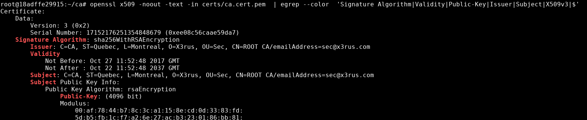
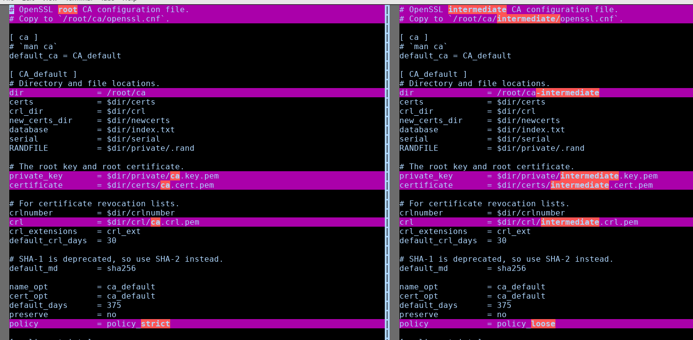
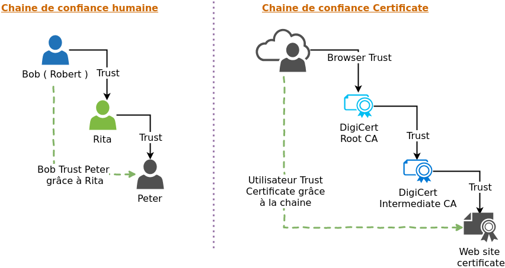
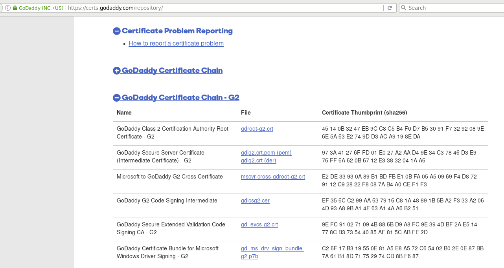
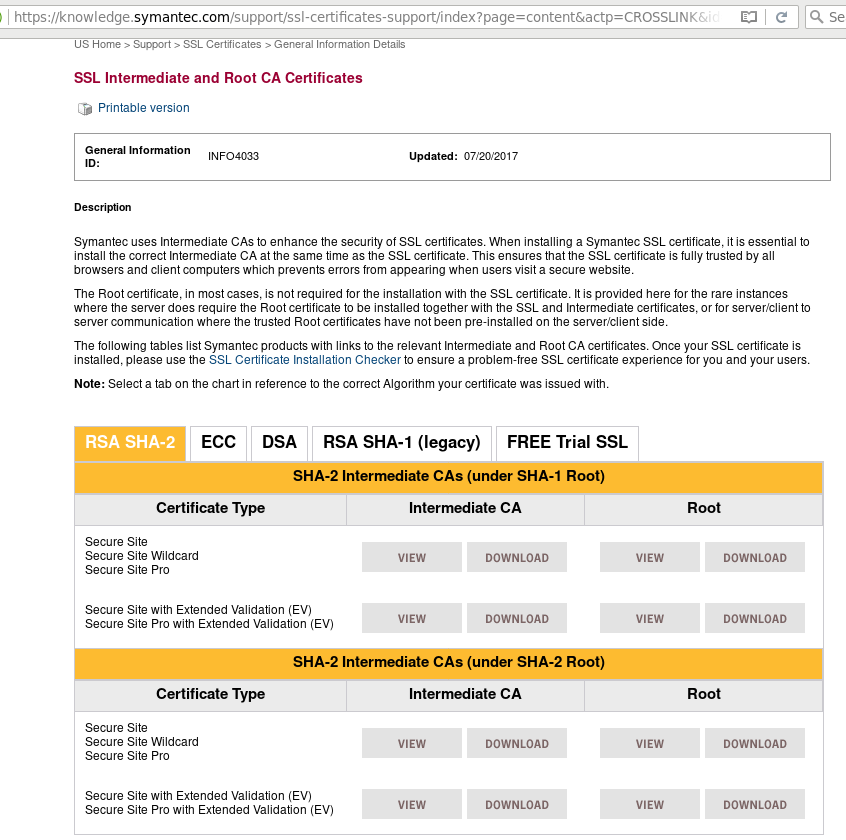
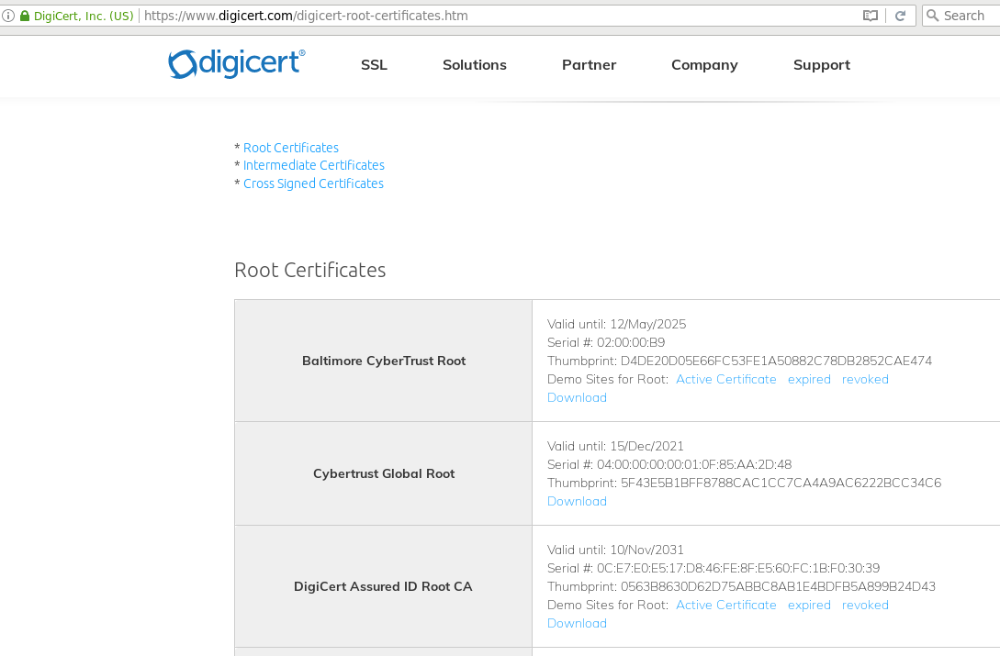
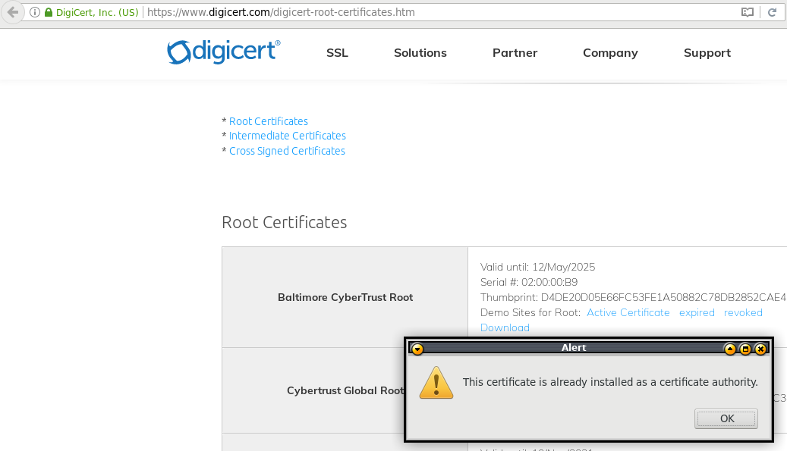

# Description 

Nous allons mettre en place notre propre autorité de certification, donc l'équivalent de Digi cert , very signe , ... Bien entendu l'ensemble de la solution est purement libre !! Est-ce le meilleur système qui sera mis en place ?  NON !
Nous allons voir une solution purement manuel , ceci à des avantages indéniable pour le processus d'apprentissage. Nous allons voir vraiment les opérations , de mise en place et chaque opération nous demandera un peu de temps. Par contre l'ensemble sera des lignes de commandes ce qui va rebouter un peu le client / utilisateur . Il n'y a pas d'interface web pour les demandes / renouvellement , ... Il manque toute une logique pour le renouvellement automatique de certificat. Selon votre usage ceci peut être pratique, car c'est très Léger :D.

Si vous cherchez une solution complète , pour votre entreprise je vous invite à consulter :

* https://www.ejbca.org/
* http://www.openxpki.org/

Il y en a probablement d'autre disponible , mais j'ai fait très peu de recherche.

Pourquoi avoir son CA ?

* Pourquoi pas ? On peut le faire puis c'est libre.
* Parce que vous avait plusieurs service en SSL et pour chaque vous devez définir une exception dans votre fureteur ou client. Avec un CA vous n'aurez qu'un certificat à accepté et l'ensemble des certificats découlant de votre autorité de certification seront autorisé.
* Car vous chiffré tous et que vous générez une multitude de certificat.
* Parce que vous désirez authentifier votre interlocuteur, votre CA fera office de validation de l'identité de la personne qui l'utilise . Bon là faut mettre plus qu'un CA mais aussi un processus de validation de l'identité lors de la réception de la demande ... Mais bon l'idée est à !
* Parce que Let's encrypt est pas disponible pour un usage interne, non publique ... (voir formation Let's encrypt)
* Ha puis je l'ai peut-être pas dit , mais juste **pour le FUN** et **apprendre**  !

* Voici la documentation de référence utilisé : [https://jamielinux.com/docs/openssl-certificate-authority/create-the-root-pair.html](https://jamielinux.com/docs/openssl-certificate-authority/create-the-root-pair.html)

Bon on commence , avant de perdre votre motivation :P ??? 

# Mise en place du l'autorité  de certification

L'opération sera réalisé en 3 étapes :

* Création de l'ultra MASTER root autorité de certification 
* Création d'une autorité de certification intermédiaire
* Création de certificat pour un serveur / service 

Donc bien entendu nous allons débuter avec le premier :D , la création du super **ROOT** 

### Version docker et Version native

Pour réaliser l'opération je vais faire la création d'un CA dans un conteneur docker , la principale raison et l'isolation de la configuration pour ne pas polluer mon environnement environnement de travail avec du matériel de formation. De plus ceci nous assurera que ceci fonctionne peut importe où vous utiliserez ce conteneur. 

Donc je vais fournir le Dockerfile ainsi que le docker-compose , ceci nous offre aussi l'avantage d'avoir l'extraction de l'essentiel voici donc le requis :

* **openssl** : Le seule requis est d'avoir le logiciel openssl de présent !
* **Éditeur de texte** : De plus vous devez avoir VI ou un autre éditeur moins puissant ;-) pour éditer du texte  

Donc voici le résultat du Dockerfile :

```
FROM ubuntu:16.04

RUN apt-get update && \
    apt-get install -y openssl vim
```

Bon pour les puristes OUI je ne devrais pas mettre __vim__ , dans mon conteneur mais comme je veux faire une formation le plus proche d'une installation sur un serveur sans docker ça simplifiera la présentation. 

Voici le docker-compose :

```
version: '2'

services:
    ca:
        image: x3-my-ca
        build: .
        container_name : 'x3-CA-f'
 #      restart: unless-stopped
        volumes:
            - "./volumes/my-CA:/root/"
        networks:
            - none

networks:
    none:
        external: true
``` 

Comme vous pouvez le voir j'ai désactivé le réseau du conteneur car non requis pour l'opération j'optimise la "sécurité" !! 
J'ai aussi associer le répertoire personnel de l'utilisateur root avec le répertoire local ./volumes/my-CA, j'aime pas mettre des valeurs relative comme ça mais bon ...

Nous avons l'ensemble du settup on démarre :D.

```bash
$ docker-compose build
[ ... ]
 ---> bd7d45f8d433                     
 Removing intermediate container 20b7bba34ec9                                   
 Successfully built bd7d45f8d433        
 Successfully tagged x3-my-ca:latest   

$ docker-compose run ca bash
```

En utilisant **docker-compose run** ça me permet d'avoir un conteneur actif uniquement lors de son utilisation en mode interactif, par la suite le système éteint le conteneur.

## ROOT autorité de certification 

Cette autorité de certification représente notre CA primaire , nous allons suivre les meilleurs pratique de sécurité . Pour rappelle peut importe les mécanisme de sécurité que nous allons mettre en place la faille c'est **NOUS** . Quand je mentionne nous je veux dire l'activité humaine et les processus mis en place par ce dernier , j'exclus les actions telle que le vole volontaire , ... 

Le ROOT CA est normalement créer dans une environnement considéré comme sécuritaire , idéalement une machine qui n'a aucune connexion sur les internet, et qui à un disque chiffré . L'idéal aussi est que le système qui contient le ROOT CA soit complètement éteint et non disponible à moins que l'on est un réelle besoin qui ne doit jamais arrivé si vous avez bien fait vos chose ou uniquement une fois tous les 5 ans ou 3 ans. 

Bon nous ici on veut voir comment faire la création d'un CA on va pas s'exciter avec un excès de sécurité mais je vous informe !! 

Nous allons travailler dans le répertoire **/root/ca** bien entendu personne autre que l'administrateur n'a besoin d'y avoir accès :D.

```bash
$ mkdir /root/ca
```

* Création de la structure des répertoires , les fichiers __index.txt__ et __serial__ sont des fichiers de base de donnée plat qui servirons à conserver l'information sur les certificats signés.

```bash
$ cd /root/ca
$ mkdir certs crl newcerts private
$ chmod 700 private
$ touch index.txt
$ echo 1000 > serial
```

Bien entendu le répertoire private contiendra des clé privé il est important de s'assurer que les droits d'accès au fichier sont adéquat .

### Fichier de configuration du ROOT CA

Nous allons maintenant faire la création d'un fichier de configuration pour notre ROOT CA , nous allons partir du fichier [root-config.txt](./data/root-config.txt) , et nous allons le parcourir. 

Je vous invite à le télécharger ( il est dans le dépôt git avec l'ensemble ) et de l'ouvrir votre éditeur préféré et nous allons passer les sections ensemble. 

Nous allons copier ce fichier dans le répertoire /root/ca en lui donnant le nom /root/ca/openssl.cnf

```bash
$ cp root-config.txt /root/ca/openssl.cnf
```

#### Configuration principale


* CA 

```
[ ca ]
 # `man ca`
default_ca = CA_default
```

Cette section est obligatoire, elle indique d'utiliser la section **CA\_default** que nous allons voir dans un instant .

* CA\_default

```
[ CA_default ]
 # Directory and file locations.
dir               = /root/ca
certs             = $dir/certs
crl_dir           = $dir/crl
new_certs_dir     = $dir/newcerts
database          = $dir/index.txt
serial            = $dir/serial
RANDFILE          = $dir/private/.rand

 # The root key and root certificate.
private_key       = $dir/private/ca.key.pem
certificate       = $dir/certs/ca.cert.pem

 # For certificate revocation lists.
crlnumber         = $dir/crlnumber
crl               = $dir/crl/ca.crl.pem
crl_extensions    = crl_ext
default_crl_days  = 30

 # SHA-1 is deprecated, so use SHA-2 instead.
default_md        = sha256

name_opt          = ca_default
cert_opt          = ca_default
default_days      = 375
preserve          = no
policy            = policy_strict
```

Si vous avez décidé de mettre l'ensemble des fichiers dans un autre répertoire que **/root/ca** ajuster la variable **dir** qui définie la racine de notre autorité de certification. Comme vous pouvez le voir nous définissons le lieux de l'ensemble des fichiers (certificats, numéro de série, la clé privé du CA , la définition des la liste des certificats révoqué (CRL) , le nombre de jour par défaut d'un certificat , ... ) De plus nous allons établir les restrictions pour l'autorité de certification intermédiaire via l'instruction **policy = policy\_strict** , voici la section de la politique.

* policy\_strict

```
[ policy_strict ]
 # The root CA should only sign intermediate certificates that match.
 # See the POLICY FORMAT section of `man ca`.
countryName             = match
stateOrProvinceName     = match
organizationName        = match
organizationalUnitName  = optional
commonName              = supplied
emailAddress            = optional
```

Cette politique sera donc utilisé pour faire la création du ou DES autorité de certification intermédiaire , nous y appliquons une restriction, le pays , la province et l'organisation (la compagnie)  doivent être la même . Nous allons avoir pouvoir définir un département ou unité d'affaire de l'entreprise différente un nom ainsi qu'un courriel distinct. 

* policy\_loose 

```
[ policy_loose ]
 # Allow the intermediate CA to sign a more diverse range of certificates.
 # See the POLICY FORMAT section of the `ca` man page.
countryName             = optional
stateOrProvinceName     = optional
localityName            = optional
organizationName        = optional
organizationalUnitName  = optional
commonName              = supplied
emailAddress            = optional
```

Voici la politique qui sera appliqué pour les certificats qui seront signé par l'autorité de certificat secondaire , comme vous pouvez le voir l'ensemble est optionnel . Donc si notre unité d'affaire est en Allemagne , en Australie , en Algérie le certificat pourra être émis par notre autorité de certificat intermédiaire sans problème.

* req

```
[ req ]
 # Options for the `req` tool (`man req`).
default_bits        = 2048
distinguished_name  = req_distinguished_name
string_mask         = utf8only

 # SHA-1 is deprecated, so use SHA-2 instead.
default_md          = sha256

 # Extension to add when the -x509 option is used.
x509_extensions     = v3_ca
```

Ceci nous permet de définir les valeurs pour les requêtes de certificat, nous avons ici le nombre de bits utilisé 2048 commence tranquillement à être limite comme taille de clé, mais bon :P, 4096 ça serait mieux  . Les chaines de caractère pour les informations seront codé en UTF-8, ... L'entrée distinguished\_name permet de définir ce que doit obligatoirement contenir une requête de certificat, nous y arrivons.

* req\_distinguished\_name 

```
[ req_distinguished_name ]
 # See <https://en.wikipedia.org/wiki/Certificate_signing_request>.
countryName                     = Country Name (2 letter code)
stateOrProvinceName             = State or Province Name
localityName                    = Locality Name
0.organizationName              = Organization Name
organizationalUnitName          = Organizational Unit Name
commonName                      = Common Name
emailAddress                    = Email Address

 # Optionally, specify some defaults.
countryName_default             = CA
stateOrProvinceName_default     = Quebec
localityName_default            = Montreal
0.organizationName_default      = x3rus
organizationalUnitName_default  = 
emailAddress_default            =
```

Voici ce que nous allons demander obligatoirement pour nos certificats donc nos requêtes de certificats : Le pays, La province , La ville, le nom de l'organisation, l'unité d'affaire , le nom du site ou service , le courriel . Comme vous pouvez le voir ceci est bien standard, mais l'idée ici est de constaté que en soit vous pourriez ajouter des informations propre à vous telle que le role , le nom du demandeur , ... Attention par contre ces informations seront aussi visible dans le certificat final donc il faut penser que ce sera PUBLIC si le certificat est transmis telle que pour un site web.

Lors de la création d'un nouveau certificat au lieu de saisir l'information manuellement vous pouvez saisir des valeurs par défaut qui seront proposé à la personne qui réalise le certificat. Comme vous pouvez le voir j'ai saisie quelque valeur propre à moi , car c'est assez ennuyant de toujours saisir la même chose :P.

#### Configuration applicable sur demande

Les sections suivante sont des configurations qui seront appliquer sur demande lors de besoin spécifique , c'est des paramètres spécifique qui sont requis pour certain type de certificat , bon j'ai déjà tendance à m'étendre un max si en plus on explique chaque paramètre on s'en sortira pas. Je vous laisse faire vos recherches pour cette partie :P , si vous voulais avoir plus de détail. 

* Paramètre des CA

```
[ v3_ca ]
 # Extensions for a typical CA (`man x509v3_config`).
subjectKeyIdentifier = hash
authorityKeyIdentifier = keyid:always,issuer
basicConstraints = critical, CA:true
keyUsage = critical, digitalSignature, cRLSign, keyCertSign

[ v3_intermediate_ca ]
 # Extensions for a typical intermediate CA (`man x509v3_config`).
subjectKeyIdentifier = hash
authorityKeyIdentifier = keyid:always,issuer
basicConstraints = critical, CA:true, pathlen:0
keyUsage = critical, digitalSignature, cRLSign, keyCertSign
```

Ceci est les 2 sections pour les autorités de certification , nous avons le ROOT ca ainsi que celui pour l'intermédiaire, ils sont  presque pareil sauf le __basicConstraints__  l'intermédiaire à un paramètre en plus. Cependant les 2 peuvent réalisé des signatures, des révocations de certificat , ... 
Je vais porter votre attention sur l'option **CA:true** qui indique que c'est un certificat CA, je vais y revenir.


* Paramètre pour un utilisateur

```
[ usr_cert ]
 # Extensions for client certificates (`man x509v3_config`).
basicConstraints = CA:FALSE
nsCertType = client, email
nsComment = "OpenSSL Generated Client Certificate"
subjectKeyIdentifier = hash
authorityKeyIdentifier = keyid,issuer
keyUsage = critical, nonRepudiation, digitalSignature, keyEncipherment
extendedKeyUsage = clientAuth, emailProtection
```

Nous avons ici les configurations si vous réalisez des certificats pour vos utilisateurs , une utilisation très commun est de fournir un certificat à un utilisateur pour une connexion VPN. Ceci permet en plus d'avoir l'authentification Nom utilisateur / Mot de passe , de valider sont identités avec un "carte" d'identité nommé certificat. 
Autre utilisation aussi pour des accès wifi , un utilisateur pourrais avoir un certificat assigné à lui sur ça machine pour ne pas avoir à d'authentifier quand il rentre sur le réseau wifi , etc etc.

Je vais revenir tous de suite sur la **basicConstraints** qui à l'identifiant **CA:FALSE**, donc le certificat qui est généré pour cette utilisation n'est pas un CA. Bon jusque vous voyez peut-être pas pourquoi j'insiste autant la dessus, il y a quelque année une autorité de certification avait fait une erreur et avait permis que les certificats qu'il émettait n'avait pas ce flag à FALSE. Résultat avec 1 certificat attribué par cette autorité la personne pouvez créer autant de certificat qu'il le désirer . :D 

* Paramètre d'un certificat pour serveur 

```
[ server_cert ]
 # Extensions for server certificates (`man x509v3_config`).
basicConstraints = CA:FALSE
nsCertType = server
nsComment = "OpenSSL Generated Server Certificate"
subjectKeyIdentifier = hash
authorityKeyIdentifier = keyid,issuer:always
keyUsage = critical, digitalSignature, keyEncipherment
extendedKeyUsage = serverAuth
```

Globalement la même chose que pour une utilisateurs :D.

* Paramètre pour la révocation d'un certificat 

```
[ crl_ext ]
 # Extension for CRLs (`man x509v3_config`).
authorityKeyIdentifier=keyid:always

[ ocsp ]
 # Extension for OCSP signing certificates (`man ocsp`).
basicConstraints = CA:FALSE
subjectKeyIdentifier = hash
authorityKeyIdentifier = keyid,issuer
keyUsage = critical, digitalSignature
extendedKeyUsage = critical, OCSPSigning
```

### Création des clé du ROOT CA

Bon maintenant que l'on a vue le fichiers de configuration je présume que vous avez hâte que l'on commence réellement à créer des choses :D , pas de panique ça arrive .

Nous allons faire la génération de la clé privé avec une clé de 4096 bits 

```bash
$ cd /root/ca
$ openssl genrsa -aes256 -out private/ca.key.pem 4096
Generating RSA private key, 4096 bit long modulus                              
.......................................++                                      
............................................................................................................................................................................................................................................................................................................................................................++     
e is 65537 (0x10001)                   
Enter pass phrase for private/ca.key.pem:                                      
Verifying - Enter pass phrase for private/ca.key.pem:

$ chmod 400 private/ca.key.pem
```

Nous devons associé un mot de passe à cette clé , bien entendu définir un bon mot de passe idéalement généré , voici ce que j'ai mis : mon\_super\_root\_ca . C'est très mauvais mais bon c'est pour un usage dans la formation.

Personne ne doit être en mesure de consulter cette clé , nous ajustons ou nous assurons que les permissions sont adéquat.

### Création du certificat pour le ROOT CA

Nous avons à présent une clé pour notre autorité de certificat, nous allons faire la création d'un certificat pour ce dernier donc la partie clé publique. 

**ATTENTION**: Nous allons définir une date d'expiration pour notre ROOT CA, cette dernière doit être loin dans le temps, car quand notre ROOT CA aura expiré l'ensemble des certificats que ce dernier a signé seront jugé invalide . Même s'ils ont une date plus loin dans le temps, et oui effectivement nous devrons ré attribuer des certificats certificats avec le nouveau CA. C'est une réaction en chaine , si un membre de la chaine de validation n'est plus jugé comme valide l'ensemble des certificats émis par ce dernier sont jugé invalide.

Si vous n'avez pas encore copié le fichier de configuration __openssl.cnf__ présenté dans la section précédente ce serait le bon moment sinon la commande utilisera le fichier par défaut du package donc ne contiendra pas les spécificités définie pour le CA.

Voici la commande : 

```bash
$ cd /root/ca
$ openssl req -config openssl.cnf \
      -key private/ca.key.pem \
      -new -x509 -days 7300 -sha256 -extensions v3_ca \
      -out certs/ca.cert.pem

Enter pass phrase for private/ca.key.pem:
You are about to be asked to enter information that will be incorporated
into your certificate request.
What you are about to enter is what is called a Distinguished Name or a DN.
There are quite a few fields but you can leave some blank
For some fields there will be a default value,
If you enter '.', the field will be left blank.
 -----
Country Name (2 letter code) [CA]:
State or Province Name [Quebec]:
Locality Name [Montreal]:
Organization Name [X3rus]:
Organizational Unit Name []:Sec
Common Name []:ROOT CA
Email Address []:sec@x3rus.com

$ chmod 444 certs/ca.cert.pem
```

### Vérification du ROOT CA certificat

Comme nous savons tous avoir des points de contrôle c'est important, car c'est simple quand on fait quelque chose de nouveau souvent on se trompe :P . 
Ce qui est ennuyant de le constater uniquement à la fin :).

Donc validons notre certificat :

```bash
$ openssl x509 -noout -text -in certs/ca.cert.pem
```

**YEAHH** merci Thomas plein de output , mais ça vous parle pas ... donc voici les points que je désire valider :

* La section : Signature Algorithme 
    * Validity : La période de validité du certificat , si j'ai fait une erreur sur la date, comme je vais signer l'ensemble des certificats avec ce dernier et telle que mentionné plus tôt un fois invalide l'ensemble des certificats signé par lui deviennent invalide c'est important que ce soit bon !!
    * Public-Key  : Je valide que la taille de ma clé est bonne !
    * Issuer : Je confirme que l'email et autre information sont valide, vous vous rappeler nous avons défini une restrictions pour notre autorité de certification intermédiaire . Nous devons donc avoir de bonne valeur ici :D.
    * Subject : Comme c'est un auto signé , ce doit être la même chose !!
    * X509v3 : Le certificat doit avoir la configuration \[ v3\_ca \] que nous avions définie dans le fichier de configuration en d'autre mot vous devez retrouvé les entrés x509v3 avec le flag **CA:TRUE**

Donc reprenons la commande avec un peu de couleur :

```bash
$ openssl x509 -noout -text -in certs/ca.cert.pem  | egrep --color  'Signature Algorithm|Validity|Public-Key|Issuer|Subject|X509v3|$'
```




Nous avons donc terminé avec le ROOT CA , je comprend que pour le moment vous soyez un peu déconcerté car finalement c'est presque que comme un certificat auto signé ... j'en convient , mais il y a le flag **CA:TRUE** :P . Sans farce effectivement en fait nous allons voir que le mécanisme de certificat est tous simple que c'est toujours le même principe qui s'applique . En conservant ça le plus simple possible la validation est d'autant plus simple .

## Autorité de certification  Intermédiaire

L'autorité de certification intermédiaire sera utilisé pour faire la signature des certificats que nous parlions de certificat pour utilisateur ou pour les serveurs , en fait tous type de certificat. L'autorité de certificat intermédiaire a son identité ( son certificat) signé par le ROOT CA et l'intermédiaire signe les certificats ceci crée une chaine de validation avec comme point primaire le ROOT CA. 

L'idée d'utiliser une autorité de certificat intermédiaire est de ne JAMAIS utiliser le ROOT CA, mais uniquement l'intermédiaire. En d'autre mot le ROOT CA est offline et inaccessible  par la majorité des personnes , réduisant le risque que la clé privé soit compromise par un administrateur. Pour ce qui est de l'autorité de certificat intermédiaire comme nous avons toujours le ROOT CA il est possible de révoquer l'intermédiaire et d'en recréer un autre car nous avons encore le ROOT CA.

Procédons à la création de cette intermédiaire, vous allez constater que ceci ressemble BEAUCOUP à notre ROOT CA :D, mais c'est une pair de clé différente :P.

```bash
$ mkdir /root/ca-intermediate
```

* Création de la structure des répertoires , les fichiers __index.txt__ et __serial__ sont des fichiers de base de donnée plat qui servirons à conserver l'information sur les certificats signés.

```bash
$ cd /root/ca-intermediate
$ mkdir certs crl csr newcerts private
$ chmod 700 private
$ touch index.txt
$ echo 1000 > serial
```

Bien entendu le répertoire private contiendra des clé privé il est important de s'assurer que les droits d'accès au fichier sont adéquat .

### Fichier de configuration du intermediate CA

Nous allons faire comme pour le CA réaliser un fichier de configuration pour la création du certificat , nous y retrouvons globalement les mêmes paramètres que lors de la définition du ROOT CA. Je ne repasserai pas l'ensemble des options car je me répéterai. 
Vous avez le fichier de configuration disponible sur le dépôt Git :  [intermediate-config.txt](./data/intermediate-config.txt)

Voici les différences entre les 2 fichiers suite à la modification :



Donc nous avons : 

* dir             = /root/ca-intermediate
* private_key     = \$dir/private/intermediate.key.pem
* certificate     = \$dir/certs/intermediate.cert.pem
* crl             = \$dir/crl/intermediate.crl.pem
* policy          = policy\_loose

* Copier la configuration 

```bash
$ cp cp x3-intermediate-config.txt /root/ca-intermediate/openssl.cnf
```

### Création des clé du intermediate CA

Tous comme pour le ROOT CA , nous allons définir une clé privé pour cette autorité .

```bash
$ cd /root/ca-intermediate
$ openssl genrsa -aes256 \
  -out private/intermediate.key.pem 4096

Enter pass phrase for intermediate.key.pem: 
Verifying - Enter pass phrase for intermediate.key.pem: 

$ chmod 400 intermediate/private/intermediate.key.pem
```

Assignation du mot de passe : intermediate-pass


### Création du certificat pour du intermediate CA

Nous avons la clé, nous passons à la génération du certificat , en fait je viens de faire un abus de langage , car ce n'est PAS un certificat que nous allons faire. La première étape est la génération d'une demande de certificat , donc d'une clé publique, cette demande sera par la suite signé par le ROOT CA , pour attester que le ROOT CA fait confiance ( trust )à cette autorité .

C'est partie :

```bash
cd /root/ca-intermediate
openssl req -config openssl.cnf -new -sha256 \
      -key private/intermediate.key.pem \
      -out csr/intermediate.csr.pem

Enter pass phrase for private/intermediate.key.pem:
You are about to be asked to enter information that will be incorporated
into your certificate request.
What you are about to enter is what is called a Distinguished Name or a DN.
There are quite a few fields but you can leave some blank
For some fields there will be a default value,
If you enter '.', the field will be left blank.
 -----
Country Name (2 letter code) [CA]:
State or Province Name [Quebec]:
Locality Name [Montreal]:
Organization Name [X3rus]:
Organizational Unit Name []:Ti-Training
Common Name []:Training intermediate CA
Email Address []:intermediate-ca@x3rus.com

```

Nous avons donc notre demande de certificat prête qui fut réalisé avec la clé privé de l'autorité de certification intermédiaire. Nous allons donc maintenant signé / valider / indiquer que nous trustons l'autorité intermédiaire en signant la demande de certificat. 
Nous allons définir une expiration plus courte pour le certificat intermédiaire , nous allons définir 10 ans , ça nous laisse du temps :P.

Nous allons allé dans le répertoire du CA pour faire cette opération , l'avantage les fichiers sont sur la même machine , si ce n'était pas le cas nous n'aurions à copier QUE et UNIQUEMENT le fichier intermediate.csr.pem du serveur intermédiate CA vers le ROOT CA.

```bash
$ cd /root/ca
openssl ca -config openssl.cnf -extensions v3_intermediate_ca \
      -days 3650 -notext -md sha256 \
      -in /root/ca-intermediate/csr/intermediate.csr.pem \
      -out /root/ca-intermediate/certs/intermediate.cert.pem
```

Comme vous pouvez le voir dans l'instruction ci-dessus nous indiquons d'utiliser les configurations / extensions __v3\_intermediate\_ca__ lors de la signature . 

Voici le résultat à l'écran :

```
Using configuration from openssl.cnf
Enter pass phrase for /root/ca/private/ca.key.pem:  [ password saisie : mon_super_root_ca ]
Check that the request matches the signature
Signature ok
Certificate Details:
        Serial Number: 4096 (0x1000)
        Validity
            Not Before: Oct 27 21:31:33 2017 GMT
            Not After : Oct 25 21:31:33 2027 GMT
        Subject:
            countryName               = CA
            stateOrProvinceName       = Quebec
            organizationName          = X3rus
            organizationalUnitName    = Ti-Training
            commonName                = Training intermediate CA
            emailAddress              = intermediate-ca@x3rus.com
        X509v3 extensions:
            X509v3 Subject Key Identifier: 
                D7:41:E8:4B:34:C0:27:B4:29:9E:EA:3C:7B:2C:DA:C5:C2:CB:6C:18
            X509v3 Authority Key Identifier: 
                keyid:1D:AF:3B:B8:E4:32:5C:9B:8E:39:49:79:B9:1E:E3:F5:1C:A4:68:29

            X509v3 Basic Constraints: critical
                CA:TRUE, pathlen:0
            X509v3 Key Usage: critical
                Digital Signature, Certificate Sign, CRL Sign
Certificate is to be certified until Oct 25 21:31:33 2027 GMT (3650 days)
Sign the certificate? [y/n]:y


1 out of 1 certificate requests certified, commit? [y/n]y
Write out database with 1 new entries
Data Base Updated
```

Ajustement des permissions :

```bash
$ chmod 444 /root/ca-intermediate/certs/intermediate.cert.pem
```

Nous pouvons voir à présent la liste des certificats que le ROOT CA a signé , dans la "base de donnée" , le fichier plat index.txt

```bash
$ cat /root/ca/index.txt
V       271025213133Z           1000    unknown /C=CA/ST=Quebec/O=X3rus/OU=Ti-Training/CN=Training intermediate CA/emailAddress=intermediate-ca@x3rus.com
```

Il est important de ne pas éditer ce fichier manuellement :P !! 

### Vérification du intermediate CA certificat

Nous avions fait l'exercice lors de la création du ROOT CA , nous allons aussi valider le résultat de nos commandes pour l'intermédiaire. Autant corrigé un problème tous de suite avant que ce soit plus compliqué.

```bash
$ openssl x509 -noout -text \                            
         -in /root/ca-intermediate/certs/intermediate.cert.pem 

 # ou la grosse commande pour avoir de la couleur :P
$ openssl x509 -noout -text -in /root/ca-intermediate/certs/intermediate.cert.pem  | egrep --color  'Signature Algorithm|Validity|Publi$
-Key|Issuer|Subject|X509v3|$'
```

Voici l'extraction :

```
    Signature Algorithm: sha256WithRSAEncryption                               
        Issuer: C=CA, ST=Quebec, L=Montreal, O=X3rus, OU=Sec, CN=ROOT CA/emailAddress=sec@x3rus.com 
        Validity                                                               
            Not Before: Oct 27 21:31:33 2017 GMT                               
            Not After : Oct 25 21:31:33 2027 GMT                               
        Subject: C=CA, ST=Quebec, O=X3rus, OU=Ti-Training, CN=Training intermediate CA/emailAddress=intermediate-ca@x3rus.com
		Subject Public Key Info:       
            Public Key Algorithm: rsaEncryption                                
                Public-Key: (4096 bit) 
	[ .... ]
	        X509v3 extensions:                                                                                                                                    
            X509v3 Subject Key Identifier:
                D7:41:E8:4B:34:C0:27:B4:29:9E:EA:3C:7B:2C:DA:C5:C2:CB:6C:18    
            X509v3 Authority Key Identifier:
                keyid:1D:AF:3B:B8:E4:32:5C:9B:8E:39:49:79:B9:1E:E3:F5:1C:A4:68:29
                                                                               
            X509v3 Basic Constraints: critical                                 
                CA:TRUE, pathlen:0                                             
            X509v3 Key Usage: critical                                         
                Digital Signature, Certificate Sign, CRL Sign  
```

Donc rapidement , le certificat contient bien les informations descriptif propre à lui telle que "**Training intermediate CA**" , nous pouvons aussi voir que l'émetteur de ce certificat est "**CN=ROOT CA**" donc c'est bien notre ROOT CA. De plus le flag **CA:TRUE** est présent pour qu'il soit identifier comme un CA donc qu'il puisse lui aussi signer des certificats. 

C'est magnifique , on travaille bien !!! 

### Création de la chaine de certificat 

Nous allons maintenant faire la création de la chaine de certificat , lors de la configuration de votre site web apache nous devrons mettre en place la chaîne afin de faire le lien entre le CA qui à fait la création du certificat et ceux listé dans le fureteur. 
Votre Browser a plusieurs certificats inclus dans sa configuration , cependant le système ne peux pas avoir l'ensemble des certificats présent sur internet , car l'ensemble du processus de validation ne fut pas réalisé pour garantir l'authenticité !  De plus ceci serait très limité pour offrir une marge de manœuvre afin de permettre au fournisseur de certificat de gérer leur système comme il l'entende. 

Donc votre fureteur à une liste de ROOT CA , inclut avec le système , par la suite le système de **trust chaine** se met en place , comme le ROOT CA à signé le certificat intermédiaire , donc qu'il le trust , le browser va faire confiance au certificat intermédiaire. Le certificat du site web fut signé par le CA intermédiaire , comme nous faisons confiance au CA intermédiaire (signé par le ROOT CA) nous faisons confiance au certificat du site. 
Peut-être une petite image serait plus simple :




Regardons les chaines de certificats disponible chez les fournisseurs populaire de certificat : 

* https://certs.godaddy.com/repository/
    

* https://knowledge.symantec.com/support/ssl-certificates-support/index?page=content&actp=CROSSLINK&id=INFO4033
    

* https://www.digicert.com/digicert-root-certificates.htm
    

Si je clique sur le ROOT CA de digicert et que je sélection download voici le résultat :  




Woww ça ressemble étrangement à notre configuration , avec un ROOT CA et un intermédiaire :D . Réalisons donc notre fichier de chaine comme nous le fournie habituellement notre fournisseur de certificat .

```bash
$ cd /root
$ cat ca-intermediate/certs/intermediate.cert.pem ca/certs/ca.cert.pem > ca-intermediate/certs/ca-chain.cert.pem
$ chmod 444 ca-intermediate/certs/ca-chain.cert.pem
```

Ceci fait simplement la concaténation des 2 fichiers :D.

Si votre organisation à un système pour faire du déploiement que nous parlions de GPO , GPP , puppet , etc ... vous pourriez faire le déploiement du ROOT CA sur l'ensemble de vos postes de travail afin que le fureteur reconnaisse nativement votre ROOT CA . Dans ce cas uniquement l'intermédiaire serait requis. 


## Création de certificats pour des serveurs

Bon tous ça pour enfin faire un certificat que nous utiliserons en frontale sur un serveur :P . Oui je sais beaucoup de choses pour assurer une sécurité , mais comme nous disons lors d'un voyage le trajet et aussi voir plus important que la destination :D. Un peu de philosophie ça fait pas de mal .

Le site de référence est parfait si vous êtes l'émetteur du certificat et le créateur , nous allons donc dévier de la documentation original afin d'avoir une couverture plus classique de la configuration. En d'autre mot nous allons partir du principe que l'administrateur du service réalise la création de la clé et de la demande de certificat depuis son serveur . L'utilisateur vous transmet uniquement le CSR donc le Certificat Signing Request pour que l'autorité de certification intermédiaire le signe.

* Création de la clé et du CSR 

Nous allons faire la création de la clé ET de la demande de certificat en une commande , vous trouverez plusieurs instruction qui sont réalisée en 2 temps. Libre à vous de choisir la méthode que vous désirez. Moi j'aime avoir tous dans la même commande ...

```bash
root@4f75d8abe3f9:~/server$ openssl req -new -newkey rsa:2048 -nodes -keyout toto.x3rus.com.key -out toto.x3rus.com.csr 
Generating a 2048 bit RSA private key
................................+++
.....................................................+++
writing new private key to 'toto.x3rus.com.key'
 -----
You are about to be asked to enter information that will be incorporated
into your certificate request.
What you are about to enter is what is called a Distinguished Name or a DN.
There are quite a few fields but you can leave some blank
For some fields there will be a default value,
If you enter '.', the field will be left blank.
 -----
Country Name (2 letter code) [AU]:CA
State or Province Name (full name) [Some-State]:Quebec
Locality Name (eg, city) []:Montreal
Organization Name (eg, company) [Internet Widgits Pty Ltd]:X3rus 
Organizational Unit Name (eg, section) []:Training
Common Name (e.g. server FQDN or YOUR name) []:toto.x3rus.com
Email Address []:

Please enter the following 'extra' attributes
to be sent with your certificate request
A challenge password []:     [Aucun mot de passe de saisie]
An optional company name []: [Aucun mot de passe de saisie]
```

* Validation de la demande de certificat

Dans le cas présent il n'y a pas de conséquence négatif si vous réalisé une mauvaise demande de certificat , car ceci est à l'interne . Vous vous serez peut-être moins apprécié si pour chaque certificat vous vous y reprenez plusieurs fois , mais ça va. Dans le cadre d'un fournisseur externe vous aurez des frais non négligeable. Alors prenons quelque seconde pour valider le certificat surtout la section **Common Name** qui représente le nom de domaine .

```bash
root@4f75d8abe3f9:~/server$ openssl req -text -in toto.x3rus.com.csr           
Certificate Request:                                                           
    Data:                                                                      
        Version: 0 (0x0)                                                       
        Subject: C=CA, ST=Quebec, L=Montreal, O=X3rus, OU=Training, CN=toto.x3rus.com
        Subject Public Key Info:       
            Public Key Algorithm: rsaEncryption                                
                Public-Key: (2048 bit)      
```

* Réception du CSR et signature avec intermediate CA 

Nous avons reçu le demande via courriel ou billet , qu'importe nous allons copier le fichier csr dans le répertoire __/root/ca-intermediate/csr__

```bash
$ cp toto.x3rus.com.csr ~/ca-intermediate/csr/
```

Nous allons aller sous le répertoire ca-intermediate et utiliser la configuration en place avec l'extention server\_cert , le certificat sera valide pour une période d'un an. C'est un peu court mais bon c'est une démonstration :P


```bash
$ cd /root/ca-intermediate
$ openssl ca -config /root/ca-intermediate/openssl.cnf \
            -extensions server_cert -days 375 -notext -md sha256 \
            -in /root/ca-intermediate/csr/toto.x3rus.com.csr.pem \
            -out /root/ca-intermediate/certs/toto.x3rus.com.cert.pem

Using configuration from /root/ca-intermediate/openssl.cnf                     
Enter pass phrase for /root/ca-intermediate/private/intermediate.key.pem:      

Check that the request matches the signature
Signature ok
Certificate Details:
        Serial Number: 4096 (0x1000)
        Validity
            Not Before: Oct 30 21:30:20 2017 GMT
            Not After : Nov  9 21:30:20 2018 GMT
        Subject:
            countryName               = CA
            stateOrProvinceName       = Quebec
            localityName              = Montreal
            organizationName          = X3rus
            organizationalUnitName    = Training
            commonName                = toto.x3rus.com
        X509v3 extensions:
            X509v3 Basic Constraints: 
                CA:FALSE
            Netscape Cert Type: 
                SSL Server
            Netscape Comment: 
                OpenSSL Generated Server Certificate
            X509v3 Subject Key Identifier: 
                E1:52:D5:FF:8D:D5:0D:21:7C:10:A5:2B:4C:90:F2:29:2C:4E:20:B3
            X509v3 Authority Key Identifier: 
                keyid:D7:41:E8:4B:34:C0:27:B4:29:9E:EA:3C:7B:2C:DA:C5:C2:CB:6C:18
                DirName:/C=CA/ST=Quebec/L=Montreal/O=X3rus/OU=Sec/CN=ROOT CA/emailAddress=sec@x3rus.com
                serial:10:00

            X509v3 Key Usage: critical
                Digital Signature, Key Encipherment
            X509v3 Extended Key Usage: 
                TLS Web Server Authentication
 Certificate is to be certified u ntil Nov  9 21:30:20 2018 GMT (375 days)
 Sign the certificate? [y/n]: y


 1 out of 1 certificate requests certified, commit? [y/n] y
 Write out database with 1 new entries
 Data Base Updated
```

Nous avons donc maintenant le certificat de signé : 

```bash
root@4f75d8abe3f9:~/ca-intermediate$ cat index.txt
V       181109213020Z           1000    unknown /C=CA/ST=Quebec/L=Montreal/O=X3rus/OU=Training/CN=toto.x3rus.com

root@4f75d8abe3f9:~/ca-intermediate$ ls -ltr certs/                            
total 16                               
-r--r--r-- 1 root root 2122 Oct 27 21:31 intermediate.cert.pem                 
-r--r--r-- 1 root root 4224 Oct 30 21:00 ca-chain.cert.pem                     
-rw-r--r-- 1 root root 2065 Oct 30 21:30 toto.x3rus.com.cert.pem 
```

Nous réaliserons un fichier zip contenant les 2 fichiers intermediate.cert.pem ET toto.x3rus.com.cert.pem. L'utilisateur devrais avoir la clé privé en ça possession.
