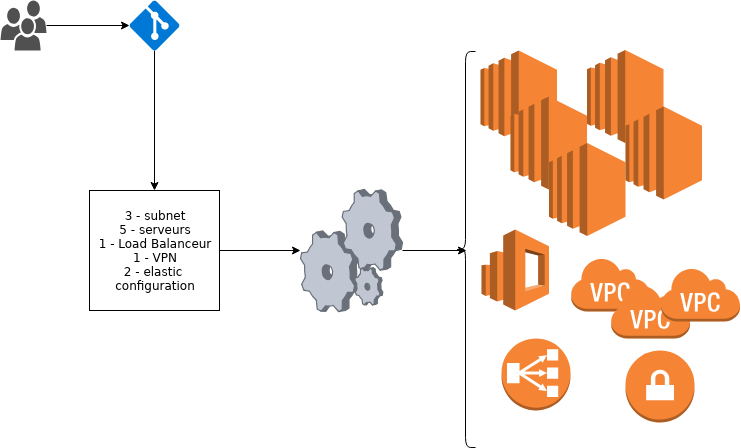
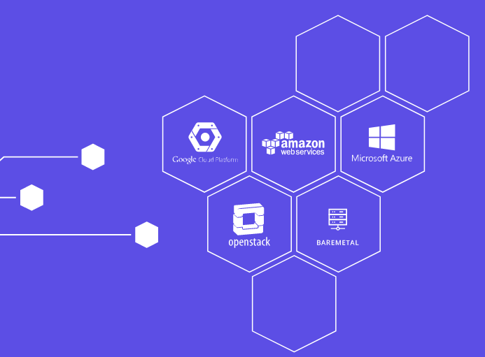
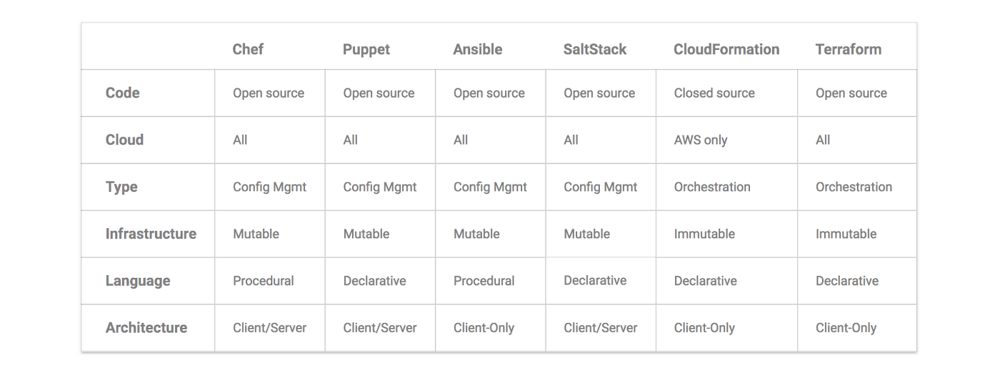

# Introduction / Présentation

**Infrastructure as Code (IaC)** est le concept de gérer et provisionner des machines au sein d'un centre de données uniquement à l'aide de fichiers de définition plutôt qu'une configuration manuelle, à travers des interfaces interactives ou physiquement. Le périmètre du système d'information (SI) couvert par ces techniques peuvent aller des équipements eux-mêmes ("bare metal") aux machines virtuelles et leurs ressources associées (sous le format de configurations sur l'hyperviseur). L'ensemble des fichiers de définitions peuvent bénéficier d'un système de gestion de versions (GIT, SVN , ...). 

Le concept d'IaC est né du besoin des entreprises à répondre efficacement à la transformation des architectures logicielles, devenues orientées web et pouvant être mises à l'échelle. La problématique d'alignement des ressources physiques aux besoins applicatifs était auparavant une problématique de grande entreprise informatique, elle s'est élargie à toute activité dont le service grandit.

C'est en 2006 qu'Amazon Web Services (AWS) introduits le concept durant la présentation d'Elastic Compute Cloud et de la première version de Ruby on Rails quelques mois auparavant. L'apparition rapide de nouveaux outils d'orchestration qui suivit l'essor de ce marché porteur a permis au concept d'Infrastructure as Code de faire sens et de se développer au sein des acteurs d'architectures redimensionnables.

En d'autres mots, à l'aide d'un fichier texte, il est possible de définir l'ensemble de l'infrastructure , que celle-ci soit infonuagique (cloud) ou sur site. 




Les avantages sont nombreux : 

* Possible de versionner  la configuration de l'infrastructure avec le contrôler de révision, avec une source de référence pour savoir la configuration en place . ( + tous les avantages du contrôler de révision ).
* Normalisé la configuration de l'infrastructure d'un environnement en réutilisant la définition ( fichier text).
    * Correction d'inconsistance entre les environnements
* Permettre le déploiement rapide , car automatisé d'environnement.
* Possibilité d'orchestrer les déploiements.
* Réduction du risque d'un déploiement car tous comme du code il est possible de le tester préalablement et réduit les erreurs humaines.

## Les options  disponibles

À ce jour les options sont nombreuses ( [List of Configuration](https://xebialabs.com/the-ultimate-devops-tool-chest/the-ultimate-list-of-configuration/) ) , la question est laquelle choisir. 

Lors d'échange avec mon entourage, clairement un élément influent, j'ai 2 joueurs qui se démarque :

* [Terraform](https://www.terraform.io/) : il existe depuis plusieurs année personnellement je l'avais boudé, car il ne supporter QUE **AWS**, je pense qu'une solution de ce type doit être utilisable pour plusieurs fournisseurs de service. À ce jour ce problème fut corrigé , maintenant il supporte un grand nombre de [module ou provider](https://www.terraform.io/docs/providers/index.html)

    * 

* [Ansible](https://www.ansible.com/) : Ansible est une plate-forme logicielle libre pour la configuration et la gestion des ordinateurs. Elle combine le déploiement de logiciels multi-nœuds, l'exécution des tâches ad-hoc, et la gestion de configuration. Ansible a aussi de nombreux [modules](https://docs.ansible.com/ansible/2.7/modules/modules_by_category.html) 

* [Puppet](https://puppet.com/fr) : Puppet est un logiciel libre permettant la gestion de la configuration de serveurs esclaves (GNU/Linux, Mac OS X et Windows). Puppet est écrit à l'aide du langage de programmation Ruby et est diffusé sous licence Apache 2.0 pour les versions récentes de Puppet. Les versions plus anciennes (inférieures à la V2.7.0), sont sous licence GPL3. 

* [Chef](https://www.chef.io/chef): Chef est un logiciel libre de gestion de configuration écrit en Ruby. Il utilise un langage dédié (appelé domain-specific language ou DSL) en pure-Ruby pour l'écriture de configuration du système d'exploitation sous la forme de « recettes » (recipes) ou de « livres de recettes » (cookbook)

## Que choisir ?

Comme je dis souvent trop de choix perd le client, dans le monde de l'opensource c'est d'autant plus vraie de par les choix multiples. Nous allons essayer avec le peu d'expérience que j'ai de répondre à cette question :P. Comme le nom de la formation est **Terraform** la conclusion est déjà connu :P, je vais essaye de développer la raison de ce choix qui est le fruit de recherche et non d'une expérience.

### Gestion de configuration vs orchestration

Si nous prenons __Puppet__ , __ansible__ , __chef__ , etc ces logiciels furent conçus dans l'idée de faire un déploiement d'une configurations sur un serveur existant :
    * Installation de packages
    * Création fichier / répertoire
    * Exécution de scripts 
    * ... 

Bien entendu avec le temps afin de répondre à une demande des utilisateurs certain modules furent ajouté afin de permettre la création d'instance EC2 (AWS) par exemple. 

De l'autre côté **Terraform** fut conĉu dans l'idée de permettre l'orchestration ou la création de l'infrastructure , il est possible de faire un peut de configuration avec **terraform** mais ce n'est pas ça force première. Comme nous le verrons plus loin **Terraform** est en mesure de faire l'appel de gestionnaire de configuration pour provisionner les systèmes créé. 

Une utilisation idéal pour **Terraform** est la cohabitation avec des systèmes telle que Docker / Kubernetes , vous avez besoin d'un orchestrateur de création et déploiement de vos conteneurs, mais l'utilisation d'un gestionnaire de configuration n'est plus requis, car l'ensemble est dans l'image du conteneur. Il y a un tutorial sur pour [Kubernetes avec terraform](https://www.terraform.io/docs/providers/kubernetes/guides/getting-started.html).

### Infrastructure Mutable vs Infrastructure Immutable


Moins pertinent mais on va le faire tout de même afin de faire une présentation de la différence entre les différent mode des logiciels. Donc les applications de type gestionnaire de configuration (__Ansible__, __Puppet__ , __Chef__ , ...), vont faire évolué la configuration d'un système. Résultat la modification des configurations vont s'ajouter au furent et à mesure sur le système . Ceci est donc une configuration mutable, la problématique ou le risque avec ce mode de fonctionnement est que chaque serveur auront une évolution différente au fur et à mesure que vous appliquez des règles. Bien entendu, nous essayons d'être strict sur les applications, cependant parfois ça glisse , sans parlé d'intervention manuel parfois requise lors d'urgence.

Dans une infrastructure Immutable, nous allons lors du processus de modification recréer l'instance ( __docker__ , __vm__ , ...) pour faire le déploiement d'une nouvelle configuration. Sur papier j'en convient c'est bien beau, mais la réalité terrain est pas toujours aussi simple, si nous prenons des serveurs de base de donnée, l'instance maître peu être difficile a détruire et recréer sans impact sur la production. Il est donc important d'avoir aussi des logiciels et mécanisme qui sont en harmonie.
Pour que ceci soit possible il y a un requis important, si faire la création d'une nouvelle instance prends 2 jours , ceci est beaucoup trop long , les logiciel d'orchestration telle que **terraform** vous permettra d'avoir une système automatisé qui permet la création rapide d'instance.
À titre d'exemple dans la démonstration qui sera réalisée à la suite de la présentation, en 6 minutes nous aurons :

* 2 clé SSH dans AWS
* 1 Réseau privé 
* 2 Subnet réseaux
* 4 règle de firewall
* 3 machines virtuel EC2

L'ensemble entièrement configurer, serveur apache déployé , site web installé , base de donnée configurer et dump SQL chargé.

Attention, je ne dis pas que les outils de configuration ne sont pas en mesure de réaliser une configuration immutable, cependant lors philosophie original n'étais pas en ce sens.

### Déclarative contre Procédurale  

__Chef__ et __Ansible__ propose de une écriture Procédurale où l'administrateur(trice) doit rédigé l'ensemble des instructions pour atteindre un état.
__Puppet__ ou **Terraform** propose une écriture déclarative où vous définissez un état que vous désirez et le système réalisera les opérations requise afin de ce conformé au exigence.

Dans l'exemple ci-dessus , très simpliste j'en convient, nous voyons un exemple pour la création d'instance sur AWS entre __Ansible__ et **Terraform**. 

* Version __Ansible__ :
    ```
	- ec2:
	    count: 10
    	image: ami-v1    
	    instance_type: t2.micro
    ```
* Version **Terraform** : 
	```
    resource "aws_instance" "example" {
          count = 10
          ami = "ami-v1"
          instance_type = "t2.micro"
    }
	```

Donc dans l'exemple ci-dessus, même si ceci est assez claire , prenons 2 secondes pour le verbalisé. Ceci permet de faire la création de 10 instances EC2 dans AWS de type t2.micro avec l'image ami-v1.
Comme vous pouvez le voir , la syntax est très similaire , il est même possible que vous vous dites , woww tout ce text pour la même chose :P.

Donc pour la création d'instance initiale la dynamique est similaire, maintenant imaginons que nous désirons ajouter 5 instances à l'environnement. 
Avec le mécanisme **Déclaratif** de **Terraform** , la personne reprendra le fichier de définition de l'environnement et changera la valeur de 10 à 15 soit comme ceci :

	```
    resource "aws_instance" "example" {
          count = 15
          ami = "ami-v1"
          instance_type = "t2.micro"
    }
	```

Lors de l'exécution de **Terraform** nous aurons un résultat comme ceci : 

```
    Plan: 5 to add, 0 to change, 0 to destroy.
```

Avec le mode **Procédural** de Ansible, vous serez obligé de savoir combien d'instance sont actuellement en exécution et de faire le calcul vous même ,d'instance à ajouter. Ansible ne conserve pas l'état, il est possible d'avoir des mécanismes permettant d'extraire l'information , cependant ceci augmente la complexité de la rédaction du playbook. Voici donc le résultat pour passé de 10 à 15 avec ansible :

    ```
	- ec2:
	    count: 5
    	image: ami-v1    
	    instance_type: t2.micro
    ```


* Désavantage du mode procédural pour l'infrastructure of code : 

    * La problématique majeur est que le code n'offre pas l'état final désiré , pour être en mesure de connaître l'état vous êtes obligé d'avoir l'historique de son exécution. De plus il est important de connaître l'ordre de son exécution , il est important d'avoir cette information pour avoir l'état actuelle du déploiement.
    * Vous serez obligé d'avoir un code de déploiement initial , ainsi qu'une serie de script afin de permettre de représenter l'évolution . Malheureusement cette multitude peut complixité la lecture et permettre une ré-utilisation complexe.

* Avantage du mode déclaratif :

    * Vous avez toujours l'information sur l'état de votre déployement peut importe l'évolution que votre environnement à eu , car lors de l'évolution vous avez modifier la même fiche. Vous n'avez donc qu'une source de référence.
    * Vous n'avez pas besoin de prendre en considération l'existant comme point de référence.
    * Le système prend en charge les étapes requis pour passé d'un état à l'autre.

* Désavantage du mode déclaratif :

    * Comme il n'y a pas de logique de passage d'état définie manuellement , il peut être difficile de définir un mode de déploiement progressif sans interruption.
    * Le mise en place de gestion de condition , de boucle n'étant pas toujours présent ne facilite pas toujours la réutilisation du code. **Terraform** a introduit ces fonctionnalités ceci permet de créer un code plus propre.

### Architecture 

Vous trouverez de mode déploiement :

* **pull** (client tire l'information du serveur ) : ce mode fonctionne sur le principe client / serveur , nous avons des agents sur l'ensemble des serveurs qui se connecte régulièrement au serveur pour récolter l'information. Pour ce modèle il est important donc d'avoir un serveur , idéalement redondant qui est en mesure de répondre à l'ensemble des clients. Vous constaterez que lorsque votre environnements prendra de l'expansion ce serveur sera de plus en plus sollicité. Les système telle que : __Chef__, __Puppet__ et __SaltStack__ utilisent ce mode , ceci a des avantages telle qu'avoir un serveur qui à l'ensemble de l'état des clients, cependant ce serveur est un autre maillon à gérer dans votre infrastructure.
* **push** (l'application pousse l'information ) : ce mode fonctionne sur le principe qu'un système pousse l'information au client , généralement ce mode est sans agent. Si nous prenons l'exemple de __Ansible__ ce dernier utilisera __ssh__ ou __remote desktop__ pour pousser les instructions. Comme ces services sont déjà disponible pour faire l'administration du système, vous n'avez la d'autre service à gérer. La configuration de __Ansible__ peut être poussé d'un serveur centrale ou des postes administrateurs. Le problème de scalabilité n'est pas présent , cependant vous n'avez pas le serveur avec l'information de l'état.

Si nous reprenons notre sujet **Terraform** ce dernier utilise le mode **push** il peut donc être initialiser depuis n'importe quelle poste. Pour le travaille en équipe il est fortement suggérer d'utiliser un lieu de stockage centralisé telle que S3 pour conserver les états des ressources . [How to manage terraform state](https://blog.gruntwork.io/how-to-manage-terraform-state-28f5697e68fa) 

### Conclusion 

Voici un tableau récapitulatif des points vu précédemment  :

 

Maintenant la décision est dans votre camp , mais vous avez un peu plus d'information pour prendre votre décision. De mon coté voici les critères important que j'avais : 

* Outils agnostique  à la solution cloud , en d'autres mot être en mesure de supporter **AWS**, **AZURE** , **GOOGLE** , ...
    * ( bonus ) : être en mesure de gérer des instances one-promise ( **Vmware**, **openStack** , ...) 
* Architecture client uniquement , mon serveur est déjà très sollicité  je n'ai pas plusieurs utilisateur le mode client est plus adapté à mes besoins
* Possibilité d'orchestrer la solution avec des solutions tiers telle que __puppet__ , __ansible__ , ... Afin de faire  d'autre configuration.
* Solution reconnu afin d'être en mesure d'avoir de forum / groupe d'utilisateur afin d'être en mesure de diagnostiquer mes problèmes.
* Solution OpenSource , avant tous pour une question de principe.
    * ( bonus ) : Avoir une compagnie en arrière afin de proposer un contrat de support en industrie , l'objectif est d'offrir une possibilité de garantie.


Dans mon cas voici ma vision de **TerraForm** et **Ansible** , **terraform** est utilisé pour l'ensemble de la mise en place de l'infrastructure. Si nous prenons le déploiement dans un environnement AWS . **Terraform** va réaliser l'ensemble de l'infrastructure , création des réseaux , passerelle réseau, instances EC2 (VM). Une fois l'ensemble créé __Ansible__ prend la main et fait la configuration des instances , ceci me permet d'avoir une solution totalement agnostique à la création. Je peux prendre mes __playbooks__ __ansible__ autant pour des machines configurer automatiquement avec **terraform** ou fournit par une équipe tierce. De plus l'utilisation de __ansible__ comme nous l'avons vue précédemment, grâce au langage procédurale j'ai plus de flexibilité pour faire la gestion du déploiement et processus de mise à jour de l'application. 

Mon objectif est d'obtenir le meilleur des 2 outils ! Nous allons donc voir comment faire la création de l'infrastructure avec **terraform** ainsi que la configuration avec **ansible** dans l'exemple suivant. J'ai opté pour une démonstration afin de faire la présentation des outils. Bien entendu je ne fait que survolé les possibilités , cependant ceci vous offrira un premier cas .

Poursuivons donc avec la prochaine section : [Démontration de Terraform](./02-usecas-setup-infra-terraform.md)

# Référence 

* [Pourquoi utilise-t-on Terraform et non Chef, Puppet, Ansible, SaltStack ou CloudFormation ?](https://www.hebergeurcloud.com/pourquoi-utilise-t-on-terraform-et-non-chef-puppet-ansible-saltstack-ou-cloudformation/) : https://www.hebergeurcloud.com/pourquoi-utilise-t-on-terraform-et-non-chef-puppet-ansible-saltstack-ou-cloudformation/
* [Configuration Management vs Orchestration](https://blog.gruntwork.io/why-we-use-terraform-and-not-chef-puppet-ansible-saltstack-or-cloudformation-7989dad2865c) : https://blog.gruntwork.io/why-we-use-terraform-and-not-chef-puppet-ansible-saltstack-or-cloudformation-7989dad2865c
* https://medium.com/@anton_32429/my-personal-story-on-terraform-vs-ansible-approach-2fac707b31ca

